# SDD 实践沉淀：从需求到可验证交付

## 1. 为什么需要 SDD

页面功能进入 AI 辅助开发后，关键挑战在于如何让每次开发都留下清晰、可追溯、可复用的上下文。

常见问题：

- 需求、Figma、实现方案、测试结果散落在对话里。
- 页面和页面模块容易直接进入编码，边界、非目标和验收标准不清晰。
- UI 结果容易偏离 Figma，尤其是移动端、空状态、错误状态、上传和提交状态。
- 前端逻辑容易堆在页面入口文件，组件拆分和接口请求缺少稳定规范。
- 页面专属图片、SVG、音频、mock 数据等资产容易散落到全局目录，导致归属不清、复用误判和清理困难。
- 前后端一起开发时，API、鉴权、数据库、SSE、COS 存储等能力容易继续堆在少数大文件里。

SDD 的目标，是把一次功能开发拆成可沉淀的规格、可执行的流程、可复用的工程约束、可验证的结果。

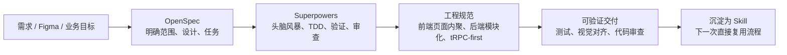

## 2. 从分层约束到项目实践

Harness 的实践启发在于：规则需要分层组织，让 AI 和开发者知道“先看什么、再做什么、最后怎么验收”。

结合当前项目的全栈页面开发特点，SDD 约束沉淀为六层结构。

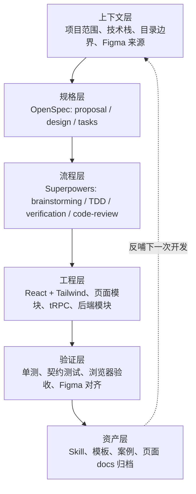

| 层级 | 解决的问题 | 当前项目落点 |
|---|---|---|
| 上下文层 | 需求信息不完整、页面归属不清 | change 名称、页面目录、路由、Figma、前后端影响 |
| 规格层 | 做什么、不做什么、怎么验收不清 | `proposal.md`、`design.md`、`tasks.md` |
| 流程层 | AI 直接写代码、缺少验证闭环 | Superpowers brainstorming、TDD、code-review |
| 工程层 | 代码结构不稳定、接口风格分裂 | React + Tailwind、页面内聚、页面资产归属、后端模块化、tRPC-first |
| 验证层 | “看起来完成”但细节有风险 | 测试、浏览器检查、Figma 对齐、接口契约 |
| 资产层 | 经验无法复用 | 根规范源 `agents/skills/core/openspec-superpowers-feature` + 本仓 SDD 文档 |

## 3. OpenSpec 与 Superpowers 的分工

OpenSpec 和 Superpowers 分别承担规格沉淀和执行纪律。

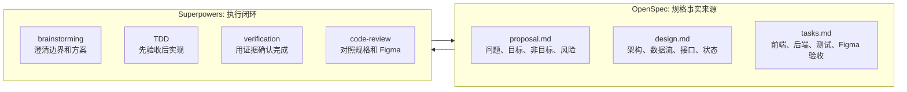

具体职责：

- OpenSpec 记录“为什么做、做什么、不做什么、怎么设计、怎么验收”。
- Superpowers 保证“先澄清、先测试、再实现、最后审查”。
- Skill 把两者固化为通用功能开发入口，目标仓库文档再补充本仓工程细节，减少每次重新约定流程的成本。

## 4. 统一工作流

页面、页面下模块、由页面驱动的后端能力，都走同一条路径。

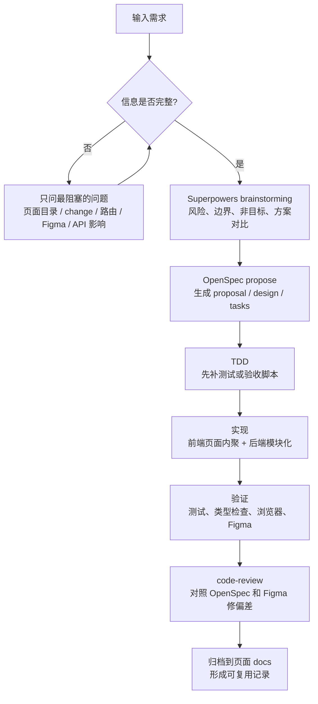

强制归档路径：

```text
client/src/pages/<page>/docs/<change-name>/
  proposal.md
  design.md
  tasks.md
```

页面模块也归档到所属页面：

```text
client/src/pages/create/docs/create-prompt-composer/
client/src/pages/create/docs/create-reference-image-upload/
client/src/pages/game/docs/game-version-panel/
```

### 迭代同步规则

OpenSpec 是页面演进记录。后续继续改同一页面或模块时，先定位该页面下已有 docs，再决定是新建 change 还是更新未完成 change。

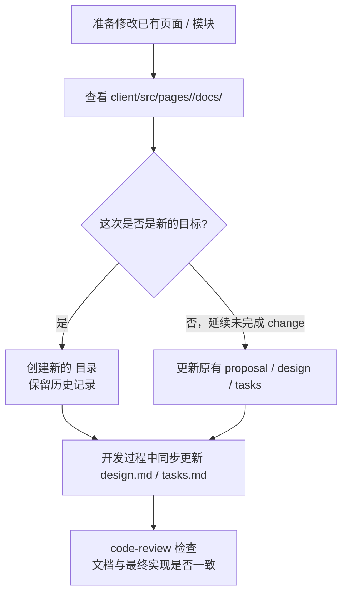

同步原则：

- `proposal.md`、`design.md`、`tasks.md`、验收记录和 review 记录统一使用中文书写；路径、API、代码标识符、命令和必须匹配 Figma 的 UI 文案保持原文。
- 新目标、新阶段、新范围：创建新的 `docs/<change-name>/`。
- 未完成 change 的继续开发：更新原目录。
- 组件边界、数据流、前端接口消费、后端模块、tRPC procedure、Figma 对齐策略发生变化：更新 `design.md`。
- 任务新增、删除、替换、延期或验收方式变化：更新 `tasks.md`。
- 目标、非目标、范围或风险变化：更新 `proposal.md`。
- 完成前必须确认文档描述最终实现，并同步开发过程中产生的设计变化。

## 5. 页面代码组织

前端按页面维护体验代码。页面入口负责组装，模块能力沉淀到页面目录下。

```text
client/src/pages/<page>/
  docs/
    <change-name>/
      proposal.md
      design.md
      tasks.md
  assets/
  components/
  hooks/
  services/
  constants/
  types.ts
  index.tsx
```

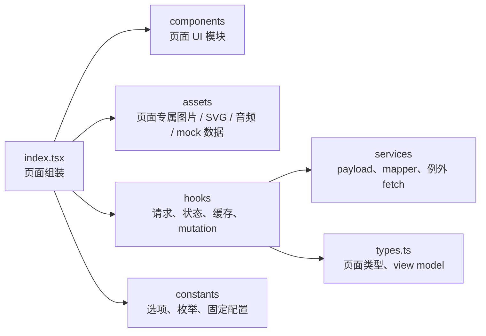

职责边界：

| 目录 | 主要职责 | 不建议放 |
|---|---|---|
| `assets/` | 页面专属静态资产、Figma 导出图、页面 mock 媒体 | 跨页面共享资产、运行时上传文件 |
| `components/` | 页面私有 UI、布局、用户动作、与该动作强相关的局部状态和副作用 | 把所有页面状态都塞进一个巨型组件 |
| `hooks/` | tRPC query/mutation、loading/error、缓存失效、复杂状态编排、可测试业务流程 | 纯展示 JSX |
| `services/` | 入参构造、返回值转换、view model 映射、上传/SSE/download 例外适配 | React hook 生命周期 |
| `constants/` | 页面固定选项、枚举、配置 | 可变业务状态 |
| `types.ts` | 页面私有类型、展示模型、tRPC 推导类型 | 全局共享类型 |

资产归属是强约束：

- 页面专属资产必须放在所属页面目录下，例如 `client/src/pages/create/assets/`。
- 禁止把页面专属资产放到 `client/src/assets`、`client/public`、`attached_assets` 等全局目录。
- Figma 导出的页面节点图片、页面私有 SVG、AI 生成的单页 mock 媒体、页面样例 JSON 默认都视为页面资产。
- 只有出现真实跨页面复用时，才允许提升到全局或 shared 目录，并且必须在对应 `design.md` 说明复用理由。

组件高内聚低耦合也是强约束：

- 页面入口 `index.tsx` 主要负责组装区域，不应成为所有 state、effect、mutation、handler 的集中地。
- 如果某个 UI 元素天然对应一个完整业务动作，它应该封装 UI、局部 loading、接口调用、toast/error、成功回调，只向父级暴露必要参数。
- 复杂逻辑优先沉淀到页面内 `hooks/`，再由页面内业务组件消费；纯 UI 子组件只保留小 props。
- 当组件 props 超过约 8 个时，优先组合对象、拆成业务组件，或提取 hook，避免父子强耦合。
- code-review 必须检查资产 import 路径；页面代码引用全局资产但没有文档说明时，视为阻塞问题。

## 6. 前端接口维护方式

前端不注册 tRPC procedure。前端只消费后端 root router 暴露出来的类型安全路径。

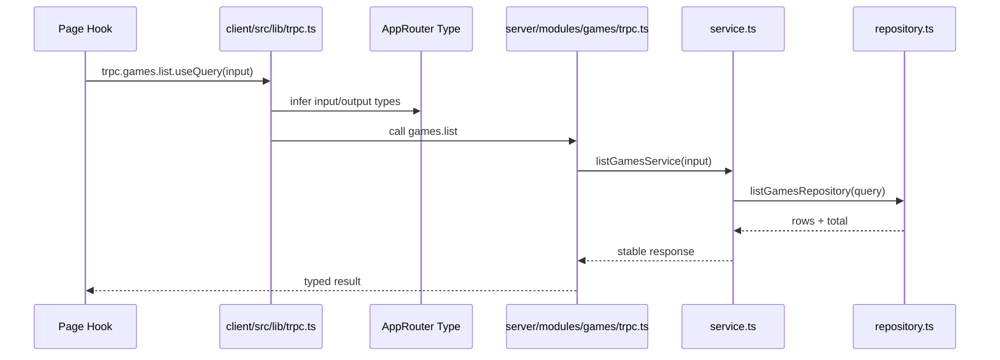

推荐规则：

- `client/src/lib/trpc.ts` 是全局唯一 tRPC 客户端入口。
- 页面复杂请求放到 `client/src/pages/<page>/hooks`。
- 页面服务适配放到 `client/src/pages/<page>/services`。
- 类型优先从 `RouterInputs` / `RouterOutputs` 推导。
- 组件只消费 hook 暴露出来的 view model、loading、error、callback。

示例：获取游戏列表并显示。

```text
client/src/pages/games/
  components/GameGrid.tsx
  components/GameCard.tsx
  hooks/useGameList.ts
  services/gameListMappers.ts
  types.ts
  index.tsx
```

```text
useGameList
  -> trpc.games.list.useQuery
  -> gameListMappers.toGameCardViewModel
  -> GameGrid / GameCard
```

## 7. 后端模块组织

后端按业务模块维护能力。页面是体验入口，后端是能力资产。

```text
server/modules/<module-name>/
  index.ts
  trpc.ts
  service.ts
  repository.ts
  schemas.ts
  types.ts
  errors.ts
  utils.ts
  *.test.ts
```

只在确有需要时增加例外入口：

```text
server/modules/<module-name>/
  express.ts
  sse.ts
  upload.ts
  proxy.ts
  storage.ts
```

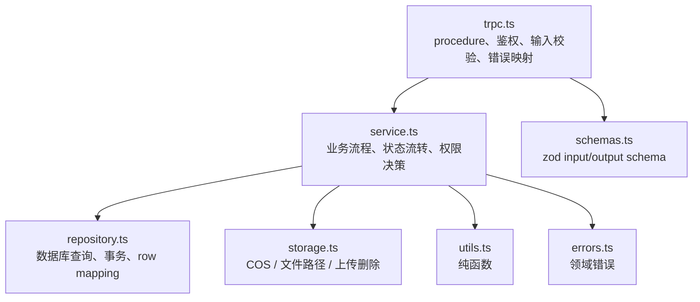

什么时候建后端模块：

- 新增业务 API。
- 新增 DB 状态流转。
- 新增 storage/COS 行为。
- 新增 SSE 或长任务流程。
- 新增权限规则。
- route 层已经承载过多业务逻辑。
- 同一逻辑会被多个入口复用。

## 8. API 路由策略：tRPC-first

普通业务 API 默认使用 tRPC。

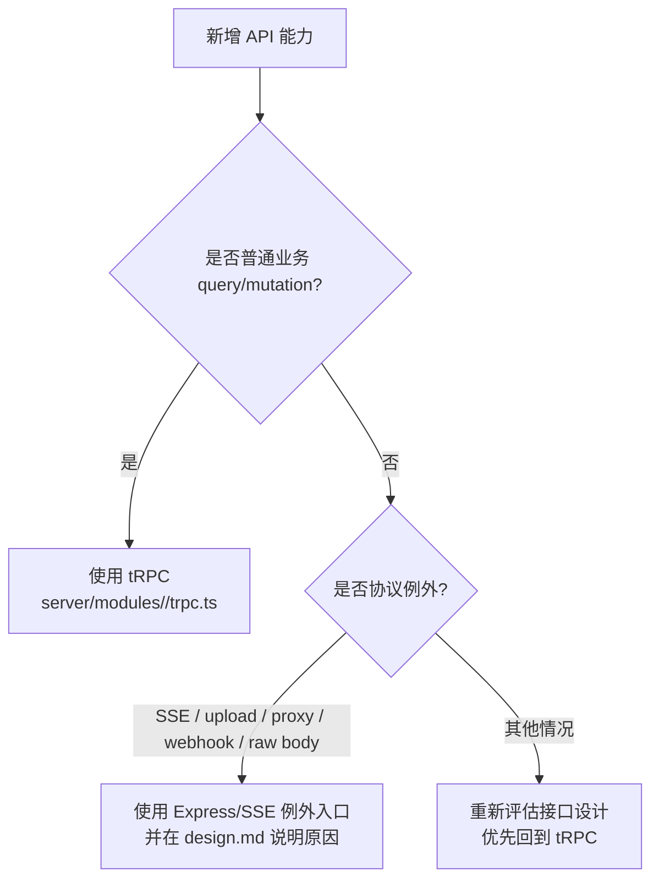

tRPC 注册链路：

```text
server/modules/<module-name>/trpc.ts 定义 moduleRouter
  -> 后端 root appRouter 注册 <module>: moduleRouter
  -> 后端导出 type AppRouter = typeof appRouter
  -> client/src/lib/trpc.ts 使用 createTRPCReact<AppRouter>()
  -> 页面 hooks 使用 trpc.<module>.<procedure>.useQuery/useMutation
```

Express/SSE 例外场景：

- SSE/流式响应。
- 文件上传或大 body 导入。
- 代理接口。
- webhook 或第三方回调。
- 需要 raw body 的接口。
- 协议特性不适合 tRPC 的场景。

例外必须写进 `design.md`，说明为什么不能使用 tRPC。

## 9. 错误码与错误模型

错误处理采用两层结构：传输错误码表达通用失败类别，业务错误码表达具体业务语义。

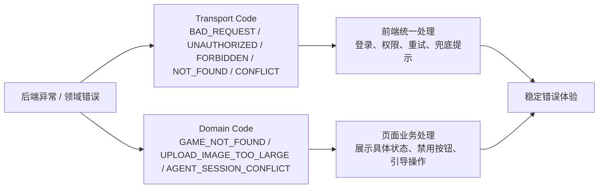

错误码定义入口：

```text
shared/_core/errors.ts
  TRANSPORT_ERROR_CODES
  DOMAIN_ERROR_CODES
  TRANSPORT_ERROR_HTTP_STATUS
  ApiErrorPayload
```

传输错误码：

| Code | 场景 |
|---|---|
| `BAD_REQUEST` | 入参非法、字段缺失、格式错误 |
| `UNAUTHORIZED` | 未登录、session 无效 |
| `FORBIDDEN` | 已登录但无角色、白名单、资源归属权限 |
| `NOT_FOUND` | 资源不存在，或出于安全考虑隐藏资源存在性 |
| `CONFLICT` | 状态冲突、重复操作、会话冲突 |
| `PRECONDITION_FAILED` | 前置状态不满足 |
| `PAYLOAD_TOO_LARGE` | 图片、ZIP、body 超过限制 |
| `UNSUPPORTED_MEDIA_TYPE` | 文件或内容类型不支持 |
| `TOO_MANY_REQUESTS` | 频控、配额、滥用保护 |
| `INTERNAL_SERVER_ERROR` | 未预期服务端错误 |

业务错误码示例：

| Domain Code | 典型场景 |
|---|---|
| `AUTH_REQUIRED` | 需要登录 |
| `AUTH_INVALID_SESSION` | 登录态无效 |
| `AUTH_NOT_WHITELISTED` | 不在白名单 |
| `GAME_PROMPT_REQUIRED` | 创作 prompt 为空 |
| `GAME_GENERATION_IN_PROGRESS` | 游戏正在生成，不能重复提交 |
| `GAME_NOT_PUBLISHED` | 游戏未发布 |
| `GAME_VERSION_CONFLICT` | 版本状态冲突 |
| `UPLOAD_IMAGE_TOO_LARGE` | 参考图超过限制 |
| `UPLOAD_UNSUPPORTED_IMAGE_TYPE` | 图片类型不支持 |
| `IMPORT_PATH_TRAVERSAL` | ZIP 存在路径穿越风险 |
| `AGENT_SESSION_CONFLICT` | agent 会话状态冲突 |
| `STORAGE_PATH_INVALID` | 存储路径非法 |

前端约束：

- 业务判断使用 `code` / `domainCode`。
- `message` 只用于安全、可展示的兜底文案。
- 页面 hook 负责把错误转换为页面状态。
- 组件只接收可展示错误状态，不解析接口原始错误对象。

Express/SSE 例外接口统一 JSON 错误形态：

```json
{
  "error": {
    "code": "BAD_REQUEST",
    "domainCode": "UPLOAD_IMAGE_TOO_LARGE",
    "message": "Image exceeds the maximum allowed size.",
    "requestId": "optional-request-id"
  }
}
```

已有旧接口可以渐进迁移。触达旧接口时，需要在 `design.md` 写明兼容策略。

## 10. OpenSpec 模板要覆盖什么

`tasks.md` 必须包含这些验收项：

```text
Frontend
Backend
Tests
Figma Alignment Acceptance
Documentation Sync
```

`design.md` 需要显式写出前后端接口消费方式：

```text
Frontend API Consumption
  - tRPC procedures consumed
  - page hooks
  - page services
  - derived frontend types
  - cache invalidation / refetch strategy
  - loading / empty / error states
  - fetch / SSE / upload exceptions

Page Assets
  - page-owned assets directory
  - Figma/exported/generated assets used by this page
  - any asset promoted to shared/global and why
  - import path review result

Backend Module Design
  - module name and directory
  - tRPC procedures
  - Express/SSE exceptions
  - service / repository / storage responsibilities
  - auth and error model

Error Model
  - transport error codes
  - domain error codes
  - frontend handling
  - message safety
  - legacy compatibility
```

这样做可以让接口设计前置：在设计阶段就明确前端如何消费、后端如何沉淀、例外如何解释。

同时，每个 change 都需要保留同步状态：

```text
Change History
  - created / updated
  - status
  - relationship to previous changes

Documentation Sync
  - design.md 是否反映最终组件、接口、后端模块和 Figma 决策
  - tasks.md 是否反映完成、延期或替换项
  - proposal.md 是否需要同步范围变化
```

## 11. Skill 如何承载这些约束

通用 core Skill 是这套实践的入口；本仓 SDD 文档负责补充页面、Figma、tRPC、资产归属等 `ai-game-forge` 细节。

```text
agents/skills/core/openspec-superpowers-feature/
  SKILL.md
  references/doc-templates.md
```

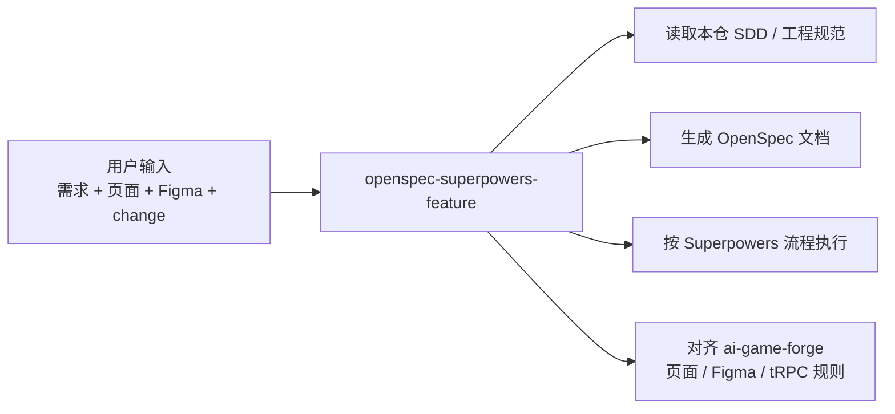

推荐输入方式：

```text
使用 openspec-superpowers-feature，并按 ai-game-forge/docs/sdd实践.md 补充页面级工程规则。

需求：重做创作页底部输入框
页面目录：client/src/pages/create
change 名称：create-prompt-composer
路由：/create
Figma：<figma node url>
页面资产：放在 client/src/pages/create/assets，除非 design.md 说明跨页面复用
前端接口：新增或复用页面 hooks/services
后端影响：新增或复用 tRPC procedure
错误模型：新增或复用 transport/domain error code
```

当信息不完整时，Skill 先进入澄清和头脑风暴，再进入实现。

## 12. 试点：生成游戏创作页面

试点输入：

- 需求：生成游戏创作页面。
- Figma：Create chat 节点。
- change 名称：`create-feature`。
- 页面归属：`client/src/pages/create`。

试点产出：

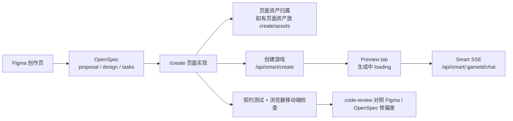

验证点：

- `/create` 页面升级为智能创作入口。
- OpenSpec 文档归档到 `client/src/pages/create/docs/create-feature/`。
- 创建成功后停留在 `/create` 的 Chat tab，聊天区展示用户消息、AI 回复和生成状态；用户手动切换到 Preview tab 时展示 loading。
- 创作者再次点击自己的游戏时进入 `/create?gameId=<id>` 并恢复聊天记录；非创作者点击进入 `/play/<id>`。
- 生成流程复用 `/api/smart/create` 和 Smart SSE，不再走旧 `/loading/:gameId`。
- 页面专属资产如有使用，必须维护在 `client/src/pages/create/assets/`；本轮移除了 remix popular games 封面资产和相关入口。
- 增加创建页服务测试，覆盖 `/api/smart/create` payload 构造、`gameId` 响应校验，并确认不发送已废弃的 `difficulty`。
- 使用浏览器在 390x844 移动端检查布局，无横向溢出。
- code-review 对照 OpenSpec 和 Figma 发现偏差并回补测试。

这个试点说明：SDD 不只是写文档，而是把需求、设计、代码、测试、视觉验收和复盘线索连成闭环。

## 13. 预期效果


可以直接观察到的变化：

- 新需求进入时，先明确页面目录、change、Figma、前后端影响。
- 每个 change 都有独立 OpenSpec 记录，需求和验收不依赖聊天记录。
- 后续迭代会先查看页面 docs，再新建或更新对应 change，避免文档和代码脱节。
- 前端代码按页面收口，assets、组件、hooks、services、types 职责更稳定。
- 后端能力按模块沉淀，普通业务 API 逐步统一到 tRPC。
- 错误处理从解析 message 转向稳定的 `code` / `domainCode`。
- 测试和浏览器验收成为完成条件。
- Skill 让 OpenSpec + Superpowers 的通用流程可以被不同成员和不同 AI 会话复用；本仓 SDD 文档负责承载页面工程细节。

## 14. 下一步

- 后续页面功能继续按 `client/src/pages/<page>/docs/<change-name>/` 归档。
- 后续页面资产默认维护在 `client/src/pages/<page>/assets/`，并把资产归属写入 `design.md`。
- 选择 1-2 个页面模块继续试点：
  - 创作页底部输入框模块。
  - 创作页参考图上传模块。
  - 游戏详情页版本面板。
- 将新增普通业务 API 统一到 tRPC。
- 将复杂后端能力逐步沉淀到 `server/modules/<module-name>/`。
- 触达旧接口时逐步迁移到统一错误 envelope 和稳定错误码。
- 补充更标准的 React 组件级测试工具链。
- 根据实际使用继续迭代 `agents/skills/core/openspec-superpowers-feature`，并把 `ai-game-forge` 专属工程细节维护在本 SDD 文档或本仓模板/知识库中。
