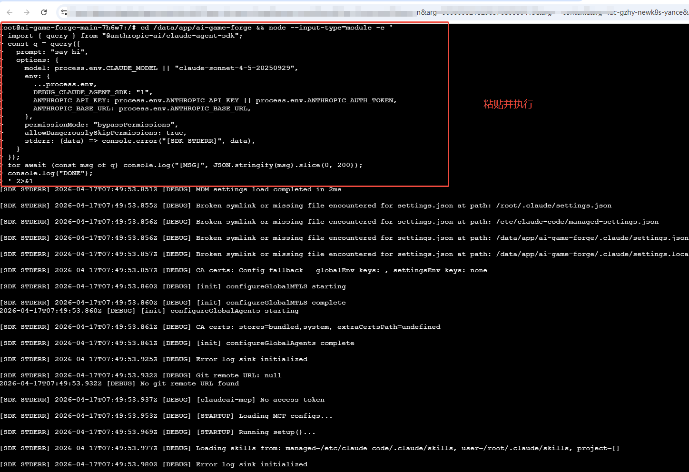
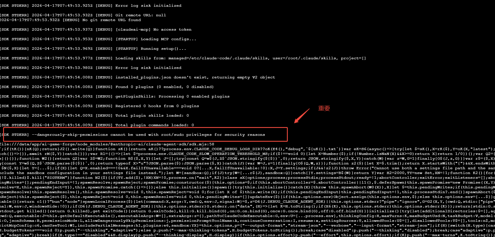
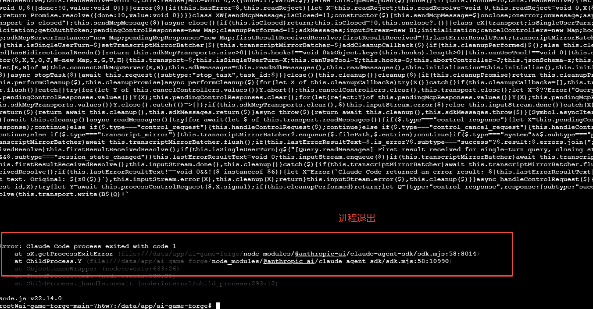

## 问题

项目中使用`@anthropic-ai/claude-agent-sdk`在服务器跑一个agent，使用方式如下：

```js
import { query } from "@anthropic-ai/claude-agent-sdk";
// ....
const queryGen = query({
  prompt: "say hi",
  options: {
    model: CLAUDE_MODEL,
    env: envConfig,
    permissionMode: "bypassPermissions",
    allowDangerouslySkipPermissions: true,
  },
});
//...
```

在本地跑没问题，部署到测试环境，报错如下：

```bash
[Agent2-Claude-Direct] Phase 0 image generation failed: Error: Claude Code process exited with code 1
    at sX.getProcessExitError[90m(file:///data/app/ai-game-forge/[39mnode_modules/[4m@anthropic-ai[24m/claude-agent-sdk/sdk.mjs:58:8014[90m)[39m
    at ChildProcess.Y [90m(file:///data/app/ai-game-forge/[39mnode_modules/[4m@anthropic-ai[24m/claude-agent-sdk/sdk.mjs:58:10990[90m)[39m
[90m    at Object.onceWrapper (node:events:633:26)[39m
[90m    at ChildProcess.emit (node:events:530:35)[39m
[90m    at ChildProcess._handle.onexit (node:internal/child_process:293:12)[39m
```

只知道claude code进程退出了，没有看到具体的原因

## 排查

省去AI 协助排查的N个过程，最后AI提议将上面的代码复制到容器中执行：

```bash
cd /data/app/ai-game-forge && node --input-type=module -e '
import { query } from "@anthropic-ai/claude-agent-sdk";
const q = query({
  prompt: "say hi",
  options: {
    model: process.env.CLAUDE_MODEL || "claude-sonnet-4-5-20250929",
    env: {
      ...process.env,
      DEBUG_CLAUDE_AGENT_SDK: "1",
      ANTHROPIC_API_KEY: process.env.ANTHROPIC_API_KEY || process.env.ANTHROPIC_AUTH_TOKEN,
      ANTHROPIC_BASE_URL: process.env.ANTHROPIC_BASE_URL,
    },
    permissionMode: "bypassPermissions",
    allowDangerouslySkipPermissions: true,
    stderr: (data) => console.error("[SDK STDERR]", data),
  }
});
for await (const msg of q) console.log("[MSG]", JSON.stringify(msg).slice(0, 200));
console.log("DONE");
' 2>&1
```

运行结果如下：







从上面日志可以看出，最重要的是这个报错：

```bash
[SDK STDERR] --dangerously-skip-permissions cannot be used with root/sudo privileges for security reasons
```

原因：Docker 容器以 root 用户运行，Claude Code 禁止 root 使用 --allow-dangerously-skip-permissions，所以子进程直接 exit 1。

去掉 `permissionMode` 和 `allowDangerouslySkipPermissions` 就可以了。

```js
const queryGen = query({
  prompt: "say hi",
  options: {
    model: CLAUDE_MODEL,
    env: envConfig,
  },
});
```


## 经验

agent毕竟是跑在服务器的，拥有读写服务器的能力，如果权限太高，容易有安全漏洞。因此agent还是需要严格限制一下权限，特别是UGC平台，万一用户通过指令攻击服务器，就完蛋咯。

以下内容来自DeepSeek

Claude Code 禁止在 Docker 容器内以 `root` 用户运行，并非技术限制，而是一项核心的安全设计原则。这背后的原因很简单：AI 代理拥有强大的文件操作和命令执行能力，赋予它 `root` 权限等于解除了所有安全枷锁，一旦出错或被利用，后果不堪设想。

具体来说，该限制主要源于以下几个核心的安全考量：

### 🛡️ 限制 `root` 的根本原因：最小化“爆炸半径”

1.  **防止权限滥用**：AI 代理的权限边界理应被严格限定。如果以 `root` 运行，代理便获得了操作系统的全部权限，包括读取所有用户的敏感数据（如 SSH 密钥、云凭证）、修改系统关键文件甚至安装恶意软件。这不是对 Claude Code 的不信任，而是一个预防性的安全设计。因此，最佳实践要求**必须以非 root 用户（如 `node`、`vscode`）运行**，将“爆炸半径”严格限制在项目目录之内。

2.  **强化容器安全基线**：即使在容器中，`root` 权限依然伴随着极高的风险。一旦容器被攻破或配置不当，攻击者就可能获得主机级别的访问权限。因此，即使在隔离的容器环境中，**不信任任何进程，即使它来自一个看起来安全的镜像**，也是一条重要的安全原则。Claude Code 的这项限制，正是驱动开发者在 Dockerfile 中创建并切换到非特权用户的强制力量。

### 🚫 `--dangerously-skip-permissions`：并非“万能钥匙”

你遇到的错误中提到 `--dangerously-skip-permissions` 标志与 `root` 权限冲突。这个标志是 Claude Code 的一个特殊模式（俗称“YOLO 模式”），其作用是绕过**所有**常规的安全确认步骤，让 AI 可以自动执行任何操作。

*   **意图**：这个功能主要被设计用于**自动化脚本和 CI/CD 流水线**，在这些场景下，人为干预是不现实也不需要的。
*   **风险**：它是一把双刃剑。在 **CI/CD 等高度可控的环境**中，结合 `--dangerously-skip-permissions` 使用可以极大提升效率。但 Anthropic 选择了一个极具警示性的名字，就是为了提醒你，这个组合（`root` + `--dangerously-skip-permissions`）的危险性是双倍的，因此被直接禁止。

### ✅ 正确实践：如何在 Docker 中安全运行 Claude Code

既然不能用 `root`，正确的做法是在 Dockerfile 中创建一个非特权用户。

#### 方法一：标准 Dockerfile 配置
在你的 Dockerfile 中添加如下指令来创建并切换到普通用户：

```dockerfile
# 创建一个名为 'claude-user' 的用户，用户ID为1000（通常与宿主机用户匹配）
RUN useradd -m -u 1000 claude-user

# 后续所有指令都以此用户身份执行
USER claude-user
```
这样做的好处是，UID 1000 通常是宿主机的默认用户，可以避免容器内外文件读写时的权限冲突。

#### 方法二：使用官方 Dev Container 模板
Anthropic 官方为 VS Code 的 Dev Containers 提供了经过安全加固的配置模板。你可以在项目的 `.devcontainer/devcontainer.json` 文件中进行如下配置，它会自动处理用户隔离和文件挂载，并集成防火墙规则。

```json
{
  "name": "Claude Code Secure Environment",
  // ... 其他配置
  "containerUser": "vscode",
  "remoteUser": "vscode"
}
```
该配置通过 `containerUser` 和 `remoteUser` 明确指定使用非 root 用户 `vscode`，构建了一个更安全的环境。

### 🛠️ 社区安全方案：一键式沙盒

为了进一步简化安全配置，社区提供了一些封装工具，它们在设计时就严格遵循了“非 root”原则：

*   **`claude-docker-sandbox`**：这是一个命令行包装器，它会自动将 Claude Code 放入一个临时的、非 root 用户的 Docker 容器中运行，并在退出时自动销毁容器。
*   **`cc-sandboxer`**：类似地，这个工具也旨在让 `claude --dangerously-skip-permissions` 在 Docker 沙盒中安全运行，为你提供一个开箱即用的隔离环境。

使用这些工具可以有效降低手动配置出错的风险。

### 💎 总结

Claude Code 对 Docker 内 `root` 权限的限制，体现了现代软件安全设计中的一个核心理念：**默认最小权限**。通过强制 AI 代理在非特权环境中运行，可以有效地将潜在损害限制在一个可控范围内，从而让你能够更安全地利用其强大的能力。