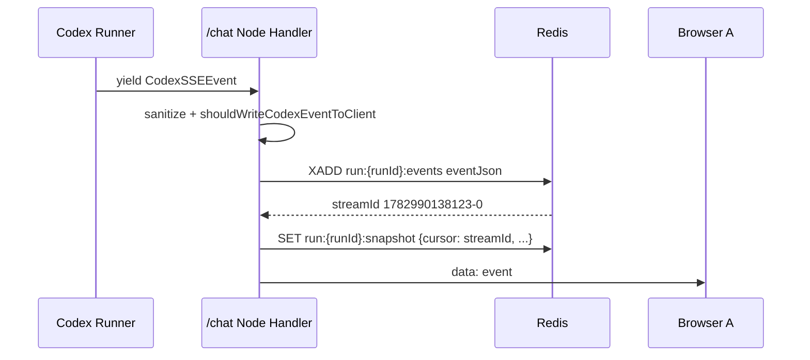
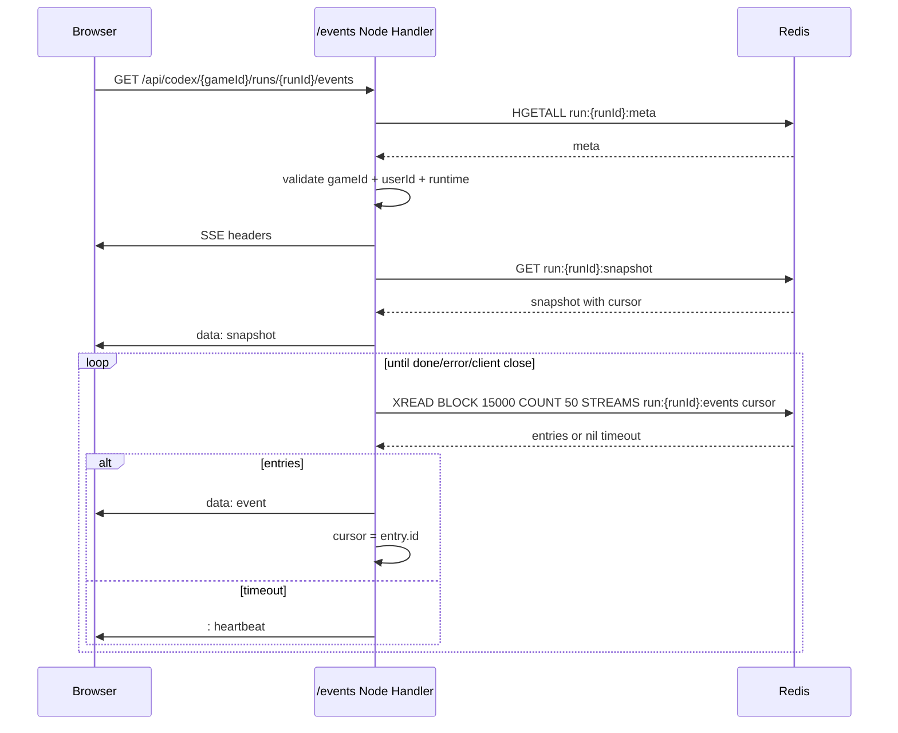
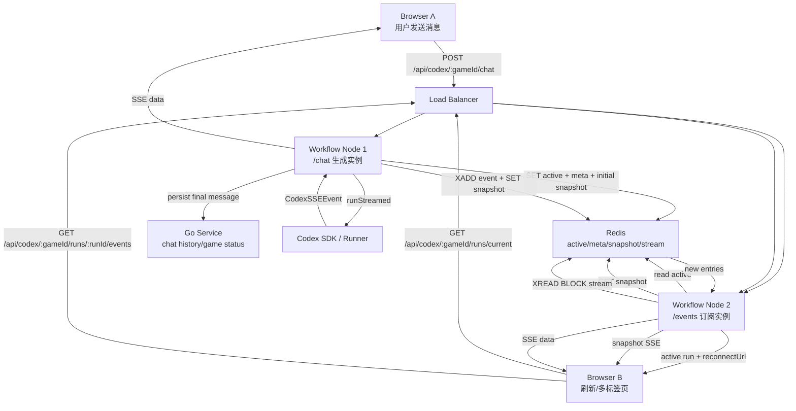
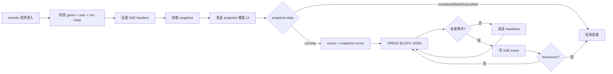

# Workflow SSE Redis Reconnect Architecture

## 正文

本文档定义 `aigameforge-workflow` 中 Codex SSE 生成链路的 Redis 重连方案。目标是在用户刷新页面、多开标签页、网络断开、负载均衡切实例、生成任务仍在运行等场景下，让客户端重新接入同一个 active run，并恢复到当前可渲染状态。

本文只描述架构方案，不表示当前代码已经实现。当前 workflow 代码中，Codex SSE 仍主要由 `server/codex-agent/sse/index.ts` 直接 `res.write("data: ...")` 输出；仓库当前没有 Redis client 依赖，也没有 `/api/codex/:gameId/runs/:runId/events` 订阅接口。

## 一句话结论

推荐采用 **Redis snapshot + Redis Stream + 服务端内部 cursor**：

- 客户端不维护 `lastEventId`。
- 客户端只需要知道是否存在 active run，以及要订阅哪个 `runId`。
- `/chat` 用于启动新一轮生成。
- `/current` 用于查询当前游戏是否已有 active run。
- `/events` 用于接入已有 run：先发送 snapshot，再通过 Redis Stream 的 `XREAD BLOCK` 读取后续增量事件。
- Redis Stream 不是 Redis 主动向 Node 推送，而是 Node 主动发起阻塞读取；Redis 有新数据时唤醒该读取请求。

选择 snapshot 模式的原因是：本项目生成链路更关心“刷新后 UI 回到当前正确状态”，不要求把断线期间每一个中间动画或逐字事件都精确补给客户端。这样可以避免多标签页之间共享 `lastEventId` 带来的游标一致性问题。

## 当前代码事实

### Codex SSE

Codex SSE 路由在 `aigameforge-workflow/server/codex-agent/sse/index.ts`：

- `writeSse(res, event)` 当前只写 `data: ${JSON.stringify(event)}\n\n`。
- `startSseKeepAlive(res)` 会写 `: connected` 和周期性 `: heartbeat`。
- 请求关闭时，Codex 路由记录 `clientDisconnected = true`，但不会把它直接当成用户取消；run 可以继续跑完。
- `agentLifecycle.tryStartExclusiveRun` 保证同一 `runtime + gameId` active run 互斥；已有 run 时会返回 `already_running`。
- run 完成后，collector 会把聚合后的 `responseJson` 写回 Go service 的 chat message。

这个行为适合先实现 Redis 重连：即使原始 `/chat` 的浏览器连接断开，后端仍可继续生成并把事件写入 Redis，后续 `/events` 可以重新接入。

### Smart SSE

Smart SSE 路由在 `aigameforge-workflow/server/smart-agents/sse/index.ts`：

- 当前请求关闭会设置 `cancelled = true`。
- 事件循环发现 cancelled 后停止读取流，最终按 cancelled 持久化。

因此 Smart 链路如果也要做同样的重连，必须先调整语义：客户端断开不等于取消生成；取消应走显式 cancel endpoint。本文主要以 Codex SSE 为落地目标。

### 现有 DB 持久化

Codex collector 在 `aigameforge-workflow/server/codex-agent/persistence/message-collector.ts` 中把事件聚合成 `responseJson.events` 和 `content`，用于历史消息恢复。这个结构适合页面刷新后的历史还原，但不适合实时重连补发，因为它不是逐条 SSE frame 的事件日志，也没有订阅能力。

Redis 方案不替代 DB。DB 仍然是长期聊天历史事实源；Redis 只承担 active run 期间的短期实时状态与订阅。

## 目标与非目标

### 目标

1. 页面刷新后能发现当前游戏有 active run，并接入该 run。
2. 多标签页或多窗口打开同一游戏时，均能订阅同一个 active run。
3. 负载均衡把 `/events` 打到另一个 Node 实例时，也能通过 Redis 读到当前状态和后续事件。
4. 原始 `/chat` SSE 连接断开后，只要生成进程还在，客户端可以重新接入。
5. 不要求客户端维护 `lastEventId`。
6. 不把 raw SDK event、内部 prompt、敏感工具输出写入 Redis 可重放事件。

### 非目标

1. 不保证重放断线期间所有中间动画或逐字输出。
2. 不替代 Go service 的聊天历史、游戏状态和成本持久化。
3. 不解决 Node 进程已经崩溃导致模型运行本身中断的问题；这种情况只能通过 terminal/error snapshot 或 DB history 降级。
4. 不在本文中定义具体 Redis 部署拓扑，只要求生产环境使用多实例可访问的 Redis。

## API 设计

### POST `/api/codex/:gameId/chat`

用途：发起一轮新的 Codex 生成。

请求示例：

```http
POST /api/codex/1704950001/chat HTTP/1.1
Content-Type: application/json
Cookie: app_session_id=...

{
  "message": "把这个游戏改成竖屏飞行射击，加入三种敌机。",
  "sessionId": "codex-session-xxx"
}
```

成功启动时仍返回 SSE：

```text
data: {"type":"run_started","runId":"run_01J2...","state":"running"}

data: {"type":"snapshot","runId":"run_01J2...","state":"running","content":"","events":[]}

data: {"type":"workflow_progress","activeStepId":"design_game","steps":[...]}
```

若已有 active run：

```http
HTTP/1.1 409 Conflict
Content-Type: application/json

{
  "error": "generation_in_progress",
  "runId": "run_01J2...",
  "state": "running",
  "reconnectUrl": "/api/codex/1704950001/runs/run_01J2.../events"
}
```

客户端收到 409 后不应重复提交 `/chat`，应改连 `reconnectUrl`。

### GET `/api/codex/:gameId/runs/current`

用途：页面打开、刷新、切 tab 回来时查询是否有 active run。

响应示例，无 active run：

```json
{
  "active": false
}
```

响应示例，有 active run：

```json
{
  "active": true,
  "runId": "run_01J2...",
  "state": "running",
  "startedAt": 1782990123000,
  "updatedAt": 1782990138000,
  "reconnectUrl": "/api/codex/1704950001/runs/run_01J2.../events"
}
```

这个接口的判断必须以后端 Redis active run 为准。客户端可以缓存本地状态提升体验，但不能用本地状态做正确性判断。

### GET `/api/codex/:gameId/runs/:runId/events`

用途：接入已有 run 的 SSE 事件流。

请求示例：

```http
GET /api/codex/1704950001/runs/run_01J2.../events HTTP/1.1
Accept: text/event-stream
Cookie: app_session_id=...
```

响应先发送 snapshot：

```text
data: {"type":"snapshot","runId":"run_01J2...","state":"running","content":"已经完成玩法规划，正在生成代码...","events":[{"type":"workflow_progress","activeStepId":"build_game","steps":[...]}],"updatedAt":1782990138000}

data: {"type":"text","textType":"result","content":"继续输出的新内容"}

data: {"type":"done","durationMs":89000}
```

客户端处理规则：

```ts
if (event.type === "snapshot") {
  replaceCurrentAssistantMessage(event);
  return;
}

applyCodexDelta(event);
```

`snapshot` 是覆盖式事件，不是增量事件。收到 snapshot 后，客户端应替换当前 run 对应的 assistant message UI，避免重复追加。

## Redis 数据模型

### Key 命名

建议按 runtime 与 run 拆分：

```text
workflow:codex:active:{gameId}:{userId}
workflow:codex:run:{runId}:meta
workflow:codex:run:{runId}:snapshot
workflow:codex:run:{runId}:events
```

如果产品上保证一个 game 只能被 owner 访问，也可以省略 active key 里的 `userId`，使用：

```text
workflow:codex:active:{gameId}
```

但为了权限校验和异常排查更清晰，推荐保留 `userId`。

### active key

类型：String 或 Hash。

String 版本：

```text
workflow:codex:active:1704950001:10086 = run_01J2...
```

Hash 版本：

```text
HSET workflow:codex:active:1704950001:10086 \
  runId run_01J2... \
  state running \
  startedAt 1782990123000 \
  updatedAt 1782990138000
```

推荐 Hash，便于 `/current` 直接返回更多信息。

TTL 建议覆盖最长生成时长，例如 2 小时。run terminal 后可以缩短 active key TTL 或直接删除。

### meta key

类型：Hash。

```text
HSET workflow:codex:run:run_01J2...:meta \
  runtime codex \
  gameId 1704950001 \
  userId 10086 \
  dbSessionId 345 \
  messageId 789 \
  state running \
  startedAt 1782990123000 \
  updatedAt 1782990138000
```

`/events` 必须读取 meta 并校验：

- `runtime === "codex"`
- `gameId` 与 path 一致
- `userId` 与当前登录用户一致，或当前用户确实拥有该 game
- `runId` 存在且未过期

### snapshot key

类型：String，内容为 JSON。

示例：

```json
{
  "runId": "run_01J2...",
  "runtime": "codex",
  "gameId": 1704950001,
  "userId": 10086,
  "state": "running",
  "content": "已经完成玩法规划，正在生成代码...",
  "events": [
    {
      "type": "workflow_progress",
      "activeStepId": "build_game",
      "steps": [
        { "id": "design_game", "title": "规划玩法", "status": "done" },
        { "id": "build_game", "title": "生成代码", "status": "running" }
      ]
    }
  ],
  "cursor": "1782990138123-0",
  "updatedAt": 1782990138123
}
```

字段说明：

| 字段 | 用途 |
| --- | --- |
| `runId` | 当前 run 标识 |
| `state` | `running`、`completed`、`failed`、`cancelled` |
| `content` | 当前 assistant result 文本聚合结果 |
| `events` | 当前仍需展示的结构化 UI 状态，例如 workflow progress、interaction request、repair 状态 |
| `cursor` | 服务端内部 Redis Stream 游标，客户端不感知 |
| `updatedAt` | 快照更新时间 |

snapshot 应保持体积可控。不要把所有历史 text chunk 都塞进 `events`；完整可读文本放 `content`，结构化 UI 状态放 `events`。

### events key

类型：Redis Stream。

```text
XADD workflow:codex:run:run_01J2...:events MAXLEN ~ 2000 * \
  eventJson '{"type":"text","textType":"result","content":"继续输出的新内容"}' \
  createdAt '1782990138123'
```

Stream 只存 **客户端可见且已脱敏的 SSE 事件**：

- `run_started`
- `workflow_progress`
- `interaction_processing`
- `interaction_request`
- `agent_repair`
- `assistant_interrupted`
- `text` 中允许发给客户端的 result 文本
- `done`
- `error`

`snapshot` 通常只写 snapshot key，不需要写入 stream。

不应写入：

- raw Codex SDK event
- 内部 prompt
- 模型完整上下文
- 工具敏感输出
- 本地绝对路径
- 密钥、token、cookie、环境变量
- heartbeat 注释行

## 写入顺序

生成侧每产生一个可见事件时，顺序必须是：

1. sanitize/filter event。
2. 写 Redis Stream：`XADD ...`。
3. 用 `XADD` 返回的 stream ID 更新 snapshot.cursor。
4. 更新 snapshot 的可渲染状态。
5. 写给当前原始 `/chat` SSE response。



这个顺序可以避免 `/events` 读到 snapshot 后错过 snapshot.cursor 之前的事件。

如果先更新 snapshot 再 XADD，订阅端可能拿到一个 cursor 但 stream 中对应事件还没写入，产生短暂不一致。

## `/events` 读取逻辑

`/events` 的核心是：先读 snapshot，再从 snapshot.cursor 开始阻塞读取后续事件。



Node 主动向 Redis 发起 `XREAD BLOCK`。Redis 不会无连接地主动给 Node 推送；它只是在有新 `XADD` 时唤醒正在阻塞的读取请求。

## 服务端伪代码

### Redis event store 接口

```ts
type CodexRunState = "running" | "completed" | "failed" | "cancelled";

type CodexRunSnapshot = {
  type: "snapshot";
  runId: string;
  runtime: "codex";
  gameId: number;
  userId: number;
  state: CodexRunState;
  content: string;
  events: CodexVisibleEvent[];
  cursor?: string;
  updatedAt: number;
};

interface CodexRunEventStore {
  createRun(input: {
    runId: string;
    gameId: number;
    userId: number;
    dbSessionId: number;
    messageId?: number | null;
    startedAt: number;
  }): Promise<void>;

  getCurrentRun(input: {
    gameId: number;
    userId: number;
  }): Promise<{ active: false } | { active: true; runId: string; state: CodexRunState; reconnectUrl: string }>;

  publishEvent(input: {
    runId: string;
    event: CodexVisibleEvent;
    snapshotPatch?: Partial<CodexRunSnapshot>;
  }): Promise<void>;

  readSnapshot(runId: string): Promise<CodexRunSnapshot | null>;

  readEventsAfter(input: {
    runId: string;
    cursor: string;
    blockMs: number;
    count: number;
  }): Promise<Array<{ id: string; event: CodexVisibleEvent }>>;

  finishRun(input: {
    runId: string;
    state: Exclude<CodexRunState, "running">;
    terminalEvent: Extract<CodexVisibleEvent, { type: "done" | "error" | "assistant_interrupted" }>;
  }): Promise<void>;
}
```

### `/events` route 伪代码

```ts
app.get("/api/codex/:gameId/runs/:runId/events", authMiddleware, asyncRoute(async (req, res) => {
  const gameId = Number(req.params.gameId);
  const runId = req.params.runId;
  const user = (req as any).user;

  const game = await getAgentGame({ req, res, user }, gameId);
  if (!game || game.userId !== user.uid) {
    res.status(404).json({ error: "run not found" });
    return;
  }

  const meta = await runEventStore.getRunMeta(runId);
  if (!meta || meta.runtime !== "codex" || meta.gameId !== gameId || meta.userId !== user.uid) {
    res.status(404).json({ error: "run not found" });
    return;
  }

  res.setHeader("Content-Type", "text/event-stream");
  res.setHeader("Cache-Control", "no-cache, no-transform");
  res.setHeader("Connection", "keep-alive");
  res.setHeader("X-Accel-Buffering", "no");
  res.write(": connected\n\n");
  res.flushHeaders?.();

  let closed = false;
  req.on("close", () => {
    closed = true;
  });

  const snapshot = await runEventStore.readSnapshot(runId);
  if (!snapshot) {
    writeSse(res, {
      type: "error",
      message: "Generation stream has expired. Please refresh history.",
    });
    res.end();
    return;
  }

  writeSse(res, snapshot);

  if (snapshot.state !== "running") {
    res.end();
    return;
  }

  let cursor = snapshot.cursor || "0-0";

  while (!closed && !res.destroyed && !res.writableEnded) {
    const entries = await runEventStore.readEventsAfter({
      runId,
      cursor,
      blockMs: 15_000,
      count: 50,
    });

    if (entries.length === 0) {
      res.write(": heartbeat\n\n");
      continue;
    }

    for (const entry of entries) {
      cursor = entry.id;
      writeSse(res, entry.event);

      if (entry.event.type === "done" || entry.event.type === "error") {
        res.end();
        return;
      }
    }
  }
}));
```

### `/current` route 伪代码

```ts
app.get("/api/codex/:gameId/runs/current", authMiddleware, asyncRoute(async (req, res) => {
  const gameId = Number(req.params.gameId);
  const user = (req as any).user;

  const game = await getAgentGame({ req, res, user }, gameId);
  if (!game || game.userId !== user.uid) {
    res.status(404).json({ error: "game not found" });
    return;
  }

  const current = await runEventStore.getCurrentRun({ gameId, userId: user.uid });
  res.json(current);
}));
```

### `/chat` already running 伪代码

```ts
const startedRun = await startCodexExclusiveRunForChat(...);

if (startedRun.status === "already_running") {
  const reconnectUrl = `/api/codex/${gameId}/runs/${startedRun.run.id}/events`;
  res.status(409).json({
    error: CODEX_CHAT_ERROR_CODE.generationInProgress,
    runId: startedRun.run.id,
    state: startedRun.run.state,
    startedAt: startedRun.run.startedAt,
    reconnectUrl,
  });
  return;
}
```

## Snapshot 构建规则

snapshot 是当前 run 的 UI 投影，必须可覆盖、可幂等。

### text 事件

对于 `type: "text"`：

- 若 `textType === "result"`，追加到 `snapshot.content`。
- 若 `textType === "process"`，根据产品 UI 决定是否写入 snapshot；如果 process 文本只用于实时过程展示，可不进入 `content`，避免刷新后展示大量过程噪声。
- 如果当前客户端只展示 result 文本，应与 `shouldWriteCodexEventToClient` 规则保持一致。

### workflow_progress 事件

覆盖 snapshot 中当前 workflow progress：

```ts
snapshot.events = upsertEvent(snapshot.events, "workflow_progress", event);
```

同一类型只保留最新状态，不保留历史进度。

### interaction_request 事件

如果 run 正在等待用户选择，snapshot 应保留当前 interaction request，让刷新后的页面仍能看到待确认 UI。

当用户提交 interaction response 后，`interaction_processing` 可以替换或清除 pending request，避免刷新后重复展示已处理问题。

### done / error

terminal 事件应：

- 写入 stream。
- 更新 snapshot.state 为 `completed`、`failed` 或 `cancelled`。
- 更新 snapshot.cursor。
- 删除或缩短 active key TTL。
- 保留 snapshot 和 stream 一段时间，方便刚刷新或刚断线的页面看到 terminal 状态。

## 完整流程图

### 生成与订阅总览



### `/events` 内部读取模型



## 场景推演

### 场景一：正常生成，无刷新

#### 请求流程

1. 用户在游戏 `1704950001` 的 Chat 中输入：

```text
把这个游戏改成竖屏飞行射击，加入三种敌机。
```

2. 客户端发起：

```http
POST /api/codex/1704950001/chat
```

3. Node 成功创建 run：

```text
runId = run_01J2A
```

4. Node 写 Redis：

```text
HSET workflow:codex:active:1704950001:10086 runId run_01J2A state running ...
HSET workflow:codex:run:run_01J2A:meta runtime codex gameId 1704950001 userId 10086 ...
SET workflow:codex:run:run_01J2A:snapshot {... state:"running", content:"", events:[]}
```

5. Node 向原始 `/chat` SSE 返回：

```text
data: {"type":"run_started","runId":"run_01J2A","state":"running"}
```

6. Codex runner 产生进度：

```json
{"type":"workflow_progress","activeStepId":"design_game","steps":[...]}
```

7. Node 处理事件：

```text
XADD workflow:codex:run:run_01J2A:events * eventJson "{...workflow_progress...}"
SET snapshot.cursor = "1782990138123-0"
res.write("data: {...workflow_progress...}\n\n")
```

8. run 完成时：

```text
XADD ... eventJson '{"type":"done","durationMs":89000}'
SET snapshot.state = "completed"
DEL workflow:codex:active:1704950001:10086
```

9. Node 持久化最终 chat message 到 Go service。

#### 结果

用户从原始 `/chat` SSE 完整看到过程和 done。Redis snapshot/stream 在这条路径中主要是为刷新、其他 tab 和异常重连准备。

### 场景二：生成中刷新页面

#### 请求流程

1. Browser A 已通过 `/chat` 启动：

```text
runId = run_01J2A
```

2. 用户刷新页面。Browser A 原始 `/chat` 连接断开。

3. Codex Node 收到 close：

```text
clientDisconnected = true
```

但 Codex run 不取消，继续生成。

4. 新页面 Browser A' 加载游戏详情，先查：

```http
GET /api/codex/1704950001/runs/current
```

5. 负载均衡可能打到 Node 2。Node 2 读 Redis active key：

```json
{
  "active": true,
  "runId": "run_01J2A",
  "state": "running",
  "reconnectUrl": "/api/codex/1704950001/runs/run_01J2A/events"
}
```

6. Browser A' 连接：

```http
GET /api/codex/1704950001/runs/run_01J2A/events
```

7. Node 2 先读 snapshot 并发送：

```text
data: {"type":"snapshot","runId":"run_01J2A","state":"running","content":"已经完成玩法规划...","events":[{"type":"workflow_progress","activeStepId":"build_game","steps":[...]}]}
```

8. 客户端执行：

```ts
replaceCurrentAssistantMessage(snapshot);
```

9. Node 2 从 `snapshot.cursor` 开始：

```text
XREAD BLOCK 15000 STREAMS workflow:codex:run:run_01J2A:events 1782990138123-0
```

10. Node 1 继续生成并 XADD 新事件；Redis 唤醒 Node 2 的 XREAD；Node 2 将新事件写给 Browser A'。

#### 结果

页面刷新后不需要 `lastEventId`，也不会重复启动生成。用户先看到当前 snapshot，再继续看到后续增量。

### 场景三：多标签页同时打开同一游戏

#### 请求流程

1. Browser A 已启动 run：

```http
POST /api/codex/1704950001/chat
```

2. Browser B 打开同一 game 页面：

```http
GET /api/codex/1704950001/runs/current
```

3. 后端返回 active run：

```json
{
  "active": true,
  "runId": "run_01J2A",
  "reconnectUrl": "/api/codex/1704950001/runs/run_01J2A/events"
}
```

4. Browser B 连接 `/events`，收到 snapshot，覆盖自己的 UI。

5. Browser A 与 Browser B 都接收后续事件。

#### 一致性说明

因为客户端不维护 game 级 `lastEventId`，A tab 不会把 B tab 的消费位置推进。每个 tab 每次接入都先读 snapshot，因此多 tab 最终会收敛到同一 run 状态。

如果需要更好的实时体验，可以前端增加 `BroadcastChannel`，让一个 tab 收到事件后广播给同源其他 tab。但这只是体验优化，可靠性仍以 `/events` 和 Redis snapshot 为准。

### 场景四：两个标签页同时点击发送

#### 请求流程

1. Browser A 和 Browser B 几乎同时发起：

```http
POST /api/codex/1704950001/chat
```

2. Node 通过 `agentLifecycle.tryStartExclusiveRun` 与 Redis active run 双重保护。

3. 第一个请求成功创建：

```json
{"type":"run_started","runId":"run_01J2A","state":"running"}
```

4. 第二个请求发现已有 active run：

```http
HTTP/1.1 409 Conflict

{
  "error": "generation_in_progress",
  "runId": "run_01J2A",
  "reconnectUrl": "/api/codex/1704950001/runs/run_01J2A/events"
}
```

5. Browser B 不再重试 `/chat`，改连 `/events`。

#### 结果

同一游戏不会启动两个并发生成任务。客户端本地判断只做体验优化，正确性由后端 active run 互斥保证。

### 场景五：`/events` 打到非生成实例

#### 请求流程

1. Browser A 的 `/chat` 在 Node 1 上运行。
2. Browser B 的 `/events` 被负载均衡打到 Node 2。
3. Node 2 通过 Redis 读取 snapshot。
4. Node 2 发起 `XREAD BLOCK`。
5. Node 1 每次生成事件都 `XADD` 到 Redis Stream。
6. Redis 唤醒 Node 2 的阻塞读取。
7. Node 2 把事件写给 Browser B。

#### 结果

`/events` 不依赖生成实例内存，因此支持多实例部署。

### 场景六：Redis snapshot 过期

#### 请求流程

1. Browser 请求：

```http
GET /api/codex/1704950001/runs/run_01J2A/events
```

2. Node 发现 meta 或 snapshot 不存在。

3. 返回错误：

```http
HTTP/1.1 410 Gone

{
  "error": "stream_expired",
  "message": "Generation stream has expired. Please refresh history."
}
```

或者在 SSE 已开始后发送：

```text
data: {"type":"error","message":"Generation stream has expired. Please refresh history."}
```

4. 客户端退回 DB history。

#### 结果

Redis 是短期实时状态，不承担长期历史保存。过期后使用 DB history 恢复最终聊天记录。

### 场景七：生成实例崩溃

#### 请求流程

1. Node 1 已启动 run，并写入 active/meta/snapshot。
2. Node 1 进程崩溃，没有机会写 `done` 或 `error`。
3. Browser 连接 `/events`，读到 snapshot.state 为 `running`。
4. `/events` 对 stream 执行 `XREAD BLOCK`，一段时间内没有新事件。
5. 如果 meta.updatedAt 超过超时阈值，例如 5 分钟没有更新，Node 2 可将 run 判为 stale：

```text
state = failed
reason = stale_run
```

6. Node 2 发送：

```text
data: {"type":"error","message":"Generation was interrupted. Please retry or refresh history."}
```

并清理 active key。

#### 结果

Redis 方案可以发现 stale run 并给用户明确反馈，但不能自动恢复已经崩溃的模型执行。若未来要恢复执行，需要额外的任务队列、checkpoint 和可重入 runner 设计。

## Redis Stream 与 Pub/Sub 对比

| 方案 | 工作方式 | 优点 | 缺点 | 本方案是否采用 |
| --- | --- | --- | --- | --- |
| Redis Pub/Sub | Node `SUBSCRIBE` 后，Redis 向在线订阅连接推消息 | 语义简单，延迟低 | 订阅断开期间消息丢失；不能从 snapshot.cursor 继续 | 不作为主方案 |
| Redis Stream + `XREAD BLOCK` | Node 主动阻塞读取，Redis 有新 `XADD` 时唤醒请求 | 可从内部 cursor 继续；跨实例可靠；可保留短期事件 | 实现比 Pub/Sub 稍复杂；需要管理 stream 长度和 TTL | 推荐 |

本文选择 Redis Stream，因为它能配合 snapshot 解决“先恢复当前状态，再继续读后续事件”的问题。

## 客户端实现要点

### 页面初始化

```ts
async function attachCurrentRun(gameId: number) {
  const current = await fetchJson(`/api/codex/${gameId}/runs/current`);
  if (!current.active) return;

  connectRunEvents(current.reconnectUrl);
}
```

### 发送消息

```ts
async function sendCodexMessage(gameId: number, message: string) {
  const response = await postSse(`/api/codex/${gameId}/chat`, { message });

  if (response.status === 409) {
    const body = await response.json();
    connectRunEvents(body.reconnectUrl);
    return;
  }

  consumeSse(response.body);
}
```

### 处理事件

```ts
function handleCodexEvent(event: CodexSseEvent | CodexSnapshotEvent) {
  if (event.type === "snapshot") {
    replaceCurrentRunMessage({
      runId: event.runId,
      content: event.content,
      events: event.events,
      state: event.state,
    });
    return;
  }

  applyCodexDelta(event);
}
```

### 不需要保存 `lastEventId`

客户端不保存：

```text
workflow:sse:last:{gameId}:{runId}
```

也不需要跨 tab 协调消费游标。重连时只要重新请求 `/events`，服务端会先发 snapshot。

## 安全与权限

1. `/current` 和 `/events` 必须走与 `/chat` 相同的 auth middleware。
2. `/events` 必须校验 game owner，不允许只凭 runId 订阅。
3. Redis key 中的 `userId` 只作为校验辅助，最终仍以业务鉴权为准。
4. Stream 只存客户端可见事件，不能存 raw prompt、raw SDK event、secret、cookie、token、环境变量。
5. error message 必须使用用户可见安全文案，不回显内部路径、命令输出、模型上下文或敏感配置。
6. Redis TTL 到期后，客户端必须降级到 DB history，不允许误导用户“仍在生成”。

## TTL 与清理策略

建议：

| Key | 创建时 TTL | terminal 后 TTL | 说明 |
| --- | --- | --- | --- |
| active | 2 小时 | 立即删除或 1 分钟 | 防止长期阻塞新生成 |
| meta | 2 小时 | 24 小时 | 方便短期排查 run |
| snapshot | 2 小时 | 24 小时 | 方便刷新后看到 terminal 状态 |
| events stream | 2 小时 | 24 小时 | 保留短期重连与调试窗口 |

如果生成最长可能超过 2 小时，应由生成侧每次更新 snapshot 时刷新 TTL。

Stream 建议使用近似裁剪：

```text
XADD key MAXLEN ~ 2000 * eventJson ...
```

如果单轮事件量更大，应结合实际前端 UI 和日志需求调大。

## 并发与一致性

### active run 互斥

当前 Node 内已有 `agentLifecycle.tryStartExclusiveRun`。Redis 方案加入后，建议再增加跨实例互斥：

```text
SET workflow:codex:active-lock:{gameId}:{userId} runId NX EX 7200
```

成功拿到 lock 后再创建 active/meta/snapshot。失败则返回 409 与 reconnectUrl。

如果当前部署只有单实例，Node 内 lifecycle 足够；一旦多实例部署，必须加 Redis lock 或等价分布式互斥。

### snapshot 与 stream 的一致性

规则：

1. `XADD` 先于 snapshot 更新。
2. snapshot.cursor 必须来自最新成功 `XADD` 的 stream ID。
3. `/events` 从 snapshot.cursor 后继续读。
4. snapshot 本身要包含当前完整可渲染状态，因此即使不补 snapshot.cursor 之前的事件，UI 也能正确。

### 重复连接

多个 `/events` 连接订阅同一个 run 是允许的。每个连接都有自己的服务端内部 cursor，互不影响。

## 实施步骤建议

1. 为 `aigameforge-workflow` 增加 Redis client 配置和 `CodexRunEventStore` 抽象。
2. 实现 in-memory fake store 供 Vitest 使用，Redis store 供生产使用。
3. 修改 Codex `/chat`：
   - run started 时创建 Redis run。
   - 每个可见事件先 publish 到 store，再写 SSE。
   - terminal 时 finish run。
   - already running 时返回 `reconnectUrl`。
4. 新增 `/api/codex/:gameId/runs/current`。
5. 新增 `/api/codex/:gameId/runs/:runId/events`。
6. 前端在页面初始化时调用 `/current`，发送消息时处理 409 reconnect。
7. 前端支持 `snapshot` 覆盖当前 run UI。
8. 观察 metrics：active run 数、stale run 数、events 连接数、Redis XREAD 超时、stream 写入失败。
9. Codex 链路稳定后，再评估是否把 Smart SSE 调整为同样模型。

## 测试建议

### 后端单测

覆盖：

- `publishEvent` 会先写 stream，再更新 snapshot.cursor。
- `/events` 首包一定是 snapshot。
- snapshot 为 terminal 时 `/events` 发完后结束。
- stream 后续收到 `done` 或 `error` 时 `/events` 结束。
- runId/gameId/userId 不匹配时拒绝订阅。
- already running 响应包含 `runId` 和 `reconnectUrl`。
- Redis store 不可用时 `/chat` 降级策略明确，不静默假装可重连。

### 前端单测

覆盖：

- 页面加载 `/current` active 后连接 `/events`。
- 收到 snapshot 后替换当前 assistant message，不追加重复文本。
- 收到 409 后不重发 `/chat`，改连 reconnectUrl。
- 多次 snapshot 幂等覆盖。
- `/events` 断开后重新 `/current` 或 reconnect。

### 手工验证

1. 启动生成后刷新页面，确认新页面直接显示当前进度。
2. 多开两个标签页，确认只启动一个 run，两个标签页都能看到后续事件。
3. 生成中断开网络，再恢复，确认页面能重新接入或刷新后接入。
4. 在多实例环境中让 `/chat` 与 `/events` 命中不同实例，确认仍能收到事件。
5. 模拟 Redis snapshot 过期，确认客户端降级到 DB history。

## 可观测性

建议记录以下指标：

| 指标 | 说明 |
| --- | --- |
| `workflow_sse_active_runs` | 当前 active run 数 |
| `workflow_sse_event_stream_connections` | 当前 `/events` 连接数 |
| `workflow_sse_snapshot_sent_total` | snapshot 发送次数 |
| `workflow_sse_xread_timeout_total` | `XREAD BLOCK` 超时次数 |
| `workflow_sse_publish_failed_total` | Redis 写事件失败次数 |
| `workflow_sse_stale_run_total` | stale run 判定次数 |
| `workflow_sse_reconnect_total` | 通过 `/events` 接入已有 run 次数 |

日志应包含：

- `gameId`
- `runId`
- `userId` 或脱敏用户标识
- `state`
- `snapshotUpdatedAt`
- `cursor`
- `nodeInstanceId`

不要记录完整 prompt、token、cookie 或敏感路径。

## 风险与取舍

| 风险 | 影响 | 缓解 |
| --- | --- | --- |
| Redis 不可用 | 不能实时重连 | `/chat` 仍可直连 SSE；前端刷新后走 DB history；告警 Redis 写失败 |
| Node 崩溃 | 生成执行中断 | stale run 检测后清 active；提示用户重试 |
| snapshot 太大 | Redis 内存和网络压力 | 只保留当前 UI 状态；文本聚合进 content；stream 裁剪 |
| 多实例重复启动 | 同一 game 同时生成两轮 | Redis lock + active key + Node lifecycle |
| 敏感事件入 Redis | 安全风险 | 只存 sanitized client-visible event；复用 event filter |
| snapshot 覆盖逻辑不正确 | 前端重复文本或 UI 回退 | snapshot 作为 replace 事件处理，增量事件作为 append/update 处理 |

## 与 `lastEventId` 方案的差异

| 维度 | `lastEventId` 精确续传 | snapshot 模式 |
| --- | --- | --- |
| 客户端复杂度 | 需要保存每个 tab 的消费游标 | 只需连接 `/events` |
| 多标签页 | 需要避免共享游标 | 天然独立 |
| 中间事件补发 | 可以精确补发 | 不保证补发，只恢复当前状态 |
| UI 一致性 | 依赖正确处理游标和幂等 | 依赖 snapshot 覆盖 |
| 适合场景 | 金融流水、审计日志、必须逐条到达 | 生成进度、聊天当前态、可覆盖 UI |

本项目更适合 snapshot 模式，因为生成 UI 的关键是当前进度、当前文本和最终结果，而不是断线期间每个中间 frame 都必须展示。

## 后续扩展

1. 如果未来需要严格审计每条 SSE，可在保留 snapshot 的同时向客户端暴露 `id:` 和 `Last-Event-ID`。
2. 如果 Smart SSE 要支持同等能力，需要先改变客户端断开即取消的语义。
3. 如果希望生成任务跨 Node 崩溃恢复，需要引入任务队列、checkpoint、可重入 runner 和外部工作目录状态管理。
4. 如果 Redis 成为瓶颈，可按 `runId` 分片或缩短 stream TTL，并保留 DB history 作为长期事实源。
