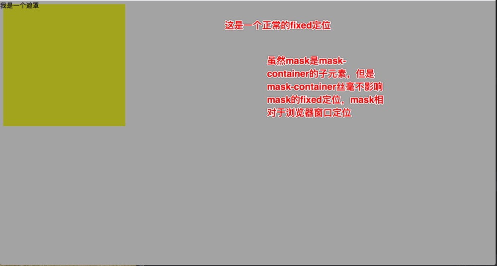
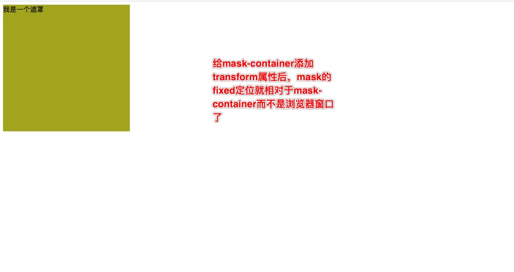

在此前很长一段时间内，我都以为 `position:fixed` 定位都是相对于浏览器窗口的。直到有一天，我发现我错了。。。。。。。

这是一个正常的 fixed 定位：


一个正常的 fixed 定位代码如下：

```html
<!DOCTYPE html>
<html lang="en">
  <head>
    <meta charset="UTF-8" />
    <title>fixed定位踩坑</title>
    <style>
      .mask-container {
        width: 300px;
        height: 300px;
        background: yellow;
      }
      .mask {
        position: fixed;
        left: 0;
        right: 0;
        top: 0;
        bottom: 0;
        background: rgba(0, 0, 0, 0.3);
      }
    </style>
  </head>
  <body>
    <div class="mask-container">
      <div class="mask">我是一个遮罩</div>
    </div>
  </body>
</html>
```

现在让我们在.mask-container 中添加一个 css 属性：transform:translateX(0)。代码如下：

```html
<!DOCTYPE html>
<html lang="en">
  <head>
    <meta charset="UTF-8" />
    <title>fixed定位踩坑</title>
    <style>
      .mask-container {
        width: 300px;
        height: 300px;
        background: yellow;
        transform: translateX(0);
      }
      .mask {
        position: fixed;
        left: 0;
        right: 0;
        top: 0;
        bottom: 0;
        background: rgba(0, 0, 0, 0.3);
      }
    </style>
  </head>
  <body>
    <div class="mask-container">
      <div class="mask">我是一个遮罩</div>
    </div>
  </body>
</html>
```

刷新浏览器，会发现效果如下图：


##### 原因

> 查看 MDN 关于 fixed 定位的定义，查看链接 [position](https://developer.mozilla.org/zh-CN/docs/Web/CSS/position)，
> 元素会被移出正常文档流，并不为元素预留空间，而是通过指定元素相对于屏幕视口（viewport）的位置来指定元素位置。
> 元素的位置在屏幕滚动时不会改变。打印时，元素会出现在的每页的固定位置。
> **fixed 属性会创建新的层叠上下文。当元素祖先的 transform, perspective 或 filter 属性非 none 时，容器由视口改为该祖先。**
