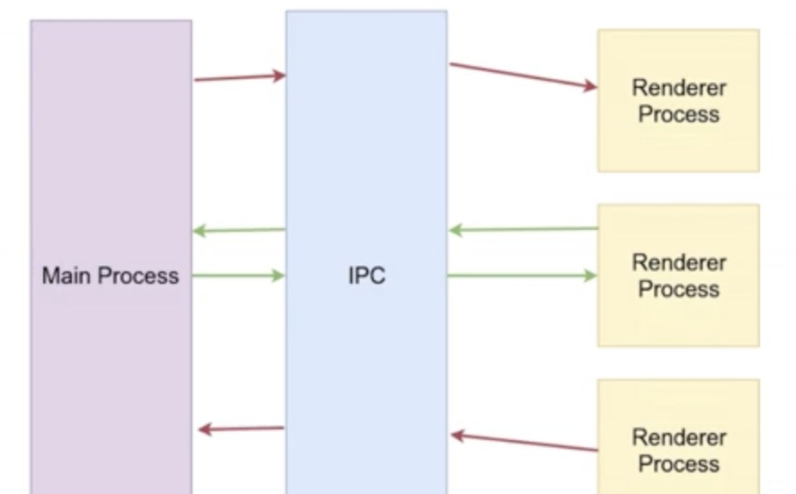

## ipc 通信

electron 主进程和渲染进程通过 ipc 进行通信，而 ipc 通信又分为以下三种：

- 单向通信：渲染进程通过`ipcRender.send`给主进程发消息，主进程通过`ipcMain.on`监听渲染进程的消息
- 双向通信：渲染进程通过`ipcRender.invoke`给主进程发消息，同时主进程通过`ipcMain.handle`监听渲染进程的消息并返回结果给渲染进程
- 单向通信：主进程通过`win.webContents.send`给渲染进程发消息，渲染进程通过`ipcRenderer.on`监听主进程的消息

主进程和渲染进程能够访问的 API 的异同，如下图所示：


主进程和渲染进程基于 ipc 通信的图示：



## 渲染进程

通过 preload.js 往渲染进程注入通信脚本。新建 preload.js，内容如下：

```js
const { contextBridge, ipcRenderer } = require("electron");

contextBridge.exposeInMainWorld("electronApi", {
  // 渲染进程和主进程的通信按以下设计，渲染进程和主进程之间通信只开通三个接口，
  // 消息类型通过data.topic区分 data = { topic: '', body }
  // 1.单向通信：渲染进程给主进程发消息
  sendMessageToMain: (data) =>
    ipcRenderer.send("MESSAGE_FROM_RENDER_TO_MAIN", data),
  // 2.双向通信：渲染进程给主进程发消息，同时还能接收主进程的返回值
  sendMessageToMainWithResult: (data) =>
    ipcRenderer.invoke("MESSAGE_CHANNEL_FOR_RENDER_MAIN", data),
  // 3.监听主进程消息
  onNoticeReceiveFromMain: (callback) =>
    ipcRenderer.on("MESSAGE_FROM_MAIN_TO_RENDER", callback),
});
```

## 主进程

### 监听渲染进程的消息

```js
const { ipcMain } = require("electron");
// 单向通信：监听渲染进程的消息
ipcMain.on("MESSAGE_FROM_RENDER_TO_MAIN", (event, data) => {
  // const webContents = event.sender;
  // const win = BrowserWindow.fromWebContents(webContents);
  // win.setTitle(data.topic);
  console.log("receivemessage from render", data);
});

// 双向通信：监听渲染进程的消息，并返回结果给渲染进程
ipcMain.handle("MESSAGE_CHANNEL_FOR_RENDER_MAIN", async (event, data) => {
  // const webContents = event.sender;
  // const win = BrowserWindow.fromWebContents(webContents);
  // win.setTitle(data.topic);
  return "主进程返回给渲染进程的结果";
});
```

### 给渲染进程发送消息

```js
win.webContents.send("MESSAGE_FROM_MAIN_TO_RENDER", data);
```
