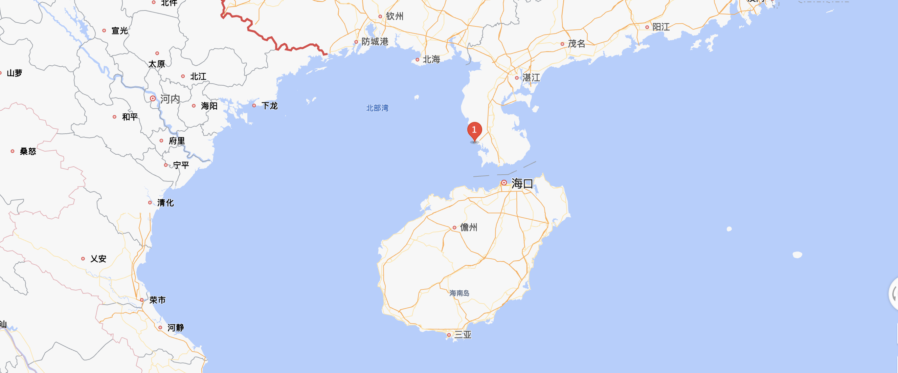
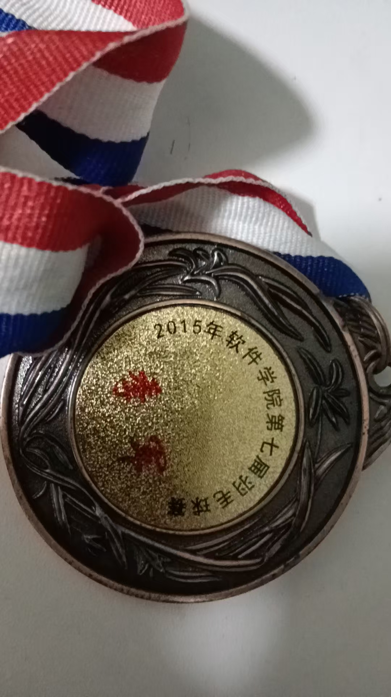
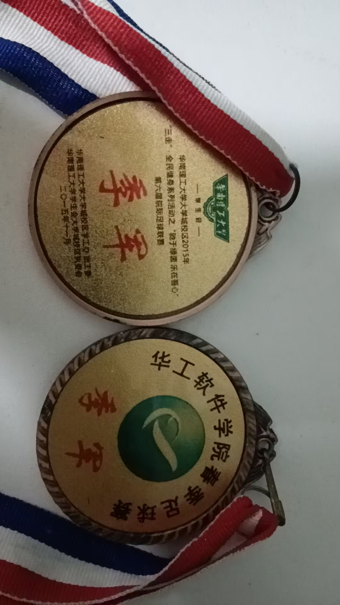

## 关于ZC的个人说明书
这篇文档是我的一个简单介绍，希望能和你交个朋友。

### 我是谁
- 来自广东湛江。海边长大，出门走一公里即是海。不会游泳，大学的游泳考试我还是憋着气游过去的
- 生于1994.05，卒于2094.05

### 兴趣爱好
- 跑步。状态最好的时期(2023年以前)可以保持5分速10公里，近两年身体素质渐渐下降，也渐渐发胖，跑个4公里都要27分钟
- 羽毛球。学生生涯最喜欢的运动之一，跟着队友混了个学院班级赛季军。毕业后球拍已经尘封

- 足球。学生生涯最喜欢的运动之一，属于又菜又爱玩的那种，上了球场毫无技术，全靠热情。毕业后已经金盆洗脚

- 看电影。丧尸（行尸走肉）、悬疑、暴力美学等类型题材都喜欢
- 骑行。等哪天失业了，尝试骑行去新疆、西藏

### 为什么选择前端？

### 为什么跳槽这么频繁？

### 职业生涯
从2017年7月毕业开始，已经度过了8年的web前端开发牛马生涯。下面是8年职业生涯的简单总结

#### 简介
1. 有将近8年的前端开发经验。具备丰富的前端业务场景，涵盖B端及C端场景。有直播间弹幕玩法、电商供应链中台、React服务端渲染、电商独立建站低代码编辑器、Canvas协同白板、webView混合开发(H5离线包)、微信小程序蓝牙通信开发、Electron客户端开发、Webpack5模块联邦微前端等复杂项目架构设计及从0到1落地经验
2. 技术栈：React全家桶、webpack、微信小程序、Electron、Canvas
3. 熟悉前端常用开发框架或者工具的源码，比如React，webpack等，基本React全家桶的源码都手撕过
4. 有较好的沟通、协作、执行能力。有一定的团队管理及项目管理经验，擅长协作流程优化

- 广东温氏 | 项目技术负责人 | 生鲜电商项目
  - 技术栈：React Native; Java + JSP; Python; 
  - 主要项目：从0到1搭建生鲜电商系统。
    + 使用React Native开发生鲜电商APP
    + Java + JSP开发电商中后台系统

- 美的 | 项目技术负责人
  - 技术栈：Vue
  - 主要项目：webview混合开发

- SHEIN(希音) | 核心开发、架构师 | 国际化电商供应链项目
  - 技术栈：React全家桶； React SSR
  - 主要项目：
    + 电商供应链中后台系统开发；
    + 中后台组件库(比如复杂的搜索表单组件[search-form](https://lizuncong.github.io/react-ui/#/components/search-form))、移动端组件库开发；
    + React服务端渲染架构师，沉淀了一套基于React的服务端渲染解决方案：[egg-react-ssr](https://github.com/lizuncong/egg-react-ssr)

- JOYY | 核心开发 | 国际化电商项目
  - 技术栈：React全家桶
  - 主要项目：
    + 参与海外电商独立建站编辑器技术调研、架构设计，核心模块开发。沉淀了一套独立建站低代码编辑器核心架构：[web-editor](https://lizuncong.github.io/web-editor/)
    + 主题模版开发负责人

- CVTE | 前端团队负责人、架构师 | 国际化教育项目
  - 技术栈：React全家桶、egg、Electron
  - 主要项目：
    + 在线课堂活动客户端开发，Electron + React混合开发。创新性采用基于window open的方案，解决多开窗口共享数据的难点问题，可以看这里：[window open多开窗口实践](https://juejin.cn/post/7201856537534939191)
    + 基于Canvas从0到1实现多人协同白板开发，相关经验沉淀可以看这里: [Canvas教程](https://lizuncong.github.io/excalidraw-app/)
    + 从0到1搭建多语言语料托管平台。服务于海外项目（基本海外项目都接入这一平台），目前该项目还在发扬光大之中。同时该项目也获得公司当年第一季度的效率提升一等奖
    + 2023年底有幸升级成部门经理(主管前后端)，1个月后功成身退，哎。。。。

- 虎牙 | 前端负责人
    + 技术栈：React全家桶、微信小程序、QT
    + 主要项目：
        + 腾讯应用宝模拟器webview混合开发架构设计、web与QT通信协议设计
        + 虎牙直播间通用礼物栏面板小程序架构设计，满足不同的业务场景
        + AI智能体微信小程序架构设计、蓝牙通信协议设计及开发。设计通用的蓝牙传输分包协议，可以看这里[微信小程序蓝牙通信开发之分包传输通信协议开发](https://juejin.cn/post/7497183377653661750)

- 网易 | 前端虚线leader
    + 技术栈：React全家桶、微信小程序
    + 负责前端团队管理，人员分工，资源协调等。带领前端团队完成创作匠+易闪两个项目的重构合并工作。牵头组织安卓、 iOS、前后端同学设计webview h5离线包方案。同时规范了策划、研发、QA整条链路的协作流程。

- 虎牙 | 前端负责人
    + 技术栈：Next.js
    + 主要项目：
        + 海外游戏道具交易站项目架构设计、核心模块开发、SEO优化

### 联系方式

