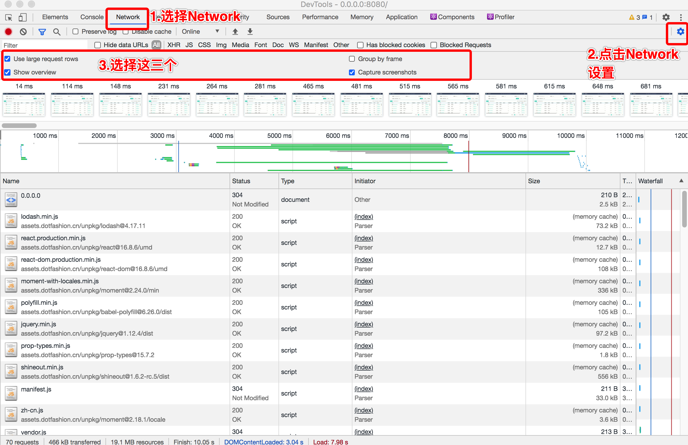
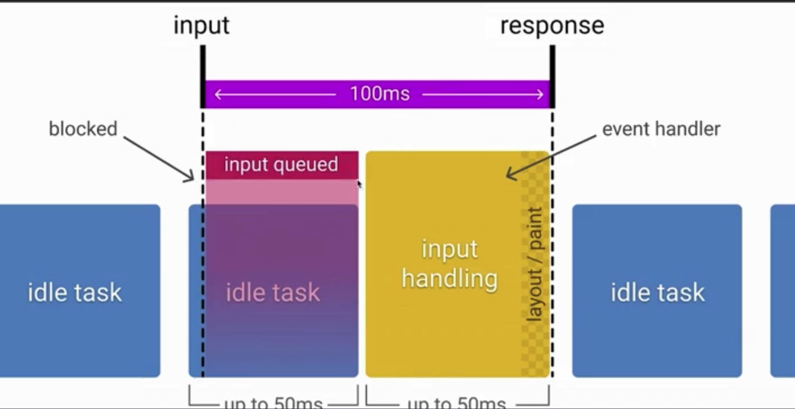

- 打开开发者工具，选择 Network
  

- TTFB: 从请求发送出去到接收到第一个字节的时间。网站快还是慢很大程度上取决于这个 TTFB。如果 TTFB 高的话，说明请求发出去了，但是资源
  一直还没回来，浏览器就一直白屏。如果 TTFB 很小，请求就很快，用户就感受到网站很快。

- First Contentful Paint。第一个有内容的绘制时间。
- Speed Index。 速度指标，标准是 4 秒。
- 页面加载时间
- 首次渲染时间
- ## 可交互。

RAIL 测量模型

- R 代表 Response 响应。 指的网站响应用户的点击、滚动等交互反馈的速度。
  - 处理事件应在 50ms 以内完成
    
- A Animation 动画
  - 每 10ms 产生一帧
- I Idle 空闲。让浏览器有足够的空闲时间。让主线程有足够的时间响应用户的交互。

  - 尽可能增加空闲时间，比如一些业务逻辑计算，应该交给后端处理，而不是前端处理，以增加浏览器空闲时间。

- L Load 加载
  - 在 5 秒内完成内容加载并可以交互

性能测量工具

- WebpageTest 网站
  - 在线进行网站性能分析
  - 如何本地部署 WebPageTest 工具

常用的性能测量 APIs

- 关键时间节点(Navigation Timing，Resource Timing)
  ```js
  window.addEventListener("load", (event) => {
    // Time to Interactive 可交互时间
    let timing = performance.getEntriesByType("navigation")[0];
    // 计算 tti = domInteractive - fetchStart
    let tti = timing.domInteractive - timing.fetchStart;
  });
  ```
- 网络状态(Network APIs)
- 客户端服务端协商(HTTP Client Hints) & 网页显示状态(UI APIs)

- L： load(onload)事件会在整个页面加载完成，包括所有依赖的资源比如样式和图片下载完成后触发。
- DCL： DOMContentLoaded 事件在初始的 HTML 文档被完全加载以及解析时触发，而不必等待样式表、图片或者子框架完成加载。
  - JavaScript 的同步模式会导致 DOM 解析暂停。如果你想在用户请求页面时，首先尽可能先解析 DOM。此时可以使用 JS 异步模式，
    并且优化样式表的加载。在通常模式的加载过程中，样式表的加载会与 DOM 解析并行，从而迟缓主要 HTML 文档的加载。
