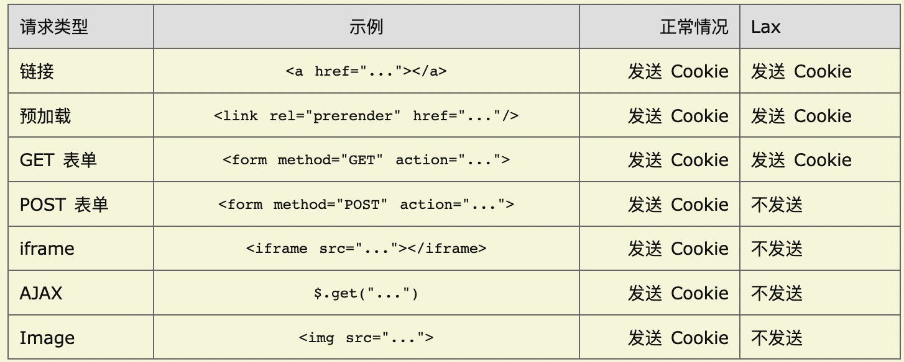

### 问题描述

在我们的业务场景中，需要通过 iframe 嵌入第三方网站。假设第三方网站：`demoUrl = https://demo.mysite.com`，我们测试环境网站`https://admin.mysitestg.com`，正式环境网站`https://admin.mysite.com/`

第三方网站二级域名和正式环境网站相同，和测试环境不同。

在测试环境网站`https://admin.mysitestg.com/preview?demoUrl=https://demo.mysite.com`中通过 iframe 内嵌 demoUrl(demo.mysite.com)的网页。demoUrl 网页有个 get 请求 cookie 种在三级域名下，即`demo.mysite.com`。此时由于浏览器 samesite 限制，该 get 请求**并没有**携带 cookie 过去后端。

> 注：get 请求为https://demo.mysite.com/leproxy/api/product/list/sortation/info/batch/query?id=123

但是在正式环境网站`https://admin.mysite.com/preview?demoUrl=https://demo.mysite.com`(二级域名.mysite.com)中一样通过 iframe 内嵌 demoUrl(demo.mysite.com)的网页，此时 demoUrl 网页的 get 请求**可以**携带 cookie 到后端

### 原因

在谷歌 80 以前的版本中，samesite 默认为 None，即允许第三方网站携带我们自己网站的 cookie。假设第三方网站通过 img 标签发起一个对我们网站的请求，那么这个请求会携带上我们网站的 cookie，请求能够正常发起，这是有安全隐患的，这也是 CSRF(跨站伪站点请求)的基本原理。于是，新版浏览器中默认将 samesite 设置为 Lax，即不允许跨站携带 cookie，防止 CSRF 攻击。

#### 问题分析

- 由于请求接口使用的是线上的接口https://demo.mysite.com/leproxy/api/product/list/sortation/info/batch/query?id=123，域名为demo.mysite.com，和demo预览页的域名一致。
- 这个接口需要携带一个 f_ds_info cookie 到后端，才能正常获取到数据。这个 cookie 种在 demo.mysite.com 域名下。
- 测试环境的域名 admin.mysitestg.com 和接口请求的二级域名不一致，所以这是一个跨站请求，cookie 没有携带过去
- 正式环境域名 admin.mysite.com，虽然和 demo.mysite.com 不同源，但是二级域名相同，因此这是一个同站请求，cookie 允许携带给后端

### 什么是 samesite(同站)，什么是 cross site(跨站)

如果两个 URL 的`protocol`、`port`和`host`都相同的话，则这两个 URL 是`同源`。不同源则一定跨域，但不一定跨站！！！

跨站并不等同于跨域

跨站的条件要比跨域的宽松点。协议和端口都不看，只要二级域名相同就认为是同站请求。

> 如果用户在www.web.dev上向static.web.dev请求图像，那么这是一个同站请求，但是一个跨域请求。此时可以携带static.web.dev上的cookie

这里需要注意并不是所有的二级域名相同的站点都是同站的，社区上维护了一个[公共后缀列表](https://publicsuffix.org/)，只要在这个列表里面的，即使二级域名相同，都属于跨站。

> 如果用户在 your-project.github.io 上向 my-project.github.io 请求图像，那么这是一个跨站请求。

### samesite 的取值

- Strict。Strict 最为严格，完全禁止第三方 Cookie，跨站点时，任何情况下都不会发送 Cookie。换言之，只有当前网页的 URL 与请求目标一致，才会带上 Cookie。

  > 这个规则过于严格，可能造成非常不好的用户体验。比如，当前网页有一个 GitHub 链接，用户点击跳转就不会带有 GitHub 的 Cookie，跳转过去总是未登陆状态

- Lax。Lax 规则稍稍放宽，大多数情况也是不发送第三方 Cookie，但是导航到目标网址的 Get 请求除外。导航到目标网址的 GET 请求，只包括三种情况：链接，预加载请求，GET 表单。详见下表。

- None 允许跨站携带 cookie。如果将 samesite 设置为 None，前提是必须同时设置 Secure 属性（Cookie 只能通过 HTTPS 协议发送），否则无效。

### 建议

一般而言，对于业务来说是建议设置 SameSite 属性值为 Lax 的，因为 Strict 太影响用户体验。

Lax 对 GET 请求是放行的，因此整改的重点在于要严格区分 GET 和 POST 的职责，即 GET 只能进行一些查询类或导航类的访问、而不是进行状态更改，要执行一些更改类的表单操作就必须交由 POST 来处理，在这种场景下 Lax 的设置才会将风险降到较低。这是因为：

- 如果用 GET 携带参数访问，其中的参数值将会记录在浏览器历史、Web 日志以及访问其他页面的 Referer 头字段中；
- Cookie 的 SameSite 属性设置为 Lax 的 GET 请求还是会被攻击者利用进行 CSRF 攻击，且 GET 型 CSRF 攻击难度低；

### 参考链接

- [samesite cookie 的解释](https://web.dev/samesite-cookies-explained/)
- [samesite 取值比较](https://www.ruanyifeng.com/blog/2019/09/cookie-samesite.html)
