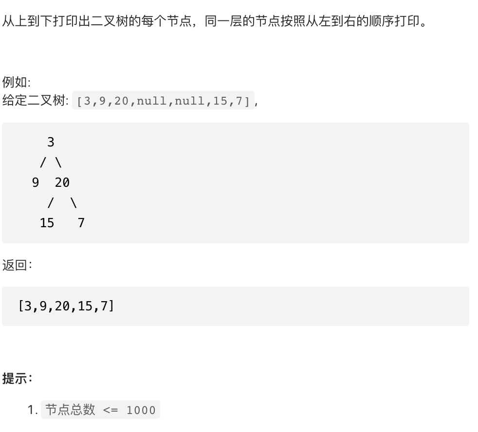

## 描述


## 实现
```js
/**
 * Definition for a binary tree node.
 * function TreeNode(val) {
 *     this.val = val;
 *     this.left = this.right = null;
 * }
 */
/**
 * @param {TreeNode} root
 * @return {number[]}
 */
var levelOrder = function(root) {
    const queue = root ? [root] : [];
    const number = []
    while(queue.length){
        const node = queue.shift()
        number.push(node.val)
        if(node.left){
            queue.push(node.left)
        }
        if(node.right){
            queue.push(node.right)
        }
    }
    return number
};
```