## Node.js架构


- 最上层是我们自己写的javascript代码
- 中间的NodeJS层是Node提供给我们的一些内置模块，比如fs、path等。
- v8引擎。开源的js引擎。能够在浏览器之外执行javascript代码。因此这里是真正执行我们自己写的javascript代码的地方
- libuv库。C++开源项目，允许node.js访问操作系统、底层文件系统。允许访问网络，还可以处理并发性

那为什么要用中间的NodeJS层呢？为什么不直接使用v8或者libuv呢？

首先要了解的是，在内部，v8和libuv几乎很少包含js代码，基本都是C++代码。因此作为javascript开发人员，我们可能并不希望全部编写C++代码。如下图所示


这就是Nodejs的目的之一，提供给我们一个很好的接口来关联我们项目中的javascript到运行在我们计算机上的C++去实际解释和执行。


另外，Nodejs提供了一些内置模块，比如http、fs、crypto、path等模块。这些模块都有非常一致的API。他们最终都引用了libuv库中相关的功能


因此，我们可能不想直接访问C++代码，我们希望在项目中使用javascript函数。通过Node.js，我们不必直接访问libuv库中的C++代码


## Node.js模块实现
以Nodejs内置模块crypto中的pbkdf2函数为例：


通过查看这个函数的源码，我们可以了解Node.js如何在内部使用libuv库以及v8引擎

pbkdf2.js源码在[https://github.com/nodejs/node/blob/main/lib/internal/crypto/pbkdf2.js](https://github.com/nodejs/node/blob/main/lib/internal/crypto/pbkdf2.js)

这里简单介绍下Nodejs源码项目目录


这里最重要的就是lib和src目录，其中：
- lib存放的是Node.js内置模块的源码，比如fs、path等模块的源码。
- src目录是lib中所有函数的C++实现。

通过查看pbkdf2.js中pbkdf2函数的实现可以发现：


PBKDF2Job就是pbkdf2的C++实现。

internalBinding就是nodejs将js和c++联系起来的地方，是js和c++的桥梁。


下面是node crypto模块的全部C++实现代码


下面是PBKDF2函数导出的地方


PBKDF2实现的地方：


## 线程
与线程有关的最重要的是调度。操作系统能够决定在任何给定时刻及时处理哪个线程


CPU每秒能处理的指令是有限的。需要确保紧急线程不必等待太长时间才能执行。

为了更快地处理线程或在给定时间处理更多线程，我们可以使用多核CPU


从技术上讲，一个内核可以处理多个线程。但这解决不了优先级的问题。


如下所示，有两个线程，它们都在竞争处理能力

线程1有一组指令想要从硬盘上读取文件，然后计算文件里面的字符数。

线程2需要计算3乘以3

从硬盘读取或者写入数据，称之为IO。IO操作是非常耗时的。在IO阶段，CPU等待硬盘读取文件并返回内容。在这段时间内，线程1无法处理其他任务，一直在等待硬盘读取完成。操作系统调度程序能够检测到这一段暂停时间或者两个指令之间的暂停时间，它可以决定暂停第一个线程，然后执行线程2。线程2执行完成后就可以继续执行线程1。


因此，有两种方式可以提高我们的处理速度：

- 1.使用多核CPU
- 2.允许操作系统调度程序检测较大的暂停，比如IO


## 事件循环

当我们启动一个node应用程序时，node会创建一个线程，执行我们所有的代码。这个线程就是我们所说的主线程，也叫事件循环线程。

详情可以点击[这里](https://nodejs.org/zh-cn/docs/guides/dont-block-the-event-loop)查看


我们可以将事件循环看作是一个控制结构，它决定应该执行什么操作。了解事件循环的工作方式是极其重要的，因为node的许多性能问题最终都归结为事件循环的行为方式。因此，从本质上讲，如果我们理解事件循环机制，那么就可以很好的理解nodejs中的性能问题

可以通过伪代码的方式理解事件循环。每次事件循环在我们的node应用程序中运行时，我们称之为一tick。


事件循环伪代码：

```js
// node myFile.js


// New timers，tasks，operations are recorded from myFile running
// 因此如果我们的myFile文件中使用了http服务监听请求，那么我们的程序将不会退出。
myFile.runContents();

const pendingTimers = [];
const pendingOSTasks = [];
const pendingOperations = [];

// 在shouldContinue函数中，nodejs将执行三个单独的检查以决定事件循环是否应该继续。
function shouldContinue(){
    // Check one: Any pending setTimeout，setInterval，setImmediate 首先，先检查是否有setTimeout、setInterval、setImmediate注册的回调函数
    // Check two: Any pending OS tasks?(Like server listening to port) 其次，检查是否有任何挂起的操作系统任务。比如检查是否服务器仍在监听传入的请求。
    // Check three：Any pending long running operations?(Like fs module) 。检查是否存在长时间运行的操作。和第二次检查有点类似。但两者之间有明显的区别。长时间运行的操作的示例：FS模块的回调函数
    return pendingTimers.length || pendingOSTasks.length || pendingOperations.length
}
// shouldContinue返回true时，事件循环将继续运行。返回false时，事件循环将结束，程序执行到底部，并退出
// Entire body executes in one 'tick'
while(shouldContinue()){
    // 1.Node looks at pendingTimers and sees if any functions are ready to be called. setTimeout，setInterval

    // 2.Node looks at pendingOSTasks and pendingOperations and calls relevant callbakcs

    // 3.Pause execution。Continue when... (暂停执行，在暂停期间，node等待新的事件发生。node just sits around and got no other work to do，it just going to waint until it see):
    //      - a new pendingOSTask is done. Like a new request has come in one some port that we are listening to.
    //      - a new pendingOperation is done. Like we fetch some file of the hard drive
    //      - a timer is about to complete. Like a timer for one of the setTimeout or setIntervals is about to 
    // expire and the relevant function needs to be called
    // Then once that pause is complete bacause we presumably see that something is 
    // about to occur we then continue with the last two steps inside of the event loop

    // 4. Look at pendingTimers. Call any setImmediate

    // 5. Handle any 'close' events.本质上讲，事件循环中的最后一步只是处理清理代码和清理
}


// exit back to terminal


```

## CPU线程调度
假设计算机只有一个CPU，则在任意时刻只能执行一条机器指令，每个线程只有获得CPU的使用权才能执行指令。
- 所谓多线程的并发执行，其实是指从宏观上看，各个线程轮流获得CPU的使用权，分别执行各自的任务。
- 在运行池中，会有多个处于就绪状态的线程在等待CPU，Java虚拟机的一项任务就是负责线程的调度，线程调度是指按照特定机制为多个线程分配CPU的使用权。

有两种调度模型：分时调度模型和抢占式调度模型
- 分时调度模型是指让所有的线程轮流获得CPU的使用权，并且平均分配每个线程占用的CPU的时间片
- Java虚拟机采用抢占式调度模型，是指优先让可运行池中优先级高的线程占用CPU，如果可运行池中的线程优先级相同，那么就随机选择一个线程，使其占用CPU，处于运行状态的线程会一直运行，直至它不得不放弃CPU。

### 进程
计算机的核心是CPU，它承担了所有的计算任务，而操作系统是计算机的管理者，它负责任务的调度，资源的分配和管理，统领整个计算机硬件。

进程是一个具有一定独立功能的程序在一个数据集上的一次动态执行的过程，是操作系统进行资源分配和调度的一个独立单位，是应用程序运行的载体。

### 线程
在早期的操作系统中并没有线程的概念，进程是拥有资源和独立运行的最小单位，也是程序执行的最小单位。任务调度采用的是时间片轮转的抢占式调度方式，而进程是任务调度的最小单位，每个进程有各自独立的一块内存，使得各个进程之间内存地址相互隔离。

后来随着计算机的发展，对CPU的要求越来越高，进程之间的切换开销较大，已经无法满足越来越复杂的程序的要求了。于是就发明了线程，线程是程序执行中一个单一的顺序控制流程，是程序执行流的最小单元，是处理器调度和分派的基本单位。一个进程可以有一个或多个线程，各个线程之间共享程序的内存空间(也就是所在进程的内存空间)。一个标准的线程由线程ID，当前指令指针PC，寄存器和堆栈组成。

而进程由内存空间(代码，数据，进程空间，打开的文件)和一个或多个线程组成。

### 小结
- 进程：一个进程中会有多个线程。（多个线程分别做不同的事情）由程序，数据、进程控制块三部分组成。由操作系统进行资源分配（包括cpu、内存、磁盘IO等）的最小单位
- 线程：cpu调度和分配的基本单位。就是CPU的作用,线程多了可以提高程序并行执行的速度
- 单核多线程：单核cpu轮流执行多个线程，通过给每个线程分配cpu时间片来实现
- 多核多线程：多个线程分配给多个核心处理，相当于多个线程并行执行。而单核多线程只能是并发

多核cpu和单核Cpu的区别：
- 单核：cpu只有1个独立的cpu核心单元，运行的线程数少，不利于同时运行多个程序，执行速度慢
- 多核：cpu只有多个独立的cpu核心单元，运行的线程数多，有利于同时运行多个程序，执行速度快

串行，并发与并行
- 串行: 多个任务，执行时一个执行完再执行另一个。
- 并发: 多个线程在单个核心运行，同一时间一个线程运行，系统不停切换线程，看起来像同时运行，实际上是线程不停切换。
- 并行: 每个线程分配给独立的核心，线程同时运行。

在单CPU系统中，系统调度在某一时刻只能让一个线程运行，虽然这种机制有多种形式，但是大多数是时间片轮询方式为主，要通过不断切换需要运行的线程让其运行的方式就叫并发(concurrent)。而在多CPU系统中，可以让两个以上的线程同时运行，这种可以同时让两个以上线程同时运行的方式叫做并行(parallel)。

所以记住：并发在微观上不是同时执行的，只是把时间分成若干段，使多个进程快速交替的执行。在软件领域，完成多个任务需要借助多线程完成。但是并不是并发操作能够完全优势于串行操作，因为进程间切换需要成本，但是有时候有些任务只能通过串行完成


## Node是否单线程？
Node事件循环是单线程。也就是说，执行我们自己写的代码的线程是单线程。这意味着我们的程序只能在一个CPU内核上运行。如果我们计算机的CPU有多个核，那么node就不会充分利用到这些优势。换句话说，我们的程序就没法快速的运行，因为它是单线程。

但是Node标准库中提供的一些函数实际上并不是单线程。换句话说，Node内部提供的一些函数运行在我们的事件循环线程之外，也就是其他线程中。

因此，简单的说node是单线程并不完全正确。


如下面代码所示，pbkdf2函数的执行大约需要548毫秒。

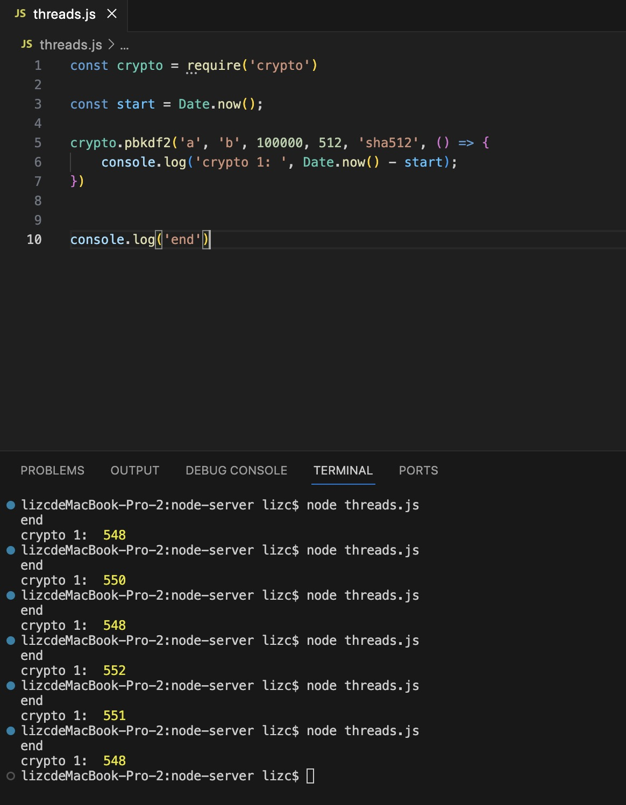

我们再来看下调用两次pbkdf2函数的结果咋样，如下所示：

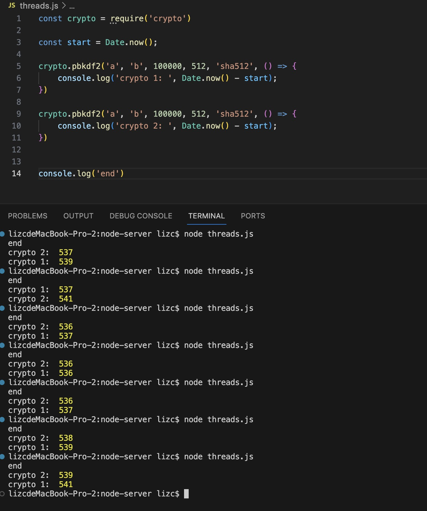


上面的结果有两点需要注意的地方：

- crypto 1和 crypto2打印的顺序不是固定的
- crypto 1和crypto2回调函数执行的时间几乎是一样的

如果node是单线程的话，那么crypto.pbkdf2的执行应该是串行的，上面两个函数的执行时间应该是累加的才对，同时打印顺序应该也是按照执行顺序来的才对。如下图所示

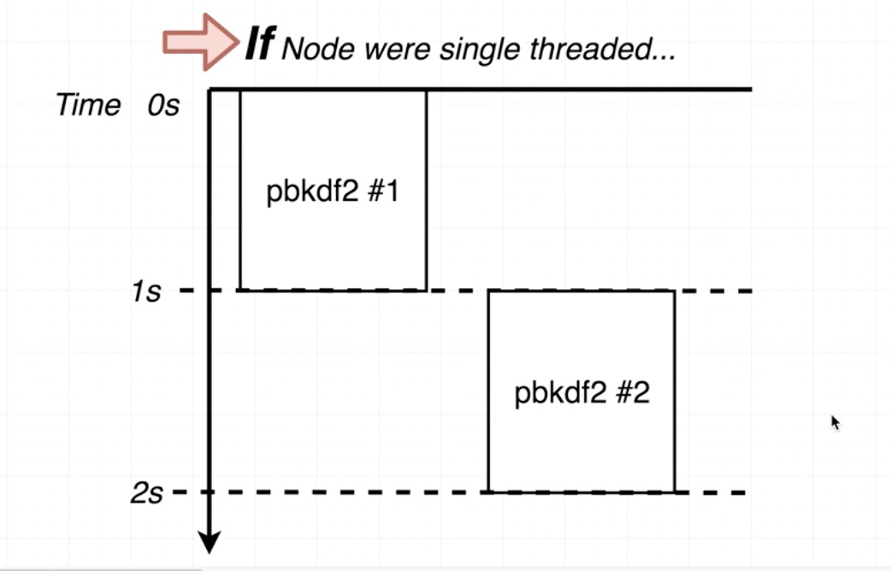


但实际上，crypto.pbkdf2函数是多线程的，谁先执行完就执行谁的回调函数，真实执行情况如下

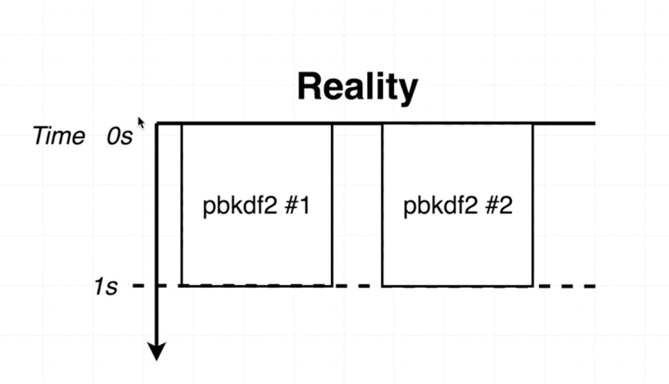


## libuv线程池
在上一节我们看到crypto.pbkdf2函数的执行并不是单线程的，这节我们将简单看下基本原理。

下面图示是crypto.pbkdf2函数的实际运行情况

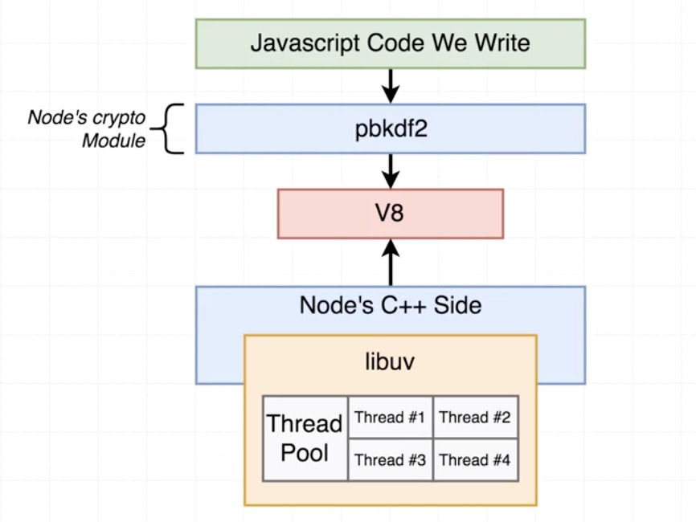

libuv会将一些昂贵的计算操作放在事件循环线程之外，也就是线程池中执行。默认情况下，线程池由四个线程组成，可用于计算密集型任务。


默认情况下，libuv会在线程池中创建4个线程。因此这意味着除了用于事件循环线程之外，还有其他四个线程可用于在我们的应用程序内执行昂贵的操作。Node标准库的大部分函数都会充分利用这个线程池，比如crypto.pbkdf2函数


很明显，node不是真正的单线程，因为node还使用其他线程来执行一些计算密集型的任务

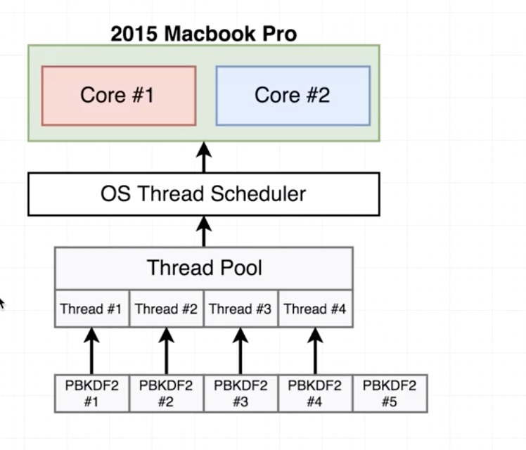


### 关于线程池的几个问题

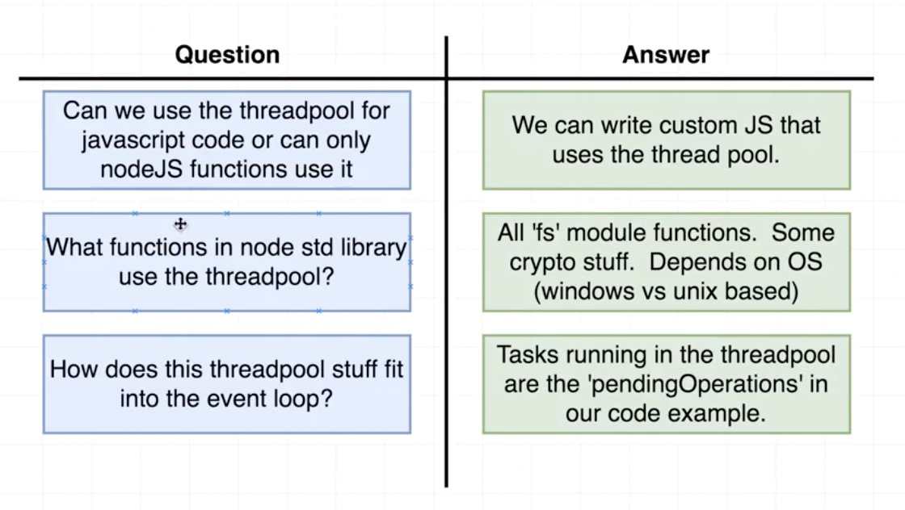

在前面事件循环的伪代码中，我们定义了一个`pendingOperations`数组。然后在我们想要检查事件循环是否应该继续运行的时候，我们检查线程池内是否还有任何挂起的操作。因此，`pendingOperations`实质上表示的是正在线程池中执行的任务。因此，只要线程池中仍有一些代码或一些任务排队等待运行，我们的程序将继续执行事件循环。


### 实例讲解

现在我们已经知道CPU是按时间片分片轮流执行线程的，同时也知道libuv线程池用于执行昂贵的计算操作。下面我们通过几个例子分析一下。

>我的电脑CPU 有4个内核。

#### demo1：1个任务
先来看下一个简单的demo

```js
const crypto = require('crypto')

const start = Date.now();

crypto.pbkdf2('a', 'b', 100000, 512, 'sha512', () => {
    console.log('crypto 1: ', Date.now() - start);
})
console.log('end')
```

执行这段代码，控制台输出：

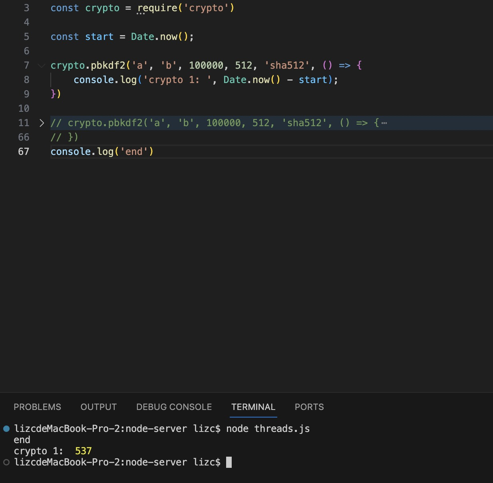

可以看到，crypto.pbkdf2函数的执行大概耗时537毫秒。

#### demo2：4个任务
由于我的计算机CPU有4个内核，同时libuv线程池默认四个线程。因此，这里我们可以试下调用四次crypto.pbkdf2看看结果

```js
const crypto = require('crypto')

const start = Date.now();

crypto.pbkdf2('a', 'b', 100000, 512, 'sha512', () => {
    console.log('crypto 1: ', Date.now() - start);
})

crypto.pbkdf2('a', 'b', 100000, 512, 'sha512', () => {
    console.log('crypto 2: ', Date.now() - start);
})

crypto.pbkdf2('a', 'b', 100000, 512, 'sha512', () => {
    console.log('crypto 3: ', Date.now() - start);
})

crypto.pbkdf2('a', 'b', 100000, 512, 'sha512', () => {
    console.log('crypto 4: ', Date.now() - start);
})
console.log('end')
```

控制台执行，注意这里可以多执行几次观察结果

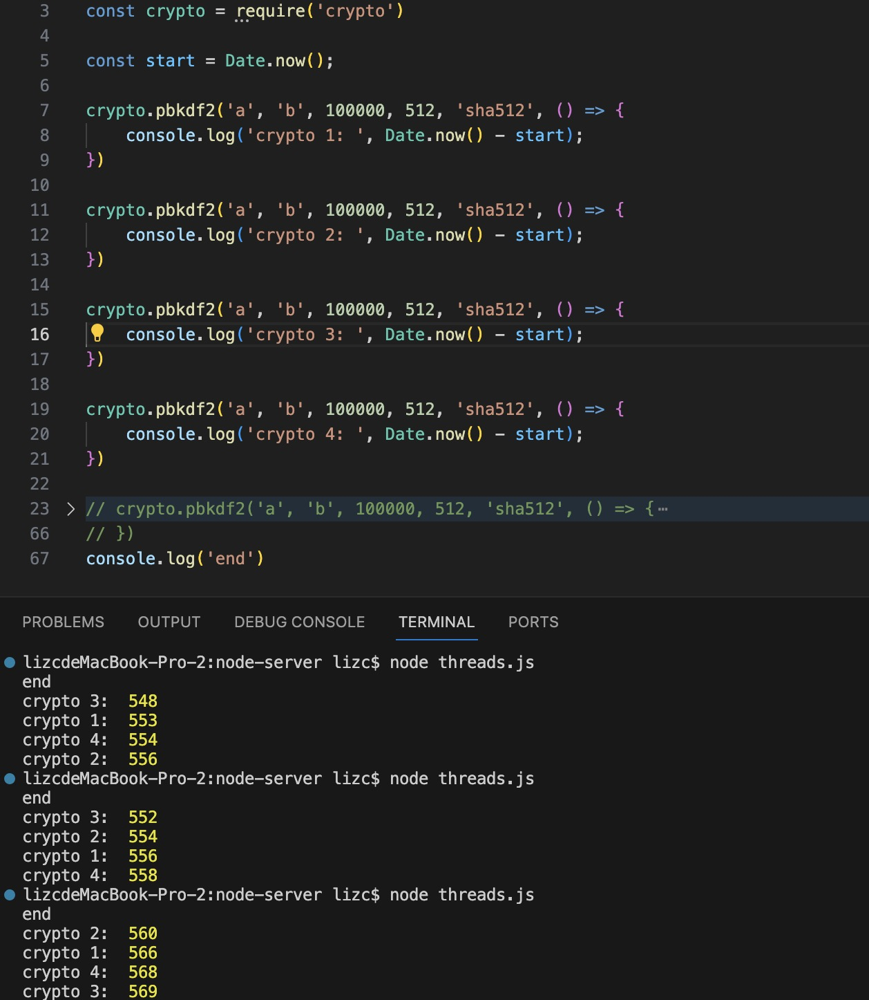

可以得出以下几点结论：
- 回调函数的执行顺序是不确定的
- 四个函数的执行耗时大概在550毫秒左右


执行过程如下图所示

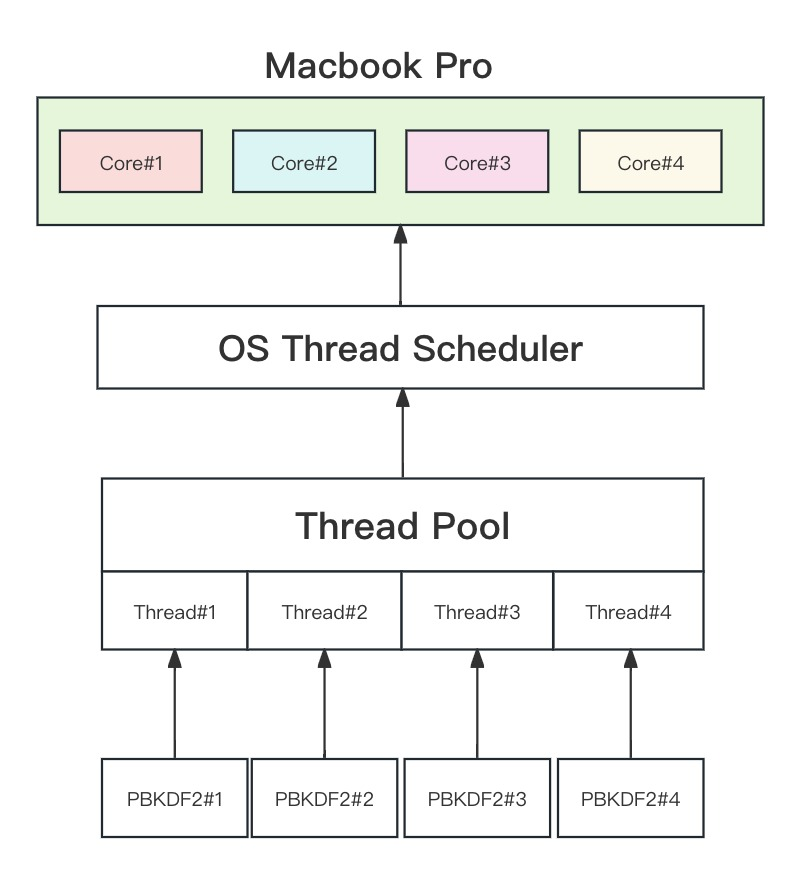

这里我们调用了四次`crypto.pbkdf2`函数，也就是有4个任务需要执行。线程池有4个线程，意味着线程池能同时处理4个任务。我电脑中的CPU有4个内核，这4个内核轮流执行4个线程，平均每个内核执行1个线程，平均耗时560毫秒左右。因此可以看到4个回调函数几乎同时执行完成，耗时差不多。


#### demo3：5个任务
修改下我们的代码，这次我们调用5次`crypto.pbkdf2`函数。

```js
const crypto = require('crypto')

const start = Date.now();

crypto.pbkdf2('a', 'b', 100000, 512, 'sha512', () => {
    console.log('crypto 1: ', Date.now() - start);
})

crypto.pbkdf2('a', 'b', 100000, 512, 'sha512', () => {
    console.log('crypto 2: ', Date.now() - start);
})

crypto.pbkdf2('a', 'b', 100000, 512, 'sha512', () => {
    console.log('crypto 3: ', Date.now() - start);
})

crypto.pbkdf2('a', 'b', 100000, 512, 'sha512', () => {
    console.log('crypto 4: ', Date.now() - start);
})

crypto.pbkdf2('a', 'b', 100000, 512, 'sha512', () => {
    console.log('crypto 5: ', Date.now() - start);
})
console.log('end')
```

在执行代码前，可以思考一下运行结果是咋样的。这里我们有5个任务排队等待处理，线程池只有4个线程可以处理这些任务，也就是说一次最多只有4个任务在同时处理，只有等到其中一个任务处理完成，线程池中有空闲线程时，才能继续处理下一个任务。可想而知，这5个任务中，前四个会优先得到执行，只有这四个任务的其中一个执行完成后，才能继续处理第5个。

到这里，已经不难猜想执行结果：

先打印前面四个任务的执行耗时，而且顺序随机，同时耗时大概在560毫秒左右。

然后过了差不多560毫秒，才输出第五个任务的回调，耗时大概在1100毫秒左右。

如下图所示：


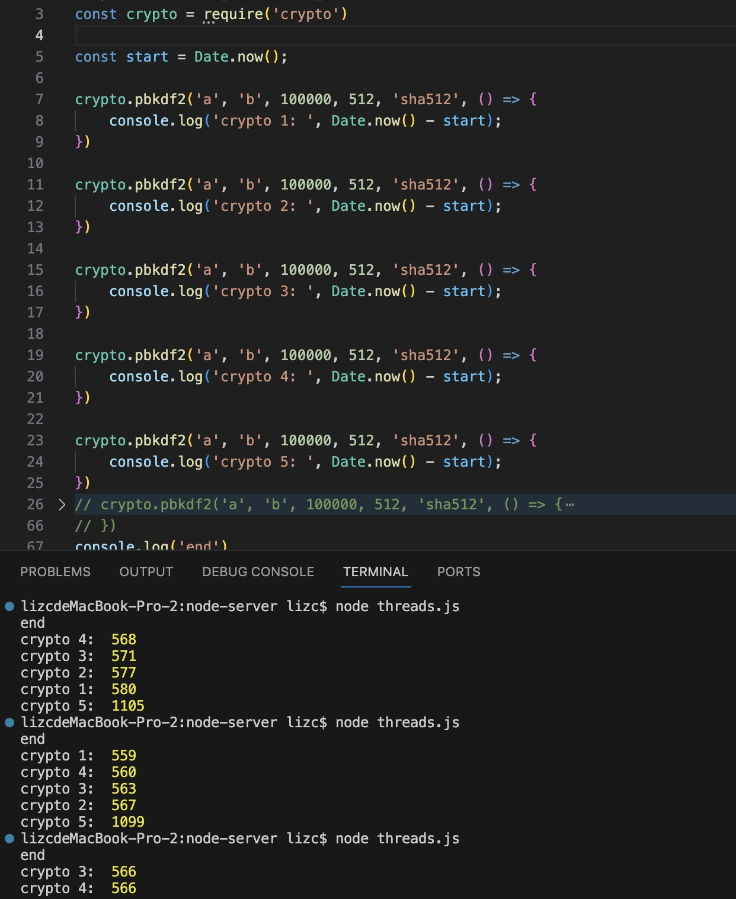

原理如下：

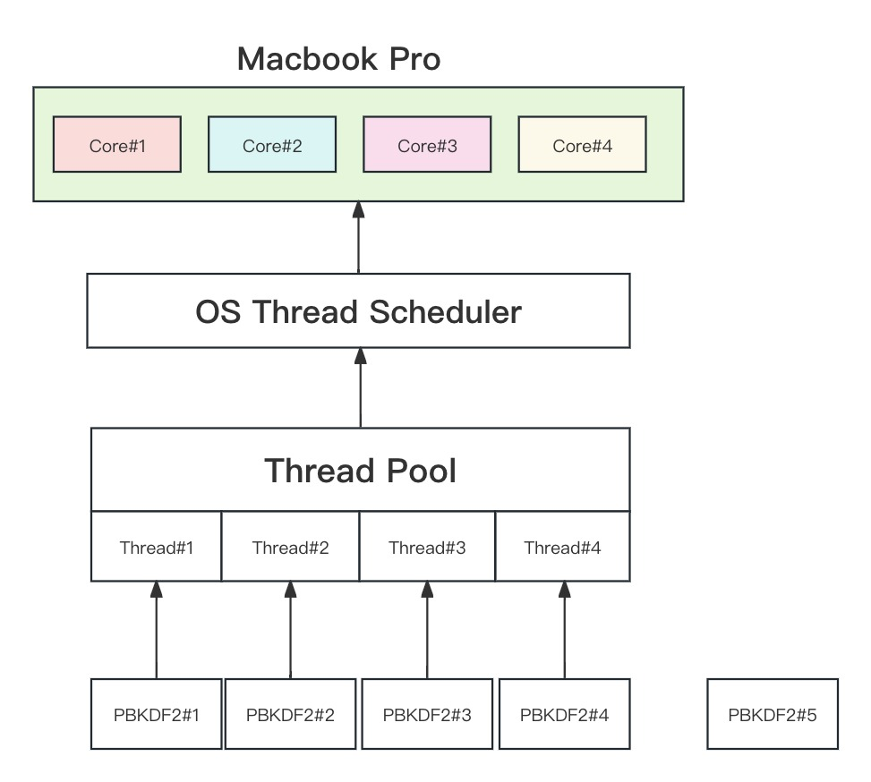

#### demo4：改变线程池大小为5
这次我们改变线程池的大小为5，这意味着线程池能同时5个任务。可以通过

```
process.env.UV_THREADPOOL_SIZE = 5;
```

修改线程池的大小。如下代码所示：

```js
process.env.UV_THREADPOOL_SIZE = 5;
const crypto = require('crypto')

const start = Date.now();

crypto.pbkdf2('a', 'b', 100000, 512, 'sha512', () => {
    console.log('crypto 1: ', Date.now() - start);
})

crypto.pbkdf2('a', 'b', 100000, 512, 'sha512', () => {
    console.log('crypto 2: ', Date.now() - start);
})

crypto.pbkdf2('a', 'b', 100000, 512, 'sha512', () => {
    console.log('crypto 3: ', Date.now() - start);
})

crypto.pbkdf2('a', 'b', 100000, 512, 'sha512', () => {
    console.log('crypto 4: ', Date.now() - start);
})

crypto.pbkdf2('a', 'b', 100000, 512, 'sha512', () => {
    console.log('crypto 5: ', Date.now() - start);
})
console.log('end')
```

分析上面的代码，这里线程池有5个线程，意味着可以同时处理5个任务，然后我们调用5次`crypto.pbkdf2`函数，即有5个任务需要处理。线程池可以同时处理这5个任务。

我们只有4个内核，却需要处理线程池中的5个线程，这4个内核需要轮流执行这5个线程，相当于每个内核需要处理1.25个线程。因此，执行完这5个任务大概耗时1.25 * 560 = 700毫秒。而且这5个任务是几乎同时完成的。


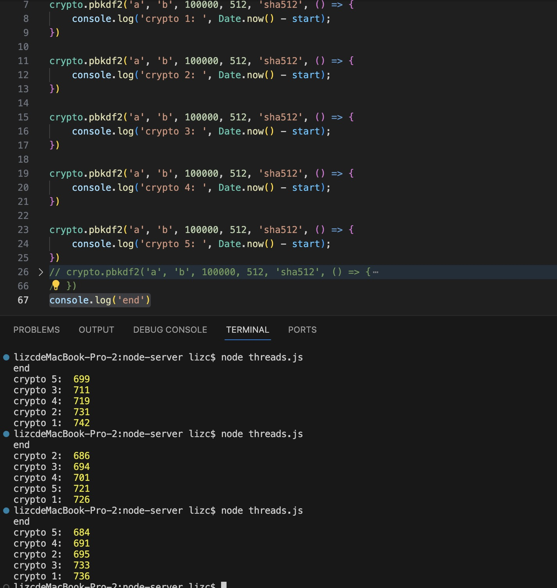


执行原理：

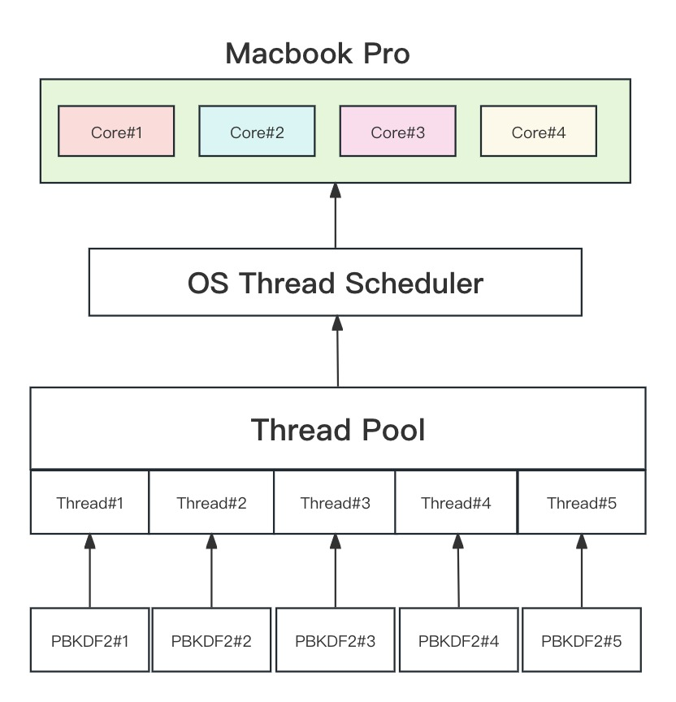


有点意思。实际上我们可以继续加大线程池数量，再细细品一下这个原理

#### demo5：改变线程池大小为6

```js
process.env.UV_THREADPOOL_SIZE = 6;
const crypto = require('crypto')

const start = Date.now();

crypto.pbkdf2('a', 'b', 100000, 512, 'sha512', () => {
    console.log('crypto 1: ', Date.now() - start);
})

crypto.pbkdf2('a', 'b', 100000, 512, 'sha512', () => {
    console.log('crypto 2: ', Date.now() - start);
})

crypto.pbkdf2('a', 'b', 100000, 512, 'sha512', () => {
    console.log('crypto 3: ', Date.now() - start);
})

crypto.pbkdf2('a', 'b', 100000, 512, 'sha512', () => {
    console.log('crypto 4: ', Date.now() - start);
})

crypto.pbkdf2('a', 'b', 100000, 512, 'sha512', () => {
    console.log('crypto 5: ', Date.now() - start);
})
crypto.pbkdf2('a', 'b', 100000, 512, 'sha512', () => {
    console.log('crypto 6: ', Date.now() - start);
})
console.log('end')
```

这次，线程池有6个线程，意味着可以同时处理6个任务。然后我们有6个任务需要处理。但我们只有4个内核轮流执行这6个线程池里的线程，平均每个内核需要执行6/4=1.5个线程。因此执行完这6个任务大概需要1.5 * 560 = 840毫秒的时间。

执行上面的代码，可以发现这6个任务几乎同时完成，耗时大概在840毫秒左右。

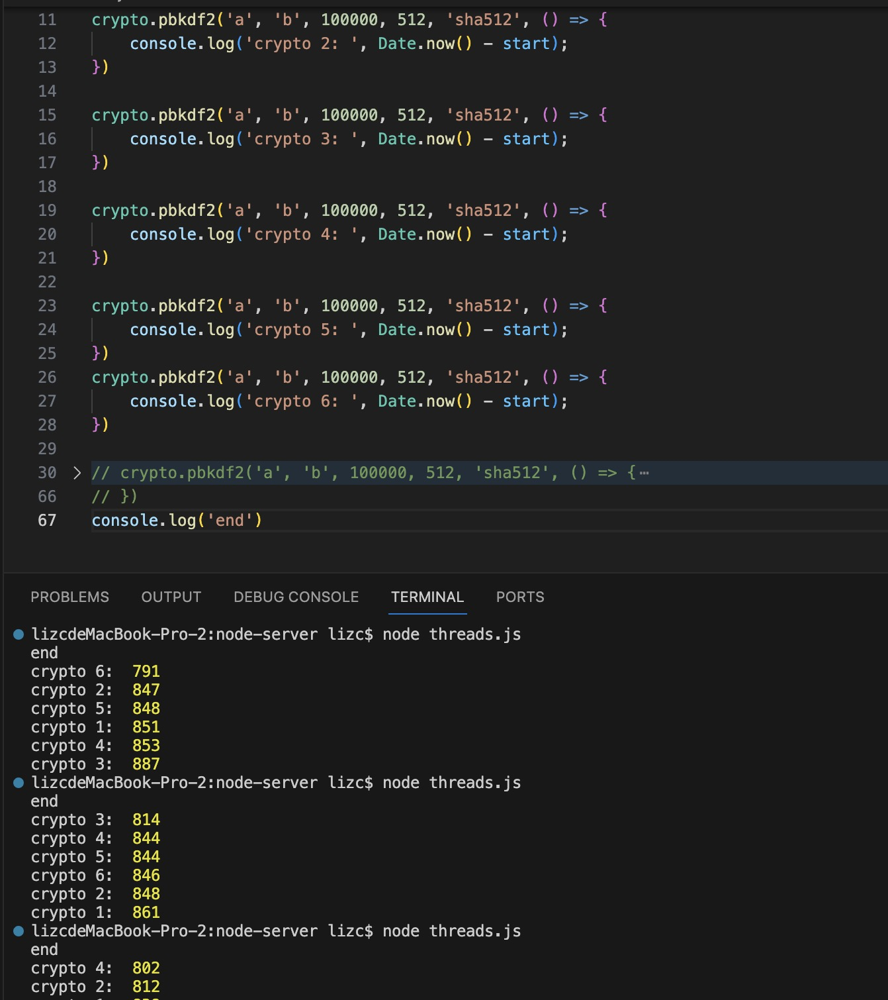

> 上面的执行时间有误差是因为CPU轮流执行这些线程时，切换线程也是需要时间的

>总的来说，线程池大小表示同时能处理的最大任务数量。

> 在线程池里的任务就是事件循环中的pendingOperations？？？需要再验证一下


## OS Operations && Libuv OS Delegation
在上一节，我们知道nodejs提供的crypto.pbkdf2函数是在线程池中执行的。当然，nodejs提供的其他内置模块并不都是在线程池中执行的。

本节就来探讨nodejs内部如何处理网络请求。通过代码验证nodejs中网络请求并不是在线程池中处理的。

首先，为了客观的研究nodejs网络请求，我们先写个简单的基准代码

```js
const https = require('https')

const startTime = Date.now();

const doRequest = (num) => {
    https.request('https://www.baidu.com/', res => {
        res.on('data', (data) => {
        })
        res.on('end', () => {
            console.log(`${num}：`, Date.now() - startTime)
        })
    }).end();
}

doRequest(1);
```

多次执行下面的代码，可以发现耗时大概在270毫秒。

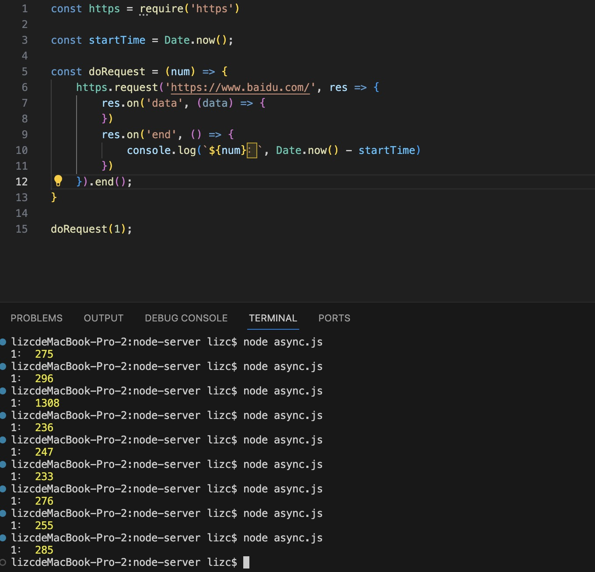


然后，多次调用`doRequest`

```js
const https = require('https')

const startTime = Date.now();

const doRequest = (num) => {
    https.request('https://www.baidu.com/', res => {
        res.on('data', (data) => {
        })
        res.on('end', () => {
            console.log(`${num}：`, Date.now() - startTime)
        })
    }).end();
}

doRequest(1);
doRequest(2);
doRequest(3);
doRequest(4);
doRequest(5);
doRequest(6);
doRequest(7);
```

执行结果如下图所示：

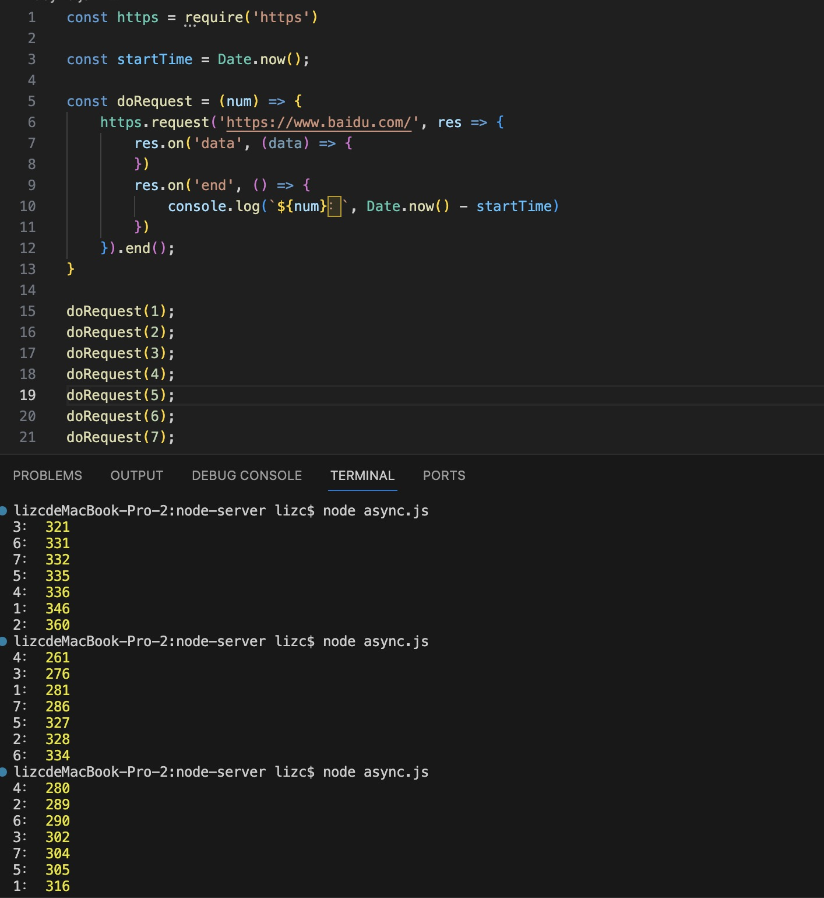


可以发现，这7个请求几乎都是在同一时间完成，这和我们之前在线程池中看到的行为截然不同，并不像`crypto.pbkdf2`一样需要排队等待线程池处理。

node提供的内置标准库中，一些函数利用了libuv的线程池。同样，也存在一些函数是直接调用libuv中内置的一些操作系统代码。如下图所示

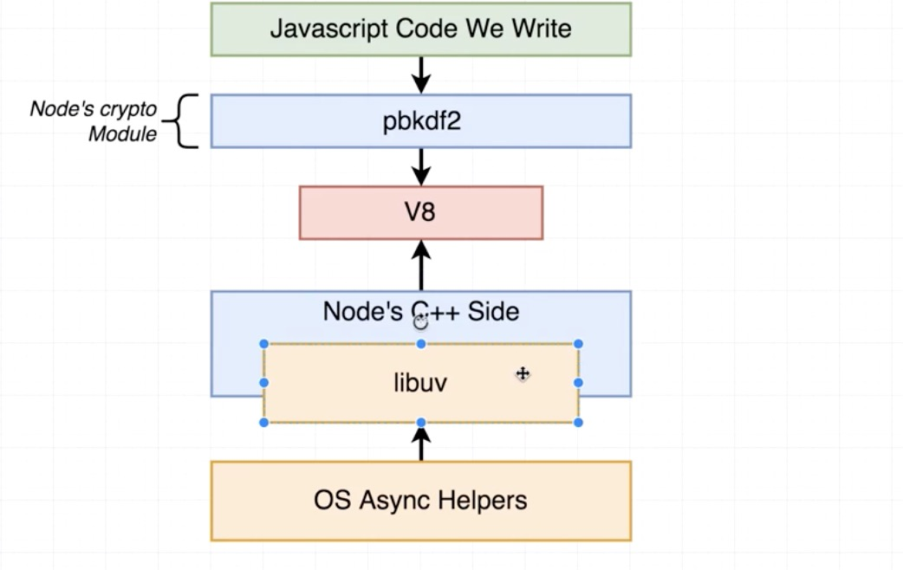

因此，在本例中，libuv看到我们正在尝试发出HTTP请求，libuv也没法直接处理所有这些涉及网络请求的超低级操作。因此，libuv将请求委托给底层操作系统。所以实际上是我们的操作系统执行真正的HTTP请求，libuv只是被用来发出请求，然后等待操作系统返回这个请求的响应。

由于libuv将工作委托给操作系统，所以操作系统自己决定是否需要创建新的线程，还是只是普通的决定如何处理发出请求的整个过程。

因此，因为是操作系统发出请求，所以内部不会阻塞我们事件循环中的javascript代码。

### OSAsync Common Questions

- nodejs标准库中哪些函数使用了操作系统的异步功能？
- 操作系统异步功能和前面讲的事件循环又有什么关系？

在事件循环中有个pendingOSTasks数组。当我们启动node应用程序时，node内部会创建类似pendingOSTasks的数组表示所有挂起的请求或者与底层操作系统相关的操作。只要该数组中仍有一些活跃的请求或者操作，node就会继续运行。一旦所有底层操作系统调用都完成了，事件循环也就结束了，应用就会退出。

这也是为什么，当我们通过http.createServer创建一个服务并监听端口时，应用程序就会在终端中一直执行而不会退出的原因。

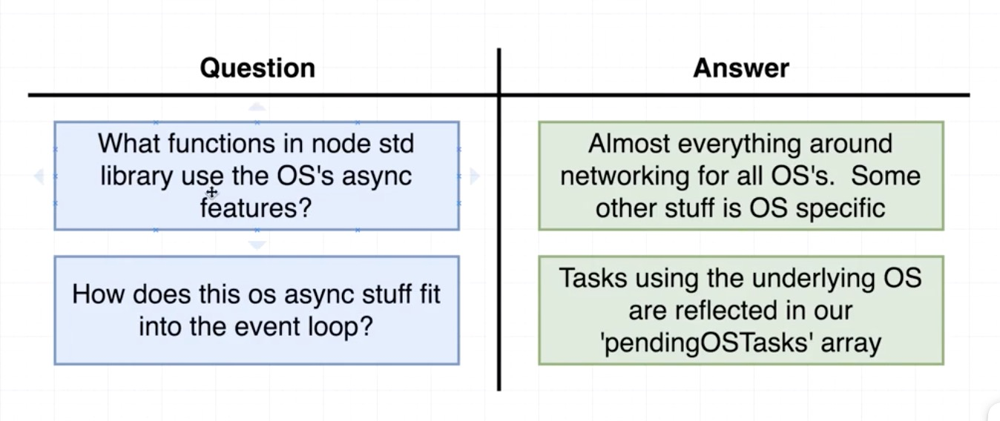


## 小结

Nodejs事件循环流程图：


## 示例

```js
const https = require('https')
const crypto = require('crypto')
const fs = require('fs')

const startTime = Date.now();

const doRequest = (num) => {
    https.request('https://www.baidu.com/', res => {
        res.on('data', (data) => {
        })
        res.on('end', () => {
            console.log(`doRequest ${num}：`, Date.now() - startTime)
        })
    }).end();
}

const doHash = (num) => {
    crypto.pbkdf2('a', 'b', 100000, 512, 'sha512', () => {
        console.log(`Hash ${num}: `, Date.now() - startTime);
    })
}


doRequest(1)

fs.readFile('multitask.js', 'utf8', () => {
    console.log('FS：', Date.now() - startTime)
})

doHash(1)
doHash(2)
doHash(3)
doHash(4)
// doHash(5)
// doHash(6)
// doHash(7)
// doHash(8)


```

思考：上面代码在控制台的执行顺序。

结果如下：

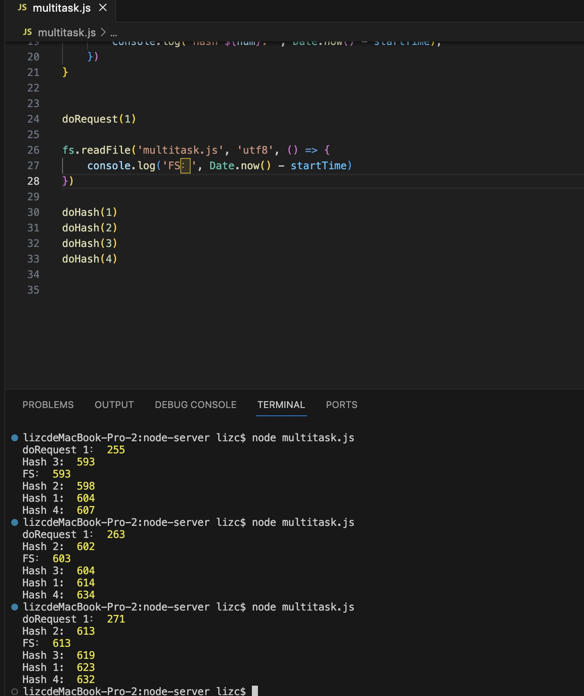


## Unexpected Event Loop Events

思考上面例子的执行结果：

- 为什么在FS前面恰好有且仅有一个Hash输出
- 为什么总是doRequest先执行

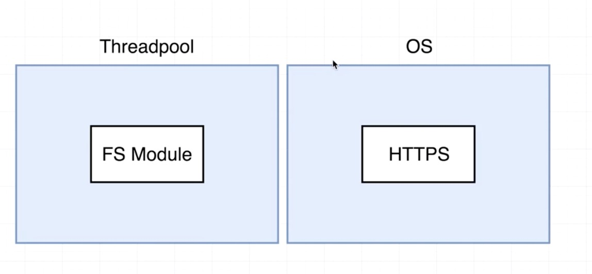


FS Module和crypto.pbkdf2都使用了线程池。HTTP模块直接使用底层操作系统执行操作


首先来了解下fs.readFile函数调用的时候，内部是怎么运行的。就会明白为什么需要大概600毫秒才能执行fs.readFile的回调。

下面图示是fs.readFile函数的执行流程

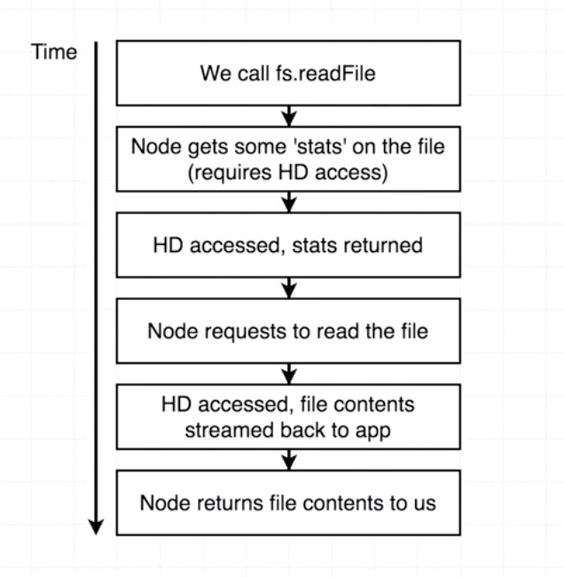


当我们第一次调用fs.readFile时，nodejs并不会直接转到硬盘并立即启动。它会先查看硬盘上的文件，并尝试收集有关该文件的一些统计数据，比如文件大小。整个过程包含一次到磁盘的往返时间。当nodejs获取完该文件的统计信息后，它就能够知道文件的预期大小是多少。然后就可以开始读取文件。因此，nodejs会再次读取硬盘，获取文件内容，并将结果返回给我们的应用程序，最后调用我们的回调函数。


这里需要重点关注的是，出现了两个明显的`Pause`，如下图所示。

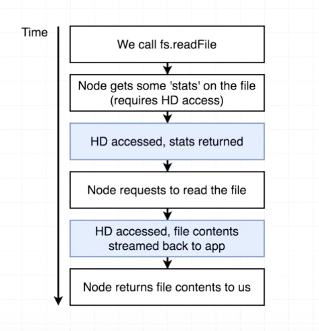

两次暂停：

- 我们在整个读取文件调用中有一次暂停，我们只是在等待硬盘驱动器返回有关此文件的一些统计数据。
- 然后当node返回硬盘驱动器真正开始读取文件时，我们经历了第二次大的暂停。

接下来我们看下面这张图，它真正解释发生了什么

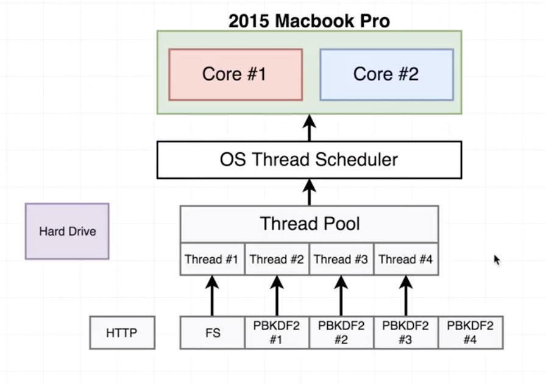


首先要认识到http模块调用根本不涉及线程池，它直接调用底层操作系统。它发出请求，一旦我们得到响应，就会将结果返回到我们的事件循环线程中。

当我们按下面的顺序调用时
```js
fs.readFile('multitask.js', 'utf8', () => {
    console.log('FS：', Date.now() - startTime)
})

doHash(1)
doHash(2)
doHash(3)
doHash(4)
```

相当于有5个任务需要线程池处理。由于线程池默认有4个线程，一次最多同时处理4个任务。

首先被处理的是读取文件和前面三个doHash。

假设FS调用这个任务被分配给了Thread#1。Thread#1开始处理文件系统调用，然后按照读取文件的流程执行，比如获取文件的统计数据，在这个阶段，thread#1开始接触硬盘驱动器，一旦请求进入硬盘，thread#1就需要等待硬盘的读取结果。此时thread#1就会先去处理doHash(4)这个任务。因此，thread#1会暂时挂起文件系统调用，转而处理去他任务，比如doHash(4)。

过了一会，thread#2、thread#3、thread#4中的其中一个就要结束了。假设thread#2先执行完成，然后看看有没有其余任务需要处理，thread#2发现仍有一个挂起的文件系统调用需要处理，因此thread#2查看它是否从硬盘驱动器中获得了文件的统计数据，可想而知此时已经获取到了结果，因此thread#2开始继续处理文件系统调用。然后，它向硬盘驱动器发出另一个后续请求，以获取实际的文件内容，这个过程中thread#2又进入等待硬盘返回结果的暂停阶段，由于此时没有其他任务需要处理，所以thread#2会一直等到硬盘返回结果。最后，文件内容返回后，thread#2就会处理它们。

这就是我们为什么在控制台中看到，FS之前一定先输出一个Hash。

>上面说了那么多，其实就是一句话，fs读取文件会有两次进入"暂停"阶段等待硬盘返回结果。但是在这个暂停的过程中，线程不会闲着，而是会处理其他任务。


现在，让我们将线程池大小改成5
```js

process.env.UV_THREADPOOL_SIZE = 5;
const https = require('https')
const crypto = require('crypto')
const fs = require('fs')

const startTime = Date.now();

const doRequest = (num) => {
    https.request('https://www.baidu.com/', res => {
        res.on('data', (data) => {
        })
        res.on('end', () => {
            console.log(`doRequest ${num}：`, Date.now() - startTime)
        })
    }).end();
}

const doHash = (num) => {
    crypto.pbkdf2('a', 'b', 100000, 512, 'sha512', () => {
        console.log(`Hash ${num}: `, Date.now() - startTime);
    })
}


doRequest(1)

fs.readFile('multitask.js', 'utf8', () => {
    console.log('FS：', Date.now() - startTime)
})


doHash(1)
doHash(2)
doHash(3)
doHash(4)
```
这里我们增加了一个额外的线程，它可以100%负责处理文件系统调用。

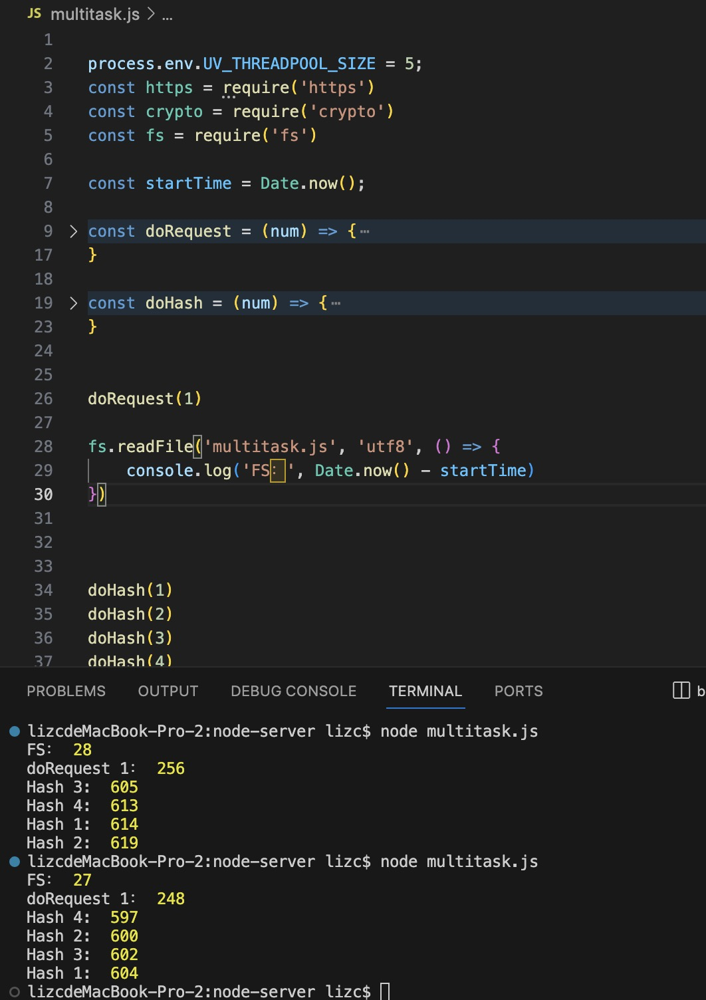


如果我们将线程池大小改成1
```js

process.env.UV_THREADPOOL_SIZE = 1;
const https = require('https')
const crypto = require('crypto')
const fs = require('fs')

const startTime = Date.now();

const doRequest = (num) => {
    https.request('https://www.baidu.com/', res => {
        res.on('data', (data) => {
        })
        res.on('end', () => {
            console.log(`doRequest ${num}：`, Date.now() - startTime)
        })
    }).end();
}

const doHash = (num) => {
    crypto.pbkdf2('a', 'b', 100000, 512, 'sha512', () => {
        console.log(`Hash ${num}: `, Date.now() - startTime);
    })
}


doRequest(1)

fs.readFile('multitask.js', 'utf8', () => {
    console.log('FS：', Date.now() - startTime)
})


doHash(1)
doHash(2)
doHash(3)
doHash(4)
```

结果如下。首先，这1个线程将对文件系统调用执行一些初始工作。然后等待硬盘返回文件统计信息，在这个过程中，这1个线程会继续处理所有的4个dohash，一旦所有这些doHash都完成，它将继续处理文件系统调用

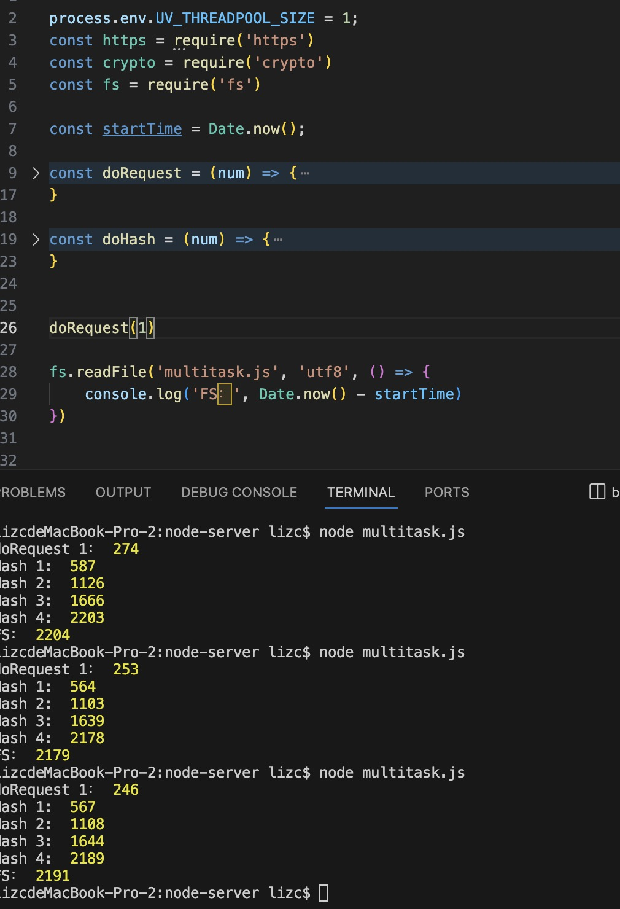

>实际上，硬盘返回结果后，会在线程池任务队列后面添加一个任务等待线程池调度。

## Enhancing Performance

继续研究下面两种方式提高Node性能
- Use Node in Cluster Mode（Recommended）。通过启动多个副本，可以获得事件循环的多个实例。推荐使用这种方式。
- Use Worker Threads（Experimental）。使用工作线程来执行大量的性能工作。每当我们启动时，这些工作线程都将使用libuv线程池。由于是实验性的，不推荐在项目中使用。

### Blocking the Event Loop
首先我们需要记住的是，只要有请求进入我们的服务器，他就会在我们的事件循环线程中处理。请求进入我们的服务器，事件循环线程对其进行处理，然后生成响应。

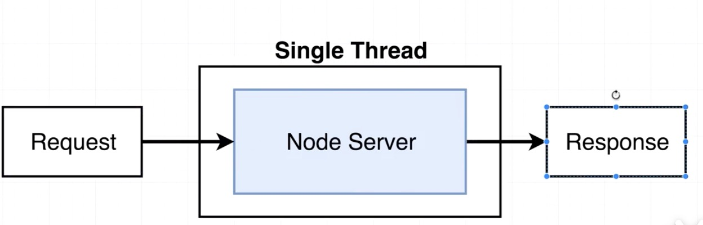

如果某个请求处理比较耗时，很明显就会阻塞其他请求。比如下面的demo，我们使用一个doWork函数调用阻塞了整个事件循环。


```js
const express = require('express')

const app = express();


const doWork = (duration) => {
    const start = Date.now();
    while(Date.now() - start < duration){}
}
app.get('/', (req, res) => {
    doWork(5000)
    res.send('Hi there')
})

app.listen(3000)
```

我们在浏览器中同时打开两个tab页，同时发起两个请求。如下图所示，在左边的标签页刷新后，立即切换到右边的标签页然后立即刷新。可以看到左边标签页的请求耗时5秒，而右边耗时差不多10秒。这是因为事件循环是单线程的。只有等到左边的请求处理完成，node服务器才能继续处理右边的请求。

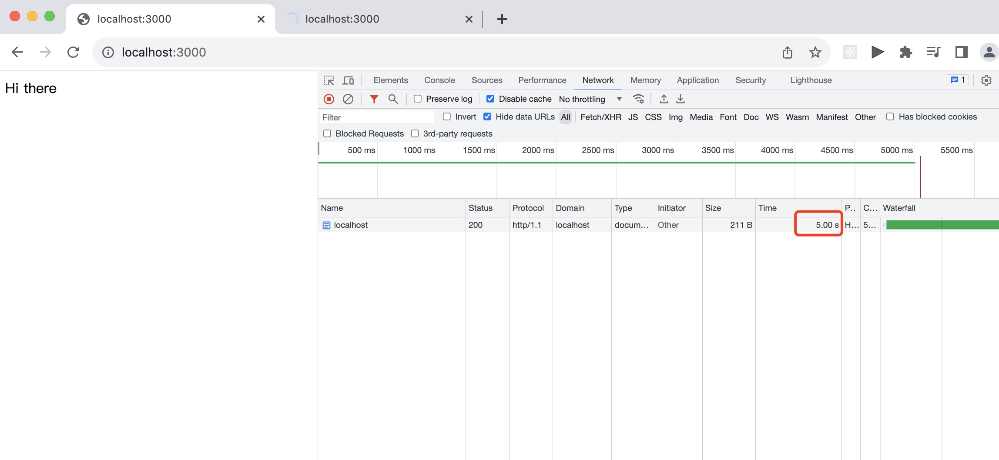

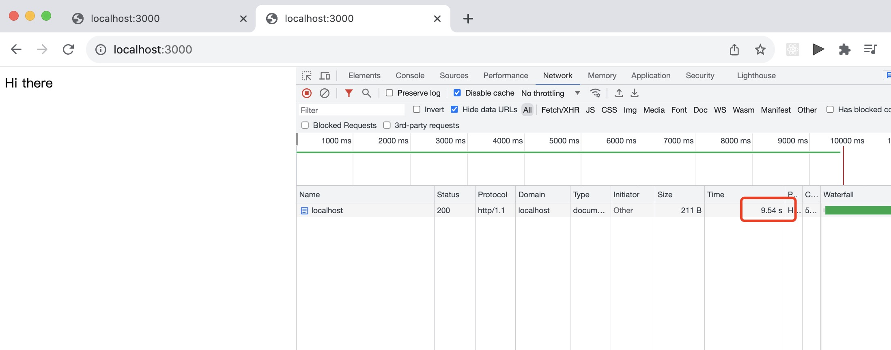


### Cluster mode
当我们开始在node应用中使用cluster， 意味着我们启动了多个node进程。总会有一个父进程或一种类似的统领进程，称为cluster manager。cluster manager负责监视我们的单个的进程实例的健康。比如下图所示都是我们的应用程序正在运行的实例。这是运行在一台计算机上的多个实例。cluster manager本身并不实际执行任何应用程序代码。换句话说，cluster manager实际上并不负责处理传入的请求或从数据库中读取数据。相反，cluster manager负责监控每个单独实例的运行状况。cluster manager可以启动单个实例，也可以停止或者重启它们，还可以向它们发送数据。这些单个实例负责实际处理传入的请求，比如访问数据库，处理身份验证等。

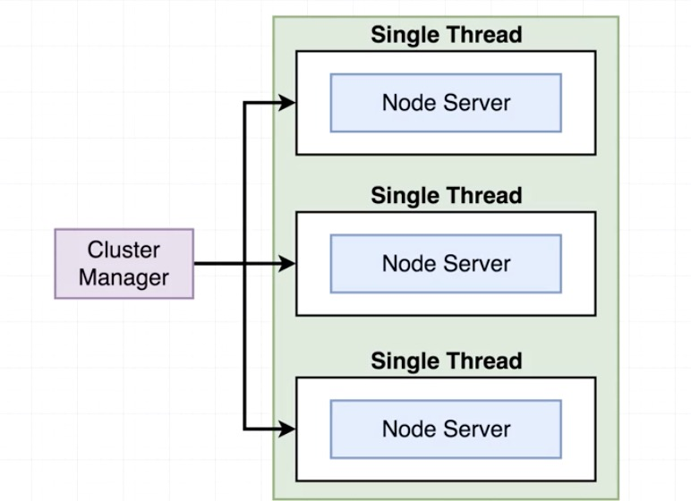


当我们以cluster mode运行时，流程如下。worker instance负责处理这些传入请求。

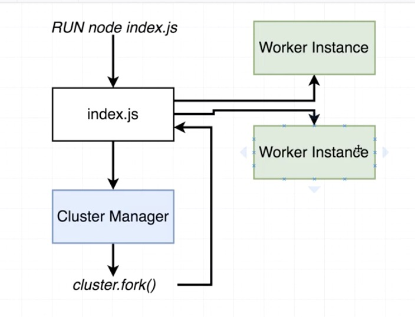


下面是cluster 模式的简单demo，这里只有一个进程实例，意味着只有一个事件循环实例。

```js
const cluster = require('cluster')
const express = require('express')


console.log(cluster.isMaster)

// Is the file being executed in master mode
if(cluster.isMaster){
    //Cause index.js to be executed again but in child mode
    cluster.fork();
} else {
    // Im a child, Im going to act like a server and do nothing else
    const app = express();

    const doWork = (duration) => {
        const start = Date.now();
        while(Date.now() - start < duration){}
    }
    app.get('/', (req, res) => {
        doWork(5000)
        res.send('Hi there')
    })
    
    app.listen(3000)
}


```

下面的代码开启了4个进程实例，意味着有4个事件循环实例，也就是4个独立的服务器。

```js
const cluster = require('cluster')
const express = require('express')


console.log(cluster.isMaster)

// Is the file being executed in master mode
if(cluster.isMaster){
    //Cause index.js to be executed again but in child mode
    // 下面调用了四次cluster.fork函数，意味着当我们在终端执行node index.js时，还会再额外执行4次index.js，
    // 只不过另外4次的cluster.isMaster设置为false
    cluster.fork();
    cluster.fork();
    cluster.fork();
    cluster.fork();
} else {
    // Im a child, Im going to act like a server and do nothing else
    const app = express();

    const doWork = (duration) => {
        const start = Date.now();
        while(Date.now() - start < duration){}
    }
    app.get('/', (req, res) => {
        doWork(5000)
        res.send('Hi there')
    })
    app.get('/fast', (req, res) => {
        res.send('This was fast!')
    })
    
    app.listen(3000)
}


```

如下图所示，先刷新左边标签页，然后立即刷新右边标签页。可以发现/fast的请求很快就完成了。

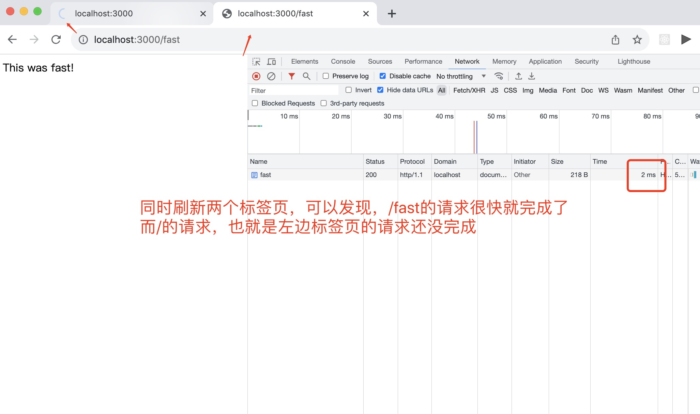


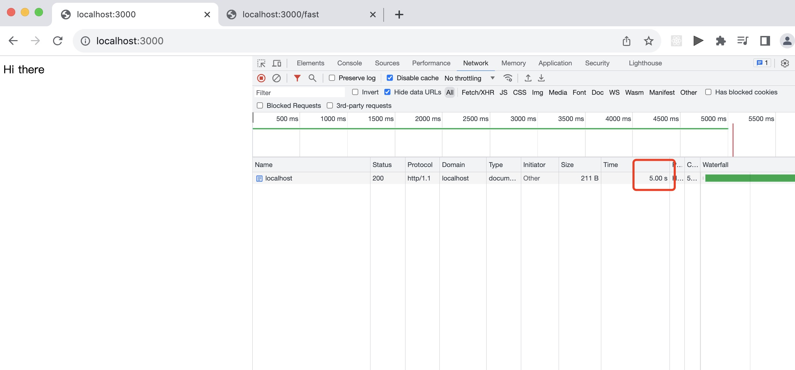


如果只开启一个进程实例，如下：

```js
const cluster = require('cluster')
const express = require('express')


console.log(cluster.isMaster)

// Is the file being executed in master mode
if(cluster.isMaster){
    //Cause index.js to be executed again but in child mode
    // 下面调用了四次cluster.fork函数，意味着当我们在终端执行node index.js时，还会再额外执行4次index.js，
    // 只不过另外4次的cluster.isMaster设置为false
    cluster.fork();
    // cluster.fork();
    // cluster.fork();
    // cluster.fork();
} else {
    // Im a child, Im going to act like a server and do nothing else
    const app = express();

    const doWork = (duration) => {
        const start = Date.now();
        while(Date.now() - start < duration){}
    }
    app.get('/', (req, res) => {
        doWork(5000)
        res.send('Hi there')
    })
    app.get('/fast', (req, res) => {
        res.send('This was fast!')
    })
    
    app.listen(3000)
}


```

先刷新左边标签页，然后立即刷新右边标签页，结果如下图：


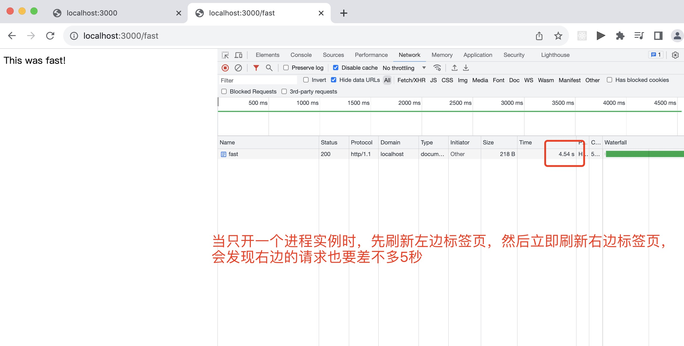


### Benchmarking Server Performance
可以使用一个工具对性能进行基准测试。我们以上面只开启了一个进程实例的代码为例。

```js
ab -c 50 -n 500 localhost:3000/fast
```

`-n 500`表示总共发起500个请求。


`-c 50`表示并发性为50，这意味着要尝试同时发起50个请求。当然，现在这些请求可能会在不同的时间完成，所以它不会批量发起50个。相反，它将尝试确保在任何给定时间点始终有50个请求在运行。因此，这里尝试发出500个请求，并确保始终有至少50个请求等待处理。


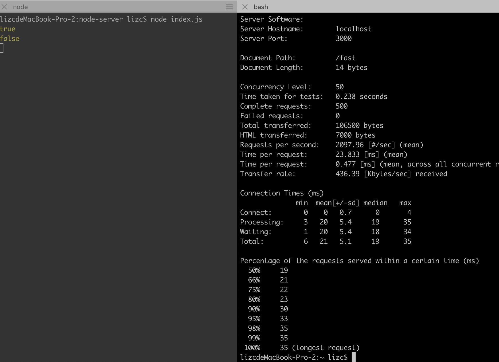

`Requests per second`表示服务器每秒处理的请求数。
`Time per request:   23.833ms`表示平均每个请求花费的时间

下面表示的是请求时间的分布范围。比如

 `50% 19`表示50%的请求在70ms内得到处理或响应。

 `100%  35`表示至少有一个请求需要35ms的时间才能做出响应。
```bash
Percentage of the requests served within a certain time (ms)
  50%     19
  66%     21
  75%     22
  80%     23
  90%     30
  95%     33
  98%     35
  99%     35
 100%     35 (longest request)
```


因此，现在我们有了一种更科学的方法来对我们服务器的性能进行基准测试。


### Benchmark Refactor
本节会介绍cluster mode在什么时候会对性能有负面的影响。

首先替换掉之前dowork的逻辑。在之前的dowork函数中，我们使用while循环阻塞事件循环线程，但是它在模拟真实的实际工作方面做的不是很好，比如一些计算任务。同时dowork函数总是暂停几乎完全相同的持续时间。这并不能真正让你很好的了解使用cluster mode时发生了什么。所以我们要使用一个更好的模拟真实的计算任务的函数来代替dowork

```js
process.env.UV_THREADPOOL_SIZE = 1;

const cluster = require('cluster')

console.log(cluster.isMaster)

// Is the file being executed in master mode
if (cluster.isMaster) {
    //Cause index.js to be executed again but in child mode
    // 下面调用了四次cluster.fork函数，意味着当我们在终端执行node index.js时，还会再额外执行4次index.js，
    // 只不过另外4次的cluster.isMaster设置为false
    cluster.fork();
    // cluster.fork();
    // cluster.fork();
    // cluster.fork();
} else {
    const express = require('express')
    const crypto = require('crypto')
    // Im a child, Im going to act like a server and do nothing else
    const app = express();

    app.get('/', (req, res) => {
        let startTime = Date.now();
        console.log('接受请求：', startTime)
        crypto.pbkdf2('a', 'b', 100000, 512, 'sha512', () => {
            console.log('请求耗时：', Date.now() - startTime)
            res.send('Hi there')
        })
    })
    app.get('/fast', (req, res) => {
        res.send('This was fast!')
    })

    app.listen(3000)
}

```

上面的代码只开启了一个子进程，同时该子进程线程池大小被设置成1。执行这段代码，然后使用ab测试性能

```bash
ab -c 1 -n 1 localhost:3000/
```

结果如下，可以发现请求耗时547毫秒左右

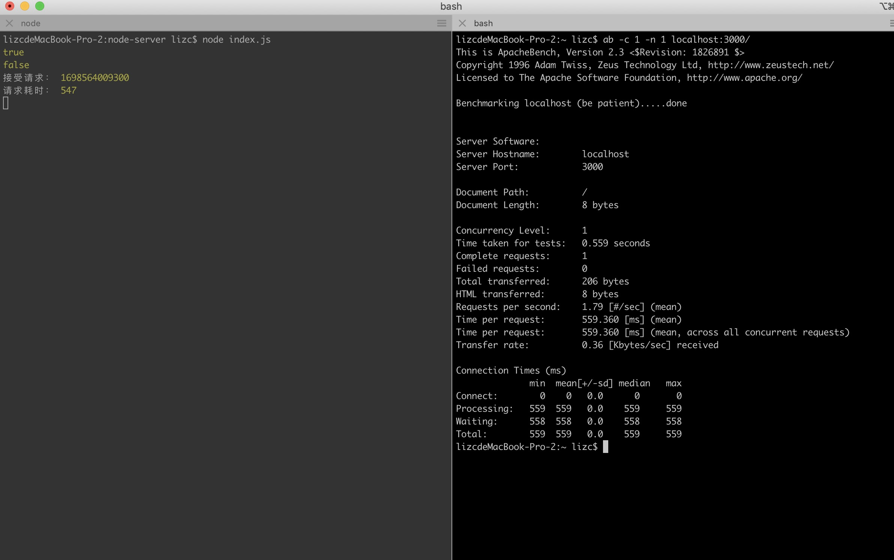


在开始继续我们的测试用例前，我们先了解下ab发起并发请求的一个特性。实际上，当我们使用发起并发请求时，ab总是会尝试先发起一个请求，等到第一个请求结果回来后，说明被测试的服务器是正常的。只有确保了服务器是能够正常响应的，ab才会继续发起后面的并发请求。

以下面的demo为例，我们使用first变量标记第一个请求。
```js
process.env.UV_THREADPOOL_SIZE = 1;

const cluster = require('cluster')


console.log(cluster.isMaster)

// Is the file being executed in master mode
if (cluster.isMaster) {
    //Cause index.js to be executed again but in child mode
    // 下面调用了四次cluster.fork函数，意味着当我们在终端执行node index.js时，还会再额外执行4次index.js，
    // 只不过另外4次的cluster.isMaster设置为false
    cluster.fork();
    // cluster.fork();
    // cluster.fork();
    // cluster.fork();
} else {
    const express = require('express')
    const crypto = require('crypto')
    // Im a child, Im going to act like a server and do nothing else
    const app = express();
    let first = true
    app.get('/', (req, res) => {
        let startTime = Date.now();
        console.log('接受请求：', startTime)
        crypto.pbkdf2('a', 'b', 100000, 512, 'sha512', () => {
            if(first){
                first = false
                while(Date.now() - startTime < 5000){}
            }
            console.log('请求耗时：', Date.now() - startTime)

            res.send('Hi there')
        })
    })
    app.get('/fast', (req, res) => {
        res.send('This was fast!')
    })

    app.listen(3000)
}


```

然后使用
```bash
ab -c 3 -n 4 localhost:3000/
```

结果如下：


如果第一个请求报错，则ab不会再发起后面的并发请求
```js
process.env.UV_THREADPOOL_SIZE = 1;

const cluster = require('cluster')

console.log(cluster.isMaster)

// Is the file being executed in master mode
if (cluster.isMaster) {
    //Cause index.js to be executed again but in child mode
    // 下面调用了四次cluster.fork函数，意味着当我们在终端执行node index.js时，还会再额外执行4次index.js，
    // 只不过另外4次的cluster.isMaster设置为false
    cluster.fork();
    // cluster.fork();
    // cluster.fork();
    // cluster.fork();
} else {
    const express = require('express')
    const crypto = require('crypto')
    // Im a child, Im going to act like a server and do nothing else
    const app = express();
    let first = true
    app.get('/', (req, res) => {
        let startTime = Date.now();
        console.log('接受请求：', startTime)
        crypto.pbkdf2('a', 'b', 100000, 512, 'sha512', () => {
            if(first){
                first = false
                while(Date.now() - startTime < 5000){}
                throw Error('第一个请求错误')
            }
            console.log('请求耗时：', Date.now() - startTime)

            res.send('Hi there')
        })
    })
    app.get('/fast', (req, res) => {
        res.send('This was fast!')
    })

    app.listen(3000)
}


```

结果如下：

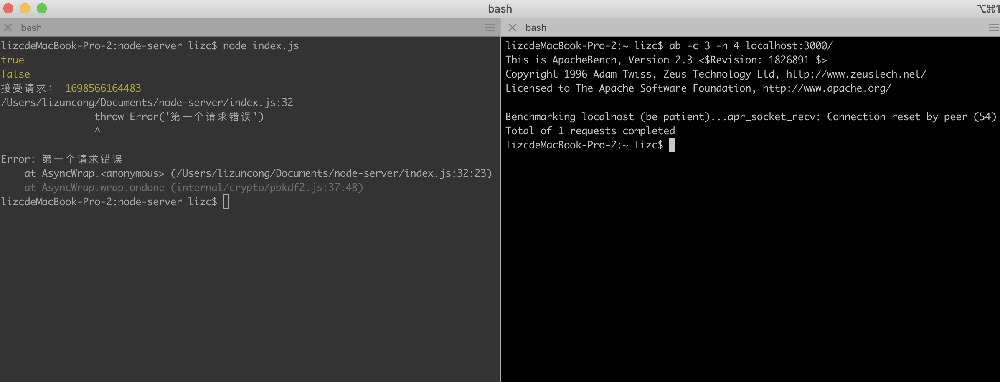

了解了ab的特性后，让我们回到我们的基准测试代码：

```js
process.env.UV_THREADPOOL_SIZE = 1;

const cluster = require('cluster')


console.log(cluster.isMaster)

// Is the file being executed in master mode
if (cluster.isMaster) {
    //Cause index.js to be executed again but in child mode
    // 下面调用了四次cluster.fork函数，意味着当我们在终端执行node index.js时，还会再额外执行4次index.js，
    // 只不过另外4次的cluster.isMaster设置为false
    cluster.fork();
    // cluster.fork();
    // cluster.fork();
    // cluster.fork();
} else {
    const express = require('express')
    const crypto = require('crypto')
    // Im a child, Im going to act like a server and do nothing else
    const app = express();
    app.get('/', (req, res) => {
        let startTime = Date.now();
        console.log('接受请求：', startTime)
        crypto.pbkdf2('a', 'b', 100000, 512, 'sha512', () => {
            console.log('请求耗时：', Date.now() - startTime)

            res.send('Hi there')
        })
    })
    app.get('/fast', (req, res) => {
        res.send('This was fast!')
    })

    app.listen(3000)
}


```

由于后面两个并发请求几乎同时到达的，但是我们只有一个进程实例，然后这个进程实例的线程池只有一个线程，我们的服务器一次只能处理一个pbkdf2函数的计算。

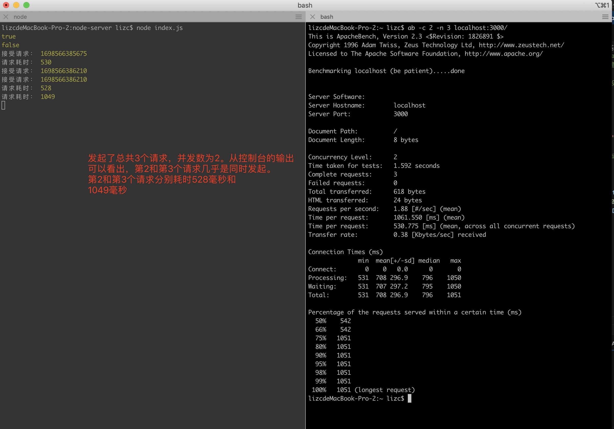


修改我们的demo，这次我们使用两个进程实例：
```js
process.env.UV_THREADPOOL_SIZE = 1;

const cluster = require('cluster')

console.log(cluster.isMaster)

// Is the file being executed in master mode
if (cluster.isMaster) {
    //Cause index.js to be executed again but in child mode
    // 下面调用了四次cluster.fork函数，意味着当我们在终端执行node index.js时，还会再额外执行4次index.js，
    // 只不过另外4次的cluster.isMaster设置为false
    cluster.fork();
    cluster.fork();
    // cluster.fork();
    // cluster.fork();
} else {
    const express = require('express')
    const crypto = require('crypto')
    // Im a child, Im going to act like a server and do nothing else
    const app = express();
    app.get('/', (req, res) => {
        let startTime = Date.now();
        console.log('接受请求：', startTime)
        crypto.pbkdf2('a', 'b', 100000, 512, 'sha512', () => {
            console.log('请求耗时：', Date.now() - startTime)

            res.send('Hi there')
        })
    })
    app.get('/fast', (req, res) => {
        res.send('This was fast!')
    })

    app.listen(3000)
}

```

从下面的结果可以看出，后面两个请求显然是几乎并行处理的。

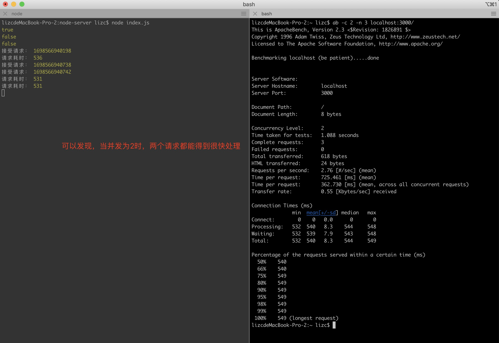

可以看到，当我们增加进程实例时，貌似能够提升我们服务器的性能。因为我们可以一个进程处理一个请求，从而提高我们服务器的并发能力。

那么，是不是进程实例越多越好呢？

为了验证进程实例越多，服务器性能是不是越好，我们看下面的demo。这次我们创建了6个子进程。

```js
process.env.UV_THREADPOOL_SIZE = 1;

const cluster = require('cluster')

console.log(cluster.isMaster)

// Is the file being executed in master mode
if (cluster.isMaster) {
    //Cause index.js to be executed again but in child mode
    // 下面调用了四次cluster.fork函数，意味着当我们在终端执行node index.js时，还会再额外执行4次index.js，
    // 只不过另外4次的cluster.isMaster设置为false
    cluster.fork();
    cluster.fork();
    cluster.fork();
    cluster.fork();
    cluster.fork();
    cluster.fork();
} else {
    const express = require('express')
    const crypto = require('crypto')
    // Im a child, Im going to act like a server and do nothing else
    const app = express();
    app.get('/', (req, res) => {
        let startTime = Date.now();
        console.log('接受请求：', startTime)
        crypto.pbkdf2('a', 'b', 100000, 512, 'sha512', () => {
            console.log('请求耗时：', Date.now() - startTime)

            res.send('Hi there')
        })
    })
    app.get('/fast', (req, res) => {
        res.send('This was fast!')
    })

    app.listen(3000)
}

```

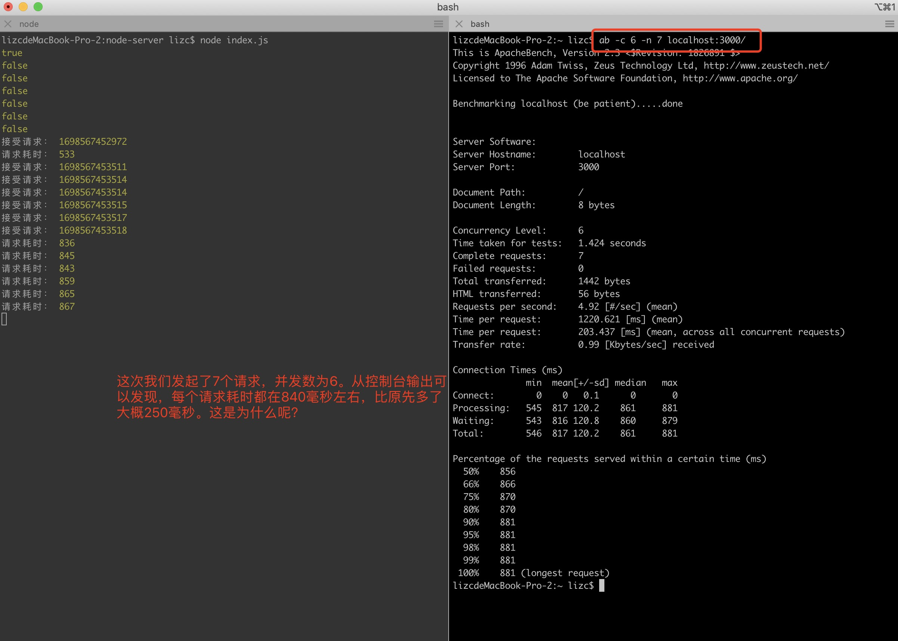

实际上，这依赖于计算机CPU的配置。比如我的计算机CPU有4个内核。这意味着我的计算机处理传入请求的能力有限。这里有6个进程，每个进程的线程池中有1个线程，也就是在同一时间，有6个线程等待CPU调度，4个内核轮流执行这6个线程，很显然，每个内核平均执行1.5个线程。如果一个pbkdf2耗时550毫秒，那么平均每个内核需要执行550 * 1.5=825毫秒，也就是一个请求需要耗时825毫秒左右。这还是理想情况，没考虑CPU在进程之间切换的时间开销。这也是为啥我们从控制台的输出得到850毫秒左右的请求耗时。

因此，尽管我们能够同时处理所有这些传入的请求，但最终结果是我们的整体性能受到影响。因为我们的CPU需要同时调度处理这6个请求。


这次，我们只创建4个进程实例，数量保持和我们计算机CPU内核数一样。

```js
process.env.UV_THREADPOOL_SIZE = 1;

const cluster = require('cluster')

console.log(cluster.isMaster)

// Is the file being executed in master mode
if (cluster.isMaster) {
    //Cause index.js to be executed again but in child mode
    // 下面调用了四次cluster.fork函数，意味着当我们在终端执行node index.js时，还会再额外执行4次index.js，
    // 只不过另外4次的cluster.isMaster设置为false
    cluster.fork();
    cluster.fork();
    cluster.fork();
    cluster.fork();
} else {
    const express = require('express')
    const crypto = require('crypto')
    // Im a child, Im going to act like a server and do nothing else
    const app = express();
    app.get('/', (req, res) => {
        let startTime = Date.now();
        console.log('接受请求：', startTime)
        crypto.pbkdf2('a', 'b', 100000, 512, 'sha512', () => {
            console.log('请求耗时：', Date.now() - startTime)

            res.send('Hi there')
        })
    })
    app.get('/fast', (req, res) => {
        res.send('This was fast!')
    })

    app.listen(3000)
}


```

从下图可以看出，最快的请求只需要555毫秒即可处理完成。而最慢的请求需要1135毫秒处理完成。因此，虽然我们使用了更少的进程，但实际上我们最终的性能是变得更好的。

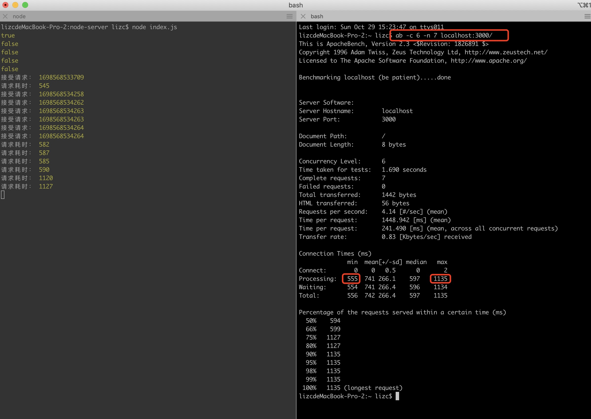


因此，通过大幅增加应用程序内部的子进程数量，使其超出计算机CPU的内核数量，将对我们的服务性能产生净负面的影响。


### 使用PM2开启cluster mode
一般在生产环境中，我们并不直接使用 nodejs 的cluster模块。而是使用pm2。pm2提供了进程守护，比如进程实例挂了，自动重启等能力。

一般在开发环境不使用pm2

新建index.js文件：
```js
const express = require('express')
const crypto = require('crypto')


const app = express();

app.get('/', (req, res) => {
    let startTime = Date.now();
    console.log('接受请求：', startTime)
    crypto.pbkdf2('a', 'b', 100000, 512, 'sha512', () => {
        console.log('请求耗时：', Date.now() - startTime)

        res.send('Hi there')
    })
})

app.get('/fast', (req, res) => {
    res.send('This was fast!')
})

app.listen(3000)


```

```bash
pm2 start index.js -i 0
```

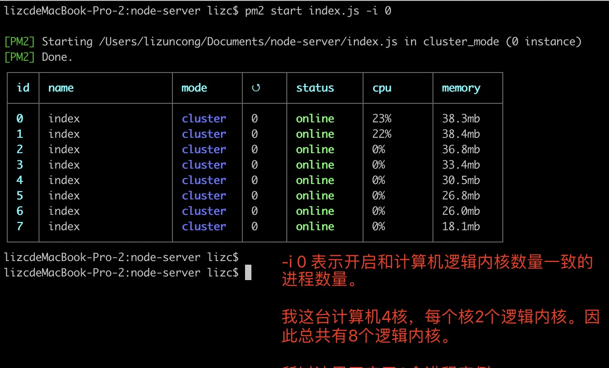


```bash
pm2 delete index
```

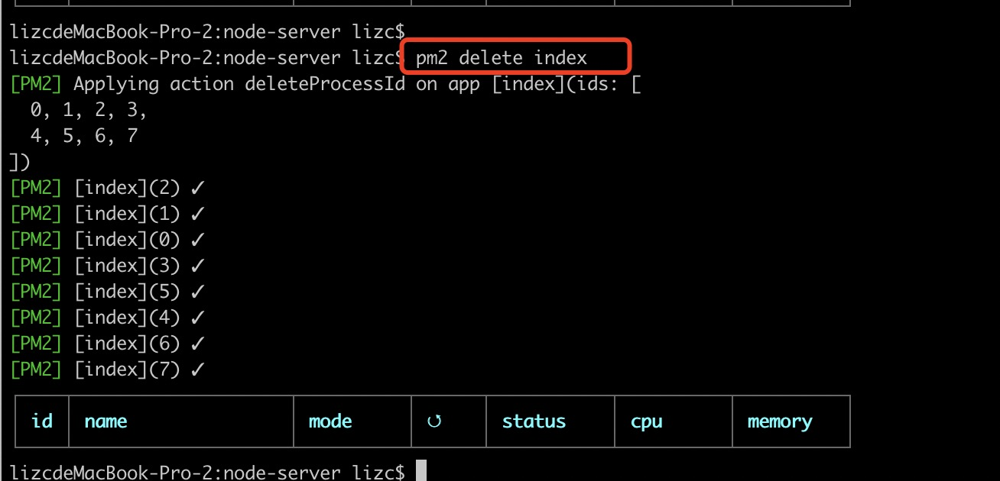


```bash
pm2 list
```

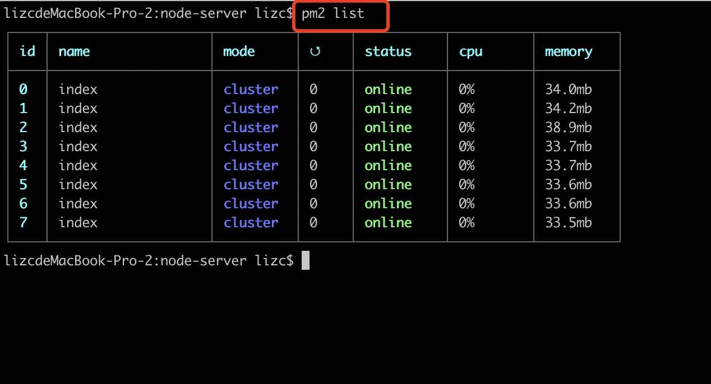


```bash
pm2 show index
```

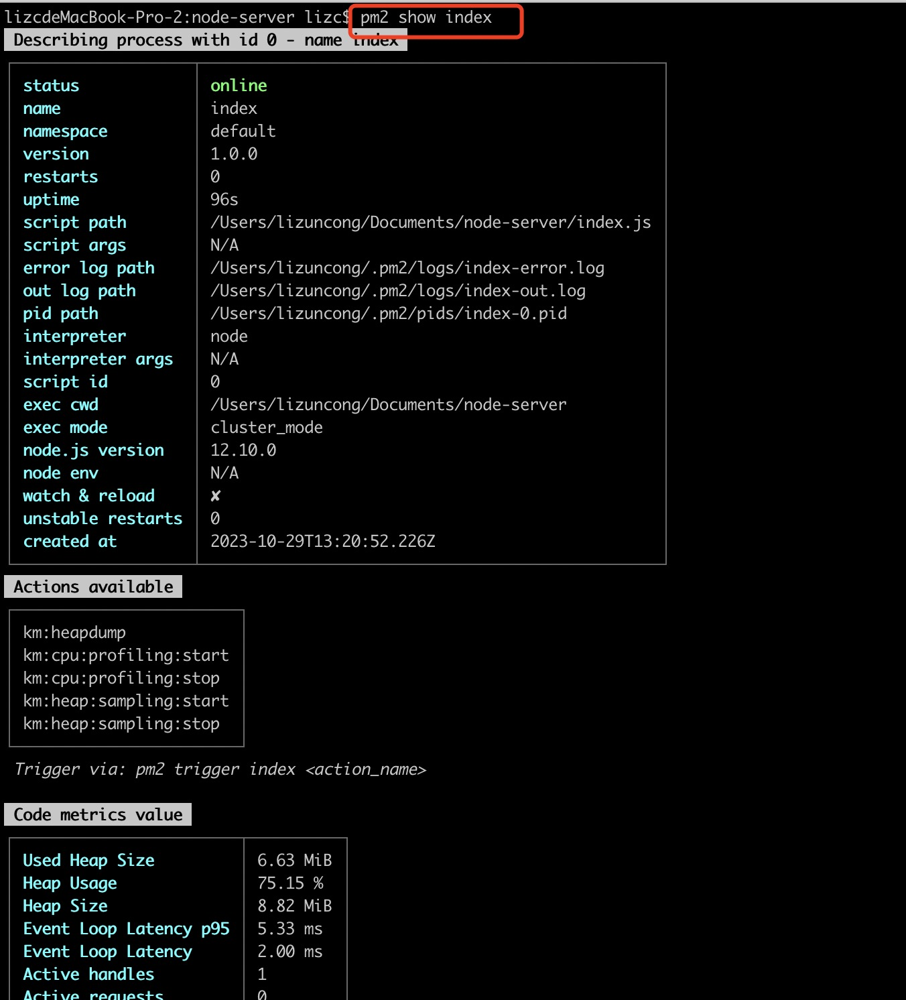


```bash
pm2 monit
```

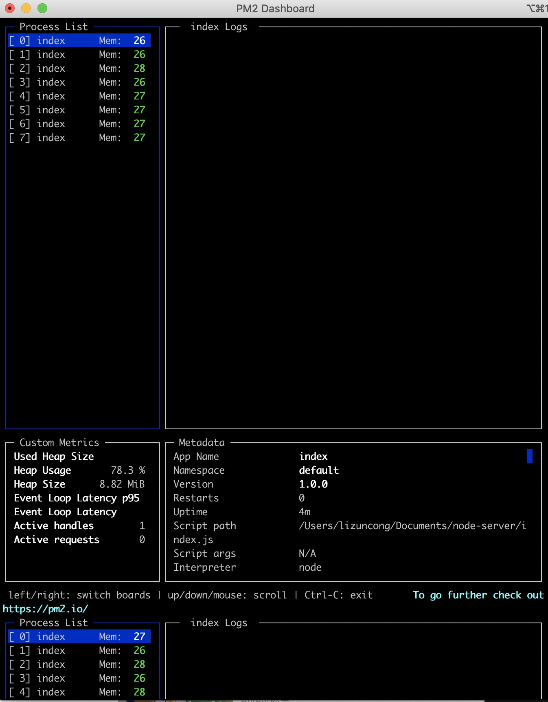


### Webworker Threads

前面几节我们谈到了如何使用cluster mode提升node性能。本节我们将简短介绍通过webworker threads提高node性能。同时，一般不要在一个应用程序内同时使用cluster mode和webworker threads两种方法。

webworker threads同样使用的是libuv中的线程池来执行操作。因此仍然受到cpu的整体处理能力的限制

>由于webworker threads还处于实验阶段。因此更建议在项目中使用cluster mode或者pm2来提高node程序的并发性