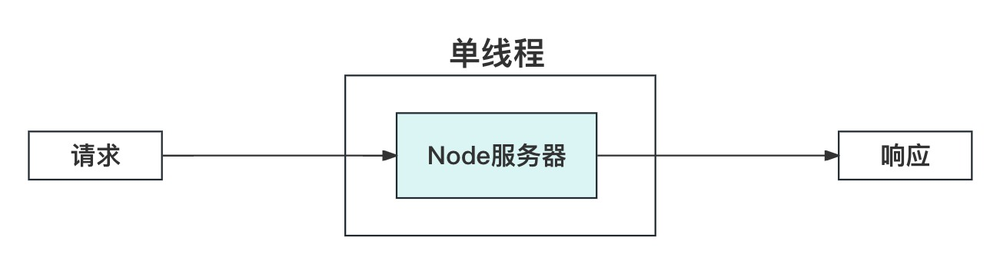
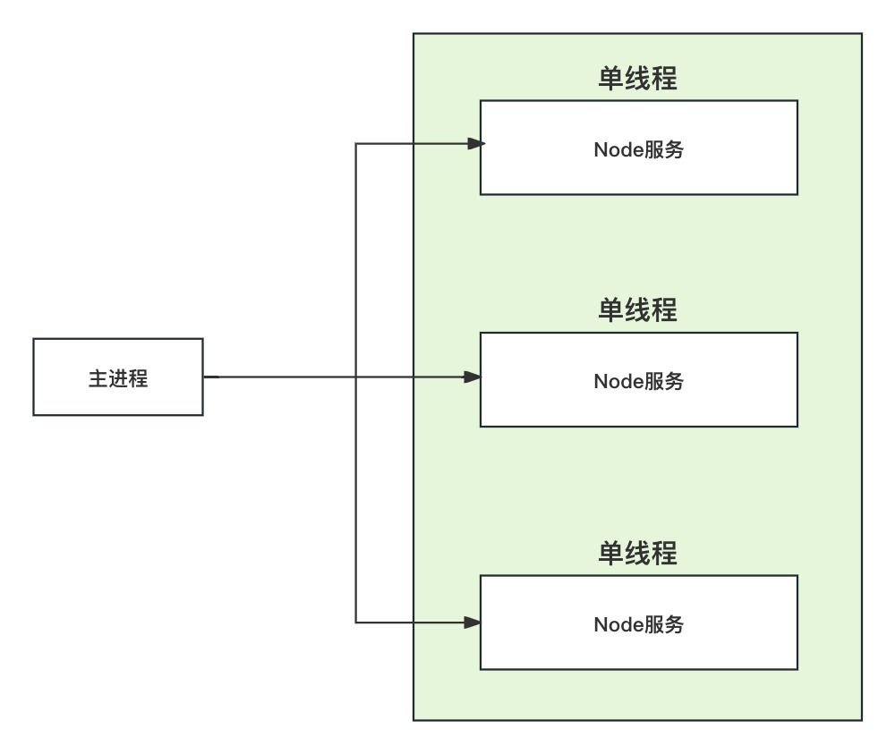
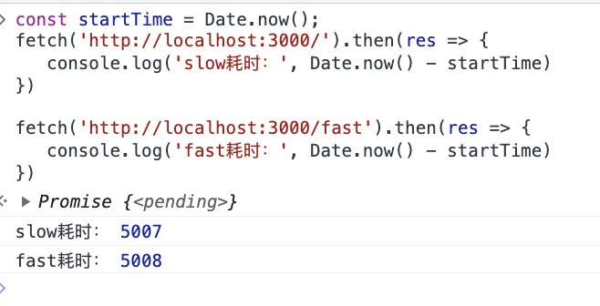
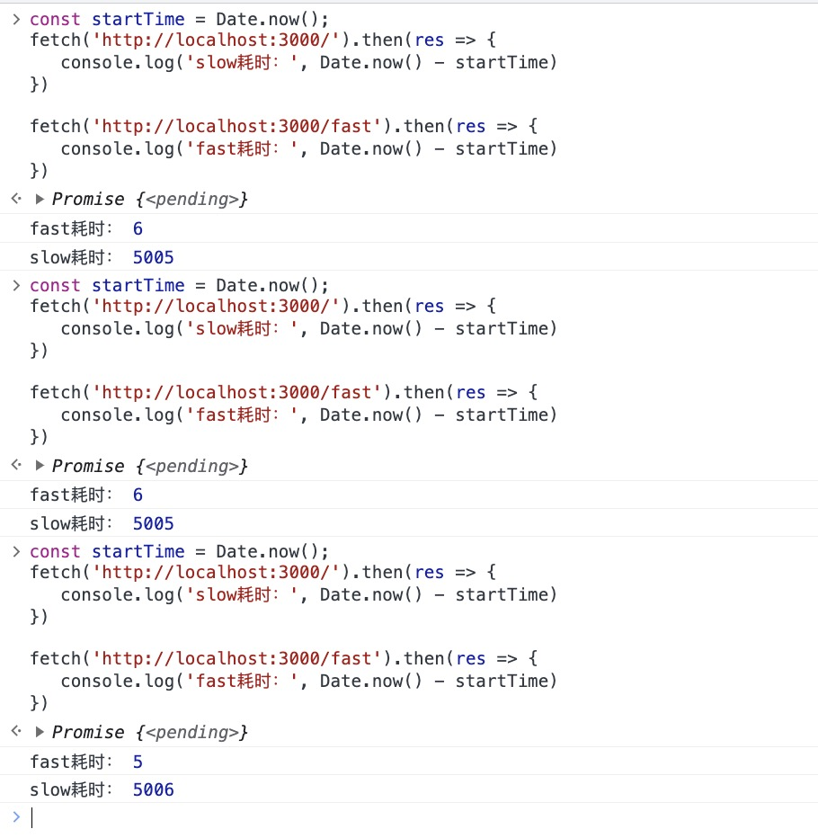

## Node单进程模式
默认情况下，node以单进程运行，一个进程实例只有一个主线程(即事件循环线程)。对于多核CPU的计算机来说，这样做效率很低，因为只有一个核在运行，其他核都在闲置。

```js
const express = require('express')

const app = express();

app.get('/slow', (req, res) => {
    let startTime = Date.now();
    while(Date.now() - startTime < 10000){}
    res.send('slow request')
})

app.get('/fast', (req, res) => {
    res.send('fast request')
})

app.listen(3000)


```

当我们执行node index.js时，就启动了一个进程实例。这就是一个node服务。这里只有一个进程实例。同时也是我们的一个应用。这个进程实例包含一个`主线程(也称事件循环线程)`以及N个`线程池`中的线程。

只要有请求进入我们的服务器，就会在我们的事件循环线程中处理。一旦请求进入我们的服务器，事件循环线程对其进行处理，然后返回响应结果。



如果某个请求处理比较耗时，很明显就会阻塞其他请求。以上面的服务为例，我们使用下面的代码依次请求`/slow`以及`/fast`接口：
```js
const startTime = Date.now();
fetch('http://localhost:3000/slow').then(res => {
   console.log('slow耗时：', Date.now() - startTime) 
})

fetch('http://localhost:3000/fast').then(res => {
   console.log('fast耗时：', Date.now() - startTime) 
})
```

结果如下，很明显，`/fast`请求被`/slow`请求阻塞了。这是因为主线程是单线程的，由于先请求的是slow，该请求阻塞了10秒，在这10秒内，主线程没法处理其他请求，导致fast请求被阻塞了。


## Cluster集群模式
可以在应用中使用cluster模式开启多个进程实例，其中包括一个主进程和若干个worker进程。主进程负责监视worker进程实例的健康。主进程本身并不实际执行任何应用程序代码，不负责处理传入的请求或执行其他操作，比如从数据库中读取数据。相反，主进程负责监控每个worker进程实例的运行状况。主进程可以启动单个实例，也可以停止或者重启它们，还可以向它们发送数据。这些worker进程实例负责实际处理传入的请求，比如访问数据库，处理身份验证等。worker进程实例之间采用进程间通信交换消息，cluster模块内置一个负载均衡器，采用Round-robin算法协调各个worker进程之间的负载。比如下图所示都是我们的应用程序正在运行的实例。这是运行在一台计算机上的多个实例。





下面是cluster 模式的简单demo，这里只有一个进程实例，意味着只有一个事件循环线程。

新建一个index.js文件，代码如下：
```js
const cluster = require('cluster')
const express = require('express')


// 这个文件是否是在master模式执行的
if(cluster.isMaster){
    // 主进程实例，会触发index.js以child模式重新执行一次
    cluster.fork();
} else {
    // worker进程实例
    const app = express();

    const doWork = (duration) => {
        const start = Date.now();
        while(Date.now() - start < duration){}
    }
    app.get('/', (req, res) => {
        doWork(5000)
        res.send('Hi there')
    })
    app.get('/fast', (req, res) => {
        res.send('This was fast!')
    })
    
    app.listen(3000)
}

```

如果先请求/，紧接着请求/fast接口，如下图。会发现/fast请求被阻塞了




下面的代码开启了2个进程实例，意味着有2个事件循环线程，也就是2个独立的服务。

```js
const cluster = require('cluster')
const express = require('express')

console.log(cluster.isMaster)

if(cluster.isMaster){
    // 下面调用了2次cluster.fork函数，意味着当我们在终端执行node index.js时，还会再额外执行2次index.js，
    // 只不过另外2次的cluster.isMaster设置为false
    cluster.fork();
    cluster.fork();
} else {
    const app = express();

    const doWork = (duration) => {
        const start = Date.now();
        while(Date.now() - start < duration){}
    }
    app.get('/', (req, res) => {
        doWork(5000)
        res.send('Hi there')
    })
    app.get('/fast', (req, res) => {
        res.send('This was fast!')
    })
    
    app.listen(3000)
}
```
如下图，可以发现/fast请求不会被阻塞了。这是因为这里我们有两个进程，一个进程处理/请求，另一个进程处理/fast请求。



## 性能测试工具简介
这里我们使用Mac自带的`ab`工具对性能进行测试。以下面的代码为例
```js
const cluster = require('cluster')
const express = require('express')

console.log(cluster.isMaster)

if(cluster.isMaster){
    cluster.fork();
} else {
    const app = express();

    const doWork = (duration) => {
        const start = Date.now();
        while(Date.now() - start < duration){}
    }
    app.get('/', (req, res) => {
        doWork(5000)
        res.send('Hi there')
    })
    app.get('/fast', (req, res) => {
        res.send('This was fast!')
    })
    
    app.listen(3000)
}
```
启动服务后，使用`ab`进行测试：

```bash
ab -c 50 -n 500 localhost:3000/fast
```
`-n 500`表示总共发起500个请求

`-c 50`表示并发50个请求，这意味着要尝试同时发起50个请求，确保在任何给定时间点始终有50个请求在运行并等待处理。当然，后面50个请求除外


`Requests per second`表示服务器每秒处理的请求数。
`Time per request:   23.833ms`表示平均每个请求花费的时间

下面表示的是请求时间的分布范围。比如

 `50% 19`表示50%的请求在70ms内得到处理或响应。

 `100%  35`表示至少有一个请求需要35ms的时间才能做出响应。
```bash
Percentage of the requests served within a certain time (ms)
  50%     19
  66%     21
  75%     22
  80%     23
  90%     30
  95%     33
  98%     35
  99%     35
 100%     35 (longest request)
```

## Cluster 如何影响服务器性能
为了方便观察Cluster Mode开启的进程数量对性能有什么影响，下面的例子将线程池大小调整为1。
```js
process.env.UV_THREADPOOL_SIZE = 1;

const cluster = require('cluster')

console.log(cluster.isMaster)

if (cluster.isMaster) {
    cluster.fork();
} else {
    const express = require('express')
    const crypto = require('crypto')
    const app = express();
    app.get('/', (req, res) => {
        let startTime = Date.now();
        console.log('接受请求：', startTime)
        crypto.pbkdf2('a', 'b', 100000, 512, 'sha512', () => {
            console.log('请求耗时：', Date.now() - startTime)

            res.send('Hi there')
        })
    })
    app.get('/fast', (req, res) => {
        res.send('This was fast!')
    })

    app.listen(3000)
}

```
启动服务，使用ab测试单个请求耗时：

```bash
ab -c 1 -n 1 localhost:3000/
```

结果如下，可以发现请求耗时559毫秒左右


有了基准值后，我们增加请求的数量以及并发数。这次总共发起三个请求，并发数为2。

```bash
ab -c 2 -n 3 localhost:3000/
```

由于后面两个并发请求几乎同时到达的，但是我们只有一个进程实例，然后这个进程实例的线程池只有一个线程，我们的服务器一次只能处理一个pbkdf2函数的计算。


在单进程的情况下，我们的服务是没法很好的处理并发请求的。我们可以尝试着增加我们的进程数量，修改我们的demo，这次我们使用两个进程实例：

```js
process.env.UV_THREADPOOL_SIZE = 1;

const cluster = require('cluster')

console.log(cluster.isMaster)

if (cluster.isMaster) {
    cluster.fork();
    cluster.fork();
} else {
    const express = require('express')
    const crypto = require('crypto')
    const app = express();
    app.get('/', (req, res) => {
        let startTime = Date.now();
        console.log('接受请求：', startTime)
        crypto.pbkdf2('a', 'b', 100000, 512, 'sha512', () => {
            console.log('请求耗时：', Date.now() - startTime)

            res.send('Hi there')
        })
    })
    app.get('/fast', (req, res) => {
        res.send('This was fast!')
    })

    app.listen(3000)
}

```

同样的，我们还是发起总共3个请求，并发数为2。同一时刻最多有2个请求到达我们的服务器，得益于cluster的负载均衡能力，假设我们第一个进程处理第一个请求，第二个请求到达服务器时，cluser主线程发现第二个进程在空闲状态，于是将第二个请求转发给第二个进程处理。

从下面的结果可以看出，后面两个请求显然是几乎并行处理的。


可以看到，当我们增加进程实例时，貌似能够提升我们服务器的性能。因为我们可以一个进程处理一个请求，从而提高我们服务器的并发能力。


## Cluster 是不是进程数量越多越好
从上面的demo可以看到，我们增加cluster进程数量，能够提高我们服务器的并发能力。那么，是不是进程实例越多越好呢？

为了验证进程实例越多，服务器性能是不是越好，我们看下面的demo。这次我们创建了6个子进程。

```js
process.env.UV_THREADPOOL_SIZE = 1;

const cluster = require('cluster')

console.log(cluster.isMaster)

if (cluster.isMaster) {
    cluster.fork();
    cluster.fork();
    cluster.fork();
    cluster.fork();
    cluster.fork();
    cluster.fork();
} else {
    const express = require('express')
    const crypto = require('crypto')
    const app = express();
    app.get('/', (req, res) => {
        let startTime = Date.now();
        console.log('接受请求：', startTime)
        crypto.pbkdf2('a', 'b', 100000, 512, 'sha512', () => {
            console.log('请求耗时：', Date.now() - startTime)

            res.send('Hi there')
        })
    })
    app.get('/fast', (req, res) => {
        res.send('This was fast!')
    })

    app.listen(3000)
}

```


下面我们发起总共7个请求，并发数量为6
```bash
ab -c 6 -n 7 localhost:3000/
```
结果如下：


实际上，这依赖于计算机CPU的配置。比如我的计算机CPU有4个内核。这意味着我的计算机处理传入请求的能力有限。我们这次启动的服务中有6个进程，每个进程的线程池中有1个线程，也就是服务器最多只能同时处理6个请求。这里我们发起7个请求，并发数为6，意味着同一时间最多有6个请求到达我们的服务器。刚好能够被我们的6个进程实例处理，每个进程的线程池又只有一个线程，因此相当于每个线程池处理1个请求，那就是有6个线程等待CPU调度，4个内核轮流执行这6个线程，很显然，每个内核平均执行1.5个线程。如果一个pbkdf2耗时550毫秒，那么平均每个内核需要执行550 * 1.5=825毫秒，也就是一个请求需要耗时825毫秒左右。这还是理想情况，没考虑CPU在进程之间切换的时间开销。这也是为啥我们从控制台的输出得到850毫秒左右的请求耗时。

因此，尽管我们能够同时处理所有这些传入的请求，但最终结果是我们的整体性能受到影响。因为我们的CPU需要同时调度处理这6个请求。


这次，我们只创建4个进程实例，数量保持和我们计算机CPU内核数一样。

```js
process.env.UV_THREADPOOL_SIZE = 1;

const cluster = require('cluster')

console.log(cluster.isMaster)

if (cluster.isMaster) {
    cluster.fork();
    cluster.fork();
    cluster.fork();
    cluster.fork();
} else {
    const express = require('express')
    const crypto = require('crypto')
    const app = express();
    app.get('/', (req, res) => {
        let startTime = Date.now();
        console.log('接受请求：', startTime)
        crypto.pbkdf2('a', 'b', 100000, 512, 'sha512', () => {
            console.log('请求耗时：', Date.now() - startTime)

            res.send('Hi there')
        })
    })
    app.get('/fast', (req, res) => {
        res.send('This was fast!')
    })

    app.listen(3000)
}


```

从下图可以看出，最快的请求只需要555毫秒即可处理完成。而最慢的请求需要1135毫秒处理完成。因此，虽然我们使用了更少的进程，但实际上我们最终的性能是变得更好的。


因此，通过大幅增加应用程序内部的子进程数量，使其超出计算机CPU的内核数量，将对我们的服务性能产生净负面的影响。


## 使用PM2开启cluster mode
一般在生产环境中，我们并不直接使用 nodejs 的cluster模块开启多进程实例，而是使用pm2。pm2提供了进程守护，比如进程实例挂了自动重启等能力。

一般在开发环境不使用pm2

新建index.js文件：
```js
const express = require('express')
const crypto = require('crypto')


const app = express();

app.get('/', (req, res) => {
    let startTime = Date.now();
    console.log('接受请求：', startTime)
    crypto.pbkdf2('a', 'b', 100000, 512, 'sha512', () => {
        console.log('请求耗时：', Date.now() - startTime)

        res.send('Hi there')
    })
})

app.get('/fast', (req, res) => {
    res.send('This was fast!')
})

app.listen(3000)


```

### 启动服务

```bash
pm2 start index.js -i 0
```


### 停止服务
```bash
pm2 delete index
```


### 列举所有进程

```bash
pm2 list
```


### 显示进程信息
```bash
pm2 show index
```


### 进程监控
```bash
pm2 monit
```

