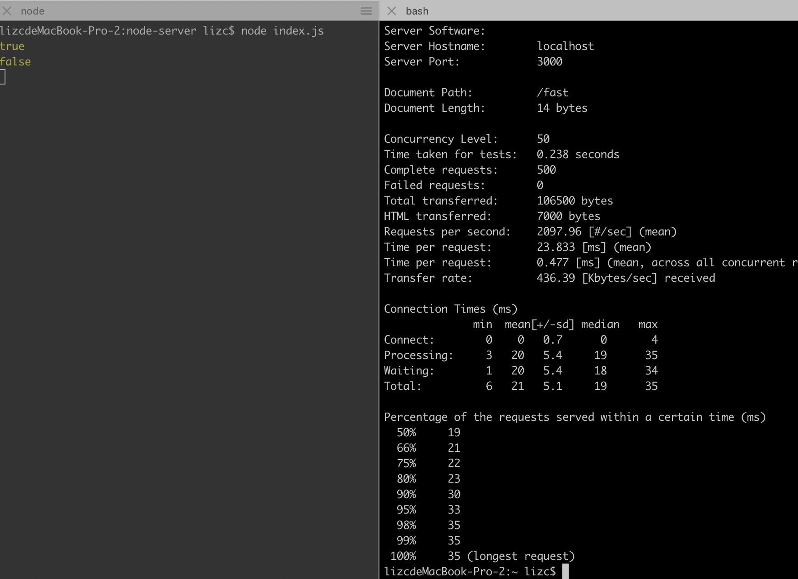
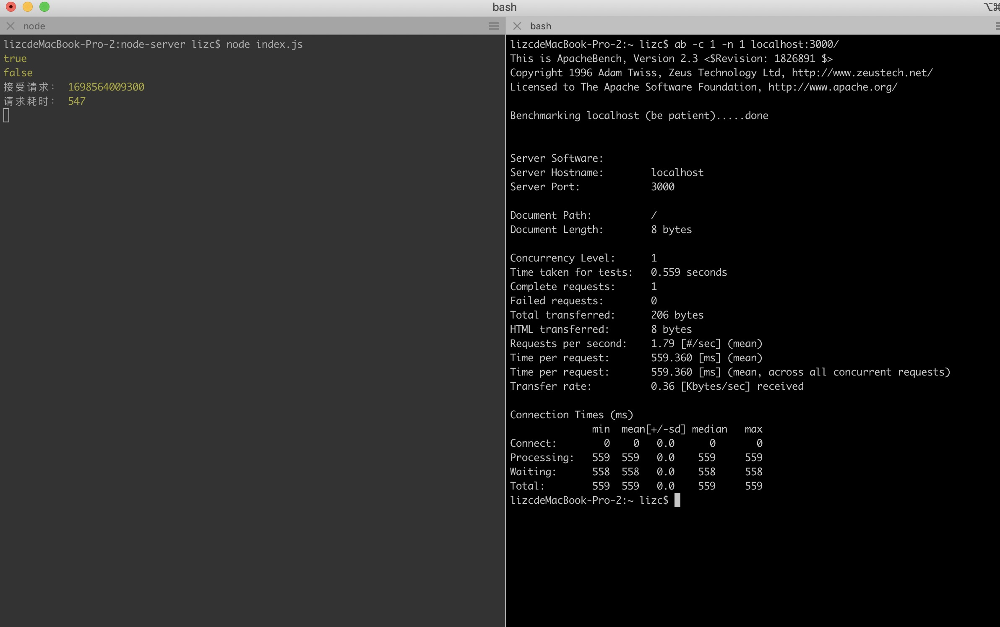

## Node单进程模式
默认情况下，node以单进程运行，一个进程实例只有一个主线程(即事件循环线程)。对于多核CPU的计算机来说，这样做效率很低，因为只有一个核在运行，其他核都在闲置。

```js
const express = require('express')

const app = express();

app.get('/slow', (req, res) => {
    let startTime = Date.now();
    while(Date.now() - startTime < 10000){}
    res.send('slow request')
})

app.get('/fast', (req, res) => {
    res.send('fast request')
})

app.listen(3000)


```

当我们执行node index.js时，就启动了一个进程实例。这就是一个node服务。这里只有一个进程实例。同时也是我们的一个应用。这个进程实例包含一个`主线程(也称事件循环线程)`以及N个`线程池`中的线程。

只要有请求进入我们的服务器，就会在我们的事件循环线程中处理。一旦请求进入我们的服务器，事件循环线程对其进行处理，然后返回响应结果。


如果某个请求处理比较耗时，很明显就会阻塞其他请求。以上面的服务为例，我们使用下面的代码依次请求`/slow`以及`/fast`接口：
```js
const startTime = Date.now();
fetch('http://localhost:3000/slow').then(res => {
   console.log('slow耗时：', Date.now() - startTime) 
})

fetch('http://localhost:3000/fast').then(res => {
   console.log('fast耗时：', Date.now() - startTime) 
})
```

结果如下，很明显，`/fast`请求被`/slow`请求阻塞了。这是因为主线程是单线程的，由于先请求的是slow，该请求阻塞了10秒，在这10秒内，主线程没法处理其他请求，导致fast请求被阻塞了。


## Cluster集群模式
可以在应用中使用cluster模式开启多个进程实例，其中包括一个主进程和若干个worker进程。主进程负责监视worker进程实例的健康。主进程本身并不实际执行任何应用程序代码，不负责处理传入的请求或执行其他操作，比如从数据库中读取数据。相反，主进程负责监控每个worker进程实例的运行状况。主进程可以启动单个实例，也可以停止或者重启它们，还可以向它们发送数据。这些worker进程实例负责实际处理传入的请求，比如访问数据库，处理身份验证等。worker进程实例之间采用进程间通信交换消息，cluster模块内置一个负载均衡器，采用Round-robin算法协调各个worker进程之间的负载。比如下图所示都是我们的应用程序正在运行的实例。这是运行在一台计算机上的多个实例。


下面是cluster 模式的简单demo，这里只有一个进程实例，意味着只有一个事件循环线程。

新建一个index.js文件，代码如下：
```js
const cluster = require('cluster')
const express = require('express')


// 这个文件是否是在master模式执行的
if(cluster.isMaster){
    // 主进程实例，会触发index.js以child模式重新执行一次
    cluster.fork();
} else {
    // worker进程实例
    const app = express();

    const doWork = (duration) => {
        const start = Date.now();
        while(Date.now() - start < duration){}
    }
    app.get('/', (req, res) => {
        doWork(5000)
        res.send('Hi there')
    })
    app.get('/fast', (req, res) => {
        res.send('This was fast!')
    })
    
    app.listen(3000)
}

```

如果先请求/，紧接着请求/fast接口，如下图。会发现/fast请求被阻塞了


下面的代码开启了2个进程实例，意味着有2个事件循环线程，也就是2个独立的服务。

```js
const cluster = require('cluster')
const express = require('express')

console.log(cluster.isMaster)

if(cluster.isMaster){
    // 下面调用了2次cluster.fork函数，意味着当我们在终端执行node index.js时，还会再额外执行2次index.js，
    // 只不过另外2次的cluster.isMaster设置为false
    cluster.fork();
    cluster.fork();
} else {
    const app = express();

    const doWork = (duration) => {
        const start = Date.now();
        while(Date.now() - start < duration){}
    }
    app.get('/', (req, res) => {
        doWork(5000)
        res.send('Hi there')
    })
    app.get('/fast', (req, res) => {
        res.send('This was fast!')
    })
    
    app.listen(3000)
}
```
如下图，可以发现/fast请求不会被阻塞了。这是因为这里我们有两个进程，一个进程处理/请求，另一个进程处理/fast请求。


## 服务器性能测试
这里我们使用Mac自带的`ab`工具对性能进行测试。以下面的代码为例
```js
const cluster = require('cluster')
const express = require('express')

console.log(cluster.isMaster)

if(cluster.isMaster){
    cluster.fork();
} else {
    const app = express();

    const doWork = (duration) => {
        const start = Date.now();
        while(Date.now() - start < duration){}
    }
    app.get('/', (req, res) => {
        doWork(5000)
        res.send('Hi there')
    })
    app.get('/fast', (req, res) => {
        res.send('This was fast!')
    })
    
    app.listen(3000)
}
```
启动服务后，使用`ab`进行测试：

```bash
ab -c 50 -n 500 localhost:3000/fast
```
`-n 500`表示总共发起500个请求

`-c 50`表示并发50个请求，这意味着要尝试同时发起50个请求，确保在任何给定时间点始终有50个请求在运行并等待处理。当然，后面50个请求除外



`Requests per second`表示服务器每秒处理的请求数。
`Time per request:   23.833ms`表示平均每个请求花费的时间

下面表示的是请求时间的分布范围。比如

 `50% 19`表示50%的请求在70ms内得到处理或响应。

 `100%  35`表示至少有一个请求需要35ms的时间才能做出响应。
```bash
Percentage of the requests served within a certain time (ms)
  50%     19
  66%     21
  75%     22
  80%     23
  90%     30
  95%     33
  98%     35
  99%     35
 100%     35 (longest request)
```

### Cluster Mode对性能的影响
为了方便观察Cluster Mode开启的进程数量对性能有什么影响，下面的例子将线程池大小调整为1。
```js
process.env.UV_THREADPOOL_SIZE = 1;

const cluster = require('cluster')

console.log(cluster.isMaster)

if (cluster.isMaster) {
    cluster.fork();
    // cluster.fork();
    // cluster.fork();
    // cluster.fork();
} else {
    const express = require('express')
    const crypto = require('crypto')
    const app = express();

    app.get('/', (req, res) => {
        crypto.pbkdf2('a', 'b', 100000, 512, 'sha512', () => {
            res.send('Hi there')
        })
    })
    app.get('/fast', (req, res) => {
        res.send('This was fast!')
    })

    app.listen(3000)
}

```
启动服务，使用ab测试单个请求耗时：

```bash
ab -c 1 -n 1 localhost:3000/
```

结果如下，可以发现请求耗时559毫秒左右




500 500 1000 1500
500 1000 1500 1500