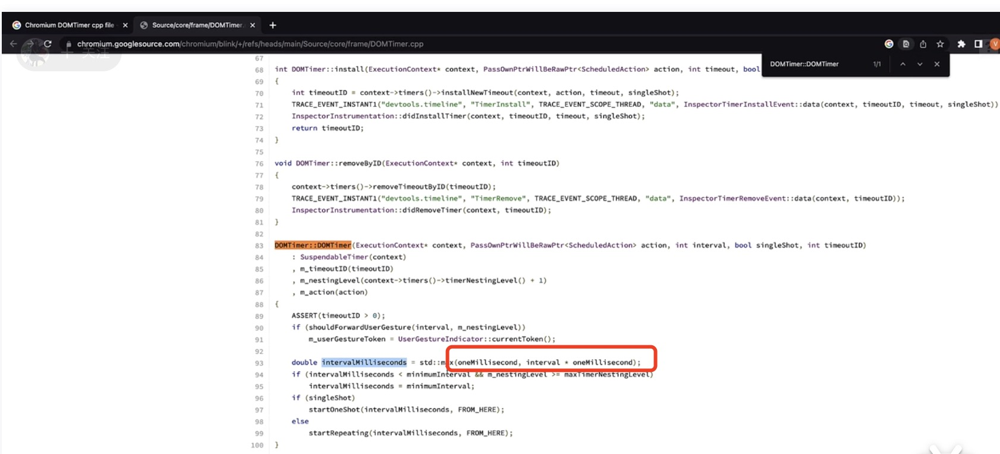

## 异步代码执行(Async Code Execution)
JavaScript is a synchronous, blocking, single-threaded language. 

To make async programming possible, we need the help of libuv

### Few Questions
Whenever an async task completes in libuv, at what point does Node decide to run the associated callback function on the call stack?

What about async methods like setTimeout and setInterval which also delay the execution of a callback function

If two async tasks such as setTimeout and readFile complete at the same time, how does Node decide which callback function to run first on the call stack


Event Loop is a C program and is part of libuv. It is a design pattern that orchestrates or co-ordinates the execution of synchronous and asynchronous code in Node.js


>timer queue、I/O queue、check queue、close queue都是libuv的一部分，而microtask queue并不是libuv的一部分


## 事件循环简介

事件循环是libuv的一部分。

事件循环详细介绍可以看Node.js官方文档：[The Node.js Event Loop, Timers, and process.nextTick()](https://nodejs.org/en/docs/guides/event-loop-timers-and-nexttick/)


下面是事件循环各阶段的顺序。每个阶段都有个待执行的先进先出的回调队列。当事件循环进入某个阶段时，它会执行这个阶段的操作，然后执行这个阶段的任务队列。如果任务队列全部执行完成，或者执行的任务数量达到了上限，那么事件循环就会进入下一阶段。


- timers。执行setTimeout和setInterval的回调。
- pending callbacks。执行系统操作相关或者线程池相关的回调，例如tcp udp。这里面执行的是伪代码中的pendingOSTasks以及pendingOperations
- idle，prepare。只在内部使用。
- poll。检索新的I/O事件；执行与I/O相关的回调（除了关闭回调、计时器调度的回调和setImmediate（）之外，几乎所有回调都执行）；node将在适当的时候在这个阶段阻塞。
- check。执行setImmediate的回调
- close callbacks。执行close事件的回调, 比如`socket.on('close', ...).`


## 事件循环流程

Nodejs事件循环流程图：


- 从上往下执行同步代码，将不同的任务添加至相应的队列
- 所有同步代码执行完后，会去执行满足条件的微任务。node中微任务有promise、process.nextTick。其中process.nextTick优先级最高。
- 所有微任务代码执行后会执行timer队列中满足条件的宏任务
- timer中的所有宏任务执行完成后就会依次切换队列
- 注意：在完成队列切换之前会先清空微任务队列

### process.nextTick
不鼓励使用process.nextTick，因为这会导致事件循环没法执行，处于饥饿状态。

## 实验


### Microtask Queue
微任务队列执行顺序是：
- 优先执行process.nextTick的回调，只有清空了process.nextTick队列，才会将控制权交给Promise队列
- 然后执行Promise队列，如果在Promise回调中调度了process.nextTick，那也只能等到Promsie队列清空，才会将控制权交给process.nextTick队列。
```js
process.nextTick(() => {
    console.log('next tick1')
})

process.nextTick(() => {
    console.log('next tick2')
    process.nextTick(() => {
        console.log('next tick3')
    })
})

process.nextTick(() => {
    console.log('next tick4')
})

Promise.resolve().then(() => {
    console.log('promise 1')
})

Promise.resolve().then(() => {
    console.log('promise 2')
    process.nextTick(() => {
        console.log('next tick5')
    })
})

Promise.resolve().then(() => {
    console.log('promise 3')
})
```

输出：
```bash
next tick1
next tick2
next tick4
next tick3
promise 1
promise 2
promise 3
next tick5
```
在这个案例中，虽然promise2又调用了process.nextTick，但控制权仍在promise队列中，此时nodejs依旧是先执行完promise 3，然后检查nextTick队列发现还有一个next tick5的回调需要执行。

> 微任务队列的执行，首先是检查process.nextTick队列，只有process.nextTick队列全部清空后。再检查promise队列，只有promise队列全部清空后，再检查process.nextTick队列。只有当process.nextTick队列和promise队列都完全清空后，控制权才交给事件循环。

### Timer Queue
我们知道事件循环在进入下一阶段前，会先清空微任务队列。那如果在事件循环的某个阶段中，有个任务又调度了微任务，那微任务又是咋样执行的？

实际上，在Node 11及以上，如果在宏任务中又调度了微任务，那么宏任务执行完后，会先清空微任务队列，再回来接着继续执行宏任务。

而在Node11以前，如果在宏任务中又调度了微任务，那么只有等到所有的宏任务都执行完后，才会清空微任务队列。

比如下面的例子，在Node 11及以上版本时，打印如下：


在Node 11以前的版本，打印如下：


```js
setTimeout(() => {
    console.log('timer1')
}, 0);

setTimeout(() => {
    console.log('timer2')
    process.nextTick(() => {
        console.log('next tick 1')
    })
}, 0);

setTimeout(() => {
    console.log('timer3')
}, 0);
```

### I/O Queue
```js
const fs = require('fs')

setTimeout(() => {
    console.log('timer 1')
}, 0);

fs.readFile('test.js', () => {
    console.log('read file')
})
```

如果多执行几次，会发现控制台输出的顺序不确定，如下：


实际上，当我们设置setTimeout第二个参数为0时，理论上表示的是0毫秒的延迟，也就是需要立即执行。


但是在chromium的底层实现中

```bash
double intervalMilliseconds = std::max(oneMillisecond, interval * oneMillisecond);
```

可以看出，如果我们传递的interval为0，那么intervalMilliseconds的值为oneMillisecond，也就是1毫秒。因此setTimeout(cb, 0)也会存在1毫秒的延迟。问题来了，1毫秒的延迟如何影响上面的执行顺序？

当我们设置0毫秒的延迟时，事件循环开始时需要检查1毫秒是否已过。如果事件循环在0.05毫秒时进入计时器，此时setTimeout的回调还没到时执行，timer queue为空。因此事件循环依次进入I/O queue。执行fs.readFile的回调。如果CPU繁忙，在1.01毫秒时事件循环开始，并进入timer queue，此时timer queue有一个任务需要执行，打印timer 1。然后依次进入I/O queue。

因为CPU繁忙程度的不确定性，以及setTimeout(cb, 0)有1毫秒的延迟，因此我们没法保证在第一轮事件循环开始时，能否立即执行setTimeout(cb, 0)的回调。




### 案例1
```js
setTimeout(() => { 
    console.log('setTimeout')
})

Promise.resolve().then(() => {
    console.log('p1')
})

console.log('start')

process.nextTick(() => {
    console.log('tick')
})

setImmediate(() => {
    console.log('setImmediate')
})

console.log('end')
```

输出：
```bash
start
end
tick
p1
setTimeout
setImmediate
```

在这个案例中，我们只需要关注node事件循环中的3个阶段：timer、poll、 check。执行流程如下：

1.当同步任务执行完成后，首先输出的是
```bash
start
end
```

此时各事件队列状态如下：


2.同步代码执行完成后，检查微任务队列中是否有需要执行的任务。这里有一个p1和tick，但process.nextTick的优先级最高的。因此输出如下：
```bash
start
end
tick
p1
```
此时微任务队列已经清空，状态如下：


3.微任务队列清空以后，事件循环开始进入timer阶段。发现有setTimeout回调需要执行，因此输出：

```bash
start
end
tick
p1
setTimeout
```
此时状态如下：


4.timer阶段的队列清空以后，事件循环依次切换到pending callbacks、idle prepare、poll阶段，这几个阶段均没有任务。

5.事件循环切换到check阶段，发现有setImmediate回调需要执行，因此输出：
```bash
start
end
tick
p1
setTimeout
setImmediate
```

### 案例2
```js
setTimeout(() => {
    console.log('settimeout1')
    Promise.resolve().then(() => {
        console.log('p1')
    })
    process.nextTick(() => {
        console.log('t1')
    })
})

Promise.resolve().then(() => {
    console.log('p2')
})

console.log('start')


setTimeout(() => {
    console.log('settimeout2')
    Promise.resolve().then(() => {
        console.log('p3')
    })
    process.nextTick(() => {
        console.log('t2')
    })
})
setImmediate(() => {
    console.log('setImmediate')
})

console.log('end')
```

### 案例3
```js
setTimeout(() => {
    console.log('timeout')
})

setImmediate(() => {
    console.log('immediate')
})
```
控制台多次执行这段代码，可以发现，输出顺序并不是固定的。

这是因为`setTimeout(callback, 0)`虽然第二个参数是0，但是有误差的，并不是立即就执行的。

如果延迟较大，事件切换进入timer阶段时发现没有任务执行，就依次切换到check阶段，执行`setImmediate`。然后第二轮循环回到timer阶段，发现有任务，执行`setTimeout`

如果没有延迟，则`setTimeout`回调立即加入timer阶段的事件队列。第一轮事件循环开始时，timer阶段就有任务需要执行，因此先执行`setTimeout`的回调。然后再执行`setImmediate`的回调。

如果把上面的代码包裹在`fs.readFile`中执行，可以发现执行顺序就是固定的，先打印`immediate`，再打印`timeout`
```js
const fs = require('fs')
fs.readFile('./test.js', () => {
    setTimeout(() => {
        console.log('timeout')
    })
    
    setImmediate(() => {
        console.log('immediate')
    })
})
```

这是因为`fs.readFile`的回调是在poll阶段执行的，`fs.readFile`回调执行完成后，此时timer阶段就有一个`setTimeout`回调需要执行，check阶段就有一个`setImmediate`回调需要执行。事件循环依次进入check阶段，因此`setImmediate`的回调先执行。第二轮事件循环来到了timer阶段，`setTimeout`后执行。

## Node与浏览器事件循环的区别
- 任务队列数不同
    + 浏览器只有宏任务和微任务队列
    + Node有6个事件队列
- 微任务执行时机不同
    + 浏览器中先执行完所有微任务，再执行宏任务
    + Node在事件队列切换时会去清空微任务
- 微任务优先级不同


## 以下待整理


当我们启动一个node应用程序时，node会创建一个线程，执行我们所有的代码。这个线程就是我们所说的主线程，也叫事件循环线程。

详情可以点击[这里](https://nodejs.org/zh-cn/docs/guides/dont-block-the-event-loop)查看


我们可以将事件循环看作是一个控制结构，它决定应该执行什么操作。了解事件循环的工作方式是极其重要的，因为node的许多性能问题最终都归结为事件循环的行为方式。因此，从本质上讲，如果我们理解事件循环机制，那么就可以很好的理解nodejs中的性能问题


## 事件循环伪代码
可以通过伪代码的方式理解事件循环。每次事件循环在我们的node应用程序中运行时，我们称之为一tick。


事件循环伪代码：

```js
// node myFile.js


// New timers，tasks，operations are recorded from myFile running
// 因此如果我们的myFile文件中使用了http服务监听请求，那么我们的程序将不会退出。
myFile.runContents();

const pendingTimers = [];
const pendingOSTasks = [];
const pendingOperations = [];

// 在shouldContinue函数中，nodejs将执行三个单独的检查以决定事件循环是否应该继续。
function shouldContinue(){
    // Check one: Any pending setTimeout，setInterval，setImmediate 首先，先检查是否有setTimeout、setInterval、setImmediate注册的回调函数
    // Check two: Any pending OS tasks?(Like server listening to port) 其次，检查是否有任何挂起的操作系统任务。比如检查是否服务器仍在监听传入的请求。
    // Check three：Any pending long running operations?(Like fs module) 。检查是否存在长时间运行的操作。和第二次检查有点类似。但两者之间有明显的区别。长时间运行的操作的示例：FS模块的回调函数
    return pendingTimers.length || pendingOSTasks.length || pendingOperations.length
}
// shouldContinue返回true时，事件循环将继续运行。返回false时，事件循环将结束，程序执行到底部，并退出
// Entire body executes in one 'tick'
while(shouldContinue()){
    // 1.Node looks at pendingTimers and sees if any functions are ready to be called. setTimeout，setInterval

    // 2.Node looks at pendingOSTasks and pendingOperations and calls relevant callbakcs

    // 3.Pause execution。Continue when... (暂停执行，在暂停期间，node等待新的事件发生。node just sits around and got no other work to do，it just going to waint until it see):
    //      - a new pendingOSTask is done. Like a new request has come in one some port that we are listening to.
    //      - a new pendingOperation is done. Like we fetch some file of the hard drive
    //      - a timer is about to complete. Like a timer for one of the setTimeout or setIntervals is about to 
    // expire and the relevant function needs to be called
    // Then once that pause is complete bacause we presumably see that something is 
    // about to occur we then continue with the last two steps inside of the event loop

    // 4. Look at pendingTimers. Call any setImmediate

    // 5. Handle any 'close' events.本质上讲，事件循环中的最后一步只是处理清理代码和清理
}


// exit back to terminal


```

>pendingOperations实质上表示的是正在线程池中执行的任务。因此，只要线程池中仍有一些代码或一些任务排队等待运行，我们的程序将继续执行事件循环。当我们启动node应用程序时，node内部会创建类似pendingOSTasks的数组表示所有挂起的请求或者与底层操作系统相关的操作。只要该数组中仍有一些活跃的请求或者操作，node就会继续运行。一旦所有底层操作系统调用都完成了，事件循环也就结束了，应用就会退出。这也是为什么，当我们通过http.createServer创建一个服务并监听端口时，应用程序就会在终端中一直执行而不会退出的原因。


