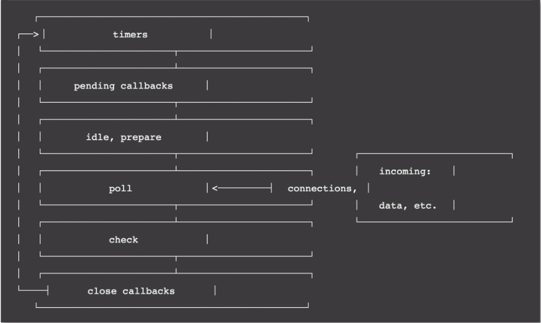

## 事件循环：高性能到底是如何做到的？
事件循环是Node.js中最基础也是最核心的部分。事件循环通俗来说就是一个无限的while循环

- 1.谁来启动这个循环过程，循环条件是什么？
- 2.循环的是什么任务？
- 3.循环的任务是否存在优先级概念？
- 4.什么进程或者线程来执行这个循环？
- 5.无限循环有没有终点？

下面是Node.js官网提供的事件循环原理图：



可以看出有6个阶段，最主要的三个阶段：

- 1. timers。本阶段执行已被setTimeout()和setInterval()调度的回调函数

- 2. pending callbacks。本阶段执行某些系统操作的回调函数

- 3. idle，prepare。仅系统内部使用，只需知道有这2个阶段就可以

- 4. poll。检索新的I/O事件，执行与I/O相关的回调，其他情况Node.js将在适当时在此阻塞。

- 5. check。setImmediate()回调函数在这里执行。setImmediate并不是立马执行而是当事件循环poll中没有新的事件处理时就执行该部分。

- 6. close callbacks。执行一些关闭的回调函数，如socket.on('close', callback)

## 例子
```js
const fs = require('fs')

setTimeout(() => {
    // 新的事件循环的起点
    console.log('settimeout')
}, 0);

setImmediate(() => {
    console.log('setImmediate')
})

// 将会在新的事件循环中的pending callbacks阶段执行
fs.readFile('./README.md', { encoding: 'utf-8' }, (err, data) => {
    if (err) throw err;
    console.log('read file success')
})

// 该部分将会在首次事件循环中执行
Promise.resolve().then(() => {
    console.log('promise: poll callback')
})

// 首次事件循环执行
console.log('1')
```

执行结果：

```js
1
promise: poll callback
settimeout
setImmediate
read file success
```

原因如下：

- 1.setTimeout如果不设置时间或者设置时间为0，则会默认为1ms
- 2.主流程执行完成后，超过1ms时，会将setTimeout回调函数插入到待执行回调函数poll队列中
- 3.当前poll队列存在可执行回调函数，需先执行完。待完全执行完成后，才会执行check: setImmediate

>先执行回调函数，再执行setImmediate

## Node.js事件循环的发起点
- Node.js启动后
- setTimeout回调函数
- setInterval回调函数
- 也可能是一次I/O后的回调函数

## 循环的是什么任务
核心流程中真正需要关注循环执行的就是poll这个过程。在poll过程中，主要处理的是异步I/O的回调函数，以及其他几乎所有的回调函数，异步I/O又分为网络I/O和文件I/O。

### 微任务
在Node.js中微任务包含2种：process.nextTick和Promise。微任务在事件循环中优先级是最高的，在同一事件循环中有其他任务存在时，优先执行微任务队列，且process.nextTick和Promise也存在优先级，process.nextTick高于Promise

### 宏任务
在Node.js中宏任务包含4种：setTimeout、setInterval、setImmediate和I/O，没有先后顺序，宏任务执行在微任务后。在同个事件循环周期内，既存在微任务队列又存在宏任务队列，那优先将微任务队列清空，再执行宏任务队列。


## poll阶段
检索新的I/O事件，执行与I/O相关的回调，其他情况Node.js将在适当时在此阻塞。

```js
setTimeout(() => {
    console.log('1')
    const startTime = Date.now();
    while(Date.now() - startTime < 5000){}
    console.log('sleep 10s')
}, 0);

// 将会在新的事件循环中的pending callbacks阶段执行
fs.readFile('./README.md', { encoding: 'utf-8' }, (err, data) => {
    if (err) throw err;
    console.log('read file success')
})
```

只有在setTimeout的回调函数执行完成后，才会执行fs.readFile的回调函数。实际上，fs.readFile其实已经处理完成了，并且通知了回调函数的一个主线程，但是由于主线程在处理setTimeout回调的时候被阻塞了，导致无法处理fs.readFile的回调。因此可以知道，主线程会因为回调函数的执行而被阻塞。这就是poll阶段重要的一个点，就是主线程会在这个阶段适时地进行阻塞。

## 实践分析
实践验证下Node.js的事件驱动，以及I/O到底有什么效果和为什么能提高并发处理能力。

Node.js不善于处理CPU密集型业务，就会导致性能问题。下面我们通过两种方式实现一个耗时CPU的计算逻辑：

- 1.直接在主业务流程中处理
- 2.通过网络异步I/O给其他进程处理

用上面2种方法分别计算从0到10000000000000之间的和，对比下各自的效果

### 主流程执行
```js
const http = require('http')

const server = http.createServer((req, res) => {
    res.write(`${startCount() + nextCount()}`)
    res.end();
})

server.listen(4000, () => {
    console.log('server start http://127.0.0.1:4000')
})

function startCount(){
    let sum = 0;
    for(let i = 0; i < 500000000;i++){
        sum = sum + i
    }
    return sum
}

function nextCount(){
    let sum = 0;
    for(let i = 500000000; i < 1000000000;i++){
        sum = sum + i
    }
    return sum
}
```

在终端使用 `time curl http://127.0.0.1:4000` 访问，可以看到执行时间在1.1秒左右