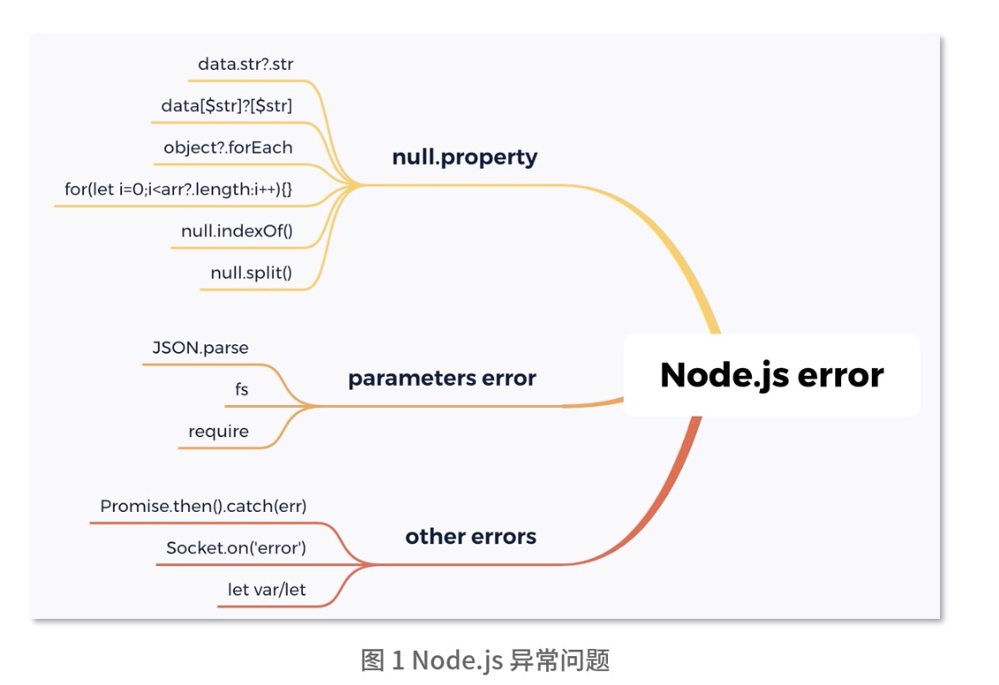

## 系统稳定：如何监控和保护进程安全
在前端因为某些用户的特殊性，导致逻辑Bug，造成这个用户服务异常，但在服务端如果没有做好异常保护，会因为某用户特殊操作可能导致整个进程退出，从而无法提供服务。

本节介绍在Node.js代码层面应该如何降低异常出现的概率，及当出现现网问题时，如何及时发现并通知相应的开发去处理。

## 为什么Node.js的进程安全和健康状况很重要
由于一个用户的异常访问或者数据库异常，加上没有做好异常处理和安全保护，直接导致整个Node.js服务重启，从而中断所有人请求，用户体验非常差

## 哪些场景会导致Node.js异常？
- 由于Node.js使用的是JavaScript，而JavaScript是一个弱类型语言，因此在现网经常会引发一些由代码逻辑的异常导致的进程异常退出。
- 在Node.js中也经常会因为内存的使用不当，导致内存泄漏，当在64位系统中达到1.4G（32位系统0.7G）时，Node.js会异常崩溃
- 由于Node.js的I/O较多也较为频繁，当启用较多I/O句柄但是没有及时释放，同样会引发进程问题

接下来我们从代码逻辑和服务器异常两个方面介绍哪些场景会导致这些问题，并且应该如何去杜绝这类问题。演示一个搭建Node.js性能告警平台，解决告警通知机制

### 代码逻辑异常汇总

Node.js的fs模块应用是非常多的，在应用fs方法时，最好使用try catch进行异常处理，因为很多时候可能存在权限不足或文件不存在等问题。

### 服务器异常
服务器异常在Node.js中最常见的问题主要是内存泄漏、句柄泄漏及网络模块调用

一般情况下不建议使用全局变量，因为全局变量最容易引发内存泄漏。举个例子，比如要将用户的session保存在一个全局变量中，随着用户越来越多，这个session变量保存的数据也会越来越大，而且没有清理的规则。即使有清理规则，清理时间长短，也会影响用户体验及内存大小。

一般打开文件句柄后，都应该主动关闭。如果未主动关闭，就会导致文件句柄越来越多，从而引发句柄泄漏问题。在Node.js里，fs模块都提供了打开文件句柄关闭的方法，比如fs.open提供了fs.close方法，fs.createWriteStream提供了fileStream.end的方法。

## 监控指标
在进程监控告警层面，要了解到底应该监控Node.js的哪些指标属性，其次在业务层面我们又应该主动上报哪些信息来作为监控指标。

### 事件延迟
因Node.js主要是事件循环，如果主线程被长时间占用，导致事件执行延迟。而最简单的办法就是使用setTimeout判断，当设定10000ms执行某个事件，但真正开始执行的时间大于1000ms，那就可能存在事件延迟了。如果这个延迟越来越长，就必须进行告警提示开发者需要查看是否有异常事件被卡住或服务压力过大。

### CPU使用率
这是一个非常重要的指标，当发现CPU使用率长期维持在70%以上，就要考虑是否需要扩容，或者是增加进程的方式来解决这个问题，如果长期在100%那肯定是需要扩容，或检查内部代码逻辑是否存在问题。

### 内存变化
Node.js的内存泄漏时较常见的，其最大的问题就是导致垃圾回收时间变长，从而影响Node.js的服务性能，最大的影响就是内存达到上限后进行重启，从而中断用户请求，引发在重启过程中的用户请求。

### 句柄变化
由于服务器的句柄是有上限的，如果无节制开启句柄，会导致系统性能损耗，从而影响进程的性能。因此必须在未使用句柄时进行释放，如果长期不释放，就会在达到上限时，导致新请求无法开启新的句柄，从而无法正常提供服务。

### 进程异常重启次数
用来判断代码逻辑是否足够健壮的一个点，如果存在异常重启次数，那一定是代码中存在未catch住的异常，或者说上面提到内存泄漏上限问题。