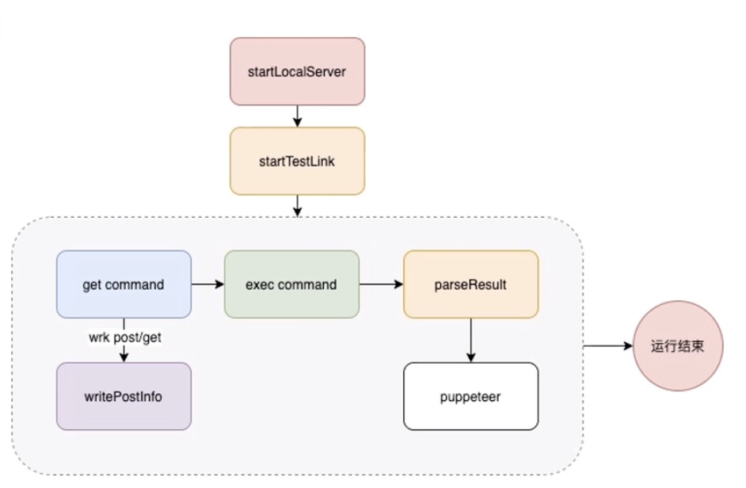
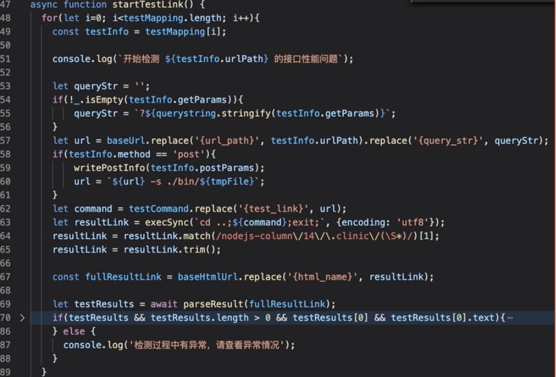
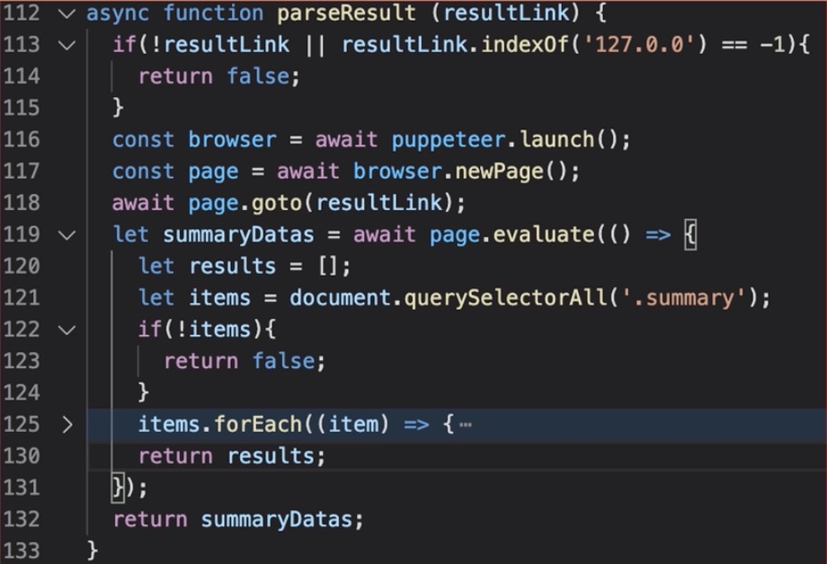

## 使用clinicjs工具实现通用性安全检查
clinicjs是一个Node.js的第三方工具，其核心目的是帮助诊断和查明Node.js性能问题。能帮助我们定位和查询到以下几方面的性能问题：
- CPU异常问题。当CPU存在密集计算占用时，可以检测出来
- 事件循环延迟问题。当主线程存在过载时，事件循环执行时间存在延迟，也可以检测出来
- 内存泄漏问题。
- 句柄泄漏问题。
以上几个问题也是前面几节非常关注的几点。

## 安装
```bash
npm install -g clinic
```

## 常用命令

- 1. clinic doctor

```bash
clinic doctor --on-port "wrk http://127.0.0.1:3000/list" -- node index.js
```

对服务器的`/list`接口进行性能全局分析。

- 2.clinic flame

```bash
clinic flame --on-port "wrk http://127.0.0.1:3000/list" -- node index.js
```

当全局分析出现事件延迟或者高CPU占用时，就需要使用该工具进行具体深入分析。

- 3.clinic bubbleprof

```bash
clinic bubbleprof --on-port "wrk http://127.0.0.1:3000/list" -- node index.js
```

当全局分析出现I/O问题时，就需要使用该工具进一步分析。

## 项目中接入自动化
上面所介绍的是clinic工具的应用，这里不详细介绍。本节的核心是将这个工具作为一个自动化的模块接入到我们的项目中。

clinic的使用是非常方便的，就像下面所示。但是我们需要思考一下，如果每次新接口上线，我们都需要一个一个跑一遍，那需要花费很多精力。此时应该思考一下有没有办法可以自动化的做接口的测试。然后只需要深入分析有问题的接口就可以了。

```bash
clinic flame --on-port "wrk http://127.0.0.1:3000/list" -- node index.js
```

基于以上分析，我们可以开始规划如何进行自动化测试。梳理出下面的流程图：


- 1.把需要测试的接口组装成一个配置信息，其中包含了待测试的请求路径。请求方式以及请求参数
- 2.因为clinic生成的是一个html文件，并且这个html文件是一个javascript动态生成的文件，因此我们需要启动一个本地服务来读取这个html文件并解析生成具体的dom结构
- 3.从数组中取出一个待测试的接口数据进行测试。根据clinicjs的命令生成具体执行的命令。然后借助child process的exec进行执行并获取执行结果
- 4.最终会生成一个运行期间的结果。在输出的最后一行，会提供一个生成后的html文件路径的地址。一般这个文件都会生成在当前项目目录下的.clinic文件夹中。
- 5.使用puppeteer从本地服务中读取html文件并解析获取其中的测试结果的dom信息。
- 6.判断dom信息中是否有异常结果。有异常就显示异常并记录测试结果
- 7.将所有的测试结果、异常接口显示出来。


根据以上流程，可以画一个逻辑执行的流程图：




关键函数：



在上面代码中的第57到63行代码中，主要是在组装clinicjs的测试命令，最终命令会变成下面这种方式：

```bash
cd ..
clinic doctor --on-port "wrk http://127.0.0.1:3000/xxx" -- node index.js
exit
```
以上是get方法的处理过程，如果是post方法需要写入post的数据，并且需要在命令行中加上post的参数，如下所示：

```bash
cd ..
clinic doctor --on-port "wrk http://127.0.0.1:3000/xxx -s ./bin/post_tmp.lua" -- node index.js
exit
```

在代码的第64-67行就是获取执行完成后生成的html文件。拿到html文件以后，我们再向本地的服务读取html的内容。最后再调用parse result来分析是否存在性能问题。





>如果html文件不是通过javascript动态生成的，可以直接通过fs.readFile获取。如果是动态生成则必须用puppeteer模拟浏览器解析html dom结构。


拿到dom结构就可以进行分析判断是否存在异常。通过以上方式，我们就可以在配置文件中增加一些接口实现自动化测试。每次上线前就在测试环境或者预发布环境中跑一遍测试。