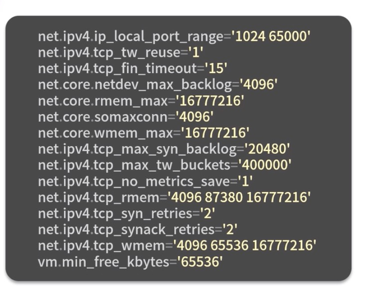
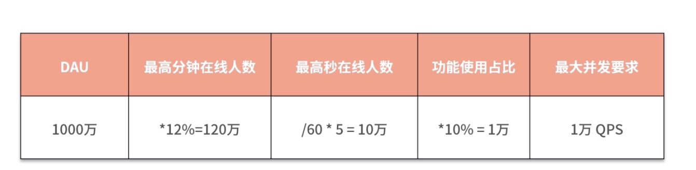
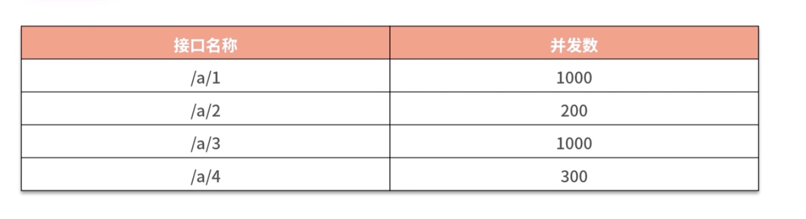

## 理论先行：高并发设计必须学的知识点
前面介绍的性能相关的知识点都是基于单个接口或者单个服务。本节将从系统层面设计高并发的系统。

掌握单个接口技术性能相关的知识远远不够的，需要拓展更多的知识点。比如说：

- 服务器内核配置
- 单机单服务部署以及多机多服务部署
- 多机器负载均衡策略
- 如何做并行压测

首先回顾一下前面几节介绍的一些设计要点，在此基础上，再学习一些需要进一步实践的相关知识点。

总的来说，对于单个服务或者单个接口，我们学习了nodejs中要着重注意的5个高性能特点：
- 主线程避免阻塞。特别是一些复杂CPU密集计算型。最好的方式是交由其他进程处理，减少当前服务进程的阻塞。
- 多进程cluster模式的应用，充分利用多核服务器，能够在单台机器启用多个进程进行负载均衡，提升服务的稳定性
- 在I/O方面要注重缓存的应用，本地缓存优先，其次共享内存，最后再是数据库。
- 过载保护策略，提升服务的稳定性，在服务过载时，保住部分用户的请求链路，以免影响所有用户。
- 工具自动化，单接口单服务性能保证，在上线前至少保证代码没有性能异常的问题。

除了上面的知识点，还需要掌握下面5个关键的知识点
- 微服务的拆分、独立系统、可扩展、可分流
- 机器内核网络配置
- 单机单服务和单机多服务部署
- 多机器部署负载均衡
- 并行压测

## 微服务拆分
随着项目流量及功能越来越多，应该考虑微服务拆分。主要是按照业务功能进行拆分。基础服务模块在node.js中最好不要拆分为服务，而应该拆分为模块。模块调用方式肯定是比网络性能更高。在业务功能较复杂的时候，拆分出独立的项目有以下几个好处：

- 便于扩展和后期维护
- 独立部署，针对流量不同的业务，独立安排部署
- 功能解藕、服务安全、减少相互影响，避免一个业务承载压力过大导致所有服务异常。
- 多人协作开发模式清晰，可以按照功能模块进行团队人力划分，这样既清晰又便于团队合作管理。

微服务拆分是基于一种框架的解决方案，能降低耦合提升单个服务的处理能力，但不能实质性的提升整体服务的并发处理能力。而服务器内核的网络配置却在一定程度上可以提升并发处理能力。

## 机器内核网络配置
关于机器内核配置，涉及到几个比较关键的配置。这里需要注意，一般情况下不需要修改任何配置。如果需要修改，也需要请相应的运维，比较专业的人士进行修改配置。

下面是调优的tcp相关的一些参数：

- ip_local_port_range
- tcp_tw_reuse。
- tcp_fin_timeout

## 单机单服务和单机多服务部署
这里所说的服务就是我们认为的项目。比如MES系统，WMS系统等。单机单服务，就是一台机器只部署MES系统。单机多服务，就是一台机器同时部署WMS系统和MES系统。

### 单机单服务
单机只部署一个Node.js服务。适合并发较大，功能底层的服务。比如Node.js做业务网关时，就适合单机单服务部署。因为网关并发一般较大，需要非常严谨的了解当前承载的并发和性能。而单机单服务则可以非常精准的了解性能的数据，不会被外界因素干扰。在应用这种服务时，需要按照机器核数来启动进程数，等于或者小于核数，避免在并发较高时占满CPU，从而影响机器的性能，系统资源无法调度，那就非常危险了。

### 单机部署多个Node.js服务
单机多服务适合于多个业务服务，但这多个业务并发相对不高。比如应用Node.js做一些活动或者通用中台服务时。这种情况不利于判断当前服务的启用的进程数，需要根据具体的业务进行判断。

举个例子，假设在一台16核机器上部署2个服务，一个并发较高，一个并发较低。两者经过分析，并发高的10核就可以满足到要求，而并发低的只需要4核就足够。这种情况就不会有太大的风险，因为加起来是14核，也不会影响到性能。但两者加起来如果超过16核，比如并发低的需要8核才能满足业务需求，那就需要考虑两者在什么场景下是否存在同时并发的压力。如果存在并发压力，就应该考虑将两者分到不同的机器上，而不是同一台机器上。或者增加机器来满足当前的业务场景

如果一台机器上有4个服务，分析方法还是和上面的相似，按下面几个步骤来判断：
- 判断4个服务加起来是否超出当前CPU总核数
- 不超出不会有影响，超出时则判断多个服务是否会同时存在最大并发数。或者最大并发的服务加起来是否会超出当前CPU核数。
- 多个服务最大并发不会超过CPU核数时，则可以合并部署。
- 多个服务最大并发会超出CPU核数时，就需要考虑拆分服务出去，或者增加机器，减少CPU核数占用。

虽然这种方式计算不够准确，但是大部分可以按照这种去参考。

其实在实际开发过程中，监控和性能告警也是非常重要的。当CPU长期处于一个高负荷时，一定是需要报警的。我们才能知道是否需要进一步扩容，或者性能优化提升。

以上是单机注意的一些细节。

## 并行压测
- 首先使用clinicjs压测工具，检测单个接口是否存在性能问题。
- 计算当前服务所应该承担的最大并发情况，用一个渐进性的表格来分析。

可以看上面表格所示的预测并发压力的方式。比如当前DAU是1000万，最高在线人数是12%，因此最高在线人数是120万。按照秒来计算，用当前数除以60就是每秒，但是由于不是严格除以60，所以我们需要乘以5这个系数来确保安全。最后10%的在线用户会使用到该服务，所以该服务的最大并发数是1万QPS。假设我们有4台服务器，按照平均分配的话，那么每台机器处理并发数大概是2500QPS。得到了1万的结论以后，我们再细分接口并发数，就得到下面表格的结论：

拿到上面接口并发数后，就可以联合的压测以上4个接口了，分别按照1000、200、1000和300的并发去压测。

压测后就可以得出当前服务的情况。接下来就需要进行多台机器联合压测。在现网一般情况下是无法4台同时压测的，可以考虑在现网比较空闲的时段，使用2台进行压测进一步分析是否满足要求。

如果单台机器涉及多服务，那么则需要将多个服务进行联合压测，才能真实的得到现网的负载承受能力。

