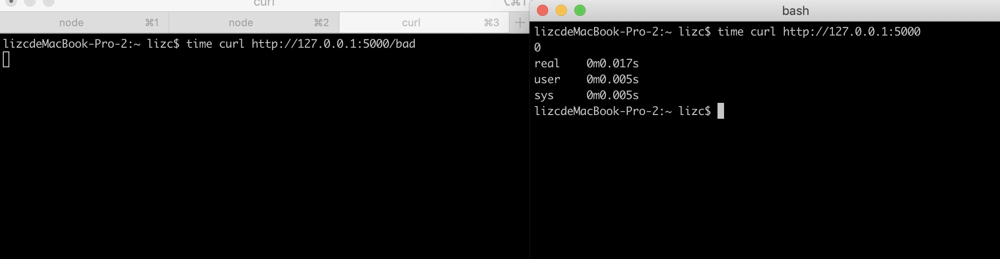
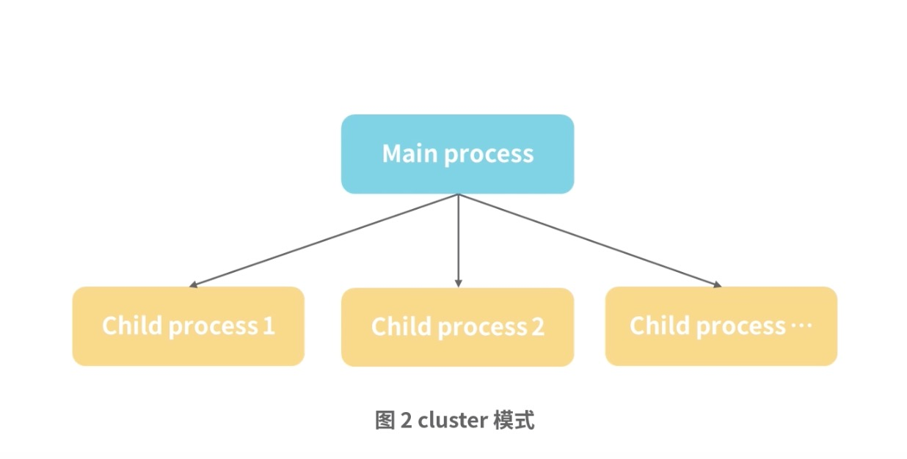

## 影响Node.js性能的因素
Node.js作为后台服务，性能是非常关键的一点。影响Node.js的性能不仅仅要考虑其本身的因素，还应该考虑所在服务器的一些因素。


Node.js的事件循环机制和cluster模式就是一种Node.js潜在的内在因素，而网络I/O，磁盘I/O以及其他内存句柄的一些问题则是因为服务器的资源因素导致的性能问题。

本节详细分析影响其性能的因素原因，以及部分优化解决方案


影响性能的一个最大的原因是在写Node.js代码时，没有注重性能影响问题

### CPU密集型计算
CPU负责了程序的运行和业务逻辑的处理。而CPU密集型表示的主要是CPU承载了比较复杂的运算。


在Node.js中主线程是单线程的，无论主线程逻辑，还是回调处理逻辑，最终都在主线程处理，那如果主线程一直在处理复杂的计算，其他请求就无法再次进来，也就是单个用户就可阻塞所有用户的请求。因此保持主线程的通畅是非常关键的。

在Node.js中有以下几种情况，会影响到主线程的运行，应该主动避免：
- 大的数据循环，比如没有利用好数据流，一次性处理非常大的数组。
- 字符串处理转化，比如加解密、字符串序列化等
- 图片、视频的计算处理。比如对图片进行裁剪、缩放或者切割等

举个实际例子，假设现在有2个功能：
- 大数组的循环
- 一个非常简单的Hello World输出

```js
const http = require('http');
const rp = require('request-promise');

const server = http.createServer((req, res) => {
    let sum = 0;
    if (req.url === '/bad') {
        console.log('bad...')
        for (let i = 0; i < 10000000000; i++) {
            sum = sum + i
        }
    }
    res.write(`${sum}`);
    res.end();
})

server.listen(4000, () => {
    console.log('server start http://127.0.0.1:4000')
})

```

在终端先发起一个bad请求，然后发起一个普通请求，如下：

time curl http://127.0.0.1:4000/bad

time curl http://127.0.0.1:4000/

可以发现，bad请求耗时很久，普通请求也被阻塞了。


这样就会因为某些用户的复杂运算，而影响到整个系统的请求处理，如果这种复杂运算占用的CPU时间越久，那么就会导致请求堆积，而这就会进一步导致系统处于崩溃状态无法恢复。


### 网络I/O
网络I/O中有2种相关的类型：同步阻塞I/O和异步非阻塞I/O：
- 同步阻塞I/O的字面意思是发出网络请求后需要等待返回后，再处理其他计算。
- 异步非阻塞I/O就是发起网络I/O后，还可处理其他的计算，这也是为什么Node.js在处理网络I/O性能较高的原因。

假设有个功能需访问一个API的数据，Node.js调用API就是一种网络I/O：

- 如果该API处理慢，那么所有用户请求都被阻塞了。
- 如果异步的话，则无需等待处理，可以继续其他的运行

在CPU例子中，可以使用一种办法就是将CPU密集型计算使用其他进程来处理，这里可以做一个简单的测试，启用2个服务，一个是使用CPU密集型计算，另外一个则是正常请求的。


和CPU代码例子中唯一不同在于CPU密集型计算使用了网络I/O。

新建cpu.js文件，并执行`node cpu.js`启动服务
```js
const http = require('http');

const port = 4000;

const server = http.createServer((req, res) => {
    let sum = 0;
    for (let i = 0; i < 10000000000; i++) {
        sum = sum + i
    }
    res.write(`${sum}`);
    res.end();
})

server.listen(port, () => {
    console.log(`server start http://127.0.0.1:${port}`)
})

```

新建index.js文件，并执行`node index.js`启动服务
```js
const http = require('http');
const rp = require('request-promise');

const port = 5000;
const server = http.createServer(async (req, res) => {
    let sum = 0;
    if (req.url === '/bad') {
        const result = await rp.get(`http://127.0.0.1:4000`)
        const sumData = JSON.parse(result);
        if (sumData && sumData.data) {
            sum = sumData.data.sum
        }
    }
    res.write(`${sum}`);
    res.end();
})

server.listen(port, () => {
    console.log(`server start http://127.0.0.1:${port}`)
})
```

在终端访问：
time curl http://127.0.0.1:5000/bad

time curl http://127.0.0.1:5000/

可以看到虽然/bad请求很耗时，但不会阻塞普通的请求。如下图：



从上面例子中可以看到，网络I/O是Node.js的优势，虽不影响主线程的处理，但对于`http://127.0.0.1:5000/bad`请求，如果要提升性能，应关注什么呢？

- 通道服用。比如现在每次访问`http://127.0.0.1:5000/bad`时都会发起一个TCP到`http://127.0.0.1:4000`，如果能够通道复用，减少TCP握手，那就可以提升该接口的性能或者将某些内部服务使用UDP来实现。
- 增加缓存。对于相同响应的返回数据，增加缓存处理，避免不必要的计算。对于上面的计算，我们完全可以缓存计算结果，这样来减少网络I/O。
- 长链接链接池。有一些网络I/O是长链接的形式，比如MySQL，Mamcached或者Redis，为了避免排队使用长链接的问题，可以使用链接池。而由于Redis和Node.js是单线程非阻塞处理，因此可以不用链接池。

网络I/O一般不影响主线程逻辑，往往网络I/O请求的服务是瓶颈端，从而影响Node.js中涉及该网络服务的请求。

网络I/O堆积较多会侧面影响：
- 服务器本身的网络模块问题
- Node.js性能，导致其他服务接口受影响。


### 磁盘I/O
和网络I/O相似，在一般情况下，磁盘I/O是不会影响到主线程性能的。这里所说的是涉及到磁盘I/O的服务请求，因为服务器的磁盘性能是一定的，如果在高并发情况下，磁盘I/O压力较大，从而导致磁盘I/O的服务性能下降，就会影响到那些需要读取磁盘的请求。


在实际开发过程中，最常见的磁盘I/O场景，就是日志模块。日志是需要写文件，从而会有频繁的日志写入。和网络I/O相似，磁盘I/O也会从侧面影响机器性能，导致Node.js服务性能受影响。


### 小结
以上3种情况，只有CPU密集计算会真正影响Node.js服务性能，而网络I/O和磁盘I/O都是直接影响服务器性能，从而侧面影响Node.js服务性能，一般这时需要调整服务器配置或者做一些队列优化方式来提升服务器性能


### 集群服务
后台服务一般都有集群的概念，无论是多机器部署，还是单机器(Node cluster模式)


#### 多进程cluster模式
上一节详细介绍了cluster模式，在实际应用过程中，这种模式也是存在性能瓶颈问题的。



在这种模式中，主进程也是存在性能瓶颈的，因为所有的请求都必须要经过主进程进行分发。

在实际开发过程中，遇到问题，由于所用机器是一个96核以上的服务器，因此启用较多的worker进程，而主进程只有一个。在单机高并发时(2万以上的每秒并发请求)导致master进程处理瓶颈，影响到服务性能，并且这时候会发现worker进程的CPU并没有任何压力。


## 总结
对于Node.js后台服务，不仅要考虑其本身性能影响，更应考虑它对服务器资源竞争产生的性能影响。

比如无节制使用服务器的内存或句柄，都会导致服务器的异常，而服务器的异常则从侧面影响到Node.js本身的性能

- 内存限制。在32位服务器上，Node.js的内存限制是0.7G，而在64位服务器上则是1.4G。**这个限制主要因为Node.js的垃圾回收线程在超过限制内存时，回收时长循环会大于1s，从而会影响性能问题**。

现网一般会启用多个进程，如果每个进程损耗1.4G，那加起来可能超出了服务器内存上限，从而导致服务器瘫痪。其次如果内存不会超出服务器上限，而是在达到一定上限时会导致服务器重启，从而会导致接口请求失败的问题。

- 句柄限制。句柄可简单理解为一个ID索引，通过这个索引可访问到其他资源，比如文件句柄、网络I/O操作句柄等。而一般服务器句柄都有上限。当Node.js没有控制好句柄，比如无限的打开文件并未关闭，会出现句柄泄漏问题，而这样会导致服务器异常，从而影响Node.js服务