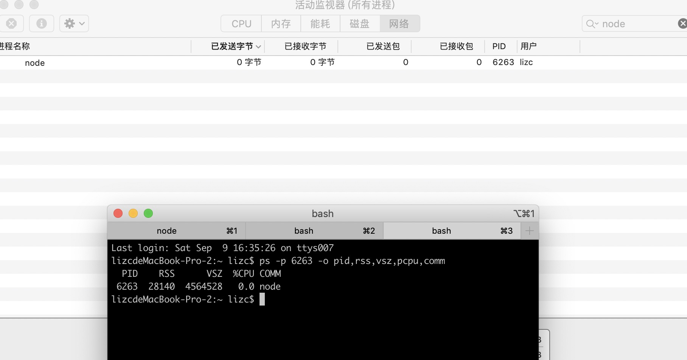
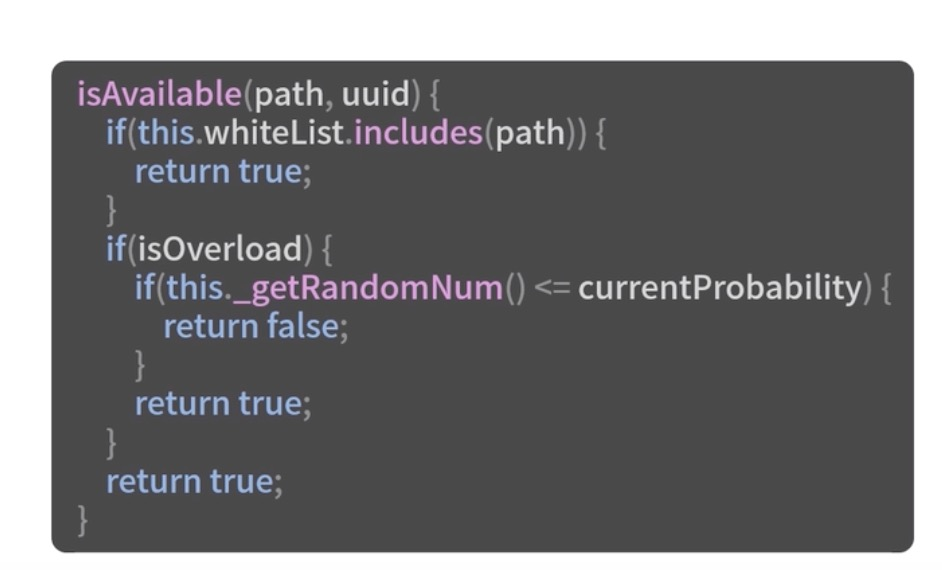
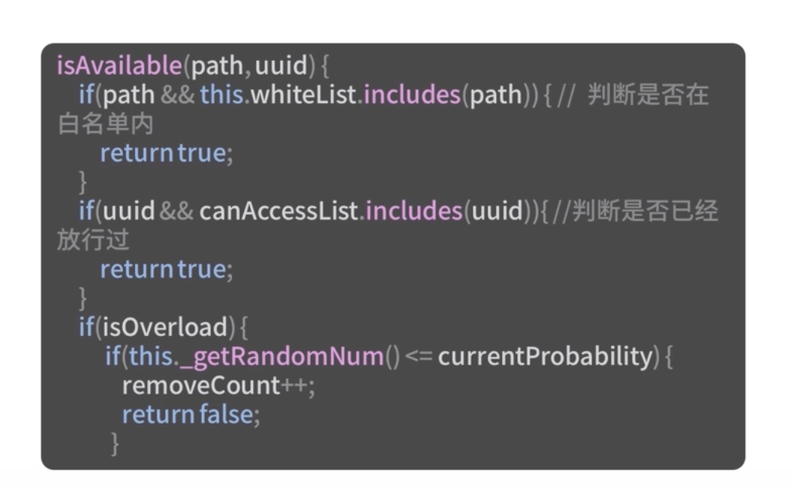

## CPU过载保护设计：如何在服务层面确保系统稳定？
上节介绍了影响Node.js服务性能的一个关键点：CPU的密集型计算，通过例子可以看到只要出现这类请求，基本就会导致服务器瘫痪。

那么是否有办法保护我们的服务呢？比如是否可以丢弃部分`/bad`请求，但是可以正常响应`/`请求，这就是本节要介绍的知识点：CPU过载保护机制。

## 过载保护
举个例子，银行的业务场景：每10分钟处理1人的业务，每10分钟会进来2个人。这样每10分钟就会积压一个用户。偶数进来的用户还需要多等10分钟。就会导致每人的等待时长是：`((n+1)/2 - 1 + (n+1)%2)*10`，n表示第几个进来的用户

长时间饱和工作状态，银行人员会很辛苦，无法更好服务用户，一般情况下，在银行都会有一定的取号上限或保安会提示无法再服务了，这就是过载保护，避免因事务积压，导致系统无法提供更好的服务。

从技术层面介绍过载保护概念，由于Node.js最大的性能损耗在于CPU，因此需要进一步了解什么是CPU的过载保护。

### 什么是过载保护
这个词最早出现在电路方面，在出现短路或者电压承载过大时，会触发电源的过载保护设备，该设备要么熔断、要么跳闸切断电源。

在服务端，首先需要设计一个过载保护的服务，在过载触发时，切断用户服务直接返回报错，在压力恢复时，正常响应用户请求。

在Node.js中最大的瓶颈在于CPU，需要针对CPU的过载进行保护。当CPu使用率超出一定范围时，进行请求熔断处理，直接报错返回。

### 实现方案
思考以下问题：
- 如何获取当前进程所在的CPU使用率的方法
- 应尽量避免过载保护影响服务性能
- 什么时候触发过载，能否减少误处理情况
- 请求丢弃方案和优先级

#### 1.获取CPU使用率
Node.js进程启动后，都会绑定在单核CPU上。假设机器有2个CPU内核，只启动了一个进程，在没其他外在因素影响的情况下，Node.js即使跑满CPU也最多只占用了50%的总机器的CPU利用率，因此这里需要获取该进程CPU使用率。因此需要使用PS这个命令，而不是利用Node.js本身的OS模块。


以Mac为例子：

```bash
ps -p ${process.pid} -o pid,rss,vsz,pcpu,comm
```

- pid是进程ID
- rss是实际内存占用
- vsz是虚拟内存占用
- pcpu是CPU使用率
- comm是进程执行的指令




在node.js中我们可以这样获取进程信息：

```js
const util = require('util')
const exec = util.promisify(require('child_process').exec)
const http = require('http');
const rp = require('request-promise');
const { platform, totalmem } = require('os');

const port = 5000;
const server = http.createServer(async (req, res) => {
    let sum = 0;
    if (req.url === '/bad') {
        for (let i = 0; i < 10000000000; i++) {
            sum = sum + i
        }
    }
    if (req.url === '/getcpu') {
        const result = await _getProcessInfo();
    }
    res.write(`${sum}`);
    res.end();
})

// 使用ps命令获取进程信息
const _getPs = async () => {
    const cmd = `ps -p ${process.pid} -o pid,rss,vsz,pcpu,comm`;
    const { stdout, stderr } = await exec(cmd);
    if (stderr) {
        console.log('异常。。。', stderr)
    } else {
        console.log('结果：', stdout)
    }
    return stdout
}
// 获取进程信息
const _getProcessInfo = async () => {
    let pidInfo, cpuInfo;
    if (platform === 'win32') {
        // windows平台
        pidInfo = await _getWmic();
    } else {
        // 其他平台linux & mac
        pidInfo = await _getPs();
        cpuInfo = await _parseInOs(pidInfo)
    }
    if (!cpuInfo) {
        // 异常处理
        return false;
    }
    const pid = parseInt(cpuInfo.pid, 10)
    const name = cpuInfo.name.substr(cpuInfo.name.lastIndexOf('/') + 1)
    const cpu = parseFloat(cpuInfo.cpu)
    const mem = {
        private: parseInt(cpuInfo.pmem, 10),
        virtual: parseInt(cpuInfo.vmem, 10),
        usage: cpuInfo.pmem / totalmem * 100
    }
    return {
        pid, name, cpu, mem
    }
}


server.listen(port, () => {
    console.log(`server start http://127.0.0.1:${port}`)
})

```


#### 2.性能影响
由于在Node.js中只有一个主线程，因此必须严格减少框架在主线程的占用时间，控制框架基础模块的性能损耗，从而将主线程资源更多服务于业务，增强业务并发处理能力。因此，上面nodejs获取进程信息还可以按照下面的方式改造：
- 1.只处理需要的数据，在第一步获取CPU使用率的基础上，需要缩减一些字段，只获取CPU信息即可。
- 2.定时落地CPU信息到内存中，而非根据用户访问来实时计算。

```js
const check = async (maxOverloadNum = 30, maxCpuPercentage = 80) => {
    setInterval(async () => {
        try {
            const cpuInfo = await _getProcessInfo();
            if (!cpuInfo) {
                return;
            }
            if (cpuInfo > maxCpuPercentage) {
                overloadTimes++;
            } else {
                overloadTimes = 0;
                return isOverload = false;
            }

            if(overloadTimes > maxOverloadNum){
                isOverload = true;
            }

        } catch (err) {
            console.log(err)
            return;
        }
    }, 2000)
}
```

- maxOverloadNum。表示最大持续超出负载次数，当大于该值时才会判断为超出负载了。
- maxCpuPercentage。表示单次CPU使用率是否大于该分位值，大于则记录一次超载次数。


#### 3.概率丢失
在获取CPU值后，可根据当前CPU的情况进行一些丢弃处理，但应尽量避免出现误处理的情况，比如当前CPU某个时刻出现过高但立马恢复了，这种情况下是不能进行丢弃请求的。只有当CPU长期处于一个高负载情况下才能进行请求丢弃。

需要根据下面三个变量进行判断：
- overloadTimes。用o表示，指CPU过载持续次数，该值越高丢弃概率越大，设定取值范围为0~10。
- currentCpuPercentage。用c表示，指CPU当前负载越高，占用率越大丢弃概率越大，设定范围为0~10。
- baseProbability。用b表示，是负载最大时的丢弃概率，取值范围为0-1。

overloadTimes可以看作是直线型，但是影响系数为0.1。baseProbability可以看作是直线型，影响系数为1。而currentCpuPercentage则是一个指数型增长模型。

可以得出一个简单的算法公式：

```js
const P = (0.1 * o) * Math.exp(c)/(10 * Math.exp(10)) * b
```

其中O取最大值100，c取最大值10，b为固定值。这里假设为0.7，那么求出来的最大概率是0.7。那么在o为30，c为90的概率则是0.19，因此会丢弃19%的用户请求。

在某些情况下，需要做一定的优化，避免一些重要的请求无法触大用户，因此还需要做一些优先级和同一个uuid进行优化的策略。

#### 4.优先级的实现
- 1.优先级问题。有些核心请求不希望用户在访问时出现丢弃的情况，比如支付或者其他核心重要的流程。
- 2.对于同一个用户，允许该用户访问其中一个接口，其他接口在短时间内也应允许请求，不然会导致有些接口响应成功，有些失败。那么用户还是无法正常使用。

优先级实现最简单的方式，就是接受一个白名单参数，如果设置了则会在白名单中请求通过处理，无需校验。如下面的代码



uuid的处理。首先需要考虑时效性，如果存储没有时效会导致存储数据过大，从而引起内存异常问题。其次应考虑使用共享内存Redis方式，因为有可能是多机器部署，为了简单化，会使用本地内存方式，但也需要考虑上限，超过上限剔除第一个元素。




接下来实践应用下，首先可以对比下性能影响。在没有应用和应用之后两者的空转性能对比。

## 最终代码
新建index.js文件：
```js
const http = require('http');
const cpuOverload = new (require('./cpuOverload'))(10, 80, 0.8);

/**
 * 定义两个服务路径
 * normal 是负责输出 hello world 的路径
 * bad 是负责复杂计算的路径
 */
const routerMapping = {
    '/v1/cpu': {
        'method': 'bad'
    },
    '/v1/normal': {
        'method': 'normal'
    }
};

/**
 * 创建 http 服务，简单返回
 */
const server = http.createServer(async (req, res) => {
    const pathname = req.url;
    // 过滤非拉取用户信息请求
    if (!routerMapping[pathname]) {
        res.write('path not found')
        res.end();
        return;
    }

    // 请求拦截，避免 cpu 过载
    if (!cpuOverload.isAvailable(pathname)) {
        res.write('server error')
        res.end();
        return
    }

    try {
        if (req.url === '/v1/cpu') {
            let sum = 0;
            for (let i = 0; i < 10000000000; i++) {
                sum = sum + i;
            }
            res.write(`sum：${sum}`)
            res.end();
            return;
        }
        if (req.url === '/v1/normal') {
            res.write(`hello world`)
            res.end();
            return;
        }
    } catch (error) {
        // 异常时，需要返回 500 错误码给前端
        console.log(error);
        res.write('server error')
        res.end();
        return
    }

})

// 启动服务
server.listen(4000, () => {
    console.log('server start at http://127.0.0.1:4000');
})

/**
 * 处理 cpu 信息采集
 */
cpuOverload.check().then().catch(err => {
    console.log(err)
});
```

新建cpuOverload.js文件：

```js
const platform = process.platform;
const util = require('util');
const exec = util.promisify(require('child_process').exec);
const os = require('os');

let overloadTimes = 0;
let isOverload = false;
let currentCpuPercentage = 0;
let currentProbability = 0;

let removeCount = 0;

const maxValue = (10 * Math.exp(10)).toFixed(4);
const maxUser = 5000;
const canAccessList = [];

class CpuOverload {

    /**
     * 
     * @param {int} maxOverloadNum 
     * @param {int} maxCpuPercentage 
     * @param {float} baseProbability 
     */
    constructor(maxOverloadNum =30, maxCpuPercentage=90, baseProbability=0.9, whiteList=[]) {
        this.maxOverloadNum = maxOverloadNum;
        this.maxCpuPercentage = maxCpuPercentage;
        this.baseProbability = baseProbability;
        this.whiteList = whiteList;
    }
    /**
     * @description 判断服务器当前是否可用
     * @param {string} path 
     * @param {string} uuid 
     */
    isAvailable(path, uuid=false) {
        if(path && this.whiteList.includes(path)) { // 判断是否在白名单内
            return true;
        }
        if(uuid && canAccessList.includes(uuid)){ // 判断是否已经放行过
            return true;
        }
        if(isOverload) {
            if(this._getRandomNum() <= currentProbability) {
                removeCount++;
                return false;
            }
        }
        if(uuid) { // 需要将 uuid 加入到放行数组
            if(canAccessList.length > maxUser){
                canAccessList.shift()
            }
            canAccessList.push(uuid);
        }
        return true;
    }

    /**
     * 定时校验服务器是否过载
     */
    async check() {
      /// 定时处理逻辑
      setInterval(async () => {
        try {
            const cpuInfo = await this._getProcessInfo();
            if(!cpuInfo) { // 异常不处理
                return;
            }
            currentCpuPercentage = cpuInfo;

            if(cpuInfo > this.maxCpuPercentage) { // 当 cpu 持续过高时，将当前的 overloadTimes 计数+1
                overloadTimes++;
            } else { // 当低于 cpu 设定值时，则认为服务负载恢复，因此将 overloadTimes 设置为 0
                overloadTimes = 0;
                return isOverload = false;
            }

            if(overloadTimes > this.maxOverloadNum){ //当持续出现 cpu 过载时，并且达到了我们设置上线，则需要进行请求丢弃了
                isOverload = true;
            }
            this._setProbability();
        } catch(err){
            console.log(err);
            return;
        }
    }, 2000);
    }

    /**
     * @description 获取一个概率值
     */
    _getRandomNum(){
        return Math.random().toFixed(4);
    }

    /**
     * @description 获取丢弃概率
     */
    _setProbability() {
        let o = overloadTimes >= 100 ? 100 : overloadTimes;
        let c = currentCpuPercentage >= 100 ? 10 : currentCpuPercentage/10;
        currentProbability = ((0.1 * o) * Math.exp(c) / maxValue * this.baseProbability).toFixed(4);
    }
     
    /**
     * @description 获取进程信息
     */
    async _getProcessInfo() {
        let pidInfo, cpuInfo;

        if (platform === 'win32') { // windows 平台
            pidInfo = await this._getWmic();
        } else { // 其他平台 linux & mac
            pidInfo = await this._getPs();
        }
        
        console.log('pidInfo',pidInfo)
        cpuInfo = await this._parseInOs(pidInfo);
        
        if(!cpuInfo || cpuInfo == '') { // 异常处理
            return false;
        }
        /// 命令行数据，字段解析处理
        console.log(parseFloat(cpuInfo));
        return parseFloat(cpuInfo).toFixed(4);
    }

    /**
     * @description 使用 ps 命令获取进程信息
     */
    async _getPs() {
        // 命令行
        const cmd = `ps -p ${process.pid} -o pcpu`;

        // 获取执行结果
        const { stdout, stderr } = await exec(cmd);
        if(stderr) { // 异常情况
            console.log(stderr);
            return false;
        }

        return stdout;
    }

    async _getWmic() {
        const cols = 'IDProcess,Name,PercentProcessorTime,PrivateBytes,VirtualBytes';
        const cmd  = 'wmic path Win32_PerfFormattedData_PerfProc_Process get ' + cols + ' /format:csv';

        const { stdout, stderr } = await exec(cmd);
        console.log(stdout);
        return stdout;
    }

    async _parseInOs(pidInfo) {
        let lines = pidInfo.trim().split(os.EOL);
        if(!lines || lines.length < 2){
            return false;
        }
        let cpuStr = lines[1];
        return cpuStr.trim();
    }

    async _parseInWin() {

    }
}

module.exports = CpuOverload;
```