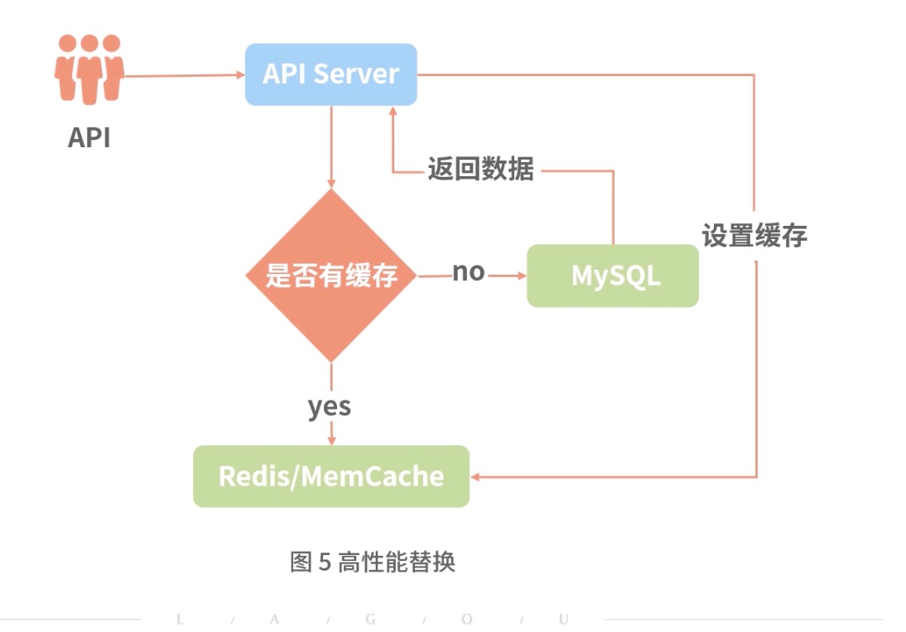

## 优化设计：在I/O方面应该要注意哪些要点
在前面介绍过，I/O不会影响整体Node.js服务的性能，但会因为I/O影响服务器系统，从而侧面影响到Node.js的性能

本节着重介绍磁盘I/O和网络I/O两个方面在研发过程中注意的要点

I/O，即输入输出，就是数据传递的过程。作为后台服务需要更多地与外部进行数据交互，那么就避免不了I/O操作。

在展开之前先了解I/O在系统层面会有2个阶段：

- 第一阶段：读取文件。将文件放入操作系统内核缓冲区。
- 第二阶段：将内核缓冲区拷贝到应用程序地址空间。

### I/O的5种模型
I/O分为5种模型：
- 1.阻塞I/O：读取一个文件，必须要等待文件读取完成后，才能执行其他逻辑，而当前是无法释放CPU的，因此无法去处理其他逻辑。
- 2.非阻塞I/O：发起了一个读取文件的指令，系统会返回正在处理中，这时如果要释放进程中的CPU去处理其他逻辑，就必须间隔一段时间，然后不停地去询问操作系统，使用轮询的判断方法看是否读取完成了。
- 3.多路复用I/O：主要是为了解决轮询调度的问题，可将这些I/O Socket处理的结果统一交给一个独立线程来处理，当I/O Socket处理完成后，就主动告诉业务，处理完成了，不需要每个业务都进行轮询查询。有三种常见的类型：
    + select。
    + poll。
    + epoll。
select是比较旧的，它和poll的区别在于poll使用的是链表来保存I/O Socket数据，而select是数组，select会有上限1024，而poll没有。

select、poll与epoll的区别在于，前两者不会告诉你是哪个I/O Socket完成了，而epoll会通知具体哪个I/O Socket完成了哪个阶段的操作。

这三者只会告知文件读取进入了操作系统内核缓冲区。第二阶段从内核拷贝到应用程序地址空间还是同步等待的。

- 4.信号驱动I/O。这种模式和多路复用的区别在于不需要有其他线程来处理，在完成读取进入操作系统内核缓冲区后，立马通知，第一阶段可由系统层面处理，不需要独立线程来管理，第二阶段和多路复用一样。

- 5.异步I/O。异步I/O是两个阶段都完成了后，才会通知，不是第一阶段完成。

Node.js是一个异步I/O，是其libv库自行实现的一种类似异步I/O的模型，对于Node.js应用来说是一个异步I/O，无须处理两个过程，而在libv内部实现，则是多线程的一个epoll模型。

在了解以上基础之后，我们就来分析在Node.js中如何进行代码优化才能达到极致的性能。我们从两个方面来介绍：
- 本地磁盘I/O
- 远程网络I/O

### 本地磁盘I/O
思考以下几点：
- 1.如果写I/O，并且不需要获取写入结果时，则不需要进行回调处理，减少主线程压力，比如最常见的例子就是写日志。
- 2.如果写I/O，可以使用文件流的方式，避免重复的打开同一个文件，损耗不必要的打开和关闭文件的过程
- 3.如果写I/O，为缓解写并发对系统的压力，可将需要写入的日志放入一个临时内存中，从而降低系统并发处理压力，降低系统负载。
- 4.如果读I/O，需要获取读取结果时，能使用缓存尽量使用缓存。读I/O需要时间，虽不影响主线程性能，但会影响用户响应时间。当读I/O过大，系统压力较大，从而影响整体读接口的性能。因粗需要使用缓存，减少并发对系统的I/O压力。
- 5.如果读I/O，无法进行缓存的，尽量考虑不使用本地磁盘I/O操作。
- 6.如果读I/O，涉及大文件读取操作时，应使用数据流的方式，而不是一次性读取内存中进行处理

接下来考虑几个场景：

- 1.后台服务会涉及较多的配置文件，而读取配置文件是与第4个场景相似的，因此这类情况处理比较简单，只需在程序启动时，将配置文件读取到内存中即可

- 2.另外一种就是读取大文件，这点和第6个大文件场景相似。比如说一次性读取一个Excel的大文件，然后对每一行进行处理，这时候如果使用Node.js的fs会导致性能问题，并且处理时间也会非常长，这部分应该尽量使用文件流方式。

- 3.日志模块。日志存在很大的写情况，和上面的1、2、3场景一致，因此需要从这3个方面去提升性能

#### 日志模块实践
接下来我们实现一个简单版本的日志读写模块，包含这3个性能提升的点：

- 1.保存待写入的日志信息，当超出最大保存日志条数时，则直接写入，不保存在日志信息中，主要是避免内存过大，引起垃圾回收性能问题。
- 2.定时从临时缓存中，取出数据写入文件中
- 3.写入文件后，无须处理回调

为避免内存占用过大，设置最大文件句柄保存数为1000个，每个文件最大的日志临时保存数为100000，因此最大可能占用的内存为：1000 * 100000/1024/1024约等于100M

### 网络I/O
在后台服务中常见的网络I/O有如下几种类型：
- 缓存型：如MemCache、Redis
- 数据存储型：如MySQL、MongoDB
- 服务型：如内网API服务或者第三方API

网络I/O的成本是最高的，因为会涉及两个最重要的点：
- 依赖其他服务的性能
- 依赖服务器之间的延时。

针对上面两点，我们可以考虑从下面几个方面进行优化：
- 减少与网络I/O的交互，比如缓存已获取的内容
- 使用高性能的网络I/O替代其他性能较差的、成本更高的网络I/O类型
- 降低目标网络I/O服务的并发压力，可以采用异步队列方式。

#### 减少网络I/O
对于一些与用户维度不想关的数据，或批次用户数据类似的情况，可通过网络I/O获取数据后，缓存在本地服务器上，后面只需从本地内存中读取即可。

本地缓存对这种固定化，无用户差别的数据是可以进行缓存的，而且非常有必要，比如，常见的一些客户端配置化信息。

本地内存缓存最大的问题点：每台机器可能缓存了不同的数据。每台机器缓存运营配置，这时运营修改了配置，不同机器过期时间不一致，导致用户每次刷新可能出现不同首页配置，需要高性能替换方案来解决。

#### 高性能替换
本地缓存是直接本地内存，性能高过共享内存，也就是网络I/O中共享内存方式。但网络I/O共享内存的性能高于网络I/O中的磁盘I/O性能，如Redis的性能是远高于MySQL的，前两者是共享内存的方式。内存操作是快于磁盘I/O，因此可通过MySQL获取数据后保存在高性能网络I/O的Redis上，可大大提升性能，其次共享内存方案也可解决本地缓存中数据不一致的问题。

共享内存适合那些可以延迟更新的数据服务。并且与用户维度无关，每个用户(或者有限用户分类)拉取的内容都是一致的，如果每个用户内容不一致，会导致缓存命中较低，同时浪费大量的内存空间。

#### 异步队列
用户抢票例子：如果每个用户抢票，都执行一次查询且购票，那对目标机器压力非常大，像12306，几亿人同时抢的情况，这里就可以采用异步队列方式。用户发送请求后，只告知用户，已经进入队列，但真正情况是用户请求会缓存在一个队列中，再逐一前往具体网络I/O服务中，独立处理。这时并发压力可控，也不会出现性能问题。

异步队列是一个较高性能的网络I/O，通过一个高性能网络I/O，将其他业务逻辑封装，让用户无感知，只是延迟了用户收到结果的时间

## 总结
这一节介绍I/O的基础模型分类，了解Node.js应用层是个异步I/O模型，但其底层libv库是一个基于epoll的I/O模型。

介绍在Node.js中常见的两种I/O：磁盘和网络。对于这两者都存在非常多的性能问题

详细介绍了如何处理这些会导致性能问题的场景。

学完本节，能够解决Node.js开发过程中各种I/O性能问题，并且能够给出一定的性能调优方案。