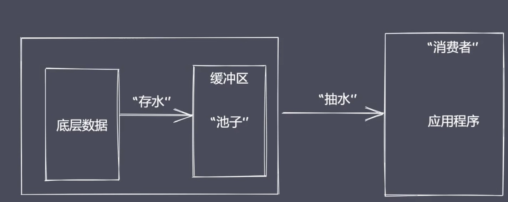

## 流操作
通过流操作数据的方式， 在空间和时间上都会具有明显的效率提升。Node诞生之初就是为了解决IO密集型的Web性能问题，其中最常用的两个模块`文件操作系统`和`网络模块`都实现了流接口

Node.js中的流就是处理流式数据的抽象接口，Node.js里的stream模块则提供了用于实现流接口的对象。

## 为什么使用流来处理数据
假设我们当前需要通过网络来观看一部高清电影，大小是1G。首先服务端会从服务器的磁盘中读取1G的内容，然后通过网络传输到客户端，最后客户端执行下载并播放。如果服务端在读取磁盘文件的时候采用的是read file这样的方式，至少存在两个常见的问题：
- 同步读取资源文件，用户需要等待数据读取完成。
- 资源文件最终一次性加载至内存，开销较大。

我们可以使用流操作解决上面的问题：

流操作的优势：
- 时间效率：流的分段处理可以同时操作多个数据chunk
- 空间效率：同一时间流无须占据大内存空间
- 使用方便：流配合管道，扩展程序变得简单

## Node.js中流的分类
- Readable：可读流，能够实现数据的读取
- Writable：可写流，能够实现数据的写操作。
- Duplex：双工流，既可读又可写。