## Node.js架构

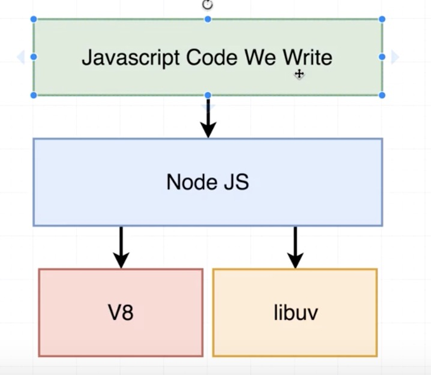

- 最上层是我们自己写的javascript代码
- 中间的NodeJS层是Node提供给我们的一些内置模块，比如fs、path等。
- v8引擎。开源的js引擎。能够在浏览器之外执行javascript代码。因此这里是真正执行我们自己写的javascript代码的地方
- libuv库。C++开源项目，允许node.js访问操作系统、底层文件系统。允许访问网络，还可以处理并发性

那为什么要用中间的NodeJS层呢？为什么不直接使用v8或者libuv呢？

首先要了解的是，在内部，v8和libuv几乎很少包含js代码，基本都是C++代码。因此作为javascript开发人员，我们可能并不希望全部编写C++代码。如下图所示

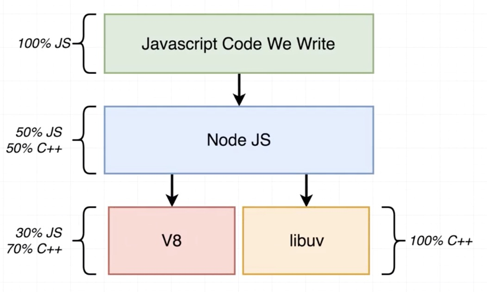


这就是Nodejs的目的之一，提供给我们一个很好的接口来关联我们项目中的javascript到运行在我们计算机上的C++去实际解释和执行。


另外，Nodejs提供了一些内置模块，比如http、fs、crypto、path等模块。这些模块都有非常一致的API。他们最终都引用了libuv库中相关的功能

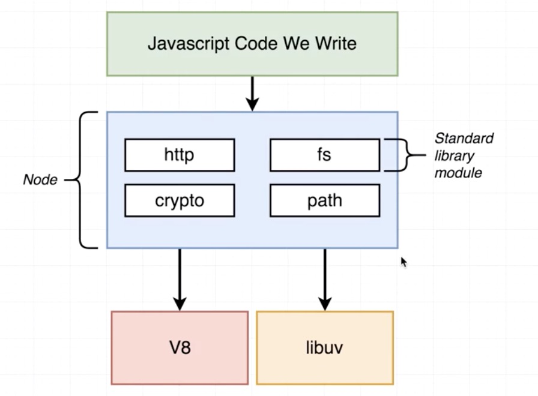


因此，我们可能不想直接访问C++代码，我们希望在项目中使用javascript函数。通过Node.js，我们不必直接访问libuv库中的C++代码


## Node.js模块实现
以Nodejs内置模块crypto中的pbkdf2函数为例：

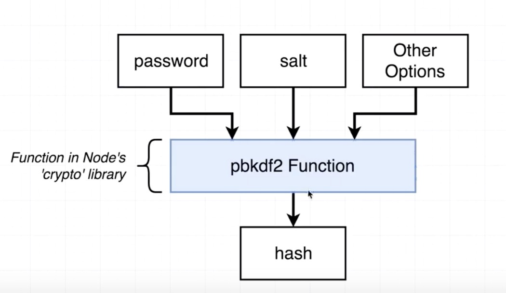

通过查看这个函数的源码，我们可以了解Node.js如何在内部使用libuv库以及v8引擎

pbkdf2.js源码在[https://github.com/nodejs/node/blob/main/lib/internal/crypto/pbkdf2.js](https://github.com/nodejs/node/blob/main/lib/internal/crypto/pbkdf2.js)

这里简单介绍下Nodejs源码项目目录

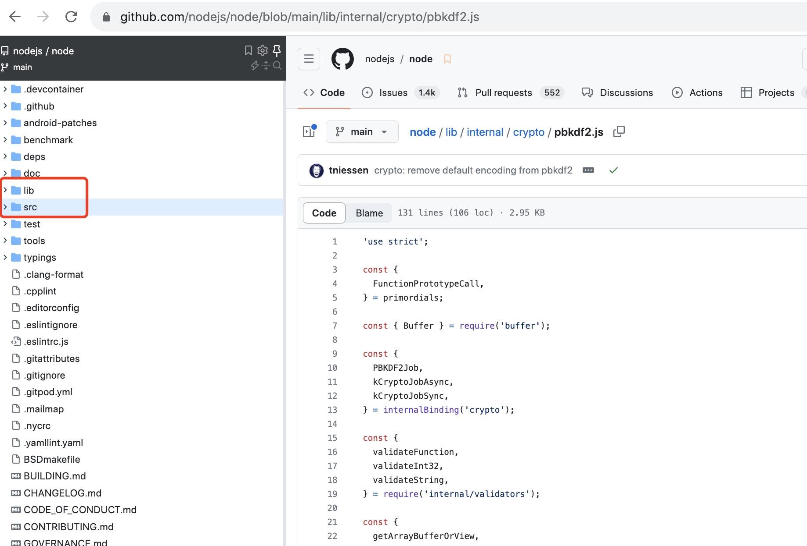

这里最重要的就是lib和src目录，其中：
- lib存放的是Node.js内置模块的源码，比如fs、path等模块的源码。
- src目录是lib中所有函数的C++实现。

通过查看pbkdf2.js中pbkdf2函数的实现可以发现：

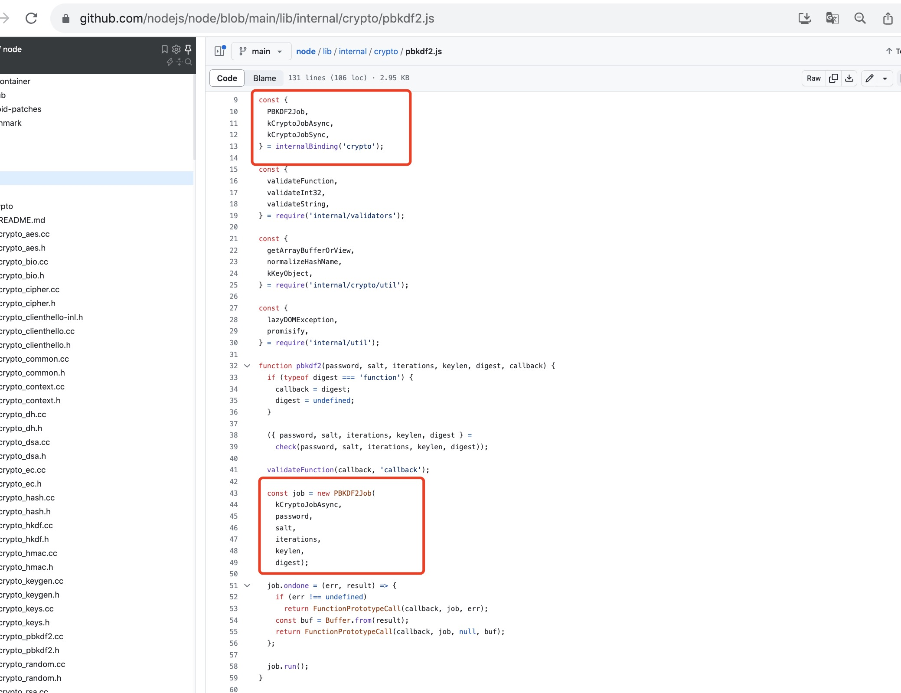

PBKDF2Job就是pbkdf2的C++实现。

internalBinding就是nodejs将js和c++联系起来的地方，是js和c++的桥梁。

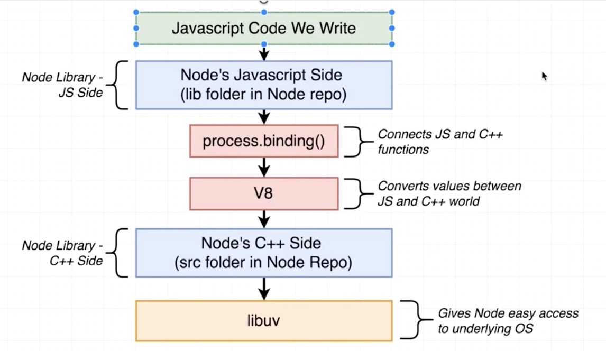

下面是node crypto模块的全部C++实现代码

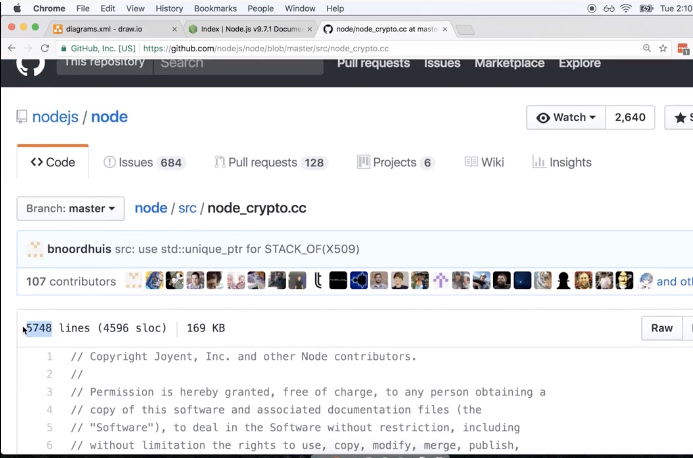

下面是PBKDF2函数导出的地方

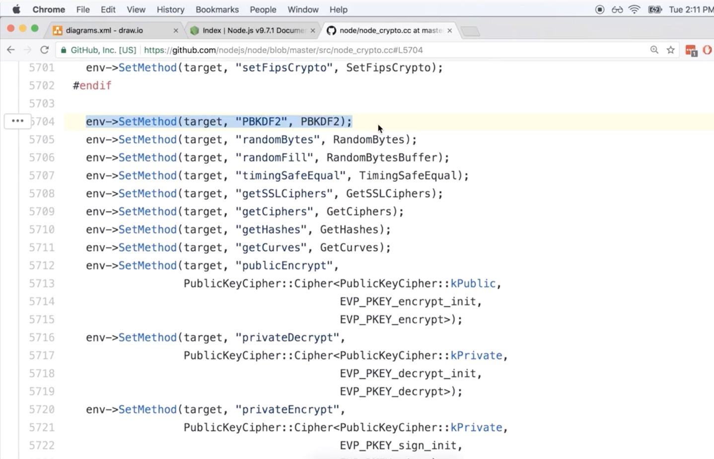

PBKDF2实现的地方：

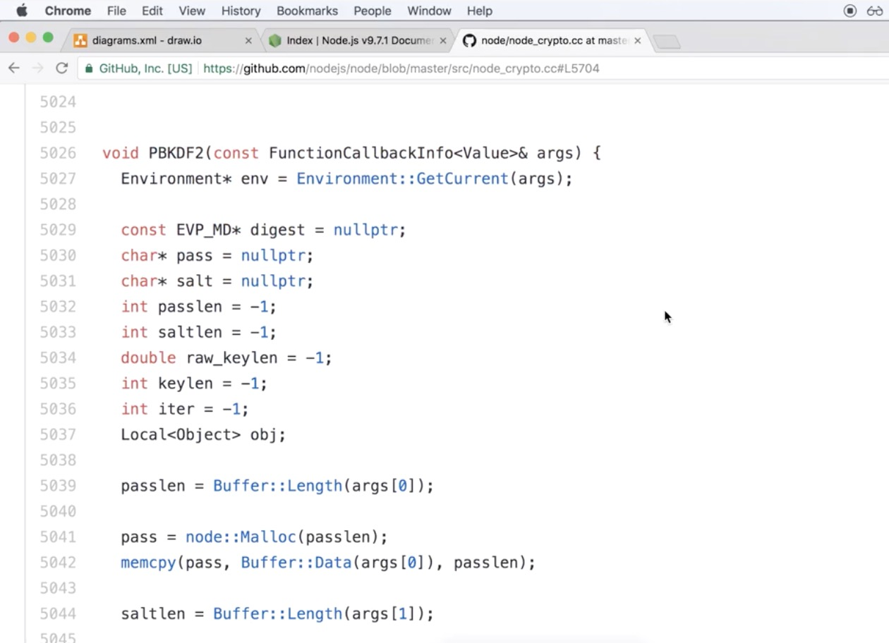


## 线程
与线程有关的最重要的是调度。操作系统能够决定在任何给定时刻及时处理哪个线程

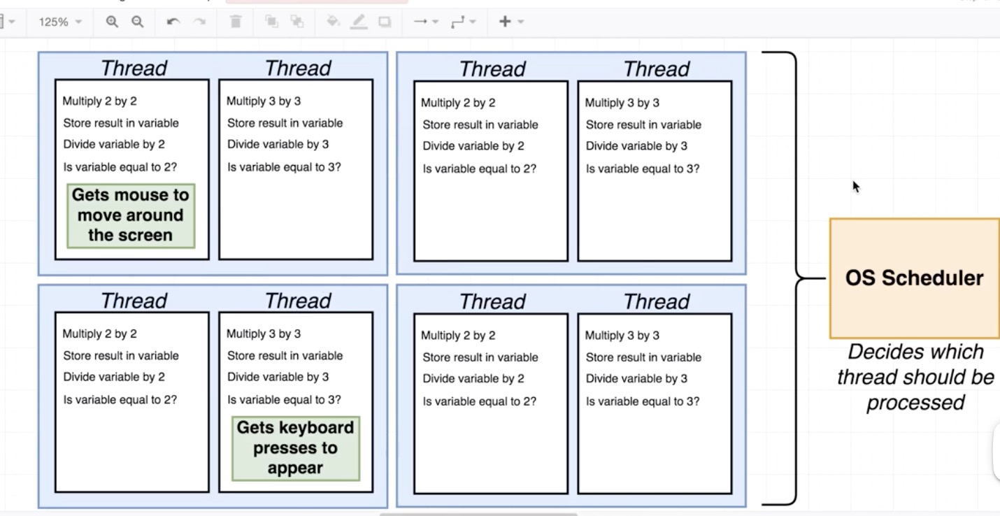

CPU每秒能处理的指令是有限的。需要确保紧急线程不必等待太长时间才能执行。

为了更快地处理线程或在给定时间处理更多线程，我们可以使用多核CPU

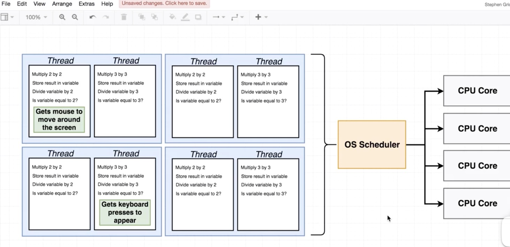

从技术上讲，一个内核可以处理多个线程。但这解决不了优先级的问题。


如下所示，有两个线程，它们都在竞争处理能力

线程1有一组指令想要从硬盘上读取文件，然后计算文件里面的字符数。

线程2需要计算3乘以3

从硬盘读取或者写入数据，称之为IO。IO操作是非常耗时的。在IO阶段，CPU等待硬盘读取文件并返回内容。在这段时间内，线程1无法处理其他任务，一直在等待硬盘读取完成。操作系统调度程序能够检测到这一段暂停时间或者两个指令之间的暂停时间，它可以决定暂停第一个线程，然后执行线程2。线程2执行完成后就可以继续执行线程1。

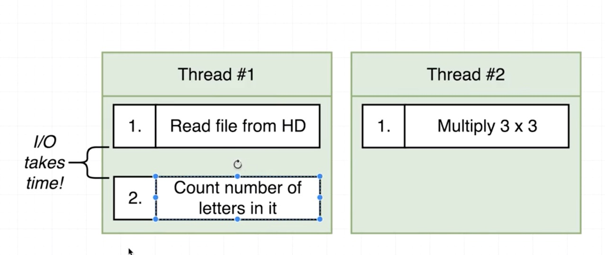


因此，有两种方式可以提高我们的处理速度：

- 1.使用多核CPU
- 2.允许操作系统调度程序检测较大的暂停，比如IO


## 事件循环

当我们启动一个node应用程序时，node会创建一个线程，执行我们所有的代码。这个线程就是我们所说的主线程，也叫事件循环线程。

详情可以点击[这里](https://nodejs.org/zh-cn/docs/guides/dont-block-the-event-loop)查看


我们可以将事件循环看作是一个控制结构，它决定应该执行什么操作。了解事件循环的工作方式是极其重要的，因为node的许多性能问题最终都归结为事件循环的行为方式。因此，从本质上讲，如果我们理解事件循环机制，那么就可以很好的理解nodejs中的性能问题

可以通过伪代码的方式理解事件循环。每次事件循环在我们的node应用程序中运行时，我们称之为一tick。


事件循环伪代码：

```js
// node myFile.js


// New timers，tasks，operations are recorded from myFile running
// 因此如果我们的myFile文件中使用了http服务监听请求，那么我们的程序将不会退出。
myFile.runContents();

const pendingTimers = [];
const pendingOSTasks = [];
const pendingOperations = [];

// 在shouldContinue函数中，nodejs将执行三个单独的检查以决定事件循环是否应该继续。
function shouldContinue(){
    // Check one: Any pending setTimeout，setInterval，setImmediate 首先，先检查是否有setTimeout、setInterval、setImmediate注册的回调函数
    // Check two: Any pending OS tasks?(Like server listening to port) 其次，检查是否有任何挂起的操作系统任务。比如检查是否服务器仍在监听传入的请求。
    // Check three：Any pending long running operations?(Like fs module) 。检查是否存在长时间运行的操作。和第二次检查有点类似。但两者之间有明显的区别。长时间运行的操作的示例：FS模块的回调函数
    return pendingTimers.length || pendingOSTasks.length || pendingOperations.length
}
// shouldContinue返回true时，事件循环将继续运行。返回false时，事件循环将结束，程序执行到底部，并退出
// Entire body executes in one 'tick'
while(shouldContinue()){
    // 1.Node looks at pendingTimers and sees if any functions are ready to be called. setTimeout，setInterval

    // 2.Node looks at pendingOSTasks and pendingOperations and calls relevant callbakcs

    // 3.Pause execution。Continue when... (暂停执行，在暂停期间，node等待新的事件发生。node just sits around and got no other work to do，it just going to waint until it see):
    //      - a new pendingOSTask is done. Like a new request has come in one some port that we are listening to.
    //      - a new pendingOperation is done. Like we fetch some file of the hard drive
    //      - a timer is about to complete. Like a timer for one of the setTimeout or setIntervals is about to 
    // expire and the relevant function needs to be called
    // Then once that pause is complete bacause we presumably see that something is 
    // about to occur we then continue with the last two steps inside of the event loop

    // 4. Look at pendingTimers. Call any setImmediate

    // 5. Handle any 'close' events.本质上讲，事件循环中的最后一步只是处理清理代码和清理
}


// exit back to terminal


```
