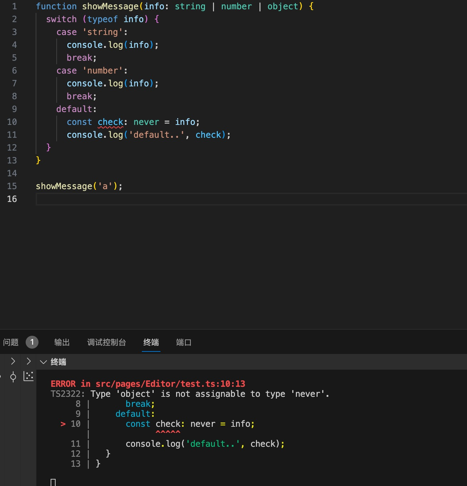

## 简介

在 TypeScript 中，`never`类型表示那些永远不会发生的值的类型。`never`类型是一个底层类型，它是其他类型的子类型，但没有任何类型是`never`的子类型。这意味着我们可以将`never`类型分配给任何其他类型，但不能将其他类型分配给`never`类型

`never` 通常应用于以下几个业务场景：

## 异常抛出

用于函数抛出异常：当一个函数内部抛出异常时，它的返回类型可以声明为`never`。这表示该函数在正常情况下不会返回任何值，而是会抛出一个异常。例如：

```typescript
function throwError(message: string): never {
  throw new Error(message);
}
```

## 无限循环

无限循环：当一个函数包含一个无限循环时，它的返回类型可以声明为`never`。这表示该函数永远不会返回，因为它会一直在循环中执行。例如：

```typescript
function infiniteLoop(): never {
  while (true) {
    // do something
  }
}
```

## 类型推断的辅助类型

比如可以用于 switch 语句中，假设有个需求，需要对传入的类型都必须进行处理：

```js
function showMessage(info: string | number) {
  switch (typeof info) {
    case "string":
      console.log(info);
      break;
    case "number":
      console.log(info);
      break;
    default:
    //....
  }
}
function showMessage(info: string | number) {
  console.log(info);
}
showMessage("字符串");
showMessage(123);
```

如果 showMessage 再增加一个类型，比如：

```js
function showMessage(info: string | number | object) {
  switch (typeof info) {
    case 'string':
      console.log(info);
      break;
    case 'number':
      console.log(info);
      break;
    default:
      console.log('default');
  }
}
```
虽然我们入参添加了`object`类型，但是switch语句没有提示，虽然代码能正常运行，但不符合我们的预期。我们需要每添加一种类型时，如果switch没有对应的处理分支，则报错。
```js
function showMessage(info: string | number | object) {
  switch (typeof info) {
    case 'string':
      console.log(info);
      break;
    case 'number':
      console.log(info);
      break;
    default:
      const check: never = info;
      console.log('default..', check);
  }
}

showMessage('a');

```

此时就会报错：

```bash
TS2322: Type 'object' is not assignable to type 'never'.
```

