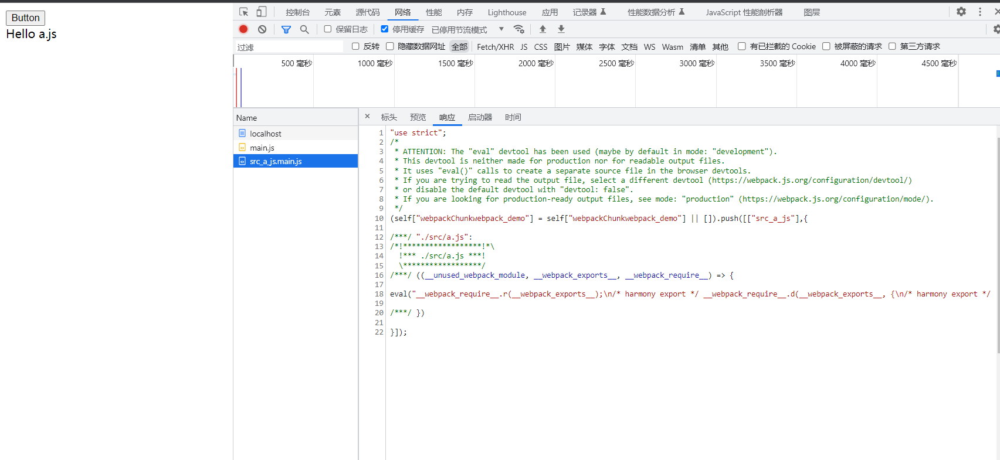
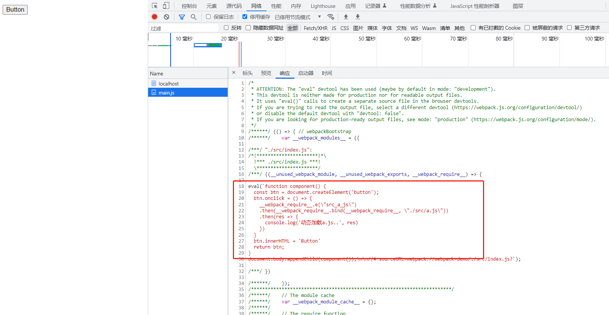

## 前言

在平时的开发中，我们经常使用 import()实现代码分割和懒加载。在低版本的浏览器中并不支持动态 import()，那 webpack 是如何实现 import() polyfill 的？

## 原理分析

我们先来看看下面的 demo

```js
function component() {
  const btn = document.createElement("button");
  btn.onclick = () => {
    import("./a.js").then((res) => {
      console.log("动态加载a.js..", res);
    });
  };
  btn.innerHTML = "Button";

  return btn;
}

document.body.appendChild(component());
```

点击按钮，动态加载 `a.js`脚本，查看浏览器网络请求可以发现，`a.js`请求返回的内容如下：



简单看，实际上返回的就是下面这个东西：

```js
(self["webpackChunkwebpack_demo"] =
  self["webpackChunkwebpack_demo"] || []).push([
  ["src_a_js"],
  {
    "./src/a.js": () => {},
  },
]);
```

从上面可以看出 3 点信息：

- 1.webpackChunkwebpack_demo 是挂到全局 window 对象上的属性
- 2.webpackChunkwebpack_demo 是个数组
- 3.webpackChunkwebpack_demo 有个 push 方法，用于添加动态的模块

再来看看 main.js 返回的内容



仔细观察，动态 import 经过 webpack 编译后，变成了下面的一坨东西：

```js
__webpack_require__
  .e("src_a_js")
  .then(__webpack_require__.bind(__webpack_require__, "./src/a.js"))
  .then((res) => {
    console.log("动态加载a.js..", res);
  });
```

上面代码中，`__webpack_require__` 用于执行模块，比如上面我们通过`webpackChunkwebpack_demo.push`添加的模块，里面的`./src/a.js`函数就是在`__webpack_require__`里面执行的。

`__webpack_require__.e`函数就是用来动态加载远程脚本。因此，从上面的代码中我们可以看出：

- 首先 webpack 将动态 import 编译成 `__webpack_require__.e` 函数
- `__webpack_require__.e`函数加载远程的脚本，加载完成后调用 `__webpack_require__` 函数
- `__webpack_require__`函数负责调用远程脚本返回来的模块，获取脚本里面导出的对象并返回

## 源码分析及实现

### 动态加载远程模块的函数

在开始之前，我们先来看下如何使用 script 标签加载远程模块

```js
var inProgress = {};
// url: "http://localhost:8080/src_a_js.main.js"
// done: 加载完成的回调
const loadScript = (url, done) => {
  if (inProgress[url]) {
    inProgress[url].push(done);
    return;
  }
  const script = document.createElement("script");

  script.charset = "utf-8";
  script.src = url;

  inProgress[url] = [done];
  var onScriptComplete = (prev, event) => {
    var doneFns = inProgress[url];
    delete inProgress[url];
    script.parentNode && script.parentNode.removeChild(script);
    doneFns && doneFns.forEach((fn) => fn(event));
    if (prev) return prev(event);
  };

  script.onload = onScriptComplete.bind(null, script.onload);
  document.head.appendChild(script);
};
```

`loadScript(url, done)` 函数比较简单，就是通过创建 script 标签加载远程脚本，加载完成后执行 done 回调。`inProgress`用于避免多次创建 script 标签。比如我们多次调用`loadScript('http://localhost:8080/src_a_js.main.js', done)`时，应该只创建一次 script 标签，不需要每次都创建。这也是为什么我们调用多次 `import('a.js')`，浏览器 network 请求只看到家在一次脚本的原因

实际上，这就是 webpack 用于加载远程模块的极简版本。

### \_\_webpack_require\_\_.e 函数的实现

首先我们使用`installedChunks`对象保存动态加载的模块。key 是 chunkId

```js
// 存储已经加载和正在加载的chunks，此对象存储的是动态import的chunk，对象的key是chunkId，值为
// 以下几种：
// undefined: chunk not loaded
// null: chunk preloaded/prefetched
// [resolve, reject, Promise]: chunk loading
// 0: chunk loaded
var installedChunks = {
  main: 0,
};
```

由于 `import()` 返回的是一个 promise，然后`import()`经过 webpack 编译后就是一个`__webpack_require__.e`函数，因此可以得出`__webpack_require__.e`返回的也是一个 promise，如下所示：

```js
const scriptUrl = document.currentScript.src
  .replace(/#.*$/, "")
  .replace(/\?.*$/, "")
  .replace(/\/[^\/]+$/, "/");

__webpack_require__.e = (chunkId) => {
  return Promise.resolve(ensureChunk(chunkId, promises));
};

const ensureChunk = (chunkId) => {
  var installedChunkData = installedChunks[chunkId];
  if (installedChunkData === 0) return;
  let promise;
  // 1.如果多次调用了__webpack_require__.e函数，即多次调用import('a.js')加载相同的模块，只要第一次的加载还没完成，就直接使用第一次的Promise
  if (installedChunkData) {
    promise = installedChunkData[2];
  } else {
    promise = new Promise((resolve, reject) => {
      // 2.注意，此时的resolve，reject还没执行
      installedChunkData = installedChunks[chunkId] = [resolve, reject];
    });
    installedChunkData[2] = promise; //3. 此时的installedChunkData 为[resolve, reject, promise]

    var url = scriptUrl + chunkId;
    var error = new Error();
    // 4.在script标签加载完成或者加载失败后执行loadingEnded方法
    var loadingEnded = (event) => {
      if (Object.prototype.hasOwnProperty.call(installedChunks, chunkId)) {
        installedChunkData = installedChunks[chunkId];
        if (installedChunkData !== 0) installedChunks[chunkId] = undefined;
        if (installedChunkData) {
          console.log("加载失败.....");
          installedChunkData[1](error); // 5.执行上面的reject，那resolve在哪里执行呢？
        }
      }
    };
    loadScript(url, loadingEnded, "chunk-" + chunkId, chunkId);
  }
  return promise;
};
```

`__webpack_require__.e`的主要逻辑在`ensureChunk`方法中，注意该方法里面的第 1 到第 5 个注释。这个方法创建一个 promise，并调用`loadScript`方法加载动态模块。需要特别主要的是，返回的 promise 的 resolve 方法并不是在 script 标签加载完成后改变。如果脚本加载错误或者超时，会在 loadingEnded 方法里调用 promise 的 reject 方法。实际上，**promise 的 resolve 方法是在脚本请求完成后，在 self["webpackChunkwebpack_demo"].push()执行的时候调用的**

## self["webpackChunkwebpack_demo"].push()

前面我们提到，`a.js`请求返回的内容是一个`self["webpackChunkwebpack_demo"].push()`函数。当请求完成，会自动执行这个函数。实际上，这就是一个 jsonp 的回调方式。该方法的实现如下：

```js
var webpackJsonpCallback = (data) => {
  var [chunkIds, moreModules] = data;

  var moduleId,
    chunkId,
    i = 0;
  for (moduleId in moreModules) {
    // 1.__webpack_require__.m存储的是所有的模块，包括静态模块和动态模块
    __webpack_require__.m[moduleId] = moreModules[moduleId];
  }

  for (; i < chunkIds.length; i++) {
    chunkId = chunkIds[i];
    if (installedChunks[chunkId]) {
      // 2.调用ensureChunk方法生成的promise的resolve回调
      installedChunks[chunkId][0]();
    }
    // 3.将该模块标记为0，表示已经加载过
    installedChunks[chunkId] = 0;
  }
};

self["webpackChunkwebpack_demo"] = [];
self["webpackChunkwebpack_demo"].push = webpackJsonpCallback.bind(null);
```

所有通过`import()`加载的模块，经过 webpack 编译后，都会被 `self["webpackChunkwebpack_demo"].push()`包裹。

## 总结

在 webpack 构建编译阶段，`import()`会被编译成类似`__webpack_require__.e("src_a_js").then(__webpack_require__.bind(__webpack_require__, "./src/a.js"))`的调用方式

```js
__webpack_require__
  .e("src_a_js")
  .then(__webpack_require__.bind(__webpack_require__, "./src/a.js"))
  .then((res) => {
    console.log("动态加载a.js..", res);
  });
```

`__webpack_require__.e()`方法会创建一个 script 标签用于请求脚本，方法执行完返回一个 promise，此时的 promise 状态还没改变。

script 标签被添加到 document.head 后，触发浏览器网络请求。请求成功后，动态的脚本会自动执行，此时`self["webpackChunkwebpack_demo"].push()`方法执行，将动态的模块添加到`__webpack_require__.m`属性中。同时调用 promise 的 resolve 方法改变状态，模块加载完成。

脚本执行完成后，触发 script 标签的 onload 回调。onload 回调主要是用于处理脚本加载失败或者超时的场景，并调用 promise 的 reject 回调，表示脚本加载失败
