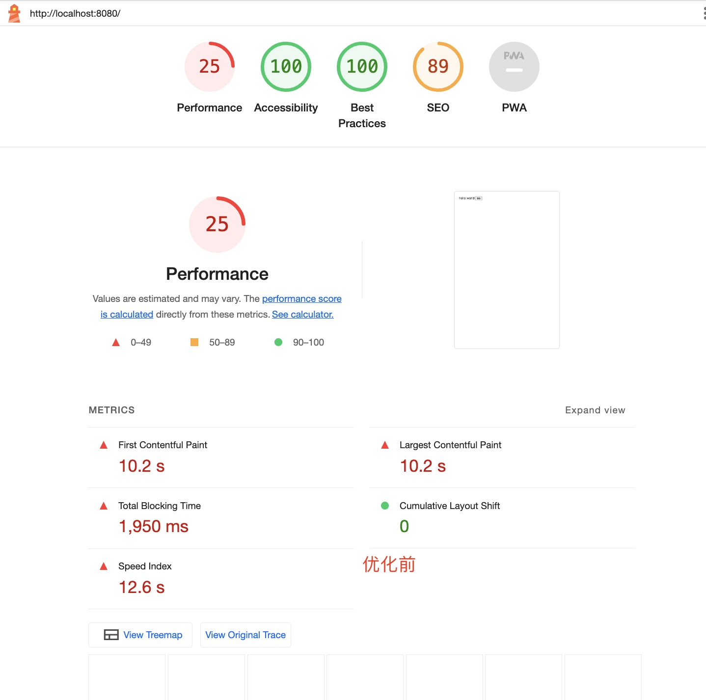
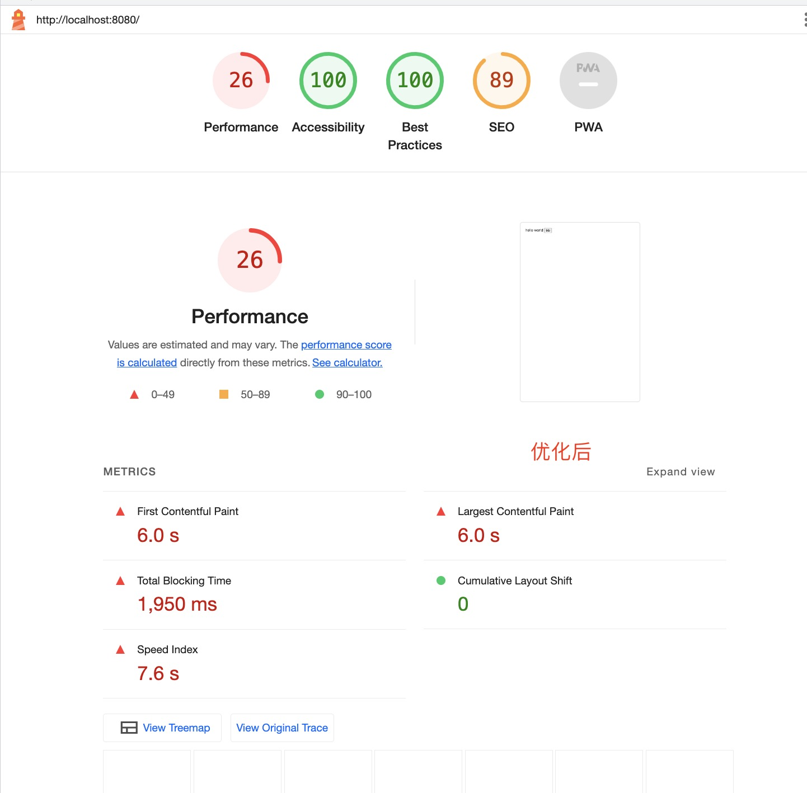
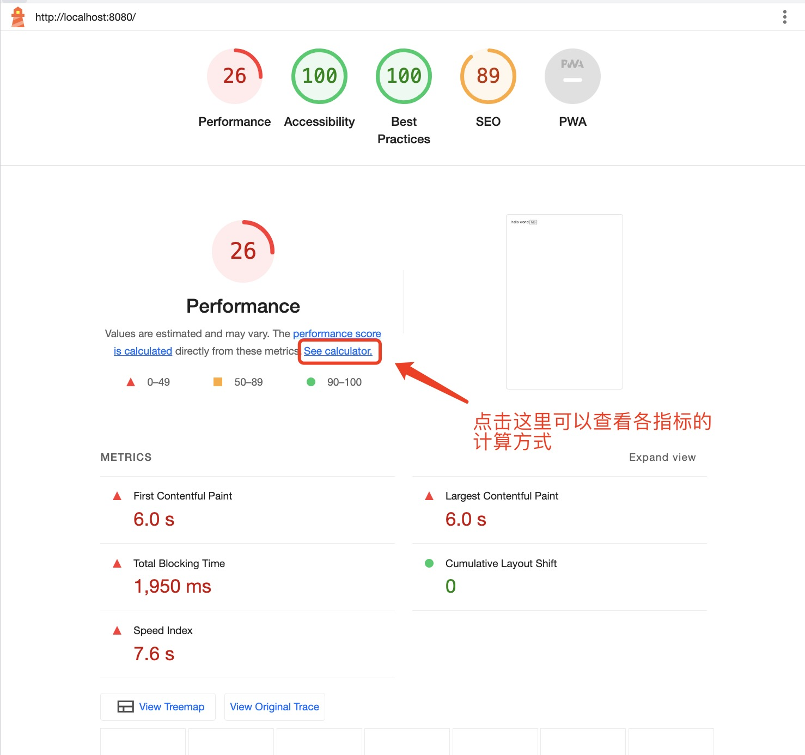
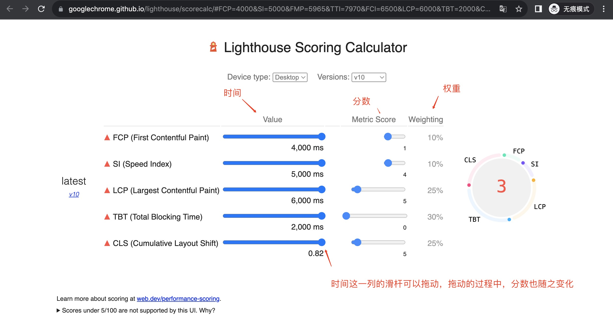
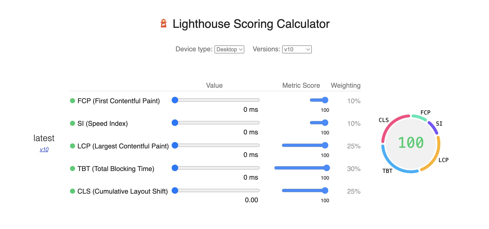

## 前言
我们一般都是用谷歌浏览器自带的`Lighthouse`测试网站的性能。但有时候我们明明已经做了很多优化，并且各项指标已经降下来了，可`Lighthouse`分数却一直没上去，这是为什么？比如下面图示

优化前：



优化后：



可以看出，优化后，FCP、LCP、SI这三个指标的下降幅度非常明显，可以看出优化力度很大，但为什么分数还是26呢？

实际上，这和`Lighthouse`指标计算有关。下面，让我们展开说说

## 大纲
- Lighthouse分数计算
- 实例讲解Lighthouse指标
- 性能预警：如何使用脚本跑分，并实现鉴权

## Lighthouse分数计算

可以从下图所示的地方进去Lighthouse分数计算规则页面。



Lighthouse分数计算规则页面



从上图至少可以得出以下几点结论
- 每个指标的权重不同。总分是根据这些指标的得分加权计算而来的。
- 每个指标的耗时都有最大值，最小值都是0。这个可以从拖动滑杆得知。
    + FCP最大耗时为4000ms。4000ms以及以上，得分为0
    + SI最大耗时为5000ms。5000ms以及以上，得分为0
    + LCP最大耗时为6000ms。6000ms以及以上，得分为0
    + TBT最大耗时为2000ms。2000ms以及以上，得分为0
    + CLS最大为0.82。0.82以及以上，得分为0。
- 各指标如果都是0，则总分满分。表示性能最好




在上面的例子中，优化前
- FCP为10.2秒，远超4000ms，得分为0。
- LCP为10.2秒，远超6000ms，得分同样为0。

优化后
- FCP为6.0秒，减少了4秒，但还是大于4000ms，因此得分还是0
- LCP为6秒，刚好达到最大值，因此得分还是0

因此，虽然我们优化后，各指标下降很明显，视觉上我们的网页显示速度也快了很多，但由于各指标还是超过了最大值，得分依旧是0，加权后总分还是不变。


## 实验讲解Lighthouse指标
以下面的代码为例
```html
<!doctype html>
<html lang="en">

<head>
    <meta charset="utf-8" />
    <title>test</title>
    <meta name="viewport" content="width=device-width, initial-scale=1" />
    <script>
        const startTime = Date.now();
        while (Date.now() - startTime < 11800) { }
    </script>

<body>
    <div id="root">
        hello world
        <button>btb</button>
    </div>
</body>
</html>
```