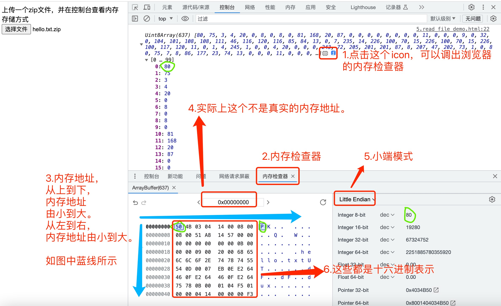
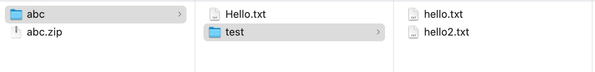
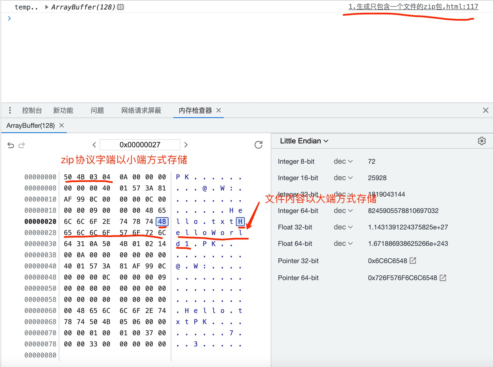

## 前言
前阵子接触了jszip，发现jszip能解析zip包并且可以读取zip包里面的文件内容，顿时就对jszip的原理产生了好奇心。本篇文章就是介绍zip文件格式协议以及js如何生成zip文件。理论上只要熟悉zip文件协议，任何编程语言都能处理zip文件。

可以点击下面的链接体验一下：
- [demo1: js生成包含一个文件的zip包](https://lizuncong.github.io/#/%E5%89%8D%E7%AB%AF%E7%9F%A5%E8%AF%86%E4%BD%93%E7%B3%BB(%E5%85%A8%E9%9D%A2)/%E5%AD%97%E7%AC%A6%E9%9B%86/1.%E7%94%9F%E6%88%90%E5%8F%AA%E5%8C%85%E5%90%AB%E4%B8%80%E4%B8%AA%E6%96%87%E4%BB%B6%E7%9A%84zip%E5%8C%85)
- [demo2: js生成包含一个文件和一个目录（包含一个文件）的zip包](https://lizuncong.github.io/#/%E5%89%8D%E7%AB%AF%E7%9F%A5%E8%AF%86%E4%BD%93%E7%B3%BB(%E5%85%A8%E9%9D%A2)/%E5%AD%97%E7%AC%A6%E9%9B%86/2.%E7%94%9F%E6%88%90%E5%8C%85%E5%90%AB%E4%B8%80%E4%B8%AA%E6%96%87%E4%BB%B6%E5%A4%B9%E7%9A%84zip%E5%8C%85)
- [demo3: js生成包含一个文件和一个目录（包含两个文件）的zip包](https://lizuncong.github.io/#/%E5%89%8D%E7%AB%AF%E7%9F%A5%E8%AF%86%E4%BD%93%E7%B3%BB(%E5%85%A8%E9%9D%A2)/%E5%AD%97%E7%AC%A6%E9%9B%86/3.%E7%94%9F%E6%88%903%E4%B8%AA%E6%96%87%E4%BB%B6%E7%9A%84zip%E5%8C%85)

点击[完整代码](https://github.com/lizuncong/lizuncong.github.io/tree/main/docs/%E5%89%8D%E7%AB%AF%E7%9F%A5%E8%AF%86%E4%BD%93%E7%B3%BB(%E5%85%A8%E9%9D%A2)/%E5%AD%97%E7%AC%A6%E9%9B%86)可以查看所有的代码示例。


## 前置知识
阅读本篇文章，需要对以下知识有一定的了解
- 字符集，特别是UTF-8。详情可以看[这里](https://lizuncong.github.io/#/%E5%89%8D%E7%AB%AF%E7%9F%A5%E8%AF%86%E4%BD%93%E7%B3%BB(%E5%85%A8%E9%9D%A2)/%E5%AD%97%E7%AC%A6%E9%9B%86/%E5%AD%97%E7%AC%A6%E9%9B%86%E5%8F%8A%E7%BC%96%E7%A0%81)。
- 大小端存储。详情可以看[这里](https://lizuncong.github.io/#/%E5%89%8D%E7%AB%AF%E7%9F%A5%E8%AF%86%E4%BD%93%E7%B3%BB(%E5%85%A8%E9%9D%A2)/%E5%AD%97%E7%AC%A6%E9%9B%86/%E5%A4%A7%E5%B0%8F%E7%AB%AF%E5%AD%98%E5%82%A8)

## 如何使用浏览器查看文件在内存中的存储
为了方便演示，我们新建一个hello.txt文件，里面内容为："Hello World"。并使用zip压缩这个文件，如下图所示：


然后我们读取这个文件，我已经写好了一个demo，可以点击[这里](https://lizuncong.github.io/#/%E5%89%8D%E7%AB%AF%E7%9F%A5%E8%AF%86%E4%BD%93%E7%B3%BB(%E5%85%A8%E9%9D%A2)/%E5%AD%97%E7%AC%A6%E9%9B%86/5.read_file_demo)在线体验一下。如下图所示：



从上图中可以看出，我们读取zip文件，并使用Uint8Array输出，即8位无符号整数数组(数组中最大整数只能是255)。文件数据都是以二进制的形式存储，采用UTF-8编码。通过图中内存检查器也可以看到这些二进制数据的十六进制表示方式。比如，数组中第一个整数是80，它的十六进制表示就是50。第二个整数是75，它的十六进制表示是4B。

## zip文件协议

任何格式的文件都有自己的协议。zip文件官方规范可以看[这里](https://pkware.cachefly.net/webdocs/casestudies/APPNOTE.TXT)。从官方文档可以看出，zip文件协议比较复杂。ZIP文件格式可以简单概括如下：

```html
[local file header 1]
[encryption header 1]
[file data 1]
[data descriptor 1] // 用于标识该文件压缩结束。该结构只有在相应的header中通用标记字段的第3位设为1时才会出现，紧接在压缩文件源数据后
   .
   .
   .
[local file header n]
[encryption header n] /// 如果文件有加密的话，必须要有这个头
[file data n]
[data descriptor n]
[archive decryption header]  // 如果中央目录有加密，则必须要有这个头
[archive extra data record]
[central directory header 1]
  .
  .
  .
[central directory header n]
[zip64 end of central directory record]
[zip64 end of central directory locator]
[end of central directory record]
```

这里列出规范中的部分说明：

- zip文件使用.zip或者.zipx后缀。以.jar、.war、.docx、.xlsx、.pptx、.odt、.ods、.odp等作为后缀的文件都是使用zip格式的，遵循zip文件协议规范。从这里可以看出，ppt实际上也是走的zip文件规范。
- ZIP格式协议相关字段都以小端模式存储，除了文件内容以外。具体可以看[4.4  Explanation of fields](https://pkware.cachefly.net/webdocs/casestudies/APPNOTE.TXT)章节

**实际上，只需包含三个基础也可以组成标准zip文件：本地文件头+中央目录头+中央目录记录结尾。**

假设我们有如下所示的abc.zip文件，里面包含三个文件，同时都没有压缩。



那么按照zip规范的**基础要求**，组织起来就是：

```html
[local file header 1] // Hello.txt文件头部
[file data 1] // Hello.txt文件内容

[local file header 2] // test/hello.txt文件头部
[file data 2] // test/hello.txt文件内容

[local file header 3] // test/hello2.txt文件头部
[file data 3] // test/hello2.txt文件内容

[central directory header 1] // Hello.txt文件对应的中央目录头部
[central directory header 2] // test/hello.txt文件对应的中央目录头部
[central directory header 3] // test/hello2.txt文件对应的中央目录头部

[end of central directory record]
```

规范中每个字端的具体含义可以看官方文档的解释。

### local file header（本地文件头）规范
下面是官方文档中关于local file header的协议
```html
local file header signature     4 bytes  (0x04034b50)
version needed to extract       2 bytes
general purpose bit flag        2 bytes
compression method              2 bytes
last mod file time              2 bytes
last mod file date              2 bytes
crc-32                          4 bytes
compressed size                 4 bytes
uncompressed size               4 bytes
file name length                2 bytes
extra field length              2 bytes

file name (variable size)
extra field (variable size)
```
- 1.local file header signature。文件头部标志。固定0x04034b50。但由于zip协议字端都是小端方式存储，因此我们通过内存检查器可以看到实际存储的是504b0304。
- 2.general purpose bit flag。通用标志位。设为0表示不压缩。如果第3位设为1，则必须要有data descriptor。
- 3.compression method。如果通用标志位设置为0，则compression method也设为0表示不压缩。
- 4.crc-32。这里可以使用[在线生成](https://www.23bei.com/tool/231.html)的，随便生成一个就好。
- 5.file name length。文件名长度。
- 6.extra field length。默认设置为0
- 7.时间说明
时间使用last mod file time 和last mod file date表示。以2023年08月01日8点0分0秒为例。last mod file date表示2023年08月01日。last mod file time表示早上8点0分0秒。

日期和时间以标准 MS-DOS 格式编码。
```html
0 - 4    秒 (除以2得到)
5 - 10   分
11 - 15  时
16 - 20  日
21 - 24  月
25 - 31  年 (减去1980年得到)
```
2023年08月01日8点0分0秒表示为：
```js
const lastModFileTime = "\x00\x40" // 01000(8点) 000000(0分) 00000(0秒) => \x40\x00  -> 早上8点0分0秒
const lastModFileDate = "\x01\x57" //  0101011(43) 1000(8) 00001(1) => \x57\x01  -> 2023年8月1日
```
2023年8月1日的十六进制表示为`\x57\x01`，但由于是小端模式存储，因此last mod file date存的是`\x01\x57`
 

>从上面可以看出，一个local file header占据的字节大小：2 * 7 + 4 * 4 + file name size = 30 + file name占据的字节数。记住这个local file header的计算方式，后面要考！！！

我们可以通过[demo1: js生成包含一个文件的zip包](https://lizuncong.github.io/#/%E5%89%8D%E7%AB%AF%E7%9F%A5%E8%AF%86%E4%BD%93%E7%B3%BB(%E5%85%A8%E9%9D%A2)/%E5%AD%97%E7%AC%A6%E9%9B%86/1.%E7%94%9F%E6%88%90%E5%8F%AA%E5%8C%85%E5%90%AB%E4%B8%80%E4%B8%AA%E6%96%87%E4%BB%B6%E7%9A%84zip%E5%8C%85)在线查看zip文件 local file header相关的字端，如下图：




### Central directory structure（中央目录头）规范
```html
central file header signature   4 bytes  (0x02014b50)
version made by                 2 bytes
version needed to extract       2 bytes
general purpose bit flag        2 bytes
compression method              2 bytes
last mod file time              2 bytes
last mod file date              2 bytes
crc-32                          4 bytes
compressed size                 4 bytes
uncompressed size               4 bytes
file name length                2 bytes
extra field length              2 bytes
file comment length             2 bytes
disk number start               2 bytes
internal file attributes        2 bytes
external file attributes        4 bytes
relative offset of local header 4 bytes

file name (variable size)
extra field (variable size)
file comment (variable size)
```

大部分字端和local file header差不多。

这里重点讲解下`relative offset of local header`的含义。这个字端表示local file header的开始位置。以下面例子为例：
```html
[local file header 1] // Hello.txt文件头部
[file data 1] // Hello.txt文件内容

[local file header 2] // test/hello.txt文件头部
[file data 2] // test/hello.txt文件内容

[local file header 3] // test/hello2.txt文件头部
[file data 3] // test/hello2.txt文件内容

[central directory header 1] // Hello.txt文件对应的中央目录头部
[central directory header 2] // test/hello.txt文件对应的中央目录头部
[central directory header 3] // test/hello2.txt文件对应的中央目录头部

[end of central directory record]
```
[central directory header 2]中的`relative offset of local header`存储的是`test/hello.txt`文件头部的开始位置，即[local file header 2]的开始位置，在这里就是 `local file header 1` + `file data 1` 占据的字节大小。

同理[central directory header 3]中的`relative offset of local header`存储的是`test/hello2.txt`文件头部的开始位置，即[local file header 3]的开始位置，在这里就是 `local file header 1` + `file data 1` + `local file header 2` + `file data 2`占据的字节大小。

显然，[central directory header 1]中的`relative offset of local header`存的是0。

>从上面可以看出，Central directory structure占据的字节大小为：2 * 11 + 4 * 6 + file name size = 22 + 24 + 文件名大小

### End of central directory record（中央目录记录结尾）规范
```html
end of central dir signature    4 bytes  (0x06054b50)
number of this disk             2 bytes
number of the disk with the start of the central directory  2 bytes
total number of entries in the central directory on this disk  2 bytes
total number of entries in the central directory           2 bytes
size of the central directory   4 bytes
offset of start of central directory with respect to the starting disk number        4 bytes
.ZIP file comment length        2 bytes
.ZIP file comment       (variable size)
```

- total number of entries in the central directory on this disk。存储的是文件总数
- total number of entries in the central directory。存储的是文件总数
- size of the central directory。中央目录区占据的字节大小。
- offset of start of central directory with respect to the starting disk number。中央目录区开始的位置。


以前面例子为例，`total number of entries in the central directory on this disk`和`total number of entries in the central directory`都是3。`size of the central directory`存的是[central directory header 1]、[central directory header 2]、[central directory header 3]这三个中央目录头部占据的总字节数。`offset of start of central directory with respect to the starting disk number`存的是[central directory header 1]头部的开始位置。


## 实践
上面说了那么多，有点枯燥。下面我们使用示例演示如何使用**本地文件头+中央目录头+中央目录记录结尾**构造一个简单的没有压缩的zip文件。

我们以下图demo为例：


全局变量定义如下：

```js
const fileData = "HelloWorld1\n";
const size = "\x0c\x00\x00\x00"; // 文件内容占据12个字节
const filenameLength = "\x09\x00"; // 文件名称占据9个字节
const fileName = "Hello.txt"; // 文件名称
const relativeOffsetOfLocalHeader = "\x00\x00\x00\x00"; //本地文件头开始位置为0
const lastModFileTime = "\x00\x40"; // 01000(8点) 000000(0分) 00000(0秒) => \x40\x00  -> 早上8点0分0秒
const lastModFileDate = "\x01\x57"; //  0101011(43) 1000(8) 00001(1) => \x57\x01  -> 2023年8月1日

const offsetOfCentralDirectory = "\x33\x00\x00\x00"; // 中央目录开始的位置：51个字节，即第52个字节开始就是中央目录的位置
const sizeOfTheCentralDirectory = "\x37\x00\x00\x00"; // 中央目录占据的字节大小: 55个字节
const totalEntries = "\x01\x00"; // 总共有一个文件
const crc32 = "\x3a\x81\xaf\x99"; // 99af813a   -> 可以使用https://www.23bei.com/tool/231.html在线生成

```


首先构造本地文件头
```js
const localFileHeaderBytes = [
  "PK\x03\x04", // local file header signature 4 bytes  (0x04034b50)
  "\x0A\x00", // version needed to extract 2 bytes 代表待处理压缩文件的级别，比如说有文件夹、内容用XX方式压缩、用XX方式加密等等都是不同的值
  "\x00\x00", // general purpose bit flag 2 bytes 内容的编码格式、是否加密等描述信息
  "\x00\x00", // compression method  2 bytes 压缩方式，默认不压缩
  lastModFileTime, // last mod file time  2 bytes
  lastModFileDate, // last mod file date  2 bytes
  crc32, // crc-32   4 bytes
  size, // compressed size  4 bytes 文件压缩长度信息，如果不做压缩，这里的size均为数据的长度
  size, // uncompressed size  4 bytes
  filenameLength, // file name length  2 bytes
  "\x00\x00", // extra field length  2 bytes extra field length为0，说明没有extra field
  fileName, // file name (variable size)
  // extra field(variable size)由于没有extra field，所以file name后面紧跟着file data
];
```
可以计算出`localFileHeaderBytes`占据的字节数为：30 + 9 = 39


fileData占据12个字节。


然后构造中央目录头
```js
const centralDirectoryStructureBytes = [
  "PK\x01\x02", // central file header signature   4 bytes  (0x02014b50)
  "\x14\x00", // version made by                 2 bytes
  "\x0A\x00", // version needed to extract       2 bytes
  "\x00\x00", // general purpose bit flag        2 bytes
  "\x00\x00", // compression method              2 bytes
  lastModFileTime, // last mod file time              2 bytes
  lastModFileDate, // last mod file date              2 bytes
  crc32, // crc-32                          4 bytes
  size, // compressed size                 4 bytes
  size, // uncompressed size               4 bytes
  filenameLength, //  file name length                2 bytes
  "\x00\x00", // extra field length              2 bytes
  "\x00\x00", // file comment length             2 bytes
  "\x00\x00", // disk number start               2 bytes
  "\x00\x00", // internal file attributes        2 bytes
  "\x00\x00\x00\x00", // external file attributes        4 bytes
  relativeOffsetOfLocalHeader, // relative offset of local header 4 bytes
  fileName, // file name (variable size)
];
```
可以计算出中央目录头占据的字节大小：46 + 9 = 55

最后构造中央目录记录结尾
```js
const endOfCentralDirectoryRecordBytes = [
  "PK\x05\x06", // end of central dir signature    4 bytes  (0x06054b50)
  "\x00\x00", // number of this disk             2 bytes
  "\x00\x00", // number of the disk with the start of the central directory  2 bytes
  totalEntries, // total number of entries in the central directory on this disk  2 bytes
  totalEntries, // total number of entries in the central directory           2 bytes
  sizeOfTheCentralDirectory, // 55 size of the central directory   4 bytes 文件夹头部总长度
  offsetOfCentralDirectory, // 文件内容的长度（local file header + filedata的长度，这里是51） offset of start of central directory with respect to the starting disk number 4 bytes
  "\x00\x00", // .ZIP file comment length        2 bytes
];
```

最后，构造zip文件的基本组成：

```js
const bytes = [
  ...localFileHeaderBytes, // 本地文件头
  fileData, // file data 文件数据
  ...centralDirectoryStructureBytes, // 中央目录头
  ...endOfCentralDirectoryRecordBytes, // 中央目录记录结尾
].join("");
```

这个就是基本的zip文件的字节表示。完整demo可以在[这里]()查看