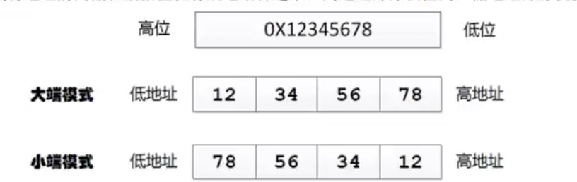

## 字节序与大小端模式

### 大端存储
Big endian。数据的低字节，保存在内存的高地址处。数据的高字节，保存在内存的低地址处。

这样的存储模式有点儿类似于把数据当作字符串顺序处理：地址由小到大增加，而数据从高位到低位放。这种存放方式符合人类的正常思维

### 小端存储
Little endian。数据的低字节，保存在内存的低地址处。数据的高字节，保存在内存的高地址处。

这种存储模式将地址的高低和数据位权有效地结合起来，高地址部分权值高，低地址部分权值低，和我们的逻辑方法一致。

>采用大端方式进行数据存放符合人类的正常思维，而采用小端方式进行数据存放利于计算机处理。到目前为止，采用大端或者小端进行数据存放，其孰优孰劣也没有定论。

>地址小的叫低地址。地址大的叫高地址。对于十进制12345来说，1是高字节，5是低字节。

>我们使用的计算机一般都是小端存储

>注意，字符是只有1个字节，故对于字符不存在大小端模式之分，只有大于1个字节的才分大小端模式
