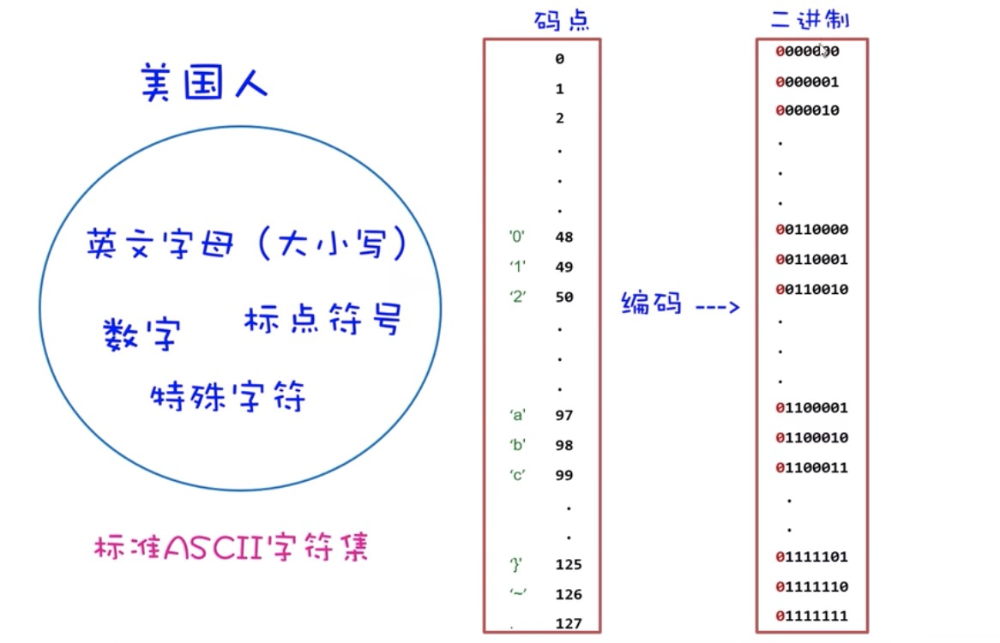
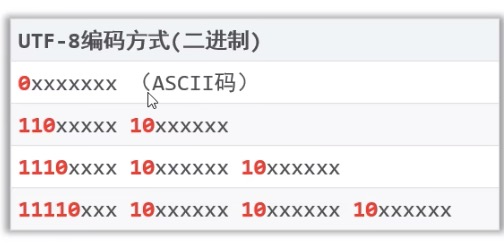

## 常见字符集
ASCII、GBK、UTF-8、编码方案、乱码问题等

如何把字符存储进计算机。

美国人需要存储的字符：英文字母(大小写)、数字、标点符号、特殊字符

字符是不能直接存入计算机的。因此我们需要将这些字符挨个从0开始到127进行编号，总共128个字符。这就是标识ASCII字符集。然后再将0到127转换成对应的二进制数字。0到127就称为码点，对应的二进制就是编码。

当然，0到127编码成二进制还不到8位，计算机底层最少都要存储一个字节，即8位。因此，我们还需要在这些二进制前面补0，让它正好是8位一个字节的形式存储。

因此，ASCII字符集实际上是使用1个字节存储字符。

- 编码：把字符按照指定的字符集编码成字节
- 解码：把字节按照指定字符集解码成字符

### 标准ASCII字符集
ASCII(American Standard Code for Information Interchange)：美国信息交换标准代码，包括了英文、符号等。

标准ASCII字符集使用1个字节存储一个字符，首位是0，总共可表示128个字符，对美国佬来说完全够用

### GBK
汉字内码扩展规范，国标。是一种汉字编码字符集，包含了2万多个汉字等字符，GBK中一个中文字符编码成两个字节的形式存储。

注意：GBK兼容了ASCII字符集。也就是GBK中0到127这128个码点需要和ASCII字符集的码点对应。因此，在GBK中，英文和数字占1个字节，中文占2个字节。

对于字符串“我a你”，用GBK的方式存入计算机，编码后的形式如下：

前两个字节表示“我“，中间一个字节表示”a“，后面两个字节表示“你”。当我们编码后存入计算机，如果读取，又是怎么知道前面2个字节表示“2我”，中间1个字节表示“a”？这就需要从GBK的编码规范说起，GBK规定，**汉字的第一个字节的第一位必须是1**，如下所示：

在解码时，计算机还是会一个一个字节读取，读取第一个字节时，发现第一个字节的第一位是1，那么计算机会连着读取后面一个字节，作为一个整体读取。读取到中间的字节时，发现是0开头，就认为是ASCII字符集，只需要读一个字节。读取到第四个字节时，发现第一位是1，那么就将第4和第5个字节作为整体读取。

>因此，GBK最大能表示的范围就只有15位。

### Unicode字符集(统一码，也叫万国码)
GBK只满足汉字编码，不能满足世界上其他国家的字符需求。因此我们需要一种全世界通用的字符集，即Unicode字符集。

Unicode是国际组织制定的，可以容纳世界上所有文字、符合的字符集。

Unicode字符集也提供了很多编码方案，比如：
- UTF-32。最早提供的方案之一。使用4个字节表示一个字符。字节数固定，编解码方便简单。但是浪费存储空间，通信效率低。比如，ASCII字符集只需要1个字节，但如果采用UTF-32编码方案，就需要往前面手动补3个字节。
- UTF-8

#### UTF-8编码以及乱码问题介绍
Unicode是统一了世界上全部字符的字符集。而UTF-8是Unicode字符集很重要的一种编码方案，也是我们接触的最多的编码方案。

UTF-8是Unicode字符集的一种编码方案，采取可变长编码方案，共分四个长度区：1个字节，2个字节，3个字节，4个字节。

- 英文字符、数字等只占1个字节(兼容标准ASCII编码)，汉字字符占用3个字节。

如何使用UTF-8编码方案对字符串“a我m“进行编码存储？下面是这三个字符在Unicode字符集中的码点(即编号)：

UTF-8编码时，并不是直接将这三个字符的码点对应的二进制位直接编码到底层的。UTF-8编码方式如下：

- 规定ASCII字符直接以一个字节的形式编码，不做任何处理。比如"a"的UTF-8编码为：01100001。而"m"的UTF-8编码为01101101
- 对于两个字节的，第一个字节必须以110开头，第二个字节必须以10开头。
- 对于三个字节的，第一个字节必须以1110开头，第二个和第三个字节必须以10开头
- 对于四个字节的，第一个字节必须以11110开头，后面三个字节都是以10开头。

因此“我”的UTF-8编码就是：11100110 10001000 10010001

综上，字符串"a我m"对应的UTF-8编码为：

01100001 11100110 10001000 10010001  01101101

>技术人员在开发时都应该使用UTF-8编码。

注意：

- 字符编码时使用的字符集，和解码时使用的字符集必须一致，否则会出现乱码
- 英文、数字一般不会乱码，因为很多字符集都兼容了ASCII编码。

#### 乱码问题
假设我们使用GBK对字符串"a我m"进行编码存储，然后使用UTF-8进行读取，就会出现乱码：

显然，当我们使用GBK对"a我m"进行编码时，"a"占用1个字节，"我"占用2个字节，"m"占用一个字节。GBK编码后大概是这样子：

0xxxxxxx 1xxxxxxx xxxxxxxx 0xxxxxxx

如果我们使用UTF-8进行解码时，第一个字节可以正常解码为"a"。读取第二个字节时，发现不符合UTF-8的编码规则，因此打印一个？号。读取第三个字节时，发现也不符合UTF-8编码规则，因此打印一个？号。读取第四个字节时，发现符合UTF-8编码规则，因此打印"m"

