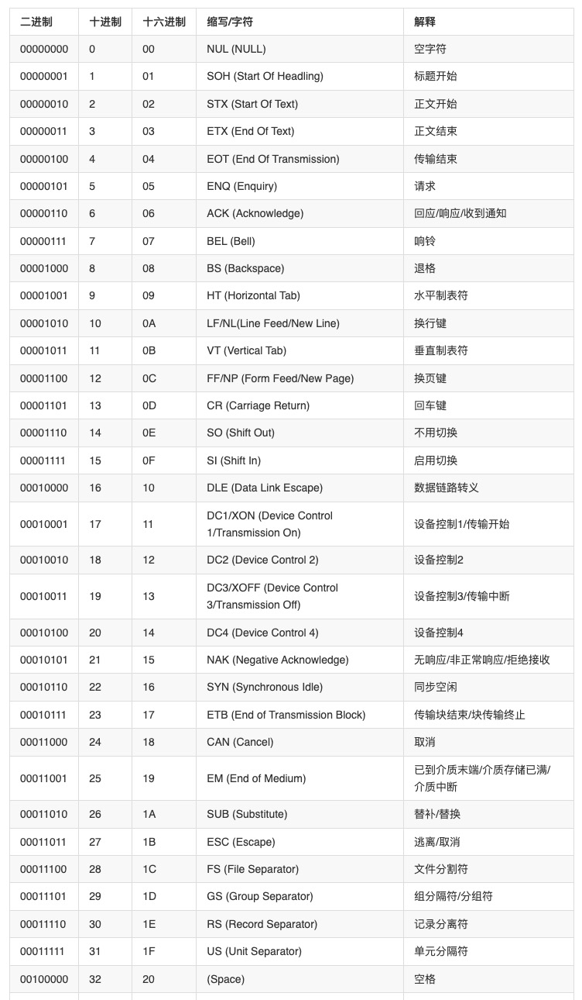

## 通信控制字符
为了避免含混不清和为通信控制字符的使用制定明确留指南，ANSI标准为每个字符下了一个唯一的定义。常见的通信控制字符有零字符，标题开始符，正文开始符，正文结束符，传输结束符，询问字符，肯定字符，报警字符等。

### 传输结束符(eot)
Unicode码点为4。传输结束符是在数据传输过程中用于标志发送结束的特定字符或字符序列。

### 零字符(null)
Unicode码点为0。当不存在数据时，零字符（NUL）用来在磁带上填充时间或填充空间。

### 标题开始符(soh)
Unicode码点为1。标题开始符(SOH)用来表示包含地址或容纳信息字符按序开始，SOH是用于双同步通信控翩协议数据流留通信控制字符，以表示信息标题数据块开始。网络中的各站检验紧跟在这个字符后的数据，以确定它们是否应该接收标题后面的数据。实质上，对网络中各站而言，此信号的作用是“听听看是否呼叫你的名字"。
### 正文开始符(stx)
Unicode码点为2。正文开始符（STX）用于双同步通信协议，它表示标题数据结束和信息数据开始。
### 正文结束符(etx)
Unicode码点为3。正文结束符(ETX)是一个双同步通信协议信号，该信号通知接收机所有信息数据都已发送完毕。ETX字符也可用来告诉用于检测通信错误的数据块校验字符已开始。
### 询问符(enq)
Unicode码点为5。询问符(ENQ)用来请求通信接收站的应答信号。它可用来获得对设备的识别，或用来确定数据传输的状态。有些IBM个人计算机异步通信软件包在协议文件传送中使用此字符。为应答ENQ字符已收到，可能要求接收设备以成功接收到的前一个数据块号来应答。ENQ的这种非标准的应用简化了未被目标设备正确接收到的数据块的重发过程。
### 肯定符(ACK)
Unicode码点为6。肯定符(ACK)用来检验发送器与接收器之间的通信是否正确无误。ACK字符的一种应用是检测数据传输的错误。接收器收到一个数据块之后，可能要向发送器发送一个ACK字符，以指明差错校验字符或信息字符无传输错误。发送器要收到ACK字符后才能发送其它数据。
### 否定符(nak)
Unicode码点为21。否定符(NAK)用来表明发送器与接收器之间通信有错。该字符通常由接收器发出，以便在差错检验表明数据传输有误时，启动数据的重发过程。ENQ、ACK和NAK这些字符通常一起用于协议数据传输，这样用户才不需要进行人机对话。这些信号发生在两个通信软件包之间，而且当它们被正确执行时，它们对用户是透明的，NAK字符也用于XMOD-EM协议，以通知发送计算机，接收计算机已准备好开始传送文件。
### 告警符(bel)
Unicode码点为7。告警符(BEL)是特殊的ASCII码控制字符，它完成与其名称相一致的功能。该字符可以包括在文本文件中，或者可以在两台设备间传送，以提醒人们注意。当以会话方式发送(靠同时接CTRL和G键来实现)时，BEL字符将使IBM个人计算机的扬声器发出提醒人们注意的告警声。该字符还可以通过BASIC命令LPRINT CHR$(7)被送到IBM个人计算机的打印机上。
### 退格符(bs)
Unicode码点为8。退格符(BS)是一种格式控制符，它甩来对直观显示监视器和打印机的实际打印位置进行控制。BS字符将IBM个人计算机的光标向左边回退一个单位距离(假设执行此回退操作时光标不处于要求的位置上)，并删除应腾空位置上显著的任一个字符。产生BS字符的键有时称之为退格删除键，因为其作用是产生回退动作。BS字符可作为数据进行发送，正像发送其它任何字符那样，但它一般只用于会话方式的彰据传输场合。当字符是被接收而不是打印新的字符时，正确设计的通信软件能完成回退操作

## ASCII码部分特殊字符简介

