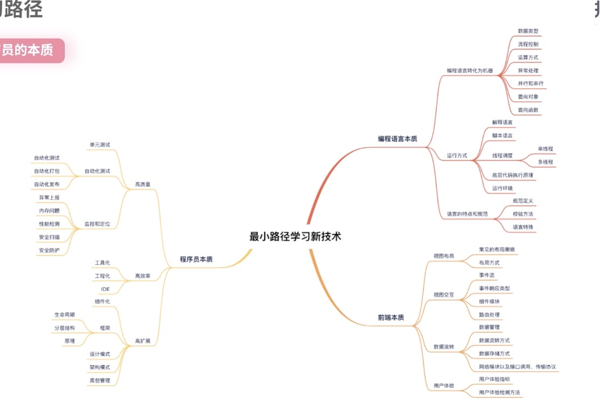

## 如何最小路径学习一门新技术
最小路径，个人理解就是能够从本质出发，剖析技术的所有需要掌握的知识点，提炼出核心的技术实现，只针对这部分核心的知识进行深入学习，并扩充基础技术框架的技能点，达到掌握这门技术的目的的学习路径。

## 技术分类
可以将技术进行分类，每一类技术都有不同的学习方法。
- 编程语言类。PHP、Java、Go、Kotlin、JavaScript、Dart等
- 技术框架类。比如React、Vue。
- 技术服务类。Redis、Kafka、MQ。

接下来可以了解下前两类的学习方法，前两者需要学习的成本和时间都比较多，而技术服务类一般掌握运用起来周期都比较短。

## 编程语言
- 需要掌握哪些基础？
- 编程语言是如何执行的？
- 特点和规范是什么？

假如想学Dart语言。就要先了解它包含的基础数据类型，基础数据类型的声明，基础类型的应用场景。解析来就是流程控制，流程控制对于各种编程语言来说都是非常相似的。比如if..else、for...in、switch。对于这类的知识点尽量学习其与众不同的部分，不用面面俱到，只需要了解其差异点即可。运算方式的话，每种语言也都比较相同。而并行串行，每种语言的处理方式都会不同，你需要深入了解最后的面向对象，面向函数，每门语言也基本相似。

关于如何执行。主要考虑是解释型语言还是脚本类语言？多进程还是单进程？多线程还是单线程、底层的代码机制是如何执行的？举个例子，如果需要学习Go语言，那么你应该了解它是多线程的，并且包含了一个协程。所谓的一个m:n的模型。那么m:n应该如何调度执行？通过探究如何执行的问题，就会去深入了解和学习这门技术的深层次的知识，而不是掌握其命令行的运行方式。

关于语言特点和规范。每门语言都不同。比如JavaScript是弱类型语言。知道这一点后，就要注意弱类型使用时，要对其进行严格的校验，避免异常。

## 前端的本质
- 视图布局
- 视图交互
- 数据流转
- 用户体验

视图布局：学习基础组件，比如form表单，动画等，弹性布局等

视图交互：事件类型、事件响应、事件流。

事件类型包括：点击、滑动、拖拽、输入等事件。

事件响应：路由跳转、数据处理转化、数据提交、事件转发。事件转发就包括冒泡、捕获和委托。

数据流转：网络模块、传输协议、存储和管理本地存储技术、数据的动态响应等等。

网络模块，每个技术都有这个模块，并且都会有一些不同的处理原则，比如同步返回还是异步获取。

传输协议无非就是JSON、XML和Protobuff。当然也存在自定义的消息二进制数据

本地存储技术：localStorage或者indexdb等。

数据响应目前就包含我们比较熟悉的MVVM的VM模块。

用户体验就需要考虑用户体验的指标怎么衡量，比如首屏渲染时长，事件延迟等。那怎么获取这些用户体验的性能指标，并且上报监控呢？这就需要深入学习。

## 程序员的本质
- 高质量。包括单元测试、自动化测试、性能压测工具、性能检测工具。异常检测上报、异常告警、安全扫描、安全保护策略等。有了这些知识，再套用一下新的技术，假如要学习ios开发，那么应该去学习其单元测试的方法。

- 高效率。主要包括工程化(指工程化工具，比如webpack，包括体积优化、打包时间优化方案)和工具化(比如前端技术中的多国家地区多语言、埋点自动化、IDE。。。)

- 高扩展。包括组件化、框架(生命周期、分层结构、原理实现)、设计模式、架构模式(MVC、MVVM、KVO、MVP)、库包管理。

当你学习新技术时，只需要扩充这部分的知识体系就足够了。

以Node.js的学习为例，首先学习Node.js单线程的事件循环原理，这部分就是编程语言的本质中所需要掌握的部分。然后在后台的本质中，用户体验及性能是非常关键的点，所以需要花时间学习性能问题和优化策略。再比如程序员的本质，需要学习框架以及原理、安全、安全检测防护方法以及工具化自动化等等。

在学习一门新的前端或者后台技术时，首先要探索该技术方向的本质特征，在此基础上思考要掌握哪些基础要素，只要把这些基础技术要点掌握后，相信遇到一门新的技术或者新的方向时，只需要在原来的技术面之上，拓展基础技术点就可以了，那样学习速度会快很多。