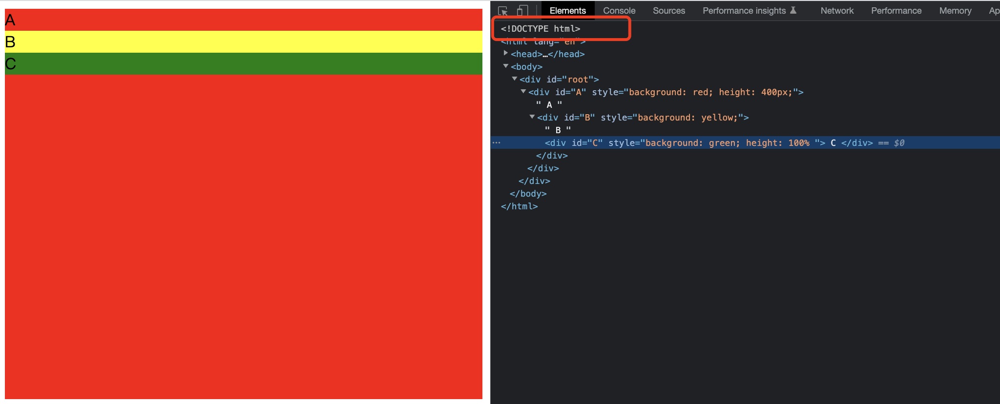
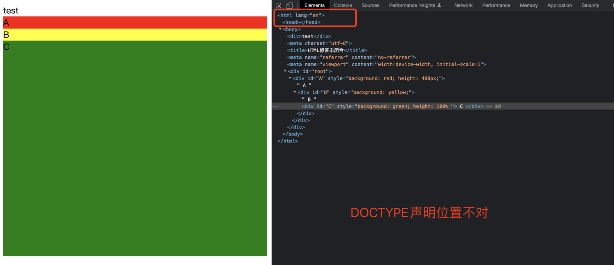
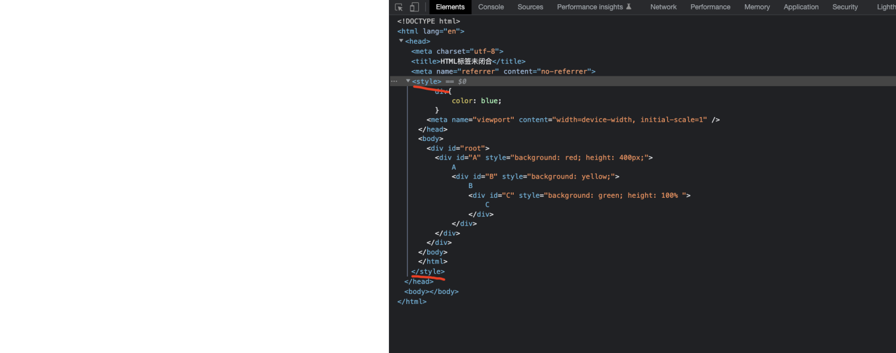
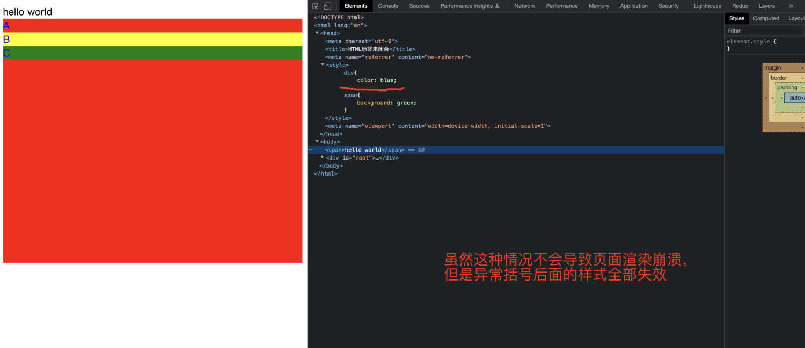
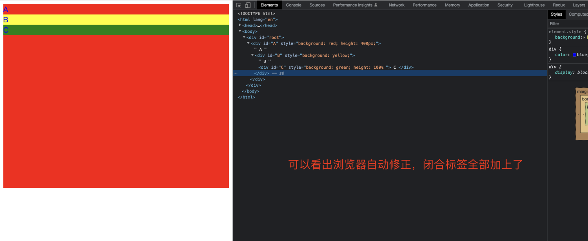

> 总的来说，`<head>`里面的标签，只要不是自闭合的，如果开发者不手动闭合，都会导致页面渲染异常，属于比较严重的。而`<body>`里面的标签，如果不闭合，实际上浏览器会自动修正，不会有什么危害

## DOCTYPE 声明位置不对

`<!DOCTYPE html>`声明一定要放在第一行，如果不放在第一行，会导致浏览器在解析 html 文档时不按标准来，从而出现一些奇奇怪怪的 bug。比如 height: 100%失效。

```html
<!DOCTYPE html>
<html lang="en">
  <head>
    <meta charset="utf-8" />
    <title>HTML标签未闭合</title>
    <meta name="referrer" content="no-referrer" />
    <meta name="viewport" content="width=device-width, initial-scale=1" />
  </head>
  <body>
    <div id="root">
      <div id="A" style="background: red; height: 400px;">
        A
        <div id="B" style="background: yellow;">
          B
          <div id="C" style="background: green; height: 100% ">C</div>
        </div>
      </div>
    </div>
  </body>
</html>
```

正常情况下：div#C 的 height:100%是相对于它的直接父节点，即 div#B。



异常情况，height:100%相对于第一个具有确定高度的祖先元素

```html
<div>test</div>
<!DOCTYPE html>
<html lang="en">
  <head>
    <meta charset="utf-8" />
    <title>HTML标签未闭合</title>
    <meta name="referrer" content="no-referrer" />
    <meta name="viewport" content="width=device-width, initial-scale=1" />
  </head>
  <body>
    <div id="root">
      <div id="A" style="background: red; height: 400px;">
        A
        <div id="B" style="background: yellow;">
          B
          <div id="C" style="background: green; height: 100% ">C</div>
        </div>
      </div>
    </div>
  </body>
</html>
```



## <head>

`<head>`里面那些不支持自闭合的标签，如果忘了闭合，则一律导致页面渲染异常。虽然浏览器会自动修正，但是问题标签后面的内容都被当作字符串处理。这里列举我们常见的标签

### `<title>`标签闭合异常

页面渲染异常

```html
<head>
  <meta charset="utf-8" >
  <title>HTML标签未闭合<title>
  <meta name="referrer" content="no-referrer" >
  <meta name="viewport" content="width=device-width, initial-scale=1" >
</head>
或者
<head>
  <meta charset="utf-8" >
  <title>HTML标签未闭合
  <meta name="referrer" content="no-referrer" >
  <meta name="viewport" content="width=device-width, initial-scale=1" >
</head>
```


### `<script>`标签闭合异常

```html
// 没有闭合
<head>
  <meta charset="utf-8" />
  <title>HTML标签未闭合</title>
  <meta name="referrer" content="no-referrer" />
  <script src="my-js-file.js" defer>
  <meta name="viewport" content="width=device-width, initial-scale=1" />
</head>
// 没有闭合
<head>
  <meta charset="utf-8" />
  <title>HTML标签未闭合</title>
  <meta name="referrer" content="no-referrer" />
  <script src="my-js-file.js" defer><script>
  <meta name="viewport" content="width=device-width, initial-scale=1" />
</head>
// 不支持自闭合
<head>
  <meta charset="utf-8" />
  <title>HTML标签未闭合</title>
  <meta name="referrer" content="no-referrer" />
  <script src="my-js-file.js" defer />
  <meta name="viewport" content="width=device-width, initial-scale=1" />
</head>
```


### `<style>`标签闭合异常

```html
<head>
  <meta charset="utf-8" />
  <title>HTML标签未闭合</title>
  <meta name="referrer" content="no-referrer" />
  <style>
    div{
        color: blue;
    }
  <style>
  <meta name="viewport" content="width=device-width, initial-scale=1" />
</head>
// 闭合标签确实
<head>
  <meta charset="utf-8" />
  <title>HTML标签未闭合</title>
  <meta name="referrer" content="no-referrer" />
  <style>
    div{
        color: blue;
    }
  <meta name="viewport" content="width=device-width, initial-scale=1" />
</head>
```



### `<style>`里面的 class 花括号缺失的情况

```html
<head>
  <meta charset="utf-8" />
  <title>HTML标签未闭合</title>
  <meta name="referrer" content="no-referrer" />
  <style>
    div{
        color: blue;

    span{
        background: green;
    }
  </style>
  <meta name="viewport" content="width=device-width, initial-scale=1" />
</head>
```



### `<body>`

正常情况下，`<body>`里面的标签没闭合，浏览器会自动修正，对页面渲染危害程度极低。特殊情况下，在`<body>`里面插入`<style>`标签，如果`<style>`标签没闭合，会导致页面渲染异常

#### 多个闭合标签缺失的情况

```html
<body>
  <div id="root">
    <div id="A" style="background: red; height: 400px;">
        A
        <div id="B" style="background: yellow;">
            B
            <div id="C" style="background: green; height: 100% ">
                C
            </div>
  </div>
</body>
```

这里，div#A 和 div#B 的闭合标签缺失，页面正常渲染，因为浏览器会自动修正，危害几乎没有


#### `<body>`中插入`<style>`标签但是闭合异常

```html
<body>
  <div id="root">
    <div id="A" style="background: red; height: 400px;">
        A
        <div id="B" style="background: yellow;">
            B
            <style>
                #C{
                    font-weight: 500;
                }
            <div id="C" style="background: green; height: 100% ">
                C
            </div>
        </div>
    </div>
  </div>
</body>
// 或者
<body>
  <div id="root">
    <div id="A" style="background: red; height: 400px;">
        A
        <div id="B" style="background: yellow;">
            B
            <style>
                #C{
                    font-weight: 500;
                }
            <style>
            <div id="C" style="background: green; height: 100% ">
                C
            </div>
        </div>
    </div>
  </div>
</body>
```

#### `<body>`中插入`<script>`标签但是闭合异常

```html
<body>
  <div id="root">
    <div id="A" style="background: red; height: 400px;">
        A
        <div id="B" style="background: yellow;">
            B
            <script>
                console.log('js')
            <script>
            <div id="C" style="background: green; height: 100% ">
                C
            </div>
        </div>
    </div>
  </div>
</body>
// 或者
<body>
  <div id="root">
    <div id="A" style="background: red; height: 400px;">
        A
        <div id="B" style="background: yellow;">
            B
            <script>
                console.log('js')

            <div id="C" style="background: green; height: 100% ">
                C
            </div>
        </div>
    </div>
  </div>
</body>
```

## HTML 未闭合标签检测方案

### DOMParser

```js
let parser = new DOMParser();
const str = `<div> test <div> </div>`;
let doc = parser.parseFromString(str, "text/xml");
console.log(doc);
```


好处就是浏览器原生 API，兼容性较好

坏处就是错误提示不够精确，同时貌似只能以 xml 的标准解析

### [Nu Html Checker](https://validator.github.io/validator/)

源码仓库：[点击这里](https://github.com/validator/validator)
在线检测网址：[点击这里](https://validator.w3.org/nu/#textarea)
支持的参数：[点击这里](https://github.com/validator/validator/wiki/Service-%C2%BB-Common-params)
提供的 HTTP 接口：[点击这里](https://github.com/validator/validator/wiki/Service-%C2%BB-HTTP-interface)

此方法的好处就是 w3c 提供的一个开源检测工具，按照 html 的标准进行校验。坏处就是需要依赖于他们的服务。源码是开源的，或许也可以将服务部署到我们自己的服务器，就摆脱了对他们服务的依赖。我调研了几个比较热门的插件，内部也是通过调这个接口实现的 html 检测

#### html5.validator.nu

```js
const html = `<div> test <div> </div>`;
var formData = new FormData();
formData.append("out", "xml");
formData.append("content", html);
const req = new XMLHttpRequest();
req.onreadystatechange = function () {
  if (req.readyState === 4) {
    const response = JSON.parse(req.responseText);
    console.log("response====", response);
  }
};
// https://validator.w3.org/nu/
// http://html5.validator.nu/
req.open("post", "http://html5.validator.nu/", true);
req.send(formData);
```

#### validator.w3.org

```js
const html = `<style>div color: red}</style> <div id="lzc"> test </div>`;
var formData = new FormData();
formData.append("out", "json"); // xhtml 会提示错误，但不能识别 css，json 可以识别 css 错误
formData.append("parser", "none");
formData.append("level", "error");

// formData.append("css", "yes");
formData.append("content", html);
const req = new XMLHttpRequest();
req.onreadystatechange = function () {
  if (req.readyState === 4) {
    const response = JSON.parse(req.responseText);
    console.log("response====", response);
  }
};
// req.open("post", "http://html5.validator.nu/", true);
req.open("post", "http://validator.w3.org/nu/", true);

req.send(formData);
```
