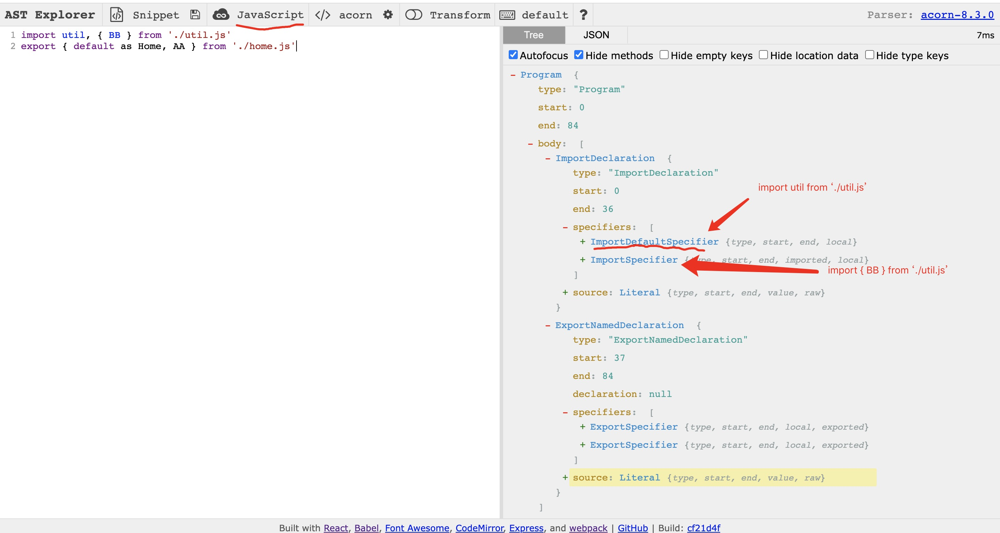
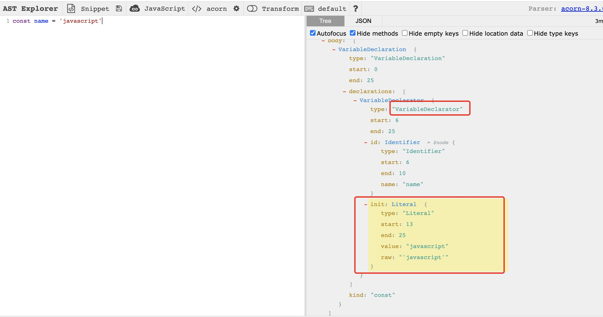
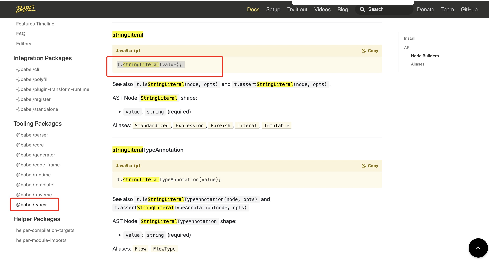

> 本文介绍按需加载原理、babel 插件开发、抽象语法树、如何开发一个加强版的按需引入插件

## 按需加载原理

以 antd 组件库为例，来了解下为什么需要按需加载

antd 通过[index.js](https://github.com/ant-design/ant-design/blob/master/components/index.tsx)文件暴露所有的组件，比如：

```js
export { default as Button } from "./button";
export { default as Input } from "./input";
export { default as Select } from "./select";
export { default as Upload } from "./upload";
// 省略了很多
```

在我们的业务代码中，我们可以通过以下两种方式使用：

- 第一种引入方法

```js
import { Button, Input } from "antd";
```

- 第二种引入方法

```js
import Button from "antd/button";
import Input from "antd/input";
```

那么这两种方法有什么区别呢？

先来看下第一种方法：

- 第一种方法引入的是 `antd/index.js`文件暴露的模块。第三方开发者使用简单，无需关注组件的具体路径。
- 这种方法最大的缺点就是无法做到按需引入。假设我们的项目中只需要 Button 和 Input 组件，理论上打包只需要打包这两个组件的代码即可。但是，这种方式引入的是 `import { Button, Input } from "antd/index.js"`，即`antd/index.js` 文件，又由于这个文件引入了 antd 所有的组件并导出，webpack 在打包 `antd/index.js` 时，就会打包这些所有的组件的代码，造成资源浪费

再来看下第二种方法：

- 第二种方法通过指定组件的具体文件位置，比如 `import Button from "antd/button"; `来引入组件，而无需经过 `antd/index.js` 文件引入。webpack 打包时，只会打包 `antd/button` 组件的代码，即可达到按需加载的目的
- 此方法最大的缺点就是，第三方开发者需要关注组件的文件位置，同时，如果 antd 组件库组件的位置调整，就会给第三方开发者的业务带来风险

那有没有办法，既能兼顾第一种方法的引入方法，又能兼顾按需加载呢？

答案是肯定的，我们可以通过在 webpack 打包时进行特殊处理，写个 webpack loader 进行源码转换

```js
import { Button, Input } from "antd";
```

当我们识别到 `import` 的是 `antd` 的模块时，可以用 loader 将其转换成：

```js
import Button from "antd/button";
import Input from "antd/input";
```

第三方使用者无需关注底层实现细节，而是从构建层面进行转换。这也是[babel-plugin-import](https://github.com/umijs/babel-plugin-import/blob/master/README.md)的基本原理

至于在打包构建时如何识别 import 的是 antd 的模块，还是其他模块，如果你正则很强的话，当然可以通过正则表达式去识别。但首选[抽象语法树](https://github.com/jamiebuilds/babel-handbook/blob/master/translations/zh-Hans/plugin-handbook.md#toc-asts)

## 抽象语法树

抽象语法树的基础知识可以看[这里](https://github.com/jamiebuilds/babel-handbook/blob/master/translations/zh-Hans/plugin-handbook.md#toc-asts)，也可以通过在线的工具[ast explorer](https://astexplorer.net/)体验一下。我们可以看下以下代码转换成抽象语法树是怎样的：

```js
import util, { BB as CC } from "./util.js";
export { default as Home, AA as DD } from "./home.js";
```



### import 语句对应的抽象语法树节点分析

从图中可以看出，`import` 语句对应的节点类型为 `ImportDeclaration`。

注意观察 `import util from './util.js';` 以及 `import { BB as CC} from './util.js';` 这两种引入方式对应的语法树节点有何不同。前者是 `ImportDefaultSpecifier` 类型，并且没有 `imported` 属性。后者是 `ImportSpecifier` 类型，拥有 `local` 以及 `imported` 属性。

`local` 以及 `imported` 的含义是什么？看下面的代码：

```js
import { BB as CC } from "./util.js";
```

这句代码的意思是从 `util.js` 中导入变量 `BB`，并且重命名为 `CC`，可以这样理解：

```js
import { BB } from "./util.js";

const CC = BB;
```

在这里，`CC` 对应的就是 `local`。`BB`对应的就是 `imported`，即 `util.js` 中暴露出的变量名称

### export 语句对应的抽象语法树节点分析

从图中可以看出，`export` 语句对应的节点类型为 `ExportNamedDeclaration`。

```js
export { default as Home, AA as DD } from "./home.js";
```

这句代码和下面的方式等价：

```js
import Home from "./home.js";
import { AA as DD } from "./home.js";
export { Home, DD };
```

export 出去的 `Home` 以及 `DD` 在抽象语法树中都是 `ExportSpecifier` 节点类型，同时拥有 `local` 以及 `exported` 属性。

`local` 表示 `default` 或者 `AA`，`exported` 表示 `Home` 或者 `DD`

## babel 编译原理

babel 在转换我们的源码时，会经过以下步骤：

- 使用 [@babel/parser](https://babeljs.io/docs/en/babel-parser) 读取源代码并转换为抽象语法树，即 AST。
- 其次使用 [@babel/traverse](https://babeljs.io/docs/en/babel-traverse) 遍历抽象语法树，并根据 visitor 修改语法树。开发者可以通过 visitor 接口注册对应的节点类型监听事件
- 最后使用 [@babel/generator](https://babeljs.io/docs/en/babel-generator) 将修改后的抽象语法树转为源代码。

在第二步修改抽象语法树节点时，可以使用 babel 官方提供给我们的 [@babel/types](https://babeljs.io/docs/en/babel-types)工具构建语法树节点。这个工具有点类似于 `Jquery`，可以让我们很方便的构造抽象语法树任何类型的节点，并且检查某一节点的类型。

babel 官方还内置了 [path](https://github.com/jamiebuilds/babel-handbook/blob/master/translations/zh-Hans/plugin-handbook.md#%E8%BD%AC%E6%8D%A2%E6%93%8D%E4%BD%9C)工具用于操作节点，比如删除，插入，更新节点等等。

## babel 插件开发

babel 插件开发可以查看 babel 官方提供的[插件开发指南](https://babeljs.io/docs/en/plugins#plugin-development)以及[babel handbook](https://github.com/jamiebuilds/babel-handbook)。

[编写你的第一个 babel 插件](https://github.com/jamiebuilds/babel-handbook/blob/master/translations/zh-Hans/plugin-handbook.md#toc-writing-your-first-babel-plugin)

`@babel/parser`将源代码转换成抽象语法树，同时提供 visitor 接口给开发者订阅相应的节点类型，当调用`@babel/traverse`遍历抽象语法树时，如果遍历到我们订阅的节点类型，则调用我们的监听事件

以一个简单的逆转变量名称的插件为例：

```js
export default function reverseNamePlugin() {
  return {
    visitor: {
      Identifier(path) {
        const name = path.node.name;
        if (name === "JavaScript") {
          // reverse the name: JavaScript -> tpircSavaJ
          path.node.name = name.split("").reverse().join("");
        }
      },
    },
  };
}
```

然后在 `.babelrc` 文件中使用这个插件：

```json
{
  "plugins": ["./reverse-name-plugin"]
}
```

在`babel`编译过程中，`reverseNamePlugin` 插件会找出所有的名字为 `JavaScript` 变量，并逆转变量名称：

```js
const JavaScript = "hello javascript";
// 经过babel编译，插件转换后变成
const tpircSavaJ = "hello javascript";
```

从`reverseNamePlugin`可以看出，babel 插件就是一个返回对象的普通函数，返回的对象中，必须定义 `visitor` 接口，这也叫做访问者模式。在 `visitor` 接口中，我们可以监听任何抽象语法树节点类型，比如前面介绍的 `ImportDeclaration`、`ExportNamedDeclaration` 等等。然后可以操作抽象语法树的节点，比如替换变量名称等等。babel 在遍历抽象语法树时，如果遍历到我们监听的节点类型，会调用我们在 `visitor` 中注册的监听事件。

babel 插件开发，本质上就是修改抽象语法树的过程，而这离不开 babel 提供给我们的操作抽象语法树的工具 babel/types。

### babel types 的使用

[@babel/types](https://babeljs.io/docs/en/babel-types)

以一个简单的例子说明。假设我们有以下代码，我需要将 `javascript` 在打包时替换成 `typescript`

```js
const name = "javascript";
```

这段代码对应的抽象语法树节点如下：


从图中可以看出，变量声明的类型是`VariableDeclarator`，同时`javascript` 的类型是 `StringLiteral`，因此我们可以在 `visitor` 中监听 `VariableDeclarator` 节点类型，然后判断 `init.value` 如果是 `javascript`，则替换成 `typescript`，实现如下：

```js
function replaceName() {
  return {
    visitor: {
      VariableDeclarator(path) {
        const node = path.node;
        if (node.init.value === "javascript") {
          node.init.value = "typescript";
        }
      },
    },
  };
}
```

如果借助 `@babel/types`，我们可以构造一个 `StringLiteral` 类型的值，并且覆盖 node.init，比如：

```js
function replaceName({ types }) {
  return {
    visitor: {
      VariableDeclarator(path) {
        const node = path.node;
        if (node.init.value === "javascript") {
          node.init = types.stringLiteral("typescript");
        }
      },
    },
  };
}
```

`StringLiteral` 类型的用法可以在 `@babel/types` 文档查看：



babel types 让我们可以很方便的构造抽象语法树的节点类型。

`path`的使用可以参考[文档](https://github.com/jamiebuilds/babel-handbook/blob/master/translations/zh-Hans/plugin-handbook.md#%E8%BD%AC%E6%8D%A2%E6%93%8D%E4%BD%9C)

### 如何使用 babel 转换源码

现在，我们来看下如何开发一个 `transform` 函数，对我们的源代码进行转换。首先安装 `@babel/generator`、`@babel/parser`、`@babel/traverse`、`@babel/types`这几个依赖。

```js
const generator = require("@babel/generator");
const parser = require("@babel/parser");
const traverse = require("@babel/traverse");
const types = require("@babel/types");

function transform(code) {
  const ast = parser.parse(code, {});

  const visitor = {
    Identifier(path) {
      const name = path.node.name;
      if (name === "JavaScript") {
        // reverse the name: JavaScript -> tpircSavaJ
        path.node.name = name.split("").reverse().join("");
      }
    },
  };

  traverse.default(ast, visitor);
  console.log("before transform\n", code);
  const result = generator.default(ast, {}, code);
  console.log("after transform\n", result.code);
}

const code = `const JavaScript = "Hello JavaScript"`;

transform(code);
```

这段代码将所有的名称为 `JavaScript` 的变量逆转成 `tpircSavaJ`，执行这段代码控制台输出：

```js
before transform
 const JavaScript = "Hello JavaScript"
after transform
 const tpircSavaJ = "Hello JavaScript";
```

其中 `parser.parse(code, {})` 第二个参数支持的配置项可以查看[文档](https://babeljs.io/docs/en/babel-parser#options)。`Identifier(path)` 中 `path`的用法可以查看[这里](https://github.com/jamiebuilds/babel-handbook/blob/master/translations/zh-Hans/plugin-handbook.md#%E8%BD%AC%E6%8D%A2%E6%93%8D%E4%BD%9C)

我们加大难度，看看在打包时如何将

```js
import { util } from "./util.js";
```

转换成

```js
import util from "./util.js";
```


从图中可以看出， `util` 对应的抽象语法树节点类型为 `ImportSpecifier`，因此我们需要在 `visitor` 中监听 `ImportSpecifier` 节点。

同时，`import util from "./util.js";` 中的 `util` 对应的节点类型为 `importDefaultSpecifier`，因此我们可以借助 babel/types 生成一个`importDefaultSpecifier`类型的节点，并使用 [path.replaceWith](https://github.com/jamiebuilds/babel-handbook/blob/master/translations/zh-Hans/plugin-handbook.md#%E6%9B%BF%E6%8D%A2%E4%B8%80%E4%B8%AA%E8%8A%82%E7%82%B9)替换节点

```js
ImportSpecifier(path) {
  if (path.node.imported.name === "util") {
    path.replaceWith(types.importDefaultSpecifier(path.node.imported));
  }
}
```

如果我们想要将 `import { util } from "./util.js";` 替换成 `import util from "@/util.js";`，可以监听 `ImportDeclaration` 节点：

```js
ImportDeclaration(path){
    if(path.node.source.value === './util.js'){
        path.node.source.value = '@/util.js'
    }
}
```

源码如下：

```js
const generator = require("@babel/generator");
const parser = require("@babel/parser");
const traverse = require("@babel/traverse");
const types = require("@babel/types");

function transform(code) {
  const ast = parser.parse(code, {
    sourceType: "module",
  });

  const visitor = {
    Identifier(path) {
      const name = path.node.name;
      if (name === "JavaScript") {
        // reverse the name: JavaScript -> tpircSavaJ
        path.node.name = name.split("").reverse().join("");
      }
    },
    ImportSpecifier(path) {
      if (path.node.imported.name === "util") {
        path.replaceWith(types.importDefaultSpecifier(path.node.imported));
      }
    },
    ImportDeclaration(path) {
      if (path.node.source.value === "./util.js") {
        path.node.source.value = "@/util.js";
      }
    },
  };

  traverse.default(ast, visitor);
  console.log("before transform\n", code);
  const result = generator.default(ast, {}, code);
  console.log("after transform\n", result.code);
}

const code = `import { util } from "./util.js";`;

transform(code);
```

## 加强版按需加载插件或者 webpack loader 的开发

### 业务背景

在我们的微前端业务场景中，主应用暴露模块给子应用使用。在子应用的项目中新增一个 remote.js 文件，用于统一收拢引入主应用暴露的远程模块。比如

子应用 A 项目新建一个 remote.js 文件，负责统一引入主应用暴露的远程模块：

```js
export { util } from "shared/util";
export { default as PageLoad, CardLoad } from "shared/PageLoad";
export { useRequest as useCustomRequest, useAnimation } from "shared/hooks";
export { Button, Table } from "shared/Components";
// 省略了其他的共享模块
```

然后在子应用 A 项目的业务代码中，比如 home.js 中，就可以这么引用：

```js
import {
  util,
  PageLoad as LocalPageLoad,
  CardLoad,
  useCustomRequest as LocalCustomRequest,
  useAnimation,
} from "@/remote"; // 远程模块
import LocalModule from "./localModule.js"; // 子应用A项目自身的模块
import { LocalModule2 } from "./localModule2.js"; // 子应用A项目自身的模块
console.log(
  util,
  LocalPageLoad,
  CardLoad,
  LocalCustomRequest,
  useAnimation,
  LocalModule,
  LocalModule2
);
```

这样就可以很方便的使用，同时将远程模块统一管理，后面即使远程模块的路径改变了，比如 `shared/util` 改成 `host/util`，那也只需要在 `remote.js` 中统一修改。

但是，这里又有一个问题，home.js 中没有使用到 `Button` 以及 `Table` 这两个共享模块，由于我们在 home.js 中直接 `import {} from '@/remote.js'` 将整个 remote.js 都引入了，所以 remote.js 里面所有的远程模块都会加载进来，造成资源的浪费。我们需要一种按需加载的方案

因此，我们需要在打包时，转换(修改)源码。我们识别出 `@/remote.js` 的路径，然后替换成真实的远程模块的路径，比如修改后的 home.js 如下：

```js
import { util } from "shared/util"; // 在打包的过程进行转换
import { CardLoad } from "shared/PageLoad"; // 在打包的过程进行转换
import LocalPageLoad from "shared/PageLoad"; // 在打包的过程进行转换
import { useAnimation } from "shared/hooks"; // 在打包的过程进行转换
import { useRequest as LocalCustomRequest } from "shared/hooks";
import LocalModule from "./localModule.js"; // 子应用A项目自身的模块
import { LocalModule2 } from "./localModule2.js"; // 子应用A项目自身的模块
```

这个转换过程，在 webpack loader 处理源码的时候进行。因此我们可以写一个 webpack loader 来进行转换。当然也可以基于 babel loader 提供的插件能力进行转换。

### remote.js 模块收集

为了在子应用的业务代码中进行模块路径转换，比如 home.js 中，为了将 `import { util } from "@/remote.js"; ` 转换成 `import { util } from "shared/util"` ，我们需要收集 `remote.js` 中模块名称和模块路径的信息，比如:

```js
{
  util: {
    name: 'util',
    exportKind: 'value',
    modulePath: 'shared/util'
  }
}
```

我们需要读取子应用 A 项目下的 remote.js 文件，并将源码转换成抽象语法树，方便收集模块信息。getRemoteModulePathMap.js 如下：

```js
const parser = require("@babel/parser");
const traverse = require("@babel/traverse");
const types = require("@babel/types");
const fs = require("fs");
const p = require("path");

module.exports = function getRemoteModulePathMap(code) {
  const remoteModulePathMap = {};
  // 将源码转换成抽象语法树
  const ast = parser.parse(code, {
    sourceType: "module",
    allowImportExportEverywhere: true,
  });
  // 注册节点监听事件
  const visitor = {
    // 监听 export 节点
    ExportNamedDeclaration: (path, state) => {
      const {
        node: { source = {}, specifiers },
      } = path;
      const modulePath = source.value;
      specifiers.forEach((specify) => {
        const { exported, exportKind } = specify;
        remoteModulePathMap[exported.name] = {
          name: exported.name, // 导出的模块名称
          exportKind, // 值：type或者value。正常的模块是value。typescript的类型声明是type
          modulePath, // 模块路径
          specify,
        };
      });
    },
  };
  // 开始遍历
  traverse.default(ast, visitor);
  return remoteModulePathMap;
};
```

### import-path-place 插件实现

```js
const fs = require("fs");
const p = require("path");
const getRemoteModulePathMap = require("./getRemoteModuleMap");
module.exports = function ({ types, ...rest }) {
  let remoteModulePathMap = {};
  function ImportDeclarationVisitor(path, { opts }) {
    const {
      node: {
        source: { value },
        specifiers,
      },
    } = path;
    if (value !== opts.match) return;
    specifiers.forEach((specify) => {
      const importedName = specify.imported.name;
      const realModulePath = remoteModulePathMap[importedName];
      if (!realModulePath) return;
      const realModuleSpecify = realModulePath.specify;
      if (realModuleSpecify.local) {
        if (realModuleSpecify.local.name === "default") {
          specify = types.importDefaultSpecifier(specify.local);
        } else {
          specify.imported = realModuleSpecify.local;
        }
      }
      path.insertBefore(
        types.importDeclaration(
          [specify],
          types.stringLiteral(realModulePath.modulePath)
        )
      );
    });
    path.remove();
  }
  return {
    visitor: {
      Program: {
        enter(path, { opts = {} }) {
          const remoteFile = opts.remoteFile;
          const code = fs.readFileSync(
            p.resolve(__dirname, "../", remoteFile),
            "utf-8"
          );
          remoteModulePathMap = getRemoteModulePathMap(code);
        },
      },
      ImportDeclaration: ImportDeclarationVisitor,
    },
  };
};
```

在 .babelrc 文件中可以这么使用：

```json
{
  "presets": [],
  "sourceType": "module",
  "plugins": [
    [
      "./import-path-replace",
      {
        "match": "@/remote", // 匹配规则
        "remoteFile": "./src/remote.ts" // 远程模块所在的文件路径
      }
    ]
  ]
}
```

### import-path-replace-loader 实现

如果不想使用 babel plugin 的形式，那么我们也可以通过实现 webpack loader 的方式进行模块路径转换

import-path-replace-loader.js：

```js
const generator = require("@babel/generator");
const parser = require("@babel/parser");
const traverse = require("@babel/traverse");
const types = require("@babel/types");
const fs = require("fs");
const p = require("path");
const loaderUtils = require("loader-utils");
const getRemoteModulePathMap = require("./getRemoteModuleMap");
let remoteModulePathMap;

function replace(source) {
  const options = loaderUtils.getOptions(this);
  const cb = this.async();
  if (!remoteModulePathMap) {
    const remoteFile = options.remoteFile;
    const code = fs.readFileSync(remoteFile, "utf-8");
    remoteModulePathMap = getRemoteModulePathMap(code);
  }

  const ast = parser.parse(source, {
    sourceType: "module",
    allowImportExportEverywhere: true,
    // 实际上，模块映射路径替换的loader是在babel loader处理之后执行的，其实这里可以不用再使用typescript处理了
    plugins: ["typescript"],
  });

  const visitor = {
    ImportDeclaration: (path, state) => {
      const {
        node: {
          source: { value },
          specifiers,
        },
      } = path;
      if (value !== options.match) return;
      specifiers.forEach((specify) => {
        const importedName = specify.imported.name;
        const realModulePath = remoteModulePathMap[importedName];
        if (!realModulePath) return;
        const realModuleSpecify = realModulePath.specify;
        if (realModuleSpecify.local) {
          if (realModuleSpecify.local.name === "default") {
            specify = types.importDefaultSpecifier(specify.local);
          } else {
            specify.imported = realModuleSpecify.local;
          }
        }
        path.insertBefore(
          types.importDeclaration(
            [specify],
            types.stringLiteral(realModulePath.modulePath)
          )
        );
      });
      path.remove();
    },
  };

  traverse.default(ast, visitor);
  const result = generator.default(ast, {}, source);
  cb(null, result.code, result.map);
}

module.exports = replace;
```

然后在 webpack config 配置文件中添加一个 loader：

```js
{
  test: /\.(jsx?|tsx?)$/,
  include: [path.resolve(__dirname, './src')], // 只处理子应用下面的模块
  enforce: 'post',
  use: [
    {
      loader: path.resolve(__dirname, './import-path-replace-loader'),
      options: {
        match: '@/remote',
        remoteFile: path.resolve(__dirname, './src/remote.js'),
      },
    },
  ],
}
```
