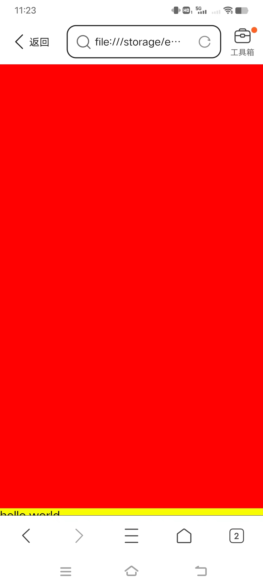
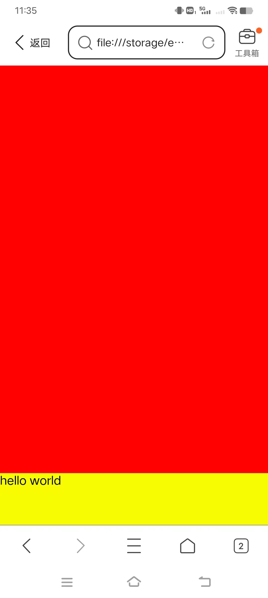

```html
<!DOCTYPE html>
<html lang="en">
  <head>
    <meta charset="utf-8" />
    <meta name="theme-color" content="#000000" />
    <meta
      name="viewport"
      content="width=device-width, initial-scale=1, maximum-scale=1, minimum-scale=1, user-scalable=no"
    />
    <title>底部工具栏遮挡问题测试</title>
    <style>
      body {
        margin: 0;
      }
      #container {
        position: relative;
        height: 100vh;
        background-color: red;
      }
      #bottom {
        position: absolute;
        bottom: 0;
        left: 0;
        right: 0;
        height: 70px;
        background-color: yellow;
      }
    </style>
  </head>
  <body>
    <div id="root">
      <div id="container">
        <div id="bottom">hello world</div>
      </div>
    </div>
  </body>
</html>
```

在移动端显示如下：



可以看出底部工具栏遮挡了 bottom 的内容，导致显示不全。这是因为我们使用了`100vh`，`100vh`在移动端浏览器会有问题。下面改成`100%`就正常了，如下：

```html
<!DOCTYPE html>
<html lang="en">
  <head>
    <meta charset="utf-8" />
    <meta name="theme-color" content="#000000" />
    <meta
      name="viewport"
      content="width=device-width, initial-scale=1, maximum-scale=1, minimum-scale=1, user-scalable=no"
    />
    <title>底部工具栏遮挡问题测试</title>
    <style>
      html,
      body,
      #root {
        height: 100%;
        overflow: hidden;
        margin: 0;
      }
      #container {
        position: relative;
        height: 100%;
        background-color: red;
      }
      #bottom {
        position: absolute;
        bottom: 0;
        left: 0;
        right: 0;
        height: 70px;
        background-color: yellow;
      }
    </style>
  </head>
  <body>
    <div id="root">
      <div id="container">
        <div id="bottom">hello world</div>
      </div>
    </div>
  </body>
</html>
```


