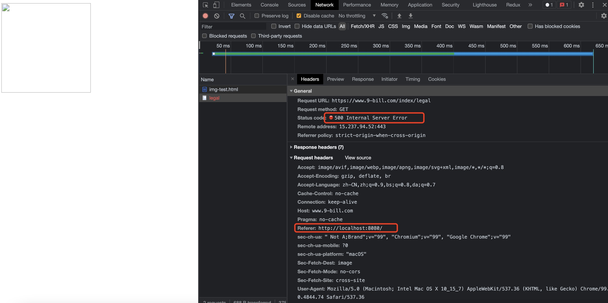
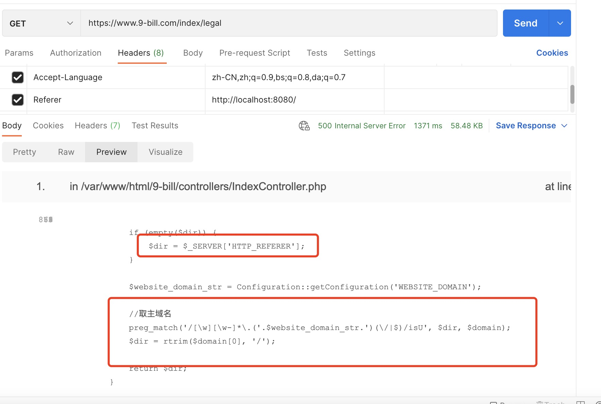
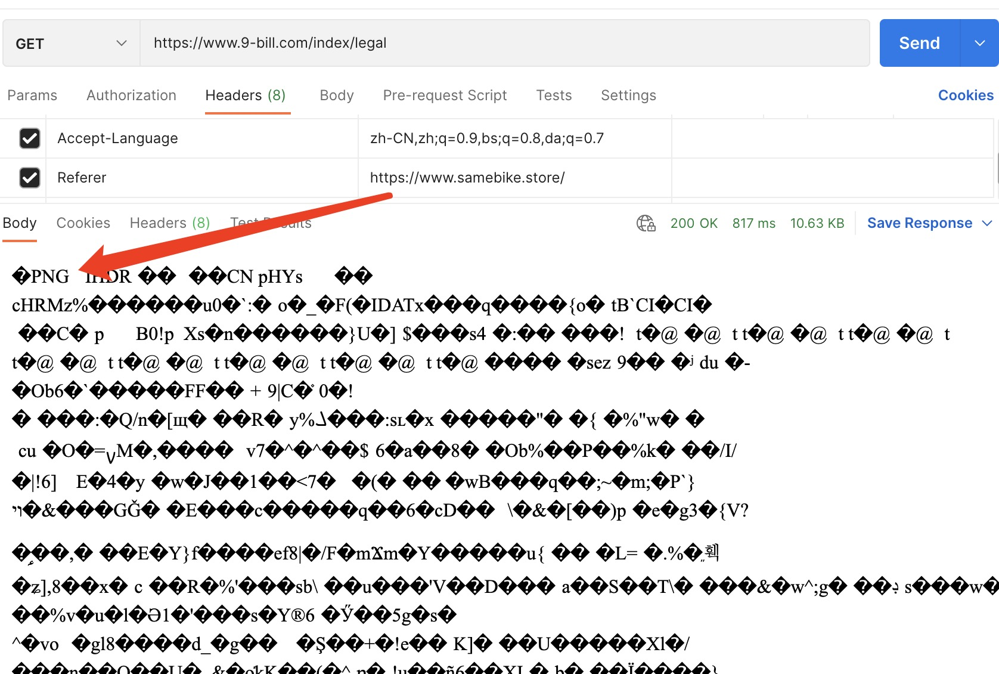

### 问题

客户反馈说有一张图片，在 A(www.aaaa.com)网站可以显示，在B(www.bbb.com)网站没显示出来。

### 排查

检查图片 DOM 发现：

```html

```

可以看出这个图片的请求地址并不像一个正常的图片地址(实际上这个链接是钱海提供的)。我本地简单起了一个服务看了下

```html
<!DOCTYPE html>
<html lang="en">
  <head>
    <meta charset="utf-8" />
    <title>图片</title>
    <!-- <meta name="referrer" content="no-referrer"> -->
    <meta name="viewport" content="width=device-width, initial-scale=1" />
    <style></style>
  </head>

  <body>
    <div id="root">
      
    </div>
  </body>
</html>
```

查看控制台：



服务器 500，有点意思

postman 看下：


referer 设置为用户的域名：


postman 看到正常响应了图片内容

好家伙，真就使用了 referer 做了图片防盗处理

### referer 是啥？

可以去 MDN 查看下。浏览器会自动在 http 请求头中携带这个标志
