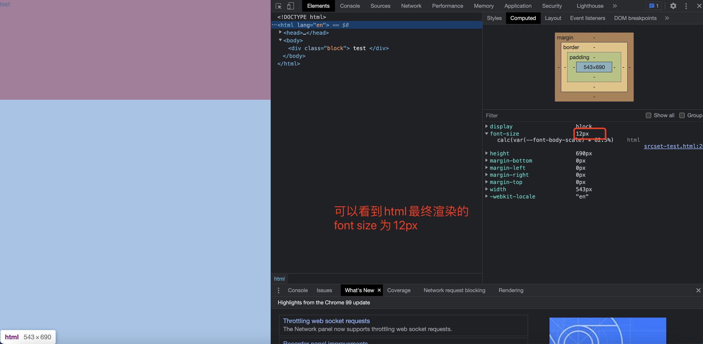

> 首先 rem 一定是相对于 html font size 大小的。

### 复现

```html
<!DOCTYPE html>
<html lang="en">
  <head>
    <meta charset="utf-8" />
    <meta
      name="viewport"
      content="width=device-width, minimum-scale=1.0, maximum-scale=1.0, user-scalable=no"
    />
    <title>REM</title>
    <style>
      :root {
        --font-body-scale: 1;
      }

      html,
      body {
        height: 100%;
        width: 100%;
        margin: 0;
      }

      html {
        font-size: calc(var(--font-body-scale) * 62.5%);
      }

      .block {
        height: 20rem;
        background-color: red;
      }
    </style>
  </head>
  <body>
    <div class="block">test</div>
  </body>
</html>
```

在浏览器查看 `html` 元素的 `font-size`



可以看到 `html` 的 `font-size` 为 12px。那么按理它内部所有的元素的 `rem` 单位都是要乘以这个 12，比如

```css
div {
  width: 20rem; // 20 * 12
}
```

但实际上，我们看下 `block` 元素的高度，即红色部分：


我们设置的 `block` 的样式：

```css
.block {
  height: 20rem;
  background-color: red;
}
```

可以发现最终渲染出来的 `block` 高度只有 200px，而不是 `20 * 12 = 240px`。

### 定位

其实问题出现在 `html` font-size 的计算上

```css
:root {
  --font-body-scale: 1;
}

html {
  font-size: calc(var(--font-body-scale) * 62.5%);
}
```

`font-size: calc(var(--font-body-scale) * 62.5%)` 相当于 `font-size: 62.5%`，这个百分比又是相对于基准值 `16px`，此时 `16 * 62.5% = 10px`，因此 `html` 的 `font-size` 理论上应该是：

```css
html {
  font-size: 10px;
}
```

但由于浏览器支持的最小字体大小是 `12px`，虽然我们设置的字体大小是 `10px`，但是浏览器实际渲染出来的 `font-size` 却是 `12px`。

但我们就算 `rem` 时，用的是我们设置在 `html` 元素上的 `font-size` 的具体的值

所以 `rem` 一定是相对于 我们设置在 `html` 上的 `font-size`

本例中只是一种视觉上的错觉
