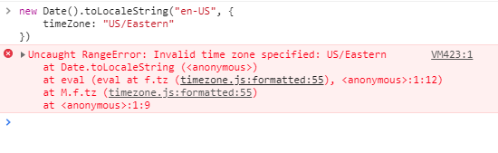

## 问题描述

Date 日期相关的，有些时区在低版本的浏览器并不支持

```js
new Date().toLocaleString("en-US", {
  timeZone: "US/Eastern",
});
```



## 解决方法

- 自己根据时区计算，比较麻烦
- 直接使用现有的[moment-timezone](https://www.npmjs.com/package/moment-timezone)
