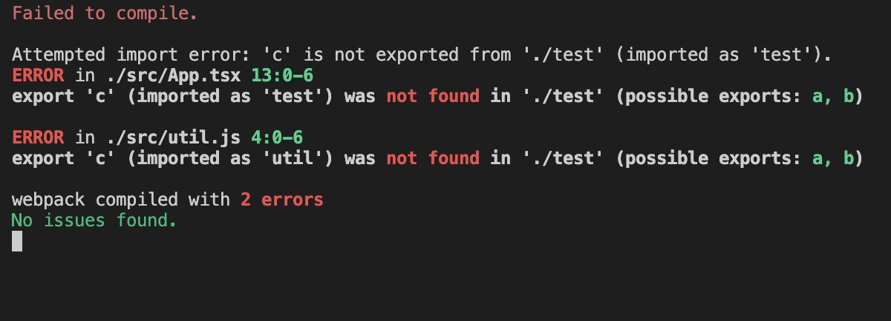
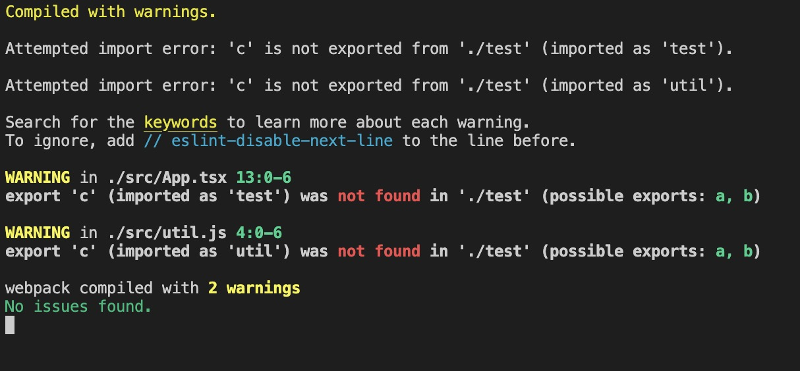
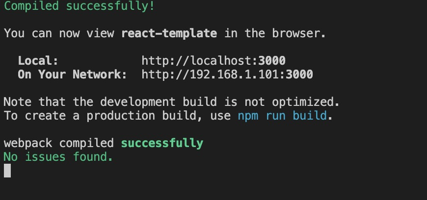

## 复现场景

新建 util.js

```js
const a = () => {
  console.log("a");
};
const b = () => {
  console.log("b");
};

export { a, b };
```

新建 extendUtil.js

```js
import * as util from "./util";

util.c = () => {
  console.log("c=====");
};
```

在 app.jsx 中按如下顺序引入:

```jsx
import "./extendUtil";
import * as util from "./util";
console.log("util...", util);
test.c();
```

此时 webpack 编译错误。


## 分析

实际上，通过 extend util 这种方式扩展导出的对象比较 hack。webpack 在打包时分析 exports 不存在，同时我们配置了 `webpack.module.strictExportPresence=true` 就会报错。此时我们只需要将 `webpack.module.strictExportPresence` 设置为 false，就可以跳过控制台的报错，但还是会提示 warning



在 webpack5 中，`webpack.module.strictExportPresence`已经被 `module.parser.javascript.exportsPresence`取代了，因此我们也可以这样设置：

```js
module: {
    // strictExportPresence: false,
    parser: {
        javascript: {
            exportsPresence: false,
        },
    }
}
```

控制台就没有警告了


## 结论

一般情况下，我们需要明确导出方法或者属性。尽量保留 webpack 的告警信息，并针对性修改。对于第三方包，没法修改的情况下，可以将`exportsPresence`设置为 warning
