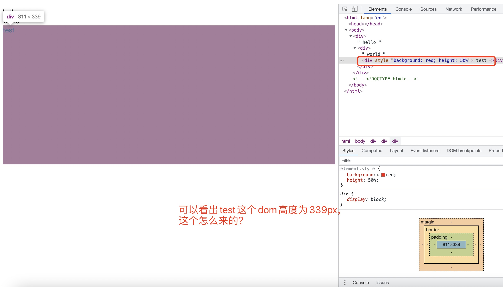
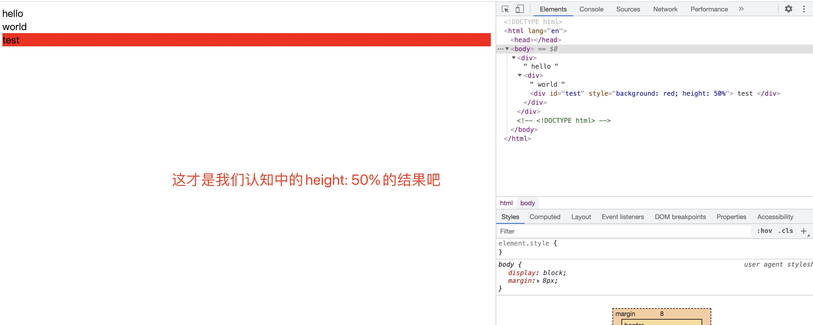
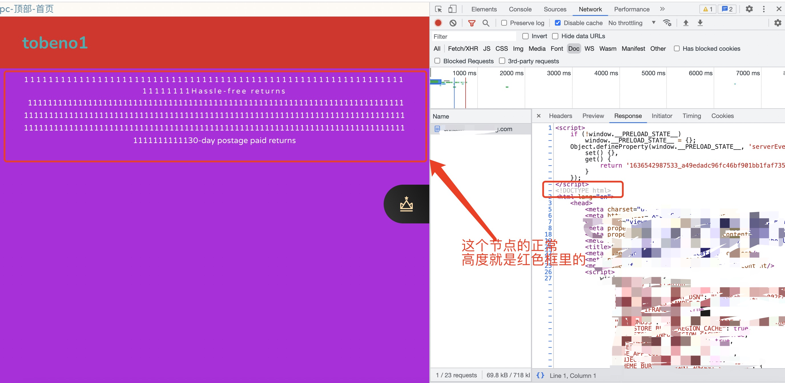
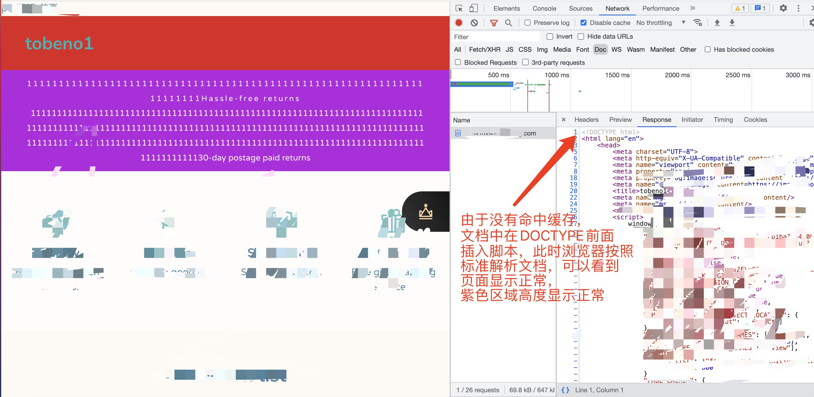

### 问题

今天遇到一个 bug，访问网站时，偶发闪屏现象，排查了大半天，发现是由一个 `height: 100%` 的 css 样式引起的。

### 复现

新建一个 html 文档，如下：

```html
<html lang="en">
  <body>
    <div>
      hello
      <div>
        world
        <div id="test" style="background: red; height: 50%">test</div>
      </div>
    </div>
  </body>
</html>
```

在浏览器打开之前，我们可以看出这个文档非常之简单，按照我们的理论知识，`test` 这个 dom 设置了 `height: 50%`，但是其父元素并没有设置高度，默认是 `height: auto`，理论上 `test` 这个 dom 节点 `50%` 的高度不会起作用。此时打开浏览器看看？结果如下：



**_所以这是为什么?_**

修改一下 html 文档，添加 DOCTYPE 声明

```html
<!DOCTYPE html>
<html lang="en">
  <body>
    <div>
      hello
      <div>
        world
        <div id="test" style="background: red; height: 50%">test</div>
      </div>
    </div>
  </body>
</html>
```

打开浏览器，可以看到：


**_这才是我们切图仔认知中的 height 百分比吧？_**

**所以 DOCTYPE 是如何影响 HEIGHT 百分比的？**

### 真实线上问题排查的难度

由于业务背景原因，我们采用 handlebar + egg 服务端渲染的模式由 node 团队返回 html 文档。而 node 团队为了优化，做了缓存。具体看下面


由于命中了缓存 node 团队的同学在`DOCTYPE`声明前面插入了一段脚本(估计是 node 同学前端基础不过关，标准上插入的 script 标签要么在 head 下面，要么在 body 下)，浏览器在收到这个 html 文档时，由于没有在第一行解析到`DOCTYPE`声明，因此浏览器切换到 `怪异模式`，按照
`怪异模式` 解析文档流。

下面是没有命中缓存时的结果

可以看出页面显示正常

由于这个脚本只在生产环境插入，本地开发所以复现不出这个问题，一开始出现 `height: 100%` 异常的时候，根本没想到会是 `DOCTYPE` 声明异常导致的。

### DOCTYPE 如何影响 height

具体可以查看[这篇文章](https://stackoverflow.com/questions/32214152/why-does-height-100-work-when-doctype-is-removed/32215263#32215263)

总的来说：

- 标准模式下，height 百分比一定是相对于父元素的
- 怪异模式下，height 百分比一定是相对于第一个有确定高度的祖先元素，如果祖先元素也没有高度，则相对于浏览器视口，比如

```html
<html lang="en">
  <body>
    <div style="height: 500px">
      hello
      <div>
        world
        <div id="test" style="background: red; height: 50%">test</div>
      </div>
    </div>
  </body>
</html>
```

至于不理解什么是浏览器的 `标准模式` 以及 `怪异模式` 的，可以谷歌一下
