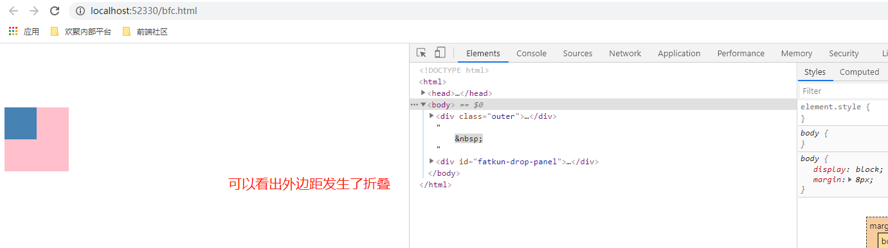
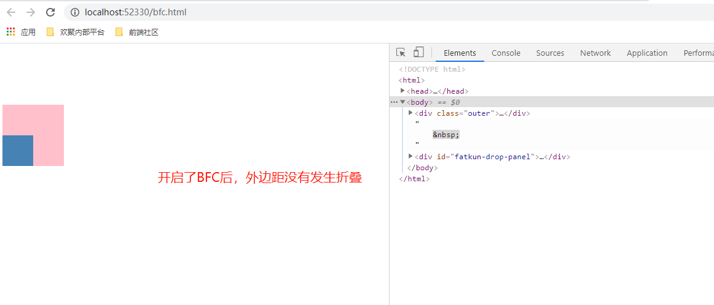
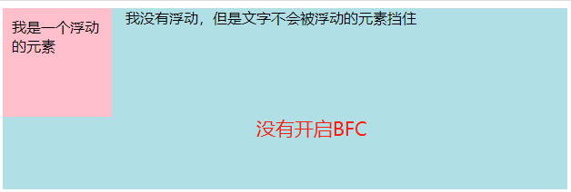
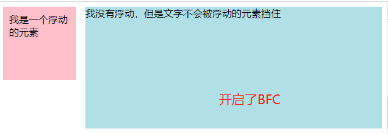
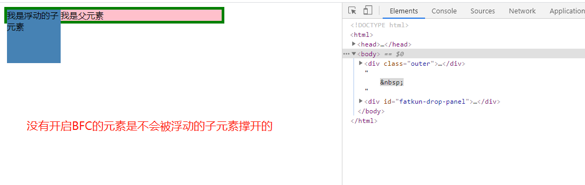
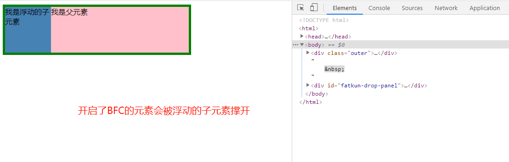

### BFC

Block Formatting Context 块格式化上下文。

用于影响内部布局的。块格式化上下文对浮动定位(float)与清除浮动(clear)都很重要

**_ 浮动定位和清除浮动时只会应用于同一个 BFC 内的元素 _**

### 开启 BFC 的方式

常见的创建块格式化上下文的方式：

- html 元素
- 浮动元素
- absolute、fixed 定位的元素
- overflow 不为 visible 的块元素
- display 为`inline-block`或者`flow-root`的元素
- display 为`flex`或`inline-flex`元素的直接子元素
- display 为`grid`或`inline-grid`元素的直接子元素

### 开启了 BFC 的元素的三个特性

- 不会和后代元素发生 marin collapse（外边距折叠，外边距合并）
- 不会和浮动的兄弟元素重叠
- 当元素高度没有设置时，会被元素内部的浮动元素撑开

#### 不会和后代元素发生 marin collapse

```html
<!DOCTYPE html>
<html>
  <head>
    <meta http-equiv="Content-Type" content="text/html; charset=utf-8" />
    <title>BFC Demo</title>
    <style type="text/css">
      .outer {
        width: 100px;
        height: 100px;
        background: pink;
        margin-top: 100px;
        overflow: hidden; // 开启了BFC
      }
      .inner {
        width: 50px;
        height: 50px;
        background: steelblue;
        margin-top: 50px;
      }
    </style>
  </head>
  <body>
    <div class="outer">
      <div class="inner"></div>
    </div>
     
  </body>
</html>
```

效果：




#### 不会和浮动的兄弟元素重叠

```html
<!DOCTYPE html>
<html>
  <head>
    <meta http-equiv="Content-Type" content="text/html; charset=utf-8" />
    <title>BFC Demo</title>
    <style type="text/css">
      .float {
        float: left;
        width: 100px;
        height: 100px;
        background-color: pink;
        padding: 10px;
        margin-right: 15px;
      }
      .right {
        /* 开启BFC */
        /* display: flow-root;  */
        height: 200px;
        background-color: powderblue;
      }
    </style>
  </head>
  <body>
    <div class="float">我是一个浮动的元素</div>
    <div class="right">我没有浮动，但是文字不会被浮动的元素挡住</div>
     
  </body>
</html>
```

效果：




#### 当元素高度没有设置时，会被元素内部的浮动元素撑开

```html
<!DOCTYPE html>
<html>
  <head>
    <meta http-equiv="Content-Type" content="text/html; charset=utf-8" />
    <title>BFC Demo</title>
    <style type="text/css">
      .outer {
        width: 400px;
        background: pink;
        border: 5px solid green;
        overflow: hidden; // 开启BFC
      }
      .inner {
        width: 100px;
        height: 100px;
        background: steelblue;
        float: left;
      }
    </style>
  </head>
  <body>
    <div class="outer">
      我是父元素
      <div class="inner">我是浮动的子元素</div>
    </div>
     
  </body>
</html>
```

效果：



