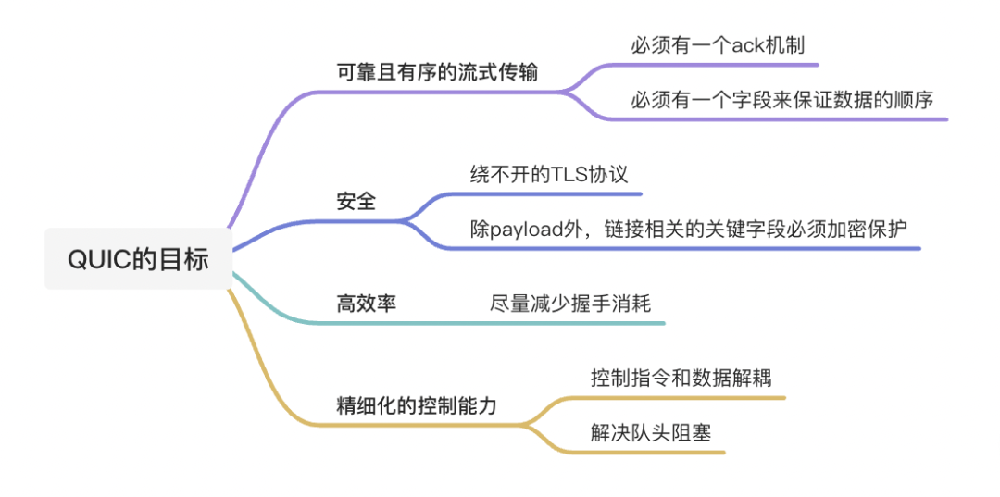
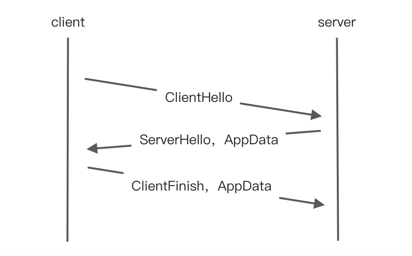

### 导言

本文主要介绍提供 HTTP/3 以及其底层协议 QUIC 的文档，介绍它们的目的、原理、协议细节以及实现等。摘抄自[HTTP3 详解](https://http3-explained.haxx.se/zh/zh)

### 为什么需要 QUIC

QUIC 可以被视为一种新型的可靠且安全的传输层协议，QUIC 的用途不局限于 HTTP 的传输

- 独立的数据流避免类似 TCP 队头阻塞问题
- 安全。想要建立一个 QUIC 连接，就必须通过 TLS 1.3 来安全地建立一个加密连接
- QUIC 提供了 0-RTT 和 1-RTT 的握手，这减少了协商和建立新连接时所需的时间

#### HTTP2 简介

- 多路复用
  - 通过同一个 TCP 连接发送多个逻辑数据流，复用带来更好的拥塞控制、更充分的带宽利用、更长久的 TCP 连接
- 头信息压缩
- 新的二进制分帧层协议
- 服务器推送

采用 HTTP/2 后，浏览器对每个主机一般只需要一个 TCP 连接，而不是以前常见的六个连接。

HTTP/2 解决了 HTTP 的`队头拥塞`（head of line blocking）问题（客户端必须等待一个请求完成才能发送下一个请求）。

#### TCP 队头阻塞（head of line blocking）

采用 HTTP/2 时，浏览器一般会在单个 TCP 连接中创建并行的几十个乃至上百个传输。如果 HTTP/2 连接双方的网络中有一个数据包丢失，或者任何一方的网络出现中断，
整个 TCP 连接就会暂停，丢失的数据包需要被重新传输。因为 TCP 是一个按序传输的链条，从 TCP 连接一端填入的字节会从另一端以原有的顺序，正确地传送出来，因此
如果其中一个点丢失了，链路上之后的内容就都需要等待。

这种单个数据包造成的阻塞，就是 TCP 上的队头阻塞（head of line blocking）。
随着丢包率的增加，HTTP/2 的表现越来越差。在 2%的丢包率（一个很差的网络质量）中，测试结果表明 HTTP/1 用户的性能更好，因为 HTTP/1 一般有六个 TCP 连接，哪怕其中一个连接阻塞了，其他没有丢包的连接仍然可以继续传输。
在限定的条件下，在 TCP 下解决这个问题相当困难。

#### 为什么不发明一个 UDP 和 TCP 之外的新型传输层协议

- 基于现有互联网上部署新型协议会遭遇很大的困难。用户与服务器之间要经过许多防火墙、NAT（地址转换）、路由器和其他中间设备（middle-box），这些设备
  有很多只认 TCP 和 UDP
- 传输层协议改动一般意味着操作系统内核也要做出修改。更新和部署新款操作系统内核的过程十分缓慢，需要付出很大的努力

#### SCTP

SCTP 是一个支持数据流的可靠的传输层协议，而且在 WebRTC 上已有基于 UDP 的对它的实现，但它存在以下问题：

- 没有解决数据流的队头阻塞问题
- 连接建立时需要决定数据流的数量
- 没有稳固的 TLS/安全性支持
- 建立连接时候需要 4 次握手，而 QUIC 一次都不用（0-RTT）
- QUIC 是类 TCP 的字节流，而 SCTP 是信息流（message-based）
- QUIC 连接支持 IP 地址迁移，SCTP 不行

#### 协议僵化

互联网上的关键中间设备，比如路由器等，经常跟不上最新的技术。网络的核心部分与边缘部分（客户端、服务器）相比，更新很慢。所以当这些设备决定了经过的流量
是否合格时，就有些问题了——在这些设备部署之后的一段时间里，协议有了新的特征。而在这些设备引入（了解）这些新特性之前，它们会认为这种特征的数据包是非
法的、恶意的，于是会将这种流量直接扔掉，或是拖延到用户不再想使用这些新特征的程度。这种问题就被称之为`协议僵化`

当中间设备检测到对于它们来说未知的新的 TCP 选项时，中间设备将拦截这些流量

**_尽可能将通信加密是对抗僵化的唯一有效手段，加密可以防止中间设备看到协议传输的绝大部分内容。_**

#### 安全性

QUIC 始终保证安全性。QUIC 协议没有明文的版本，所以想要建立一个 QUIC 连接，就必须通过 TLS 1.3 来安全地建立一个加密连接。如上文所说，加密可以避免协议僵化
等拦截和特殊处理。这也使 QUIC 具有了 Web 用户所期望的所有的 HTTPS 安全特性。QUIC 只在加密协议协商时会发送几个明文传送的初始握手报文。

#### 减少延迟

与 TCP 的 3 次握手相比，QUIC 提供了 0-RTT 和 1-RTT 的握手，这减少了协商和建立新连接时所需的时间。除此之外，QUIC 提供了提早传输更多数据的“早期数据”
（early data）特性，并且它的使用比 TCP 快速打开（TCP Fast Open）更加简便。因为数据流概念的引入，客户端不用等待前一个连接结束，便可以与同一个主机
建立另一个逻辑连接。

### QUIC 协议特点

- 基于 UDP 的传输层协议。有一些网络上的中间设备会拦截端口 53（用于 DNS）以外的 UDP 流量。还有一些网络会节流（throttle）UDP 流量，使得 QUIC 的表现慢于基于 TCP 的协议。更多网络的表现未知。
- 可靠。在不可靠的 UDP 之上增加了一层可靠性的层。提供数据包重传、拥塞控制、调整传输节奏（pacing）以及其他一些 TCP 中存在的特性
- 数据流。QUIC 在同一物理连接上可以有多个独立的逻辑数据流。这些数据流并行在同一个连接上传输，不影响其他流
- 有序交付。QUIC 的单个数据流可以保证有序交付，但多个数据流之间可能乱序
- 快速握手。QUIC 提供 0-RTT 和 1-RTT 的连接建立，这意味着 QUIC 在最佳情况下不需要任何的额外往返时间便可建立新连接。其中更快的 0-RTT 仅在两个主机之间建立过连接且缓存了该连接的“秘密”（secret）时可以使用。
- 使用 TLS1.3 传输层安全协议，天生自带加密机制。TLS 1.3 有着很多优点，但使用它的最主要原因是其握手所花费的往返次数更低，从而能降低协议的延迟。
- QUIC 之上的 HTTP 协议。
  - HTTP/2 中使用 HPACK 压缩头部，HPACK 算法依赖于数据流的有序交付
  - 由于 HTTP/3 的数据流之间可能乱序，因此需要改进 HPACK。HTTP 使用 QPACK 压缩头部

### QUIC 工作原理

- 建立一个连接。QUIC 连接是两个 QUIC 端点之间的单次会话（conversation）过程。QUIC 建立连接时，加密算法的版本协商与传输层握手合并完成，以减小延迟。
  在连接上实际传输数据时需要建立并使用一个或多个数据流。
- 协商安全的 TLS 连接
- 使用数据流
- 0-RTT。先前已连接过一个服务器的客户端可能缓存来自该连接的某些参数，并在之后与该服务器建立一个无需等待握手完成就可以立即传输信息的 0-RTT 连接，从而减少建立新连接所必需的时间。

### HTTP3

为了使 HTTP 可以通过 QUIC 传输，协议的某些方面要进行修改，修改的结果便是 HTTP/3。这些必要修改是因 QUIC 与 TCP 在某些性质上的不同所致，修改包括：

- 在 QUIC 中，数据流由传输层本身提供，而在 HTTP/2 中，流由 HTTP 层完成。
- 由于数据流互相独立，HTTP/2 中使用的头部压缩算法如果不做改动，会造成队头阻塞。
- QUIC 流与 HTTP/2 略有不同。
- HTTP/3 将使用 HTTPS:// URL 履行
- HTTP 服务器响应头可以设置：Alt-Svc: h3=":50781"，这指示了同一名称的主机在 UDP 端口 50781 提供 HTTP/3 服务

### HTTP3 与 HTTP2 的比较

HTTP/3 面向 QUIC 设计，QUIC 是一个自己处理数据流的传输层协议。

HTTP/2 面向 TCP 设计，因此数据流在 HTTP 层处理。

#### 相似之处

这两个协议为客户端提供了几乎相同的功能集。

- 两者都提供数据流
- 两者都提供服务器推送
- 两者都有头部压缩，QPACK 与 HPACK 的设计非常类似
- 两者都通过单一连接上的数据流提供复用
- 两者都提供数据流的优先度设置

#### 不同之处

两个协议的主要不同点在于细节，不同之处主要由 HTTP/3 使用的 QUIC 带来。

- 得益于 QUIC 的 0-RTT 握手，HTTP/3 可以提供更好的早期数据支持，而 TCP 快速打开和 TLS 通常只能传输更少的数据，且经常存在问题。
- 得益于 QUIC，HTTP/3 的握手速度比 TCP+TLS 快得多。
- HTTP/3 不存在明文的不安全版本。尽管在互联网上很少见，HTTP/2 还是可以不配合 HTTPS 来实现和使用。
- 通过 ALPN 拓展，HTTP/2 可以直接在 TLS 握手时进行协商。HTTP/3 基于 QUIC，所以需要凭借响应中的 Alt-Svc: 头部来向客户端宣告

## 进阶部分：QUIC 的建联设计

和 TCP 一样，QUIC 的首要目标也是提供一个`可靠、有序的流式传输协议`。不仅如此，QUIC 还要保证`原生的数据安全`以及`传输的高效`。

可以说，QUIC 就是在以一种更简洁高效的机制去对标 TCP+TLS。当然，和 TCP+TLS 一样，QUIC 建联流程的本质都是在为上述特性服务，由于 QUIC 是基于 UDP 重新设计的协议，便也就没那么多的历史包袱，我们先来整理下我们对这个新的协议的诉求：

整理好需求之后，我们再来看看 QUIC 实现的效果。

先来看一个 QUIC 链接的建立流程，一次 QUIC 链接建立的粗略示意图如下：

可以看到，QUIC 相比于 TCP+TLS，只需要 1.5 个 RTT 就能完成建联，大大提升了效率。熟悉 TLS 的同学可能会发现 QUIC 的建联流程似乎跟 TLS 握手没有太大区别，TLS 本身又是一个强依赖于数据有序可靠传输的协议，然而 QUIC 又依赖 TLS 去达成有序且可靠的能力，这似乎成为了一个鸡和蛋的问题，那么 QUIC 是如何解决这个问题的呢？

我们需要更深一步去看看 QUIC 建联的流程，粗略示意图仅仅只能帮我们粗略感受下 QUIC 相比于 TCP+TLS 流程的高效，我们来进一步看看更精细化的 QUIC 建联流程：

这里的图显得有些繁琐，抛去 TLS 握手的细节，整个流程实际上还是和 TCP 一样是一个请求-响应的模式，然而相比于 TCP+TLS，我们还看到了一些不一样的地方：

- 图中多了"init packet"、"handshake packet"、"short-header packet"的概念；
- 图中多了 pkt_number 的概念以及 stream+offset 的概念；
- pkt_number 的下标变化似乎有些奇怪。

而这些不同机制就是 QUIC 实现相比于 TCP 来说更高效的点，让我们来逐一分析。

#### 一、 pkt_number 的设计

pkt_number 从流程图看起来，和 TCP 的 seq 字段比较类似，然而实际上还是有不少差别，可以说，pkt_number 的设计就是为了解决前面提到的 TCP 的问题的，我们来看看 pkt_number 的设计：

##### 1.1. 从 0 开始的下标

前面我们提到过，如果 TCP 的 seq 是一个从 0 开始的字段，那么其实不需要握手，就可以开始数据的有序发送，所以解决 TLS 和有序可靠传输这个鸡和蛋问题的方案非常简单。即 pkt_number 从 0 开始计数，便可直接保证 TLS 数据的有序。

##### 1.2. 加密 pkt_number 以保障安全

当然 pkt_number 从 0 开始技术便也就遇上了和 TCP 一样的安全问题，解决方案也很简单，就是用为 pkt_number 加密，pkt_number 加密后，中间人便无法获取到加密的 pkt_number 的 key，便也无法获取到真实的 pkt_number，也就无法通过观测 pkt_number 来预测后续的数据发送。而这里又引申出了另一个问题，TLS 需要握手完成后才能得到中间人无法获取的 key，而 pkt_number 又在 TLS 握手之前又存在，这看起来又是一个鸡和蛋的问题，至于其解决方案，这里先卖一个关子，留到后面 QUIC-TLS 的专题文章再讲。

##### 1.3. 细粒度的 pkt_number space 的设计

TLS 严格来说并不是一个状态严格递进的协议，每进入一个新的状态，还是有可能会收到上一个状态的数据，这么说有点抽象。

举个例子，TLS1.3 引入了一个 0-RTT 的技术，该技术允许 Client 在通过 ClientHello 发起 TLS 请求时，同时发送一些应用层数。我们当然期望这个应用层数据的过程相对于握手过程来说是异步且互不干扰的，而如果他们都是用同一个 pkt_number 来标示，那么应用层数据的丢包势必会导致对握手过程的影响，所以，QUIC 针对握手的状态设计了三种不同的 pkt_number space：

(1) init

(2) Handshake

(3) Application Data

分别对应：

(1) TLS 握手中的明文数据传输，即图中的 init packet；

(2) TLS 中通过 traffic secret 加密的握手数据传输，即图中 handshake packet；

(3)握手完成后的应用层数据传输及 0-RTT 数据传输，即图中的 short header packet 以及图中暂未画出的 0-RTT packet。

三种不同的 space 保证了三个流程的丢包检测互不影响。关于这部分在系列文章后续(关于 QUIC 丢包检测)还会再次深入剖析。

##### 1.4. 永远自增的 pkt_number

这里的永远自增指的是 pkt_number 的明文随每个 QUIC packet 发送，都会自增 1。pkt_number 的自增解决的是二义性问题，接收端收到 pkt_number 对应的 ACK 之后，可以明确的知道到底是重传的报文被 ACK 了，还是新的报文被 ACK 了，这样 RTT 的估计及丢包检测，就可以更加精细，不过仅仅只靠自增的 pkt_number 是无法保证数据的有序的，我们再来看看 QUIC 提供了什么样的机制保证数据的有序。

#### 二、基于 stream 的有序传输

我们知道 QUIC 是基于 UDP 实现的协议，而 UDP 是不可靠的面向报文的协议，这和 TCP 基于 IP 层的实现并没有什么本质上的不同，都是：

(1) 底层只负责尽力而为的，以 packet 为单位的传输;

(2) 上层协议实现更关键的特性，如可靠，有序，安全等。

从前面我们知道 TCP 的设计导致了链接维度的队头阻塞问题，而仅仅依靠 pkt_number 也无法实现数据的有序，所以 QUIC 必须要一种更细粒度的机制来解决这些问题：

##### 2.1 流既是一种抽象，也是一种单位

TCP 队头阻塞的根因来自于其一条链接只有一个发送流，流上任意一个 packet 的阻塞都会导致其他数据的失败。当然解决方案也不复杂，我们只需要在一条 QUIC 链接上抽象出多个流来即可，整体的思路如下图：

只要能保证各个 stream 的发送独立，那么我们实际上就避免了 QUIC 链接本身的队头阻塞，即一个流阻塞我们也可以在其他流上发送数据。

有了单链接多流的抽象，我们再来看 QUIC 的传输有序性设计，实际上 QUIC 在 stream 层面之上，还有更细粒度的单位，称作 frame。一个承载数据的 frame 携带有一个 offset 字段，表明自己相对于初始数据的偏移量。而初始偏移量为 0，这个思路等价于 pkt_number 等于 0，即不需要握手即可开始数据的发送。熟悉 HTTP/2、GRPC 的同学应该比较清楚这个 offset 字段的设计，和流式数据的传输是一样的。

##### 2.2 一个 TLS 握手也是一个流

虽然 TLS 数据并没有一个固定的 stream 来标示，但其可以被看作为一个特定的 stream，或者说是所有其他 stream 能建立起来的初始 stream，因为它其实也是基于 offset 字段和固定的 frame 来承载的，这也就是 TLS 数据有序的保障所在。

##### 2.3 基于 frame 的控制

有了 frame 这一层的抽象之后，我们当然可以做更多的事情。除了承载实际数据之外，也可以承载一些控制数据，QUIC 的设计汲取了 TCP 的经验教训，对于 keepalive、ACK、stream 的操作等行为，都设置了专门的控制 frame，这也就实现了数据和控制的完全解耦，同时保证了基于 stream 的细粒度控制，让 QUIC 成为更精细化的传输层协议。

讲到这里，其实可以看到我们从 QUIC 建联流程的探讨中，已经明确了 QUIC 设计的目标，正如文章中一直在强调的概念：

“无论是建联还是什么流程，都是在为实现 QUIC 的特性而服务”。

我们现在对 QUIC 的特性及实现已经有了一些认知，来小结一下：

此时，我们再来看看 QUIC 的建联过程中的一些设计，就不会再被其复杂的流程所困扰，更能直击它的本质，因为这些设计是在 QUIC 建联大框架确认下来之后，一些细枝末节的点，而这些点往往又会在 RFC 中占据不小的篇幅，消耗读者的心力。

举个例子，比如针对 QUIC 的放大攻击及其处理方式：放大攻击的原理为，TLS 握手过程中 ClientHello 数据很少。但 server 可能响应很多数据，这就可能形成放大攻击，比如 attacker A 发起大量 ClientHello，但把自己的 src ip 修改为 Client B，这样 attacker A 就成倍的放大了自己的流量，以攻击 Client B，其解决方案也很简单，QUIC 要求每个 Client 的首包都 padding 到一定的长度，并且在服务端提供了 address validation 机制，同时在握手完成之前，限制服务端响应的数据大小。

RFC9000 中花了一章节来介绍这个机制，但其本质来说只是针对 QUIC 当前握手流程的问题的修补，而不是为了设计这个机制再去设计了握手流程。

### 参考链接

[深入 HTTP/3（一）｜从 QUIC 链接的建立与关闭看协议的演进](https://mp.weixin.qq.com/s/ulrLwhzt327SJ3EDSMKwDg)
