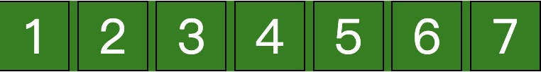
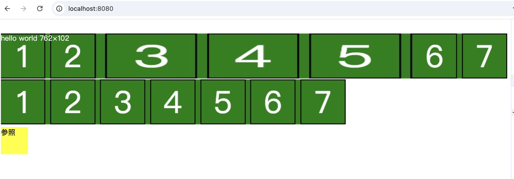
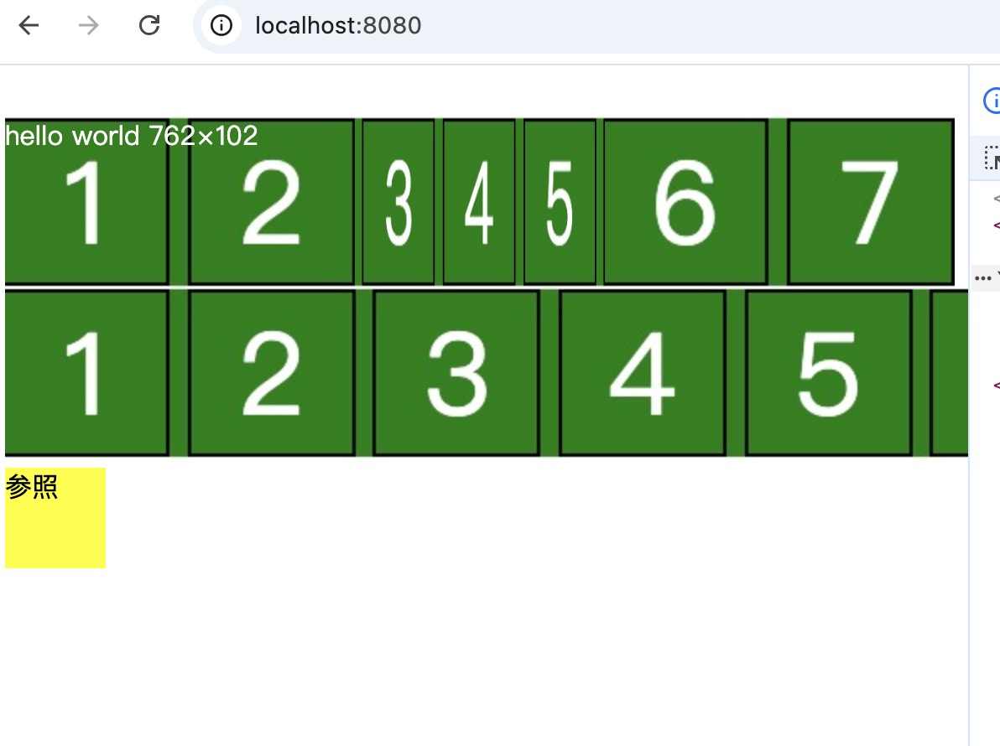

## 效果
比如给定下面的一张图，如何实现保持1和2，6和7不拉伸，只拉伸中间的3，4，5.



效果如下：






## 实现代码
```html
<!DOCTYPE html>
<html>
<head> 
<meta charset="utf-8"> 
<title>菜鸟教程(runoob.com)</title> 
<style>
  * {
    box-sizing: border-box;
}
  .container {
    background-color: red;
    color: white;
    height: 102px;
    width: 100%;
    border-image-source: url(./1.jpg);
    border-image-width: 102px 208px 0px 208px;
    border-image-slice: 102 208 0 208;
  }
  .block {
    width: 60px;
    height: 60px;
    background-color: yellow;
  }


</style>
</head>
<body>

  <div id="container" class="container">
    <div>
      hello world  762 × 102

    </div>
  </div>
  

  <div class="block">参照</div>
  <script>

  </script>
</body>
</html>
```