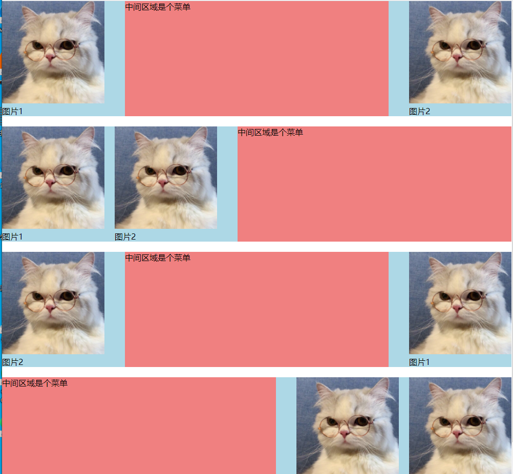
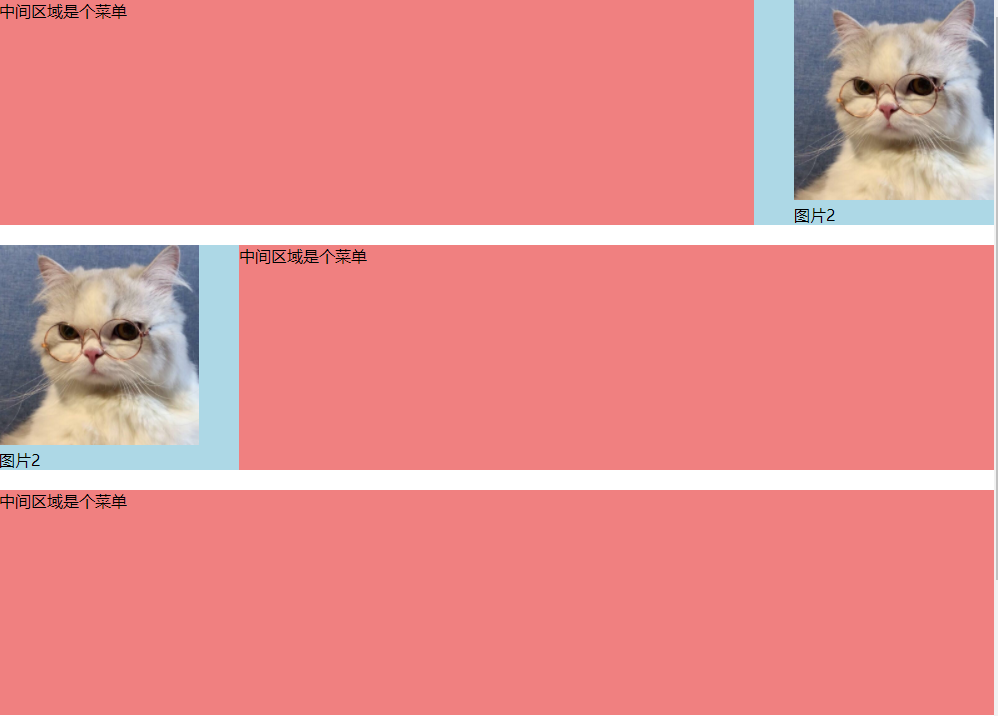

### 视觉位置

css 并不能修改 dom 的结构，调整 dom 的位置。dom 的结构及位置在我们写代码时就已经固定下来，除非用 js 手动修改 dom。视觉位置就是我们在页面上看到的 dom 的位置。这和实际的 dom 位置不同。
常见的能使用 css 调整 dom 视觉位置的方法有：

- float
- position
- display:table、display:table-footer-group，display:table-header-group
- display:flex 结合 order

### 业务背景

如下图



业务需求如下：

- 每张图片的位置可以配置，可以放在菜单(粉红色区域)前面，也可以放在菜单后面，菜单和图片均保持自适应宽度
- 如果没有配置图片，则不显示图片，图片不占空间
- 图片和图片之间的间距保持 20px，图片和菜单之间的间距保持 40px。容器两边没有边距。
- 需要兼容垂直方向和水平方向，水平方向可以配置图片在菜单上面，或者下面。

### 解决方法

可以使用 float，display:flex + order，或者 display:table 布局

#### flex 布局

flex 布局结合 order 属性能够非常简单的实现这种复杂的场景，代码简洁，而且能够同时适用于水平方向和垂直方向。
缺点是 order 属性有兼容性问题

```handlebars
<style>
  *{ margin: 0; padding: 0; } img{ width: 200px; } .container{ display: flex;
  /*flex-direction: column; // 如果需要在垂直方向上应用，只需打开注释即可*/
  background-color: lightblue; margin-bottom: 20px; } .menu{ flex: 1; height:
  225px; background-color: lightcoral; }
  {{! 下面是关键的css }}
  .front{ order: 1; // 放在菜单前面的图片一律设置为1 margin-right: 20px; //
  如果要适用垂直方向，则改成margin-bottom即可 } .back{ order: 3; //
  放在菜单后面的图片一律设置为3 margin-left: 20px; //
  如果要使用垂直方向，则改成margin-top即可 } .menu{ order: 2; // 菜单的order固定
  } div[data-order*=front] .menu{ margin-left: 20px; } div[data-order*=back]
  .menu{ margin-right: 20px; }
</style>

{{! 需要判断是否有图片url，没有url则不显示图片，这里为了简单演示，就不这么做 }}
{{!--    {{#if img1_url}}
        <div class="block {{img1.position}}">
          
          <div>图片1</div>
        </div>
    {{/if}}
--}}
{{! 试着将img1.position 设置为front，img2.position设置为back试试}}
<body>
  <div data-order="{{img1.position}}{{img2.position}}" class="container">
    <div class="block {{img1.position}}">
      
      <div>图片1</div>
    </div>
    <div class="block {{img2.position}}">
      
      <div>图片2</div>
    </div>
    <div class="menu">
      中间区域是个菜单
    </div>
  </div>
</body>
```

#### float 布局怎么玩

float 布局兼容性良好。缺点是

- 只能适用于水平方向
- 没有浮动的元素设置 margin，还是会和浮动的兄弟元素重叠，需要额外处理。

```handlebars
  <style>
    *{
      margin: 0;
      padding: 0;
    }
    img{
      width: 200px;

    }
    .container{
      background-color: lightblue;
    }
    .menu{
      height: 225px;
      background-color: lightcoral;
    }
    .front{
      float: left;
      margin-right: 20px;
    }
    .back{
      float: right;
      margin-left: 20px;
    }
    .menu-wrap{
      overflow: hidden; /** 需要设置overflow:hidden。否则会和浮动的兄弟元素重叠，详情可了解BFC **/
    }
    div[data-order*=front] .menu{
		  margin-left: 20px;
	  }
    div[data-order*=back] .menu{
		  margin-right: 20px;
	  }
  </style>
</head>
<body>
  <div data-order="backfront" class="container">
    <div class="block back">
      
      <div>图片1</div>
    </div>
    <div class="block front">
      
      <div>图片2</div>
    </div>
    <div class="menu-wrap">
      <div class="menu">
        中间区域是个菜单
      </div>
    </div>
  </div>
</body>
```

### table 布局

缺点是只能垂直方向，而且只能允许一个 table-header，一个 table-footer，即最多只能有两张图片。flex 布局和 float 都支持拓展数量不限的图片。

```handlebars
  <style>
    *{
      margin: 0;
      padding: 0;
    }
    img{
      width: 200px;

    }
    .container{
      display: table;
      background-color: lightblue;
    }
    .menu{
      height: 225px;
      background-color: lightcoral;
    }
    .front{
      display: table-header-group;
      margin-bottom: 20px;
    }
    .back{
      display: table-footer-group;
      margin-top: 20px;
    }
    div[data-order*=front] .menu{
		  margin-top: 20px;
	  }
    div[data-order*=back] .menu{
		  margin-bottom: 20px;
	  }
  </style>
</head>
<body>
  <div data-order="backfront" class="container">
    <div class="block back">
      
      <div>图片1</div>
    </div>
    <div class="block front">
      
      <div>图片2</div>
    </div>
    <div class="menu">
        中间区域是个菜单
    </div>
  </div>

</body>
```
