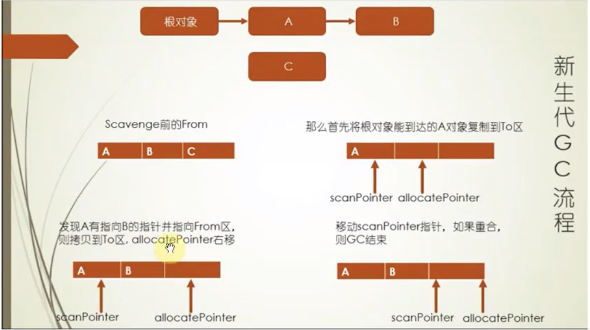
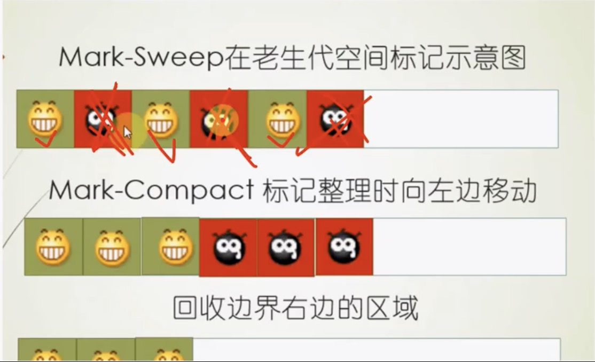
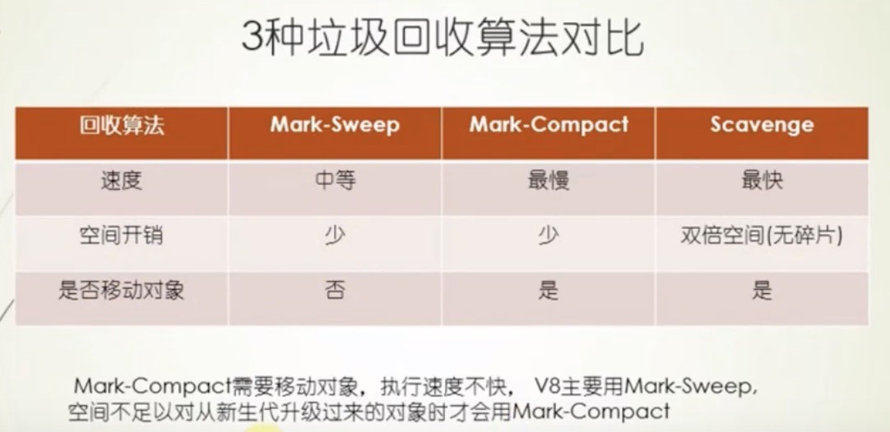

## 第一节 垃圾回收算法

- 引用计数
- 标记清除

### 内存管理的主要问题

内存管理最艰难的任务是找到“哪些被分配的内存确实已经不再需要了”。最好是开发人员来确定在程序中哪一块内存不再需要并且释放它。垃圾回收器主要工作是跟踪内存的分配和使用，以便当分配的内存不再使用时，自动释放它。这只能是一个近似的过程，因为要知道是否仍然需要某块内存是无法判定的(无法通过某种算法解决)。

### 引用计数垃圾收集

这是最初级的垃圾收集算法。如果没有引用指向该对象(零引用)，对象将被垃圾回收机制回收。

### 引用计数法的缺点：无法处理循环引用

在下面的例子中，两个对象被创建，并互相引用，形成了一个循环。它们被调用之后会离开函数作用域，所以它们已经没有用了，可以被回收了。然而，引用计数算法考虑到它们互相都有至少一次引用，所以它们不会被回收。

```js
function f() {
  var o = {};
  var o2 = {};
  o.a = o2; // o 引用 o2
  o2.a = o; // o2 引用 o
  return "hello world";
}

f();
```

### 标记-清除算法

这个算法假定设置一个叫做根（root）的对象（在 Javascript 里，根是全局对象）。垃圾回收器将定期从根开始，找所有从根开始引用的对象，然后找这些对象引用的对象……从根开始，垃圾回收器将找到所有可以获得的对象和收集所有不能获得的对象。这也是标记阶段。

在清除阶段，垃圾回收器将清除所有不能获得的对象

从 2012 年起，所有现代浏览器都使用了标记-清除垃圾回收算法。

### 循环引用不再是问题了

在上面的示例中，函数调用返回之后，两个对象从全局对象出发无法获取。因此，他们将会被垃圾回收器回收。

### 限制: 那些无法从根对象查询到的对象都将被清除

尽管这是一个限制，但实践中我们很少会碰到类似的情况，所以开发者不太会去关心垃圾回收机制

## 第二节 V8 内存管理

### 2.1 NodeJS 中的内存管理

- 网页端的内存泄漏顶多影响单个客户端
- 对于持续运行的服务进程 Node 服务器端程序，必须及时释放不再用到的内存。否则，内存越来越高，轻则影响系统性能，重则导致进程崩溃
- 如果不再用到的内存没有及时释放，就叫做内存泄漏

### 2.2 V8 内存管理

#### 2.2.1 V8 内存限制

- 在 64 位操作系统可以使用 1.4G 内存
- 在 32 位操作系统中可以使用 0.7G 内存

#### 2.2.2 V8 内存管理

- JS 对象都是通过 V8 进行分配管理内存的
- process.memoryUsage 返回一个对象，包含了 Node 进程的内存占用信息

```js
console.log(process.memoryUsage());
// 返回一个对象：
// {
//   rss: 17461248,
//   heapTotal: 4210688,
//   heapUsed: 2091160,
//   external: 634511
// }
```

rss(resident set size)：所有内存占用，包括指令区和堆栈

heapTotal：“堆”占用的内存，包括用到的和没用到的。即已经申请到的堆内存

heapUsed: 用到的堆的部分，当前使用的数量。判断内存泄漏，以 heapUsed 字段为准

external: V8 引擎内部的 C++对象占用的内存

#### 2.2.3 为何限制内存大小

- 因为 V8 的垃圾收集工作原理导致的，1.4G 内存完成一次垃圾收集需要 1 秒以上
- 这个暂停时间成为 Stop The World，在这个期间，应用的性能和响应能力都会下降

#### 2.2.4 如何打开内存限制

- 一旦初始化成功，生效后不能再修改
- -max-new-space-size，最大 new space 大小，执行 scavenge 回收，默认 16M，单位 KB
- -max-old-space-size，最大 old space 大小，执行 MarkSweep 回收，默认 1G，单位 MB

```shell
node --max-old-space-size=2000 app.js 单位是M
node --max-new-space-size=1024 app.js 单位是kb
```

## 第三节 V8 的垃圾回收机制

- V8 是基于分代的垃圾回收
- 不同代垃圾回收机制也不一样
- 按存活的时间分为新生代和老生代

### 2.1 分代

- 年龄小(存活时间小)的是新生代，由 From 区域和 To 区域两个区域组成
  - 在 64 位系统里，新生代内存是 32M，From 区域和 To 区域各占用 16M
  - 在 32 位系统里，新生代内存是 16M，From 区域和 To 区域各占用 8M
- 年龄大(存活时间大)的是老生代，默认情况下，
  - 64 位系统下老生代内存是 1400M
  - 32 位系统下老生代内存是 700M


### 2.2 新生代垃圾回收

- 新生代区域一分为二，每个 16M，一个使用，一个空闲
- 开始垃圾回收的时候，会检查 FROM 区域中的存活对象，如果还活着，拷贝到 TO 空间，完成后释放空间
- 完成后 FROM 和 TO 互换
- 新生代扫描的时候是一种广度优先的扫描策略
- 新生代的空间小，存活对象少
- 当一个对象经历过多次的垃圾回收依然存活的时候，生存周期比较长的对象会被移动到老生代，这个移动过程被称为晋升或者升级
  - 经过 5 次以上的回收还存在
  - TO 的空间使用占比超过 25%，或者超大对象
    

### 2.3 老生代

- 老生代使用的垃圾回收算法：mark-sweep(标记清除)和 mark-compact(标记整理)
  - mark-sweep
    - 标记活着的对象，随后清除在标记阶段没有标记的对象，只清理死亡对象
    - 问题在于清除后会出现内存不连续的情况，这种内存碎片会对后续的内存分配产生影响
    - 如果要分配一个大对象，碎片空间无法分配
  - mark-compact
    - 标记死亡后会对对象进行整理，活着的对象向左移动，移动完成后直接清理掉边界外的内存
- 老生代空间大，大部分都是活着的对象，GC 耗时比较长
- 在 GC 期间无法响应，STOP-THE-WORLD
- V8 有一个优化方案，增量处理，把一个大暂停换成多个小暂停 INCREMENT_GC
  



## 内存泄漏的场景

- 定时器
- dom 事件监听器
- 闭包
- 死循环

## 参考链接

- [https://v8.dev/blog/trash-talk](https://v8.dev/blog/trash-talk)
