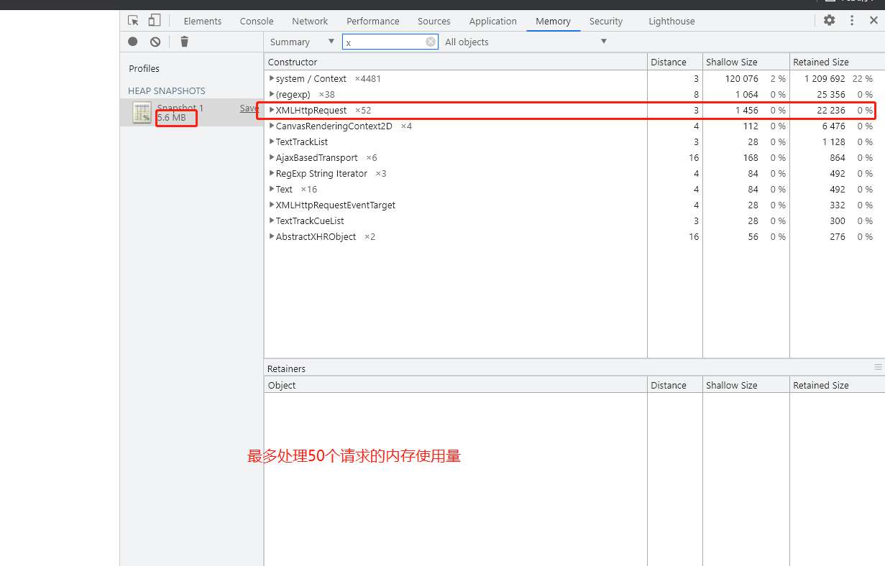
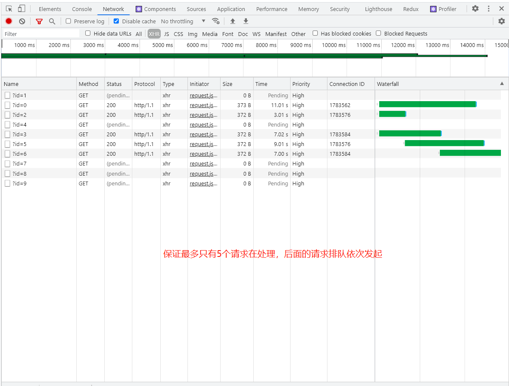

### 并发请求的限制

对于前端来说，限不限制并发请求数意义不大。假设同时发起 1000 个请求，由于浏览器对同个域名下 TCP 连接数有限制，http1.x 最多并行 6 个连接。因此就算是 1000 个请求，浏览器能同时发起的也就 6 个请求，其余请求还是要排队等待发起。

emmmm，装 X 点，从内存使用角度来说，前端控制并发数，对浏览器来说会友好点，毕竟同时 new 1000 个 xhr 对象内存也是可观的。

下图是没有限制并发数，同时发起 1000 个请求的内存使用情况：


下图是限制最多并发 50 个请求，其余请求前端控制排队依次发起：


### 场景 1

如果短时间内发起大量的请求，比如 1000 个请求过来了，前端控制最多只有`Max`个请求在处理，后面的请求排队等候。如果有请求完成，则后面的请求补位，如下图：


前端代码实现：

封装一个 ajax：

```js
const queue = []; // 排队的请求
const max = 6; // 最大并发数
let currentCount = 0;
export default function ajax(path, { id }) {
  return new Promise((resolve, reject) => {
    currentCount++;
    const executeTask = () => {
      const task = queue.shift();
      currentCount--;
      if (task) {
        task();
      }
    };
    const task = () => {
      let xhr = new XMLHttpRequest();
      const url = `http://localhost:3000${path}/?id=${id}`;
      xhr.onload = () => {
        executeTask();
        if (xhr.status === 200) {
          return resolve(xhr.response || xhr.responseText);
        }
        return reject("请求失败");
      };
      xhr.onerror = () => {
        executeTask();
        return reject("出错了");
      };
      xhr.open("GET", url);
      xhr.withCredentials = true;
      xhr.send("hello");
    };
    if (currentCount < max + 1) {
      task();
    } else {
      // 超过最大并发数则排队
      queue.push(task);
    }
  });
}
```

发起 1000 个请求

```js
for (let i = 0; i < 1000; i++) {
  ajax("/get", { id: i }).then((res) => {
    console.log(`第${i}个请求返回：`, res);
  });
}
```

后端代码：

```js
const express = require("express");
const querystring = require("querystring");
const app = express();
app.use((req, res, next) => {
  if (req.method === "OPTIONS") {
    // 预检请求
    res.setHeader("Access-Control-Allow-Origin", "*");
    res.end();
  } else {
    // 普通请求
    res.setHeader("Access-Control-Allow-Origin", "http://localhost:9001");
    res.setHeader("Vary", "Origin");
    res.setHeader("Access-Control-Allow-Credentials", "true");
    next();
  }
});
app.get("/login", (req, res) => {
  res.setHeader("Set-Cookie", [
    "type=ninja;Secure;SameSite=None;",
    "language=javascript;Secure",
    "name=lzc;SameSite=Strict",
  ]);
  res.json({ method: "get", cookie: req.headers.cookie });
});
app.get("/get", (req, res) => {
  const urlSplitData = req.url.split("?");
  req.path = urlSplitData[0];
  req.query = querystring.parse(urlSplitData[1]);
  const time = 3000 + Math.round(Math.random() * 10) * 2 * 1000;
  console.log("get..", req.query.id);
  res.setHeader("Connection", "Keep-Alive");
  res.setHeader("timeout", "60");
  setTimeout(() => {
    res.json({ method: "get", id: req.query.id, time: `${time}ms` });
  }, time);
});
app.listen(3000, () => {
  console.log(`service listening at http://localhost:3000`);
});
```

### 场景 2

同时发起 1000 个请求，和场景 1 一样，浏览器最多处理`Max`个请求，后面的请求排队等候，如果有请求完成，则后面的请求补位，并且要求这 1000 个请求全部返回了，才执行回调。

```js
const pros = [];
for (let i = 0; i < 24; i++) {
  pros.push(ajax("/get", { id: i }));
}
Promise.all(pros).then((res) => {
  console.log("所有请求都返回了。。", res);
});
```
