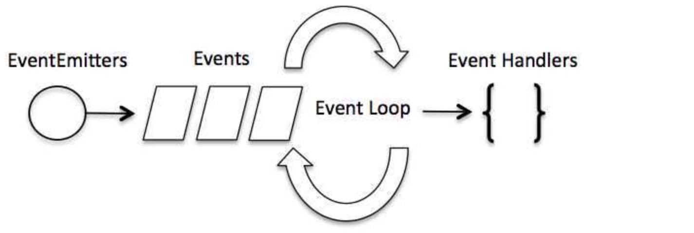

### node 简介

node.js 是一个事件驱动 I/O 服务端 JavaScript 环境，基于 Google 的 V8 引擎，V8 引擎执行 JavaScript 的速度非常快，性能非常好。

### node 回调函数

node.js 异步编程的直接体现就是回调，异步编程依托于回调来实现。比如可以使用异步方式读取文件，一边读取文件，一边执行其他命令，在文件读取完成后，将文件内容作为
回调函数的参数返回，这样在执行代码时就没有阻塞或者等待文件 I/O 操作。**这就大大提高了 Node.js 的性能，可以处理大量的并发请求**

### node 事件循环

- node.js 是单进程单线程应用程序，但是因为 V8 引擎提供的异步执行回调接口，**通过这些接口可以处理大量的并发，所以性能非常高**

- node.js 基本上所有的事件机制都是用设计模式中观察者模式实现。

- node.js 单线程类似进入一个 while(true)的事件循环，直到没有事件观察者退出，每个异步事件都生成一个事件观察者，如果有事件发生就调用该回调函数.

##### 事件驱动程序

Node.js 使用事件驱动模型，当 web server 接收到请求，就把它关闭然后进行处理，然后去服务下一个 web 请求。

当这个请求完成，它被放回处理队列，当到达队列开头，这个结果被返回给用户。

这个模型非常高效可扩展性非常强，因为 webserver 一直接受请求而不等待任何读写操作。（这也称之为非阻塞式 IO 或者事件驱动 IO）

在事件驱动模型中，会生成一个主循环来监听事件，当检测到事件时触发回调函数。



整个事件驱动的流程就是这么实现的，非常简洁。有点类似于观察者模式，事件相当于一个主题(Subject)，而所有注册到这个事件上的处理函数相当于观察者(Observer)。

Node.js 有多个内置的事件，我们可以通过引入 events 模块，并通过实例化 EventEmitter 类来绑定和监听事件，如下实例：

```javascript
// 引入 events 模块
var events = require("events");
// 创建 eventEmitter 对象
var eventEmitter = new events.EventEmitter();
// 绑定事件及事件的处理程序
eventEmitter.on("eventName", eventHandler);
// 触发事件
eventEmitter.emit("eventName");
```
