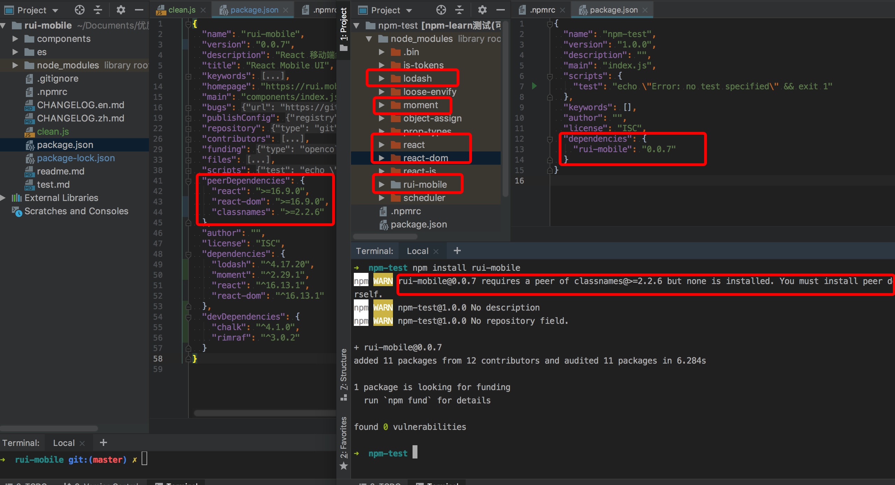

### 使用 python 在本地启动一个服务

本地启动服务，在项目目录下运行 python -m SimpleHTTPServer 8000。
即可。8000 是端口，可以不填，默认 8000

### npm 发包流程

1. 打开 npmjs.com 官网注册一个账号，注意激活邮箱
2. 修改 package.json 中的 name，这个 name 不是项目名称，而是包名称。
3. 打开控制台，执行 npm login，在控制台登录 npm。
   在控制台看到
   Logged in as xxx on https://registry.npmjs.org/
   则表示登录成功。注意这里要使用 npm 官网的源，不要使用淘宝等第三方源。
4. 登录成功后，在项目下执行 npm publish 就行了。

### npm 各字段，这里使用本人所写的 rui-mobile 包为例

1. files
   > npm 包作为依赖安装时要包括的文件，比如 npm install rui-mobile 时，会将 rui-mobile 的 packages.json
   > 中指定的 files 安装下来。files 字段接收一个文件正则格式的数组。[*]代表所有文件。
   > 也可以使用 npmignore 来忽略个别文件。
   > files 字段优先级最大，不会被 npmignore 和.gitignore 覆盖。
2. main

   > 指定 rui-mobile 的入口文件。当使用 import rui from 'rui-mobile'引入组件时，其实就是在引入 main 指定的文件。

3. dependencies
   > rui-mobile 所依赖的其他 npm 包，当使用 npm install rui-mobile 下载时，dependencies 中指定的包都会一并被下载。
4. devDependencies
   > rui-mobile 包所依赖的构建和测试相关的 npm 包。当使用 npm install rui-mobile 下载时，devDependencies 中的包不会
   > 被下载。
5. peerDependencies
   > 指定 npm 包与主 npm 包的兼容性，当开发插件时是需要的，例如开发 React 组件时，
   > 其组件是依赖于 react、react-dom npm 包的，可以在 peerDependencies 指定需要的版本。

```jsx
 "peerDependencies": {
   "react": ">=16.8.0",
   "react-dom": ">=16.8.0"
 }
```

注：如果 peerDependencies 指定的 npm 包没有下载，npm 版本 1 和 2 会直接下载。 npm3 不会下载，会给出警告。

关于 dependencies，devDependencies，peerDependencies 的差别可以看下图：



如图，rui-mobile 中有 peerDependencies，dependencies，devDependencies

```js
/*rui-mobile中的依赖关系*/
dependencies = {
  lodash: "^4.17.20",
  moment: "^2.29.1",
  react: "^16.13.1",
  "react-dom": "^16.13.1",
};
devDependencies = {
  chalk: "^4.1.0",
  rimraf: "^3.0.2",
};
peerDependencies = {
  react: ">=16.9.0",
  "react-dom": ">=16.9.0",
  classnames: ">=2.2.6",
};
```

然后新建一个 npm-test 项目，这是一个空的项目，什么依赖都没有，在这个目录下执行 `npm init -y`，
然后执行 `npm install rui-mobile`，观察 npm-test 的 package.json 文件的依赖字段，可以看见
package.json 的 dependencies 只有 rui-mobile 这个依赖，然后打开 npm-test 下面的 node-modules 可以发现，

1.rui-mobile 中 dependencies 指定的依赖都下载到了 npm-test 目录下。

2.rui-mobile 中的 devDependencies 都不会被下载到 npm-test 目录下。

3.rui-mobile 中的 peerDependencies 都不会被下载到 npm-test 目录下，但是会在控制台提示用户安装 peerDependencies 指定的依赖。

4.在 rui-mobile 中执行 npm install 时，只会安装 dependencies 以及 devDependencies 指定的依赖，peerDependencies
指定的依赖不会被安装
