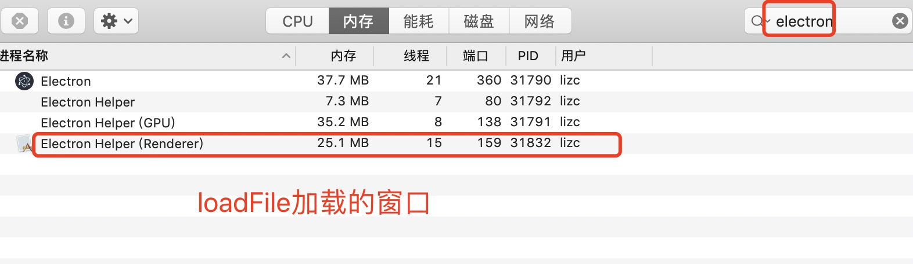
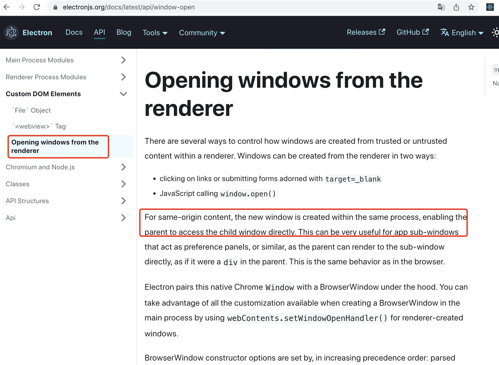
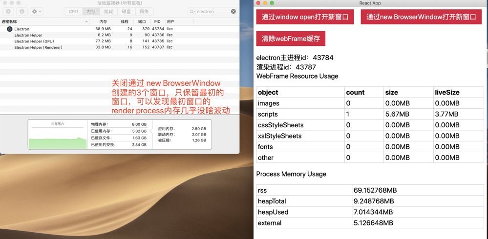
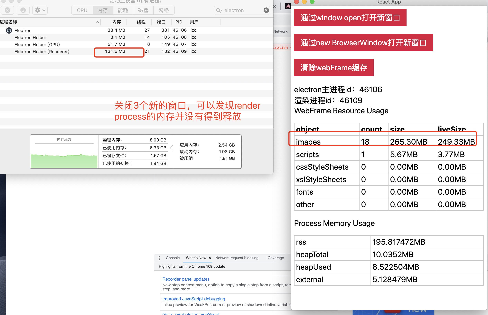
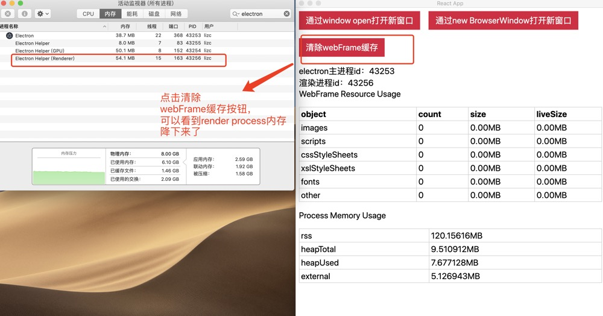

## 前言

本篇文章研究通过 window.open 和 new BrowserWindow 两种方案创建新窗口内存开销、进程数量对比。

- 操作系统：macOS Mojave
- Electron 版本：8.5.1

本次实验所使用的前端代码在这里：[web-cross-platform-application](https://github.com/lizuncong/web-cross-platform-application)

electron 代码在这里：[electron-app](https://github.com/lizuncong/electron-app)

## 内存分析方法

- chrome dev tools memory.
- process.memoryUsage
- webFrame.getResourceUsage。electron 提供的一个 API，可以获取渲染进程缓存所使用的内存开销。同时 electron 还可以使用`webFrame.clearCache`清除缓存

在这次实践中，我发现使用 `webFrame.getResourceUsage` 是比较靠谱的，能够帮助我们清理不再使用的缓存。

## loadURL 和 loadFile

`BrowserWindow`可以通过`loadURL`或者`loadFile`加载窗口。一般情况下，通过`new BrowserWindow`创建的窗口，一个窗口对应一个`render process`。

```js
const mainWindow = new BrowserWindow({
  //...
});
// mainWindow.loadURL("http://localhost:3000/memory-usage");

mainWindow.loadFile("index.html"));
```

但是，通过 loadURL 加载的窗口，会额外多出一个占用内存很小的`render process`。



这里需要注意，在整个应用生命周期内，不管有多少个`BrowswerWindow`通过`loadURL`加载窗口，最多只会多出一个`render process`


## 进程数量

通过 `new BrowserWindow` 创建新的窗口，每个窗口都有一个对应的`render process`。通过`window.open`打开同源窗口时，新窗口会在同一个渲染进程(即父窗口)中创建，也就是说，无论我们通过`window.open`打开多少个窗口，最终只有一个`render process`。可以参考[electron](https://www.electronjs.org/docs/latest/api/window-open)文档



### new BrowserWindow

这里我们通过 `new BrowserWindow` 创建三个新的窗口，进程数量和内存开销如下：


从图中看出，4 个窗口总共 4 个 render process，这 4 个 render process 所占的内存总和差不多 500MB

当我们关闭新创建的 3 个窗口，只保留最初的窗口，我们发现，最初窗口的 render process 内存几乎没啥波动



### window open

为了保证条件一致，在使用`window open`创建窗口前，我们先停止 electron 主进程，并重启。然后点击按钮创建三个新的窗口，进程数量和内存开销如下图：


从图中看出，即使是打开了 4 个窗口，整个应用生命周期内只有一个 render process，而这个 render process 所占内存开销为`132.9MB`。**因此，在打开业务功能相同的窗口的情况下，window open 能节省不少内存开销**。

注意上图中的 images 数量是 18。这里，我们打开的窗口内容实际上都是一样的，每个窗口都是显示 6 张图片。理论上，不论打开多少个新窗口，render process 只会缓存 6 张图片，因为这 6 张图片的 url 都是一样的。但是为了区分 url 不一样的场景，我在打开窗口时，可以加了 id，然后在图片链接后面加了个查询参数`?id=id`。所以这里打开 3 个窗口，就 18 个图片 url


当我们关闭新创建的 3 个窗口时，只保留最初的窗口，我们发现，render process 的内存并没有释放。如下图所示：



如果我们点击 `清除webFrame缓存` 按钮，我们会发现 render process 内存降下来了，但是相比于创建窗口前的内存，增加了大约 20MB，如下图：



这 20MB 的内存波动是怎么来的？需要深入研究

### 小结

- 当我们通过 `new BrowserWindow` 方式创建新窗口时，主进程会为每个窗口创建一个 render process，这些 render process 加起来的内存开销还是比较大的。当我们关闭这些新创建的窗口时，最初的窗口对应的 render process 所占的内存开销几乎没有波动

- 当我们通过 `window open` 方式创建新窗口时，新窗口会在父窗口的渲染进程中创建，共用一个 render process。上面的实践证明，通过 window open 打开新的窗口，这些窗口的内存总开销比通过`new BrowserWindow`创建的内存总开销小很多。**但是，当我们关闭其他新创建的窗口，只保留最初的父窗口，会发现父窗口的 render process 所占的内存并没有降下来**。这是因为，新窗口中所有的请求，比如这里的图片请求、脚本请求，都会经过父窗口的 render process 进行缓存，这部分缓存的内存并不会随着新窗口的关闭而清除。因此，我们需要在窗口关闭时手动调用 `webFrame.clearCache()` 将这些缓存清除，render process 的内存也会降下来。**但是，即使是调用了 webFrame.clearCache()清除缓存，render process 的内存还是比之前增加了大概 20MB，这说明还有资源没有被释放，这个还需要研究**

## 反复打开关闭窗口，对内存的影响

在 electron 的 issue 中，找到不少描述反复打开关闭窗口，内存会持续增加或者内存泄漏的 issue，比如[这个](https://github.com/electron/electron/issues/21586)：


可以在 electron 的 issue 中搜索 `memory leak`查看相关的 issue

在我的实践中，通过 `new BrowserWindow`打开的窗口，即使是反复打开关闭，内存的波动比较小，可以忽略不计。

但是，通过 `window open` 反复打开关闭的窗口，不论打开关闭多少次，调用 `webFrame.clearCache()`清除缓存后，相比最开始的状态，内存依然增加了 20MB

比如，下面是 render process 最开始的状态：


点击按钮，反复打开关闭弹窗，然后点击清除 webFrame 缓存按钮，内存短时间内稳定在 50MB，如下所示：


大概过了几十秒，内存又恢复了之前的 30MB 左右


因此，可以猜测，之前反复打开关闭弹窗，波动的 20MB，应该是还没来得及垃圾回收

## 总结

综上所述，相比于`new BrowserWindow`创建窗口的方式，`window open`具有进程单一、通信简单、数据共享方便、内存开销小、代码可维护性强等优势
