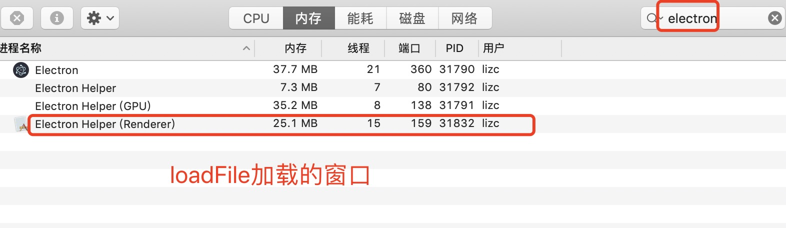
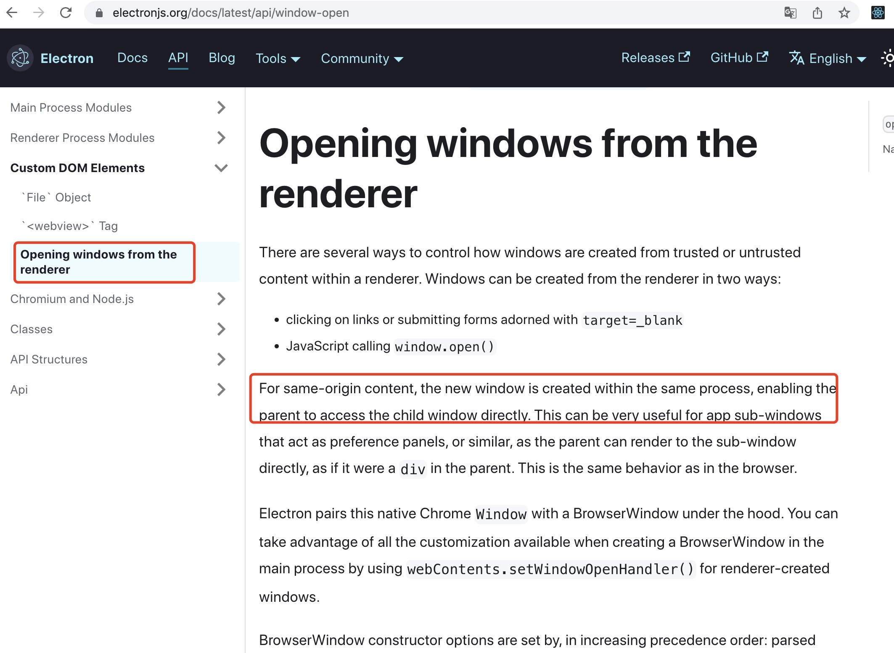
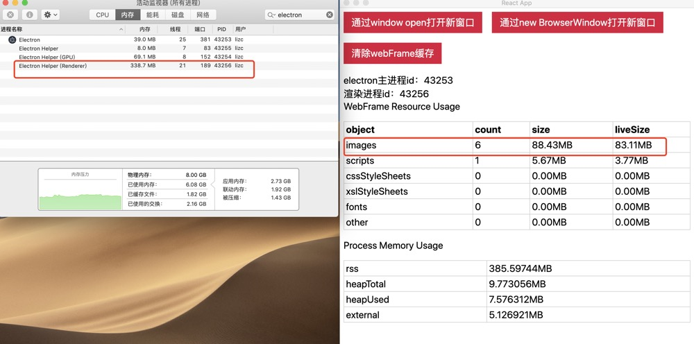
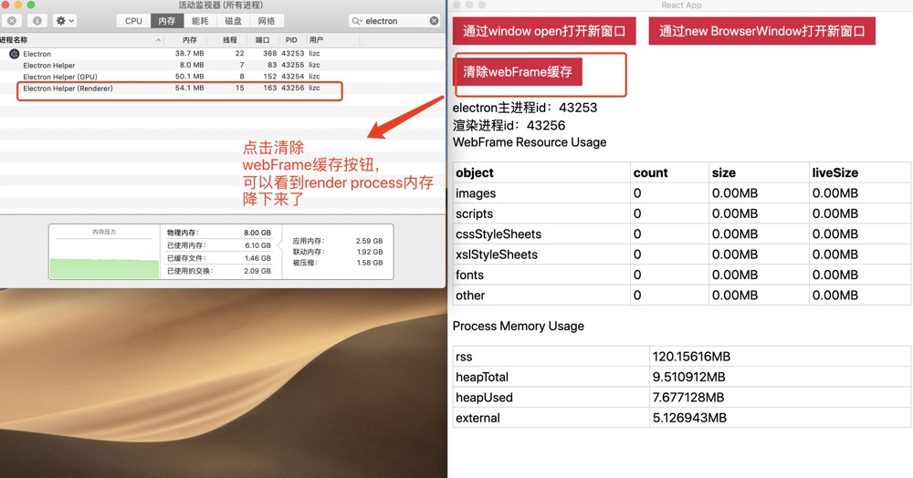

## 前言

本篇文章研究通过 window.open 和 new BrowserWindow 两种方案创建新窗口内存开销、进程数量对比。

- 操作系统：macOS Mojave
- Electron 版本：8.5.1

## 内存分析方法

- chrome dev tools memory
- process.memoryUsage
- webFrame.getResourceUsage。electron 提供的一个 API，可以获取渲染进程缓存所使用的内存开销。同时 electron 还可以使用`webFrame.clearCache`清除缓存

在这次实践中，我发现使用 `webFrame.getResourceUsage` 是比较靠谱的，能够帮助我们清理不再使用的缓存。

## loadURL 和 loadFile

`BrowserWindow`可以通过`loadURL`或者`loadFile`加载窗口。一般情况下，通过`new BrowserWindow`创建的窗口，一个窗口对应一个`render process`。

```js
const mainWindow = new BrowserWindow({
  //...
});
// mainWindow.loadURL("http://localhost:3000/memory-usage");

mainWindow.loadFile("index.html"));
```

但是，通过 loadURL 加载的窗口，会额外多出一个占用内存很小的`render process`。



这里需要注意，在整个应用生命周期内，不管有多少个`BrowswerWindow`通过`loadURL`加载窗口，最多只会多出一个`render process`


## 进程数量

通过 `new BrowserWindow` 创建新的窗口，每个窗口都有一个对应的`render process`。通过`window.open`打开同源窗口时，新窗口会在同一个渲染进程(即父窗口)中创建，也就是说，无论我们通过`window.open`打开多少个窗口，最终只有一个`render process`。可以参考[electron](https://www.electronjs.org/docs/latest/api/window-open)文档



### new BrowserWindow

这里我们通过 `new BrowserWindow` 创建三个新的窗口，进程数量和内存开销如下：


从图中看出，4 个窗口总共 4 个 render process，这 4 个 render process 所占的内存总和：`33.1 + 120.8 + 121.6 + 125.3 = 400.8MB`

当我们关闭新创建的 3 个窗口，只保留最初的窗口，我们发现，最初窗口的 render process 内存几乎没啥波动


### window open

为了保证条件一致，在使用`window open`创建窗口前，我们先停止 electron 主进程，并重启。然后点击按钮创建三个新的窗口，进程数量和内存开销如下图：


从图中看出，即使是打开了 4 个窗口，整个应用生命周期内只有一个 render process，而这个 render process 所占内存开销为`346.6MB`。**因此，在打开业务功能相同的窗口的情况下，window open 能节省不少内存开销**。

但是当我们关闭新创建的 3 个窗口时，只保留最初的窗口，我们发现，render process 的内存并没有释放。如下图所示：



如果我们点击 `清除webFrame缓存` 按钮，我们会发现 render process 内存降下来了，但是相比于创建窗口前的内存，增加了大约 20MB，如下图：



这 20MB 的内存波动是怎么来的？需要深入研究

### 小结

- 当我们通过 `new BrowserWindow` 方式创建新窗口时，主进程会为每个窗口创建一个 render process，这些 render process 加起来的内存开销还是比较大的。当我们关闭这些新创建的窗口时，最初的窗口对应的 render process 所占的内存开销几乎没有波动

- 当我们通过 `window open` 方式创建新窗口时，新窗口会在父窗口的渲染进程中创建，共用一个 render process。上面的实践证明，通过 window open 打开新的窗口，这些窗口的内存总开销比通过`new BrowserWindow`创建的内存总开销小很多。**但是，当我们关闭其他新创建的窗口，只保留最初的父窗口，会发现父窗口的 render process 所占的内存并没有降下来**。这是因为，新窗口中所有的请求，比如这里的图片请求，都会经过父窗口的 render process 进行缓存，这部分缓存的内存并不会随着新窗口的关闭而清除。因此，我们需要在窗口关闭时手动调用 `webFrame.clearCache()` 将这些缓存清除，render process 的内存也会降下来。**但是，即使是调用了 webFrame.clearCache()清除缓存，render process 的内存还是比之前增加了大概 20MB，这说明还有资源没有被释放，这个还需要研究**

## window open 是能对性能最好的一种方式

不论 window open 打开多少个窗口，自始至终只有一个 render process。我们都知道，创建一个进程都是需要内存开销的。通过 new BrowserWindow 创建窗口会为每个窗口创建一个 render process 进程
