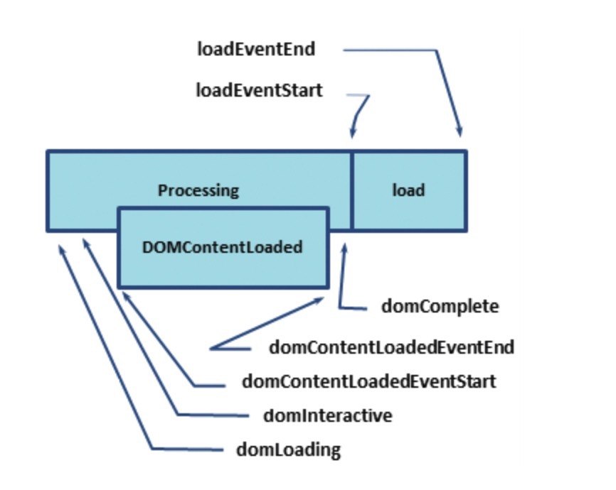

#### 现代浏览器网页渲染原理

关键渲染路径(critical rendering path)，其中回流和重绘最消耗性能

- 影响回流的操作
  - 添加/删除元素
  - 操作 styles
  - display:none
  - offsetLeft，scrollTop，clientWidth
  - 移动元素位置
  - 修改浏览器大小，字体大小
  - 避免 layout thrashing，布局抖动。读写分离，使用 transform 做一些位移的操作，而不是直接改变元素的位置等

为什么 JavaScript 需要等到 CSSOM 树构建完毕才能执行，而不用等 DOM 树构建完毕。  
理由很简单呀，虽然 js 都可以查询 dom 和 cssom，但是 js 可以在浏览器 onload 以后或者将脚本放在最后执行，就可以访问操作
dom。但 cssom 就不行呀，因为没有事件可以监听 cssom 树构建完毕，js 不知 cssom 何时构建完毕，因此浏览器干脆让 js 暂停执行，等到
cssom 树构建完毕。

#### 评估关键渲染路径

- Lighthouse 对页面运行一系列自动化测试，然后生成关于页面的 CRP 性能的报告。适用于开发过程中评估性能
- Navigation Timing API 捕获真实用户监控。这些指标捕获来自真实用户与网站的互动。
  
  - domLoading：这是整个过程的其实时间戳，浏览器即将开始解析第一批接收到的 HTML 文档字节
  - domInteractive：表示浏览器完成对所有 HTML 的解析并且 DOM 构建完成的时间点。
  - domContentLoaded：表示 DOM 准备就绪并且没有样式表阻止 JavaScript 执行的时间点，这意味着可以构建渲染树了。
    - 许多 JavaScript 框架都会等待此事件发生后，才开始执行他们自己的逻辑。
  - domComplete：顾名思义，所有处理完成，并且网页上的所有资源(图像等)都已下载完毕。
  - loadEvent：作为每个网页加载的最后一步，浏览器会触发 onload 事件，以便触发额外的逻辑。
- 在开发时，利用 Lighthouse 发现明显的 CRP 优化机会，然后使用 Navigation Timing API 监控应用在实际使用过程中的性能。
- **\*对我们而言，我们将重点放在与关键渲染路径有关的几个关键里程碑上：\*\***
  - `domInteractive` 表示 DOM 准备就绪的时间点。
  - `domContentLoaded` 一般表示 DOM 和 CSSOM 均准备就绪的时间点
    - 如果没有阻塞解析器的 JavaScript，则 `DOMContentLoaded` 将在 `domInteractive` 后立即触发。
  - `domComplete` 表示网页及其所有子资源都准备就绪的时间点。
