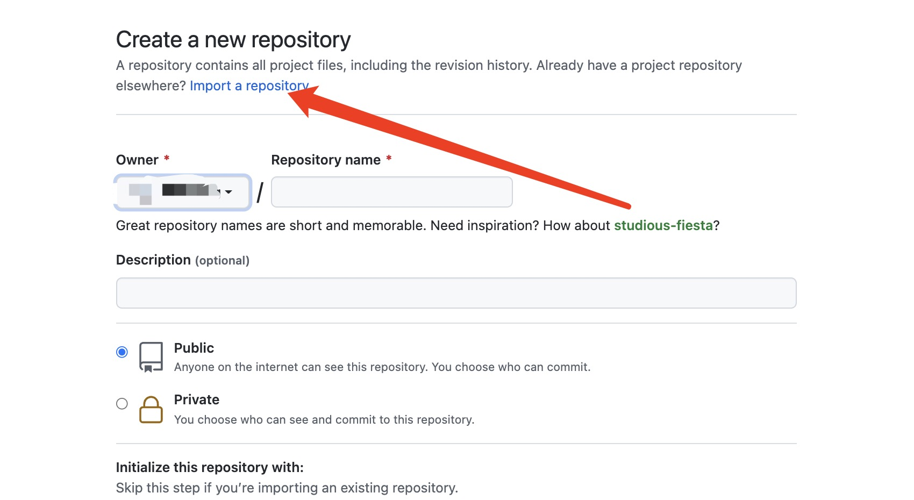
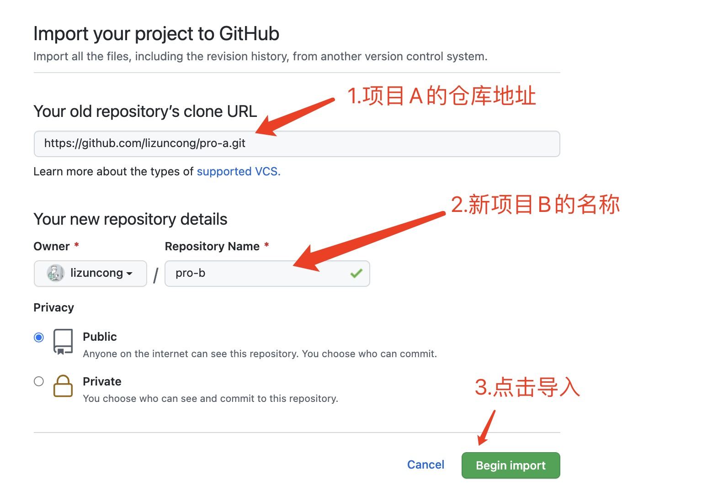

### 背景

在项目开发过程中，经常需要从一个项目 A 中复制一份代码出来，以创建一个新的项目 B。这个时候又希望项目 B 保留项目 A 的提交记录等历史信息。

### 方法一，直接使用 git 界面操作

以 github 为例，gitlab 也有一样的操作界面。

假设已有的项目 A 地址为：https://github.com/xxx/pro-a.git

1. 在 github 中创建一个新的项目 B
   

2.输入项目 B 的仓库名称


3.导入成功。此时项目 B 中依然会保留着项目 A 的历史提交记录以及分支！！

### 方法二，使用 git remote & git merge 方式

- 1. 首先初始化一个空的项目 B 仓库，添加一个.gitignore 文件(任意文件都行，主要是为了创建一个项目 B 的 master 分支)，以下操作均在项目 B 目录下的终端执行
- 2. 将项目 A 的地址添加到项目 B 本地的远程仓库中

```shell
git remote add proAMaster https://github.com/lizuncong/pro-a.git
```

现在在终端执行 `git remote` 可以看见本地有两个远程仓库

```shell
origin
proAMaster
```

- 3.抓取项目 A 仓库数据到项目 B 仓库中

```shell
git fetch proAMaster
```

- 4.在本地创建一个项目 A 的分支
  如果是需要同步项目 A 的 master 分支到项目 B 的 master 分支。则在项目 B 本地创建一个项目 A 的 master 分支。

```shell
git checkout -b proA-master proAMaster/master
```

- 5.切换到项目 B 本地 master 分支
  现在本地有两个分支，一个是项目 B 自己的 master 分支。一个是 proA-master 分支，这个分支是项目 A 的 master 分支

```shell
git merge proA-master --allow-unrelated-histories
```

同步成功，此时项目 A 已经同步到项目 B 中，项目 B 中还能保留项目 A 的提交记录，同时还不会有多余的项目 A 的分支。

### 方法三，git pull 的方式

```shell
git pull https://github.com/lizuncong/pro-a.git dev
```

dev 是需要同步的分支名称

这种方式同步简单，并且还能保留项目 A 的历史提交记录，同时还不会有多余的项目 A 的分支
